# 알고리즘
1. [알고리즘 분석](#알고리즘-분석)
	1. [시간 복잡도와 공간복잡도](#시간-복잡도와-공간복잡도-)
	2. [알고리즘의 정당성 증명](#알고리즘의-정당성-증명-)
2. [알고리즘 설계 패러다임](#알고리즘-설계-패러다임)
	1. [완전 탐색](#완전-탐색-)
	2. [분할 정복](#분할-정복-)
	3. [동적 계획법](#동적-계획법-)
	4. [탐욕법](#탐욕법-)
	5. [조합 탐색](#조합-탐색-)
	6. [파라메트릭 서치](#파라메트릭-서치-)
3. [유명한 알고리즘](#유명한-알고리즘)
	1. [정수론](#정수론-)
		1. [소수](#소수-)
		2. [유클리드 알고리즘](#유클리드-알고리즘-)
		3. [모듈라 연산](#모듈라-연산-)
		4. [이항 계수](#이항-계수-)
	2. [계산 기하](#계산-기하-)
4. [기초 자료구조](#기초-자료구조)
	1. [비트마스크](#비트마스크-)
	2. [부분 합](#부분-합-)
	3. [선형 자료구조](#선형-자료구조-)
	4. [큐와 스택, 데크](#큐와-스택과-데크-)
	5. [문자열](#문자열-)
	6. [해시](#해시-)
	7. [B-Tree & B+Tree](#b-tree--btree-)
5. [트리](#트리)
	1. [트리의 구현과 순회](#트리의-구현과-순회-)
	2. [이진 탐색트리](#이진-탐색트리-)
	3. [우선순위 큐와 힙](#우선순위-큐와-힙-)
	4. [구간 트리](#구간-트리-)
	5. [상호 배타적 집합](#상호-배타적-집합-)
	6. [트라이](#트라이-trie-)
6. [그래프](#그래프)
   1. [그래프의 표현과 정의](#그래프의-표현과-정의-)
   2. [DFS](#dfs-)
   3. [BFS](#bfs-)
   4. [최단 경로 알고리즘](#최단-경로-알고리즘-)
      1. [다익스트라](#다익스트라-)
      2. [벨만-포드](#벨만-포드-)
      3. [플로이드의 모든 쌍 최단 거리 알고리즘](#플로이드의-모든-쌍-최단-거리-알고리즘-)
   5. [최소 스패닝 트리](#최소-스패닝-트리-)
      1. [크루스칼의 최소 스패닝 트리 알고리즘](#크루스칼의-최소-스패닝-트리-알고리즘-)
      2. [프림의 최소 스패닝 트리 알고리즘](#프림의-최소-스패닝-트리-알고리즘-)
   6. [네트워크 유량](#네트워크-유량-)
      1. [포드-풀커슨 알고리즘](#포드-풀커슨-알고리즘-)
      2. [에드몬드-카프 알고리즘](#에드몬드-카프-알고리즘-)
      3. [네트워크 모델링](#네트워크-모델링-)
      4. [이분 매칭](#이분-매칭-)
7. [정렬](#정렬)
	1. [삽입 정렬](#삽입-정렬-)
	2. [선택 정렬](#선택-정렬-)
	3. [버블 정렬](#버블-정렬-)
	4. [병합 정렬](#병합-정렬-)
	5. [힙 정렬](#힙-정렬-)
	6. [퀵 정렬](#퀵-정렬-)
	7. [기수 정렬](#기수-정렬-)
	8. [계수 정렬](#계수-정렬-)
	9. [셸 정렬](#셸-정렬-)

<br>

---

# 알고리즘 분석

---

# 시간 복잡도와 공간복잡도 [☝](#알고리즘)
좋은 알고리즘, 효율적인 알고리즘이란 적은 시간안에 적은 자원을 소비해서 답을 도출하는 알고리즘을 말합니다. 알고리즘의 속도와 자원 사용량을 나타내는 지표를 각각 시간 복잡도와 공간 복잡도라고 합니다.

## 시간복잡도(Time Complexity)

시간 복잡도는 서로 다른 알고리즘의 효율성을 비교할 때 사용합니다. 시간 복잡도(Time Complexity)는 알고리즘의 절대적인 실행 시간을 나타내는 것이 아닌 알고리즘을 수행하는 데 연산들이 몇 번 이루어지는 지를 숫자로 표기합니다. 그런데 연산(Operation)의 실행 횟수는 보편적으로 그 값이 변하지 않는 상수(Constant)가 아니라 입력한 데이터의 개수를 나타내는 n에 따라 변하게 됩니다.연산의 개수를 입력한 데이터의 개수 n의 함수로 나타낸 것을 시간 복잡도 함수라고 말합니다. 시간 복잡도에는 몇 가지 규칙이 있습니다.

1. **입력값(n)은 항상 0보다 크다.**  
   입력값이 음수일 수는 없습니다. 그래서 복잡도는 항상 0보다 크다고 가정하고 계산을 해야합니다.
2. **함수는 많은 입력값이 있을 때 더 많은 작업을 하게 됩니다.**  
   더 많은 입력값이 주어지면 어떤 작업을 하는 데 필요한 계산이나 처리 시간이 길어집니다.
3. **시간 복잡도에서는 모든 상수를 삭제합니다.**
   만약 어떤 알고리즘의 복잡도가 3n 이라면 3은 고려하지 않고 복잡도는 n이 됩니다. 2n, 3n, 10n 모두 복잡도가 n 인 알고리즘입니다.
4. **낮은 차수의 항들은 무시합니다.**  
   시간 복잡도에서는 입력값이 작은 값은 고려하지 않고 큰 값에 대해서만 생각을 하므로 n 이 무한으로 커진 경우를 가정하고 비교해야 합니다. 이런 이유로 시간 복잡도에서는 낮은 차수의 항들은 무시합니다.
5. **시간 복잡도 함수가 log 함수를 포함할 경우 밑은 무시합니다.**  
   모든 로그는 서로 배수 관계입니다. 그래서 복잡도에 관해서 이야기할 때는 로그의 밑에 대해서는 고려하지 않아도 됩니다. 로그의 밑은 무시하고 로그 ( logn ) 알고리즘이라고만 말하면 됩니다.
6. **등호를 사용하여 표현합니다.**  
   2n 은 O(n) 과 같습니다. 여기서 O(n) 은 2n 이 어떤 함수의 집합에 속한다는 의미를 가집니다. 그렇기 때문에 아래와 같은 등호를 활용하여 이 관계를 수학적으로 쓸 수 있습니다.
   2n = O(n), 2n ∈ O(n)

### 접근적 표기법(Big Oh Notation)

시간복잡도는 입력 크기에 대한 함수로 표기하는데 이를 단순한 함수로 표현하기 위해 점근적 표기를 사용합니다. 이는 입력이 무한으로 커질때의 복잡도를 간단하게 표현하기 위한 방법입니다.


위 그래프는 복잡도가 n 인 알고리즘에 점근적 표기법을 적용한 결과입니다. x축은 복잡도 n, y축은 필요한 일의 양이나 메모리를 의미합니다.

다른 알고리즘이 이 그래프의 어떤 위치에 있는지에 따라 복잡도 n 인 알고리즘과 다른 알고리즘의 복잡도를 비교할 수 있습니다. 다른 알고리즘이 복잡도 n 인 알고리즘의 아래에 있다면, 같은 일을 하는 데 시간이 덜 들기 때문에 더 빠른 알고리즘이라 합니다. 반대로, 복잡도 n 인 알고리즘의 위에 있다면, 더 느린 알고리즘입니다.

점근적 표기법에서는 이러한 알고리즘 간의 관계를 다음과 같이 표현합니다.

- **O (빅 오 복잡도) : 비교 대상인 그래프가 일치 혹은 아래에 있을 때. 비교 대상인 다른 알고리즘과 같거나 더 빠르다**
- θ (세타 복잡도) : 비교 대상인 그래프가 일치할 때. 비교 대상인 다른 알고리즘과 같다.
- Ω (빅 오메가 복잡도) : 비교 대상인 그래프가 일치 혹은 위에 있을 때. 비교 대상인 다른 알고리즘과 같거나 느리다.
- o (리틀 오 복잡도) : 비교 대상인 그래프가 아래에 있을 때. 비교 대상인 다른 알고리즘보다 더 빠르다.
- ω (리틀 오메가 복잡도) : 비교 대상인 그래프가 위에 있을 때. 비교 대상인 다른 알고리즘과 느리다.

## Big-O 표기 연산시간 크기 관계


Olog(1) < Olog(logn) < Olog(n) < O(nlogn) < O(n^2) < O(n^3) < O(e^n)

## 공간복잡도(Space Complexity)

공간 복잡도(Space Complexity)란 알고리즘을 수행시키기 위해 필요한 기억장치(memory)의 크기를 의미합니다.

공간복잡도는 총 공간 요구 = 고정 공간 요구 + 가변 공간 요구로 나타낼 수 있으며 수식으로는 S(P) = c + Sp(n) 으로 표기합니다.

- 고정 공간: 입력과 출력의 횟수나 크기와 관계없는 공간의 요구(코드 저장 공간, 단순 변수, 고정 크기의 구조 변수, 상수)
- 가변 공간: 해결하려는 문제의 특정 인스턴스에 의존하는 크기를 가진 구조화 변수들을 위해서 필요로 하는 공간, 함수가 순환 호출을 할 경우 요구되는 추가 공간이다. 즉 동적으로 필요한 공간 동적으로 필요한 공간.

일반적으로 알고리즘의 공간복잡도를 분석할 때는 위의 두 가지 중 두 번째 것을 계산합니다. 공간 복잡도도 시간 복잡도와 유사하게 빅오 표기법을 사용합니다.

```java
int sum(int a[], int n)
{
  int x = 0;
  for(int i = 0; i < n; i++) {
    x  = x + a[i];
  }
  return(x);
}
```

위 알고리즘에서는 총 4 개의 변수를 사용합니다.

- int arr[n] : 4\*n byte (입력 공간)
- int n : 4 byte (입력 공간)
- int x : 4 byte (보조 공간)
- int i : 4 byte (보조 공간)

총 4n + 12의 메모리를 요구하고 이를 빅오 표기법으로 표현하면 O(n)이 됩니다.

---

# 알고리즘의 정당성 증명 [☝](#알고리즘)

용어
어떤 - 상황에 따라 a가 되기도 any가 되기도 한다.

간단한 문제의 경우에는 직관적으로 알고리즘을 설계할 수 있지만, 문제가 복잡해지면 알고리즘이 과연 문제를 제대로 해결하는지를 파악하기 어려워집니다.

테스트 케이스를 이용해 단위 테스트를 해서 프로그램을 실행하고 답을 점검해 볼 수 있지만, 이런 방식은 잘못된 예외 케이스를 찾았을 때, 알고리즘에 문제가 있음은 증명할 수 있어도 알고리즘이 문제가 없음을 증명하기는 어렵습니다.

모든 입력에대해서 문제가 없음을 정확하게 증명하기 위해서는 다양한 수학적 기법을 사용해야합니다.

## 수학적 귀납법과 반복문 불변식
수학적 귀납법은 반복적인 구조를 갖는 명제들을 증명하는데 사용되는 증명 기법입니다.
수학적 귀납법은 다음 3단계로 나눠서 증명이 진행됩니다.

1. 단계 나누기
증명하고 싶은 것을 여러 단계로 나눕니다. (수학적 귀납법을 이용한 수열의 증명에서 1번째항, 2번째항,…k번째항,… n번째항으로 나누는 것이 단계 나누기 입니다.)
2. 첫 단계 증명
나눈 단계 중 첫번째 단계에서 증명하고싶은 내용이 성립함을 보입니다.
3. 귀납 증명
k번째 단계에서 증명하고 싶은 내용이 성립한다면, k+1번재 단계에서도 증명하고 싶은 내용이 성립함을 보이면 됩니다.

수학적 귀납법을 소개할 때 가장 많이 나오는 예시가 도미노입니다.
도미노는 첫번째 도미노를 손으로 밀어서 쓰러뜨리면, 다음 도미노도 넘어집니다.
즉, 한 도미노가 스러지면 다음 도미노 역시 쓰러지기 때문에, 중간에 k번째 도미노가 쓰러지면 k+1번째 도미노 역시 쓰러질 것이고 이 과정이 반복되면 마지막 도미노까지 쓰러질 것입니다. 

이처럼 도미노가 쓰러지는 것으로부터 얻은 직관으로 이진 탐색을 수학적 귀납법으로 증명해보겠습니다.

### 이진 탐색과 반복문 불변식
#### 반복문 불변식
이진 탐색의 알고리즘 정당성을 증명하기 전에 반복문 불변식이라는 개념을 먼저 알아보겠습니다.

대부분의 알고리즘은 어떤 형태로든 반복적인 요소를 가지게 됩니다. 
이 반복적인 요소를 귀납법을 이용할 때 사용하는 것이 바로 반복문 불변식입니다.
반복문 불변식은 **반복문의 내용이 한 번 실행될 때마다 중간 결과가 우리가 원하는 답으로 가는 길 위에 있는지를 명시하는 조건** 입니다.

반복문의 마지막에 정답을 계산하기 위해서는 중간 단계에서 항상 식이 변하지않고 성립해야합니다.

불변식을 이용해서 반복문의 정당성을 증명하면 다음과 같습니다.
1. 반복문 진입시 불변식이 성립함을 증명
2. 반복문 내용이 불변식을 깨뜨리지 않음을 증명
3. 반복문 종료시 불변식이 성립하는지 확인(확인되면 정답을 찾은 것)

#### 이진 탐색 알고리즘의 정당성 증명
```java
//필수 조건 : arr은 오름차순으로 정렬되어 있다.
public int binsearch(int[] arr,int target){
	int n = arr.length;
	int left = -1, right = n;
	//반복문 불변식 1: left<right
	//반복문 불변식 2: arr[left]<target<=arr[right] 
	while(left + 1 < right){
		int mid = (left + right)/2;
		if(arr[mid]<target) left = mid;
		else right = mid;
	}
	return right;
}
```
반복문 불변식 1: left<right
while 문의 조건에 걸려서 종료됐다면 반드시 left+1 >= right 입니다.
불변식에 의하면 left < right 이므로 left + 1 = right 가 됩니다.
반복문 불변식 2: arr[left]<target<=arr[right] 
이 불변식에 의해서 종료조건을 만난 후에 우리가 구하려 했던 값은 right가 됨을 알 수 있습니다.
이처럼 불변식이 while문 종료시에 항상 성립한다는 것을 보였기 때문에 이 알고리즘의 정당성은 증명되었습니다.

불변식을 이용해서 정당성을 증명하는 과정은 귀납법과 다를 것이 없어보이지만 전체 작업을 각 단계로 나누는 과정이 이미 반복문으로 만들어져있기 때문에 더 간단합니다. 반복문이 처음 시작될 때 불변식이 만족함을 보이고, 반복문 내용이 한 번 지나가도 이 조건이 다시 유지됨을 보여주면 쉽게 증명할 수 있습니다.

## 귀류법
우리가 원하는 결론과 반대되는 상황을 가정하고 논리를 전개해서 결론이 잘못됐음을 찾아내는 증명 기법입니다.
귀류법은 보통 최선의 선택인지를 증명해야하는 **그리디 알고리즘의 정당성을 증명**할 때 많이 사용합니다.

### 귀류법을 이용한 증명
홀수 + 짝수는 홀수 임을 증명해보겠습니다.
1. 홀수 + 짝수는 짝수라고 가정
2. 홀수는 2n-1, 짝수는 2m(n,m은 자연수)
3. 2n-1 + 2m = 2(n-m)-1
4. 2(n-m)-1은 홀수(2의 배수는 짝수)
5. 이는 1에서의 홀수+짝수 = 짝수 가정과 모순
6. 따라서 홀수 + 짝수 = 홀수

### 귀류법의 활용
귀류법은 알고리즘의 결과가 최선(최단 경로, 최소 비용 등등)임을 보이기 위한 절차는 다음과 같습니다.
1. 각 단계에서 최선의 선택을 함을 귀류법으로 증명
2. 귀류법으로 최선의 선택함이 증명된다면 다음 단계에서도 최선의 선택을 함을 귀납법으로 증명

## 비둘기집의 원리
n마리 비둘기 n-1개의 비둘기 집에 넣으면 비둘기가 2마리 이상의 비둘기 집이 적어도 하나 존재한다

## 구성적 증명
우리가 원하는 어떤 답이 존재한다는 사실을 증명하기위해 사용하는 증명법입니다. 귀류법과 귀납법이 답이 존재한다는 사실을 논증하는 것이라면, 구성적 증명은 답의 실제 예를 들어서 보여주거나 답을 만드는 방법을 실제로 제시하는 증명법입니다.
ex) 코드의 정당성 증명없이 온라인 저지 사이트에 올려서 채점해서 맞으면 그 문제에 한해서는 이상없이 작동하는 코드임을 생각해봅시다.

## 안정적 결혼 문제
안정적 결혼 문제는 다음과 같은 상황을 이야기합니다.
n명의 남성과 여성이 단체 미팅에서 만났습니다. 여러 게임을 진행하는 동안 모든 사람은 자신이 원하는 상대방의 우선쉰위를 맘 속에 정했고, 이제 시간이 되어 남자 1호와 여자 1호가, 남자 2호와 여자 2호가 각각 짝이 되었습니다. 그런데 남자 1호와 여자 2호는 자신들의 짝보다, 서로를 더 선호한다는 사실을 알게되었습니다. 이런 일이 일어나지않도록 짝을 지어줄 수 있는 방법이 항상 있을까요? 아니면 불가능한 경우가 있을까요?

이 알고리즘은 실제로 어느 대학의 석사 과정 신입생의 지도 교수 배정 과정에 도입된 알고리즘이기도 합니다.

그렇다면 이 알고리즘은 어떻게 해결할 수 있을까요??

1. 처음에는 남성들이 모두 자신이 가장 선호하는 여성의 앞에가서 프로포즈를 합니다. 여성이 그 중 제일 마음에드는 남성을 고르면 나머지는 거절을 당하고 자기 자리로 돌아갑니다.
2. 거절당한 남자들은 상대에게 짝이 있는지 없는지와 관계없이 다음으로 마음에 드는 여성에게 다가가 프로포즈합니다. 여성들은 현재 자신의 짝보다 더 마음에 드는 남성이 다가왔다면, 지금의 짝 대신 새로운 남성을 선택합니다.
3. 짝이 없는 남성이 없을 때까지 2번 항목을 반복합니다.

위와 같이 진행한다면 안정적으로 모든 쌍을 구할 수 있습니다.
모든 여성이 1번씩 알고리즘에 참여하기 때문에 O(N)만큼의 시간이 소모되고 각각의 여성은 자신 선호도를 확인해야하기 때문에 이 과정에서 O(N), 프로포즈한 남성이 선호도 순서를 확인해 여성을 선택하는데 걸리는 시간 O(1)이 소모 됩니다. 
그렇기 때문에 이 알고리즘의 시간복잡도는 O(N^2)입니다.

그렇다면 이 알고리즘이 항상 종료된다는 것은 어떻게 알 수 있을까요?  그리고 모든 사람이 짝을 찾고 그 짝이 항상 안정적인 것은 어떻게 알 수 있을까요?

- 종료 증명
각 남성은 거절당할 때마다 지금까지 프로포즈했던 여성들보다 우선순위가 낮은 여성에게 프로포즈합니다. 따라서 각 남성이 최대 n명의 여성들에게 순서대로 프로포즈한 이후에는 더 이상 프로포즈할 수 있는 여성이 없으므로 반드시 종료됩니다.
- 모든 사람이 짝을 찾음 증명
프로포즈 받은 여성은 프로포즈한 남성들 중 한 명을 반드시 선택하고, 더 우선순위가 높은 남성이 프로포즈해야지만 짝을 바꾸기 때문에, 한 번이라도 프로포즈를 받은 여성은 항상 작이 있습니다.
이에 귀류법을 적용해보겠습니다.
1. 남녀 한 사람씩 짝을 찾지 못하고 남았다고 가정
2. 모든 남성은 우선순위가 높은 순서대로 모두에게 한 번씩 프로포즈하기 대문에, 지금 짝을 찾지 못한 여성에게도 한 번은 프로포즈를 했습니다.
3. 우선순위에 따라서 남은 여성은 지금 받은 프로포즈를 받아들여야하기 때문에 짝을 찾지 못하는 사람이 존재할 수 없습니다.
- 짝의 안정성 증명
귀류법을 사용하면 증명할 수 있습니다.
1. 짝을 지었는데 결과적으로 짝이 아닌 두 념녀가 서로 자신의 짝보다 상대방을 더 선호한다고 가정합니다.
2. 더 선호하는 여성이 있다면 남성은 지금 자신의 짝 이전에 그 여성에게 반드시 프로포즈를 했어야합니다. 
3. 여성은 더 마음에 드는 남성이 나타났을 대만 짝을 바꾸기 때문에, 둘이 짝이 아니라는 것은 지금 프로포즈한 남성보다 더 선호하는 남성과 짝이 됐다는 뜻입니다.
4. 그러므로 프로포즈 받았던 남성보다 마음에 들지않는 남성과 최종적으로 짝이 될 수 없습니다.

이처럼 귀류법과 귀납법 그리고 구성적 증명을 이용하면 복잡해보이는 알고리즘의 정당성을 확인하는데 도움이 됩니다.

---

# 알고리즘 설계 패러다임

---
				       
# 완전 탐색 [☝](#알고리즘)
## 완전 탐색이란?
컴퓨터의 빠른 계산 능력을 이용하여 가능한 경우의 수를 일일이 나열하면서 답을 찾는 방법

'무식하게 푼다'라는 의미인 **Brute-Force(브루트 포스)** 라고도 부르며, 직관적이어서 이해하기 쉽고 문제의 정확한 값을 얻어낼 수 있는 가장 확실하며 기초적인 방법이다.

예를 들어, 4자리의 암호로 구성된 자물쇠를 풀려고 시도한다고 생각해보자. 이 문제를 반드시 해결할 수 있는 가장 확실한 방법은 0000 ~ 9999까지 모두 시도해보는 것이다. (최대 10,000번의 시도로 해결 가능)

하지만 완전탐색은 답으로 가능한 경우의 수가 많은 경우에는 사용하기 어려우므로 **완전 탐색을 이용할 수 있는 경우인지 잘 파악하는게 중요**하다.

<br>

따라서 완전 탐색 기법으로 문제를 풀기 위해서는 다음과 같은 조건을 고려해야 한다.
1. 해결하고자 하는 문제의 가능한 경우의 수를 대략적으로 계산한다.
2. 가능한 모든 방법을 다 고려한다.
3. 실제 답을 구할 수 있는지 적용한다. 

<br>

## 완전 탐색 기법
완전 탐색 자체가 알고리즘은 아니기 때문에 완전탐색 방법을 이용하기 위해서 여러 알고리즘 기법이 이용된다.
주로 이용되는 기법들은 다음과 같다.

* 단순 Brute-Force
* 비트마스크 (Bitmask)
* 재귀 함수
* 순열 (Permutation)
* BFS, DFS

<br>

### 단순 Brute-Force
어느 기법을 사용하지 않고 단순히 for문과 if문 등으로 모든 case들을 만들어 답을 구하는 방법이다.
이는 아주 기초적인 문제에서 주로 이용되거나, 전체 풀이의 일부분으로 이용된다.

<br>

### 비트마스크 (Bitmask)
2진수를 이용하는 컴퓨터의 연산을 이용하는 방식이다.
완전탐색에서 비트마스크는 문제에서 나올 수 있는 모든 경우의 수가 **각각의 원소에 포함되거나, 포함되지 않는 두 가지 선택으로 구성되는 경우**에 유용하게 사용 가능하다.

간단한 예시로 원소가 5개인 집합의 모든 부분 집합을 구하는 경우를 생각해보자.
어떤 집합의 부분집합은 집합의 각 원소가 해당 부분집합에 포함되거나, 포함되지 않는 두가지 경우만 존재한다.

따라서 5가지 이진수(0~31)를 이용하여 각 원소의 포함 여부를 체크할 수 있다.

<p align="center">

</p>

위 그림과 같이 0부터 31까지의 각 숫자들이 하나의 부분집합에 일대일로 대응된다.

<br>

### 재귀 함수
재귀 함수를 통해서 문제를 만족하는 경우들을 만들어가는 방식이다.

위에 언급한 부분집합 문제를 예로 들면, 만들고자 하는 부분집합을 `S`라고 할 때, `S = {}`부터 시작해서 각 원소에 대해 해당 원소가 포함이 되면 `S`에 넣고 재귀함수를 돌려주고, 포함되지 않으면 `S`를 그대로 재귀함수에 넣어주는 방식이다.

비트마스크와 마찬가지로 주로 각 원소가 포함되거나, 포함되지 않는 두 가지 선택을 가질 때 이용된다. 

<br>

### 순열
완전 탐색의 대표적인 유형이다.
서로 다른 N개를 일렬로 나열하는 순열의 경우의 수는 `N!` 이므로 완전 탐색을 이용하기 위해서는 N이 한자리 수 정도는 되어야 한다. 

순열에 원소를 하나씩 채워가는 방식이며, 반복문, 재귀 함수, next_permutation 등을 이용하여 구현할 수 있다. 

<br>

### BFS, DFS
약간의 난이도가 있는 문제로 `완전 탐색 + BFS/DFS 문제`가 많이 나온다.

대표적인 유형으로 길 찾기 문제가 있다. 단순히 길을 찾는 문제라면 BFS/DFS만 이용해도 충분하지만, 주어진 도로에 장애물을 설치하거나, 목적지를 추가하는 등의 추가적인 작업이 필요한 경우에 이를 완전 탐색으로 해결하고 나서, BFS/DFS를 이용하는 방식이다. 

<br>

### 관련 문제
[백준 1062번 가르침](https://www.acmicpc.net/problem/1062)

[백준 10819번 차이를 최대로](https://www.acmicpc.net/problem/10819)

<br>

----
	
# 분할 정복 [☝](#알고리즘)
## 분할 정복(Divide and Conquer)이란?
한 문제를 둘 이상의 **부분 문제(sub-problem)** 로 나누어 해결하고 이를 합쳐 원래 문제를 해결하는 기법

분할 정복 알고리즘은 다음과 같이 세 부분으로 나누어서 생각해볼 수 있다.

1. **분할(Divide)** : 원래 문제를 분할하여 더 작은 하위 문제들 나눈다.

2. **정복(Conquer)** : 하위 문제 각각을 재귀적으로 해결

3. **병합(merge)** : 하위 문제들의 답을 합쳐서 원래 문제를 해결

<br>

분할 정복을 적용하기 위해서는 문제에 다음과 같은 몇 가지 특성이 성립해야 한다.

1. 부분 문제로 나누는 자연스러운 방법이 있어야 한다.

2. 부분 문제의 답을 조합해 원래 문제의 답을 계산하는 효율적인 방법이 있어야 한다.

   *(분할 정복을 사용한다고 무작정 효율이 좋아지는 것은 아니다.)*

<br>

## 분할 정복의 장/단점
- 장점 👍
  - 문제를 나눔으로써 어려운 문제를 해결할 수 있다는 장점이 있다. 그리고 이 방식이 그대로 사용되는 효율적인 알고리즘들도 여럿 있으며, 문제를 나누어 해결한다는 특징상 병렬적으로 문제를 해결하는 데 큰 강점이 있다.
  - 보통, 분할 정복의 경우 작은 문제로 분할함으로써 같은 작업을 더 빠르게 처리할 수 있게 해준다. (수행 시간 감소)

- 단점 👎
  - 함수를 재귀적으로 호출한다는 점에서 함수 호출로 인한 오버헤드가 발생하며, 스택에 다양한 데이터를 보관하고 있어야 하므로 스택 오버플로우가 발생하거나 과도한 메모리 사용을 하게 되는 단점이 있다.

<br>

## 일반적인 재귀 호출과 다른 점 

<p align="center">

</p>

* 분할 정복이 일반적인 재귀 호출과 다른 점은 **문제를 한 조각과 전체를 나누는 대신 거의 같은 크기의 부분 문제로 나누는 것** 이다.

* 보통 재귀 함수를 사용해서 분할 정복 알고리즘을 구현하지만, 분할 정복이라고 해서 반드시 재귀 함수를 이용하는 것은 아니다. 함수 호출시 발생하는 오버헤드를 없애기 위해서 스택이나 큐 등을 이용하는 경우도 있다.

<br>

## 분할 정복 알고리즘 활용 예시

분할 정복이 쓰이는 예는 **이분검색, 병합정렬, 퀵정렬, 최대값 찾기, 임계값의 결정, 쉬트라센 행렬곱셈 알고리즘** 등이 있다.

<br>

### 병합 정렬과 퀵정렬 (같은 문제를 어느 단계에서 해결하느냐에 따른 구분)

병합 정렬(merge sort)과 퀵 정렬(quick sort)은 분할 정복 패러다임을 기반으로 해서 만들어진 대표적인 정렬 알고리즘이다.

이 두 알고리즘은 같은 아이디어로 정렬을 수행하지만 시간이 많이 걸리는 작업을 **분할 단계**에서 하느냐, **병합 단계**에서 하느냐가 다르다.

이렇게 같은 문제를 해결하는 알고리즘이더라도 어떤 식으로(어느 단계에서) 분할하느냐에 따라 다른 알고리즘이 될 수 있다.

<br>

### 병합 정렬

<p align="center">

</p>

* 전체 수행 시간은 **병합 과정**에 의해 지배된다.

* **O(n)** 시간이 걸리는 과정을 **재귀 호출 후에 진행** (병합 과정)

   문제의 수는 항상 절반으로 나눠지기 때문에 필요한 단계 수는 **O(logn)**

* 시간 복잡도 : 항상 **O(nlogn)** 으로 일정

<br>

### 퀵 정렬
<p align="center">
 
</p>

* 전체 수행 시간은 두개 부분 문제로 나누는 **파티션(partition) 과정**에 의해 지배된다. 분할된 두 부분 문제가 비슷한 크기로 비슷한 크기로 나눠진다는 보장이 없기 때문에, 이를 비슷한 크기로 나누는 좋은 기준을 선택하는 것은 퀵정렬에서 중요한 요소이다.

* **O(n)** 시간이 걸리는 과정을 **재귀 호출 전**에 진행 (분할)

   문제의 수가 항상 절반으로 나누어 진다는 보장이 없기 때문에 필요한 단계수를 정확히 계산하기 힘들다.
   
   **최악의 경우 n, 평균적인 경우 logn**만큼의 단계가 필요하다.

* 시간 복잡도 : 최악 = **O(n^2)**, 평균 = **O(nlogn)**

<br>

### 관련 문제
[백준 1629번 곱셈](https://www.acmicpc.net/problem/1629)

[백준 10830번 행렬 제곱](https://www.acmicpc.net/problem/10830)

<br>

---

# 동적 계획법 [☝](#알고리즘)
## 동적 계획법(Dynamic Programming, DP)이란?

동적 계획법은 주어진 문제를 풀기 위해서, 문제를 여러 개의 **하위 문제(subproblem)** 로 나누어 푼 다음, 그것을 결합하여 해결하는 방식이다.

<br>

<p align="center">

</p>

동적 계획법은 처음 주어진 문제를 더 작은 문제들로 나눈 뒤 각 조각의 답을 계산하고, 이 답들로부터 원래 문제에 대한 답을 계산해 낸다는 점에서 분할 정복(Divide and Conquer)과 비슷하다. 하지만 가장 큰 차이점은 **동적 계획법에서는 쪼개진 작은 문제가 중복되지만, 분할 정복은 절대로 중복될수가 없다는 점**이다.

다시 말하면, 동적 계획법과 분할 정복의 차이는 **문제를 나누는 방식**이다. 동적 계획법에서는 어떤 부분 문제는 두 개 이상의 문제를 푸는데 사용될 수 있기 때문에, 이 문제의 답을 여러 번 계산하는 대신 **한 번만 계산하고 그 결과를 재활용함으로써 속도를 향상**시킬 수 있다. 이때 이미 계산한 값을 저장해 두는 메모리를 캐시(cache)라고 부르며, 두 번 이상 계산되는 부분 문제를 중복되는 **부분 문제(overlapping subproblems)** 라고 부른다.

<br>

* **동적 계획법의 조건**

   두 가지 속성을 만족해야 동적 계획법으로 문제를 풀 수 있다.

1. **Overlapping Subproblem**
   : 중복되는 부분 문제(overlapping subproblem) 는 어떤 문제가 여러 개의 부분 문제(subproblem)으로 쪼개질 수 있을 때 사용하는 용어이다. 이때 '부분 문제'란, 항상 새로운 부분 문제를 생성해내기 보다는 계속해서 같은 부분 문제가 여러 번 재사용되거나 재귀 알고리즘을 통해 해결되는 문제를 가리킨다.

2. **Optimal Substructure**
   : 최적 부분구조(optimal substructure)는 어떤 문제의 최적의 해결책이 그 부분 문제의 최적의 해결책으로 부터 설계될 수 있는 경우를 말한다. 즉, 최적 부분구조 일때 문제의 정답을 작은 문제의 정답에서부터 구할 수 있다. 이 속성은 동적 계획법이나 그리디 알고리즘의 유용성을 판별하는데 사용되기도 한다.
   

<br>

* **메모리제이션(Memorization)**

메모이제이션은 컴퓨터 프로그램이 동일한 계산을 반복해야 할 때, **이전에 계산한 값을 메모리에 저장함**으로써 동일한 계산의 반복 수행을 제거하여 **프로그램 실행 속도를 빠르게 하는 기술**이다. 동적 계획법의 핵심이 되는 기술이다.

동적 계획법에서 각 문제는 한 번만 풀어야 한다. (중복되는 부분 문제를 여러번 풀지 않는다는 뜻) Optimal Substructure를 만족하기 때문에 같은 문제는 구할 때마다 정답이 같다. 따라서 정답을 한 번 구했으면 그 정답을 캐시에 메모해놓는다. 이렇게 메모하는 것을 코드의 구현에서는 배열에 저장하는 것으로 할 수 있다. 이를 메모리제이션이라고 한다.

<br>

## 동적 계획법의 장/단점

- 장점 👍
  - 필요한 모든 가능성을 고려해서 구현하므로 항상 최적의 결과를 얻을 수 있다.
  
  - 메모리에 저장된 값을 사용하므로 큰 문제를 빠른 속도로 해결하여 최적의 해를 찾아낼 수 있다.

- 단점 👎
  - 모든 가능성에 대한 고려가 불충분할 경우 최적의 결과를 보장할 수 없다.
  
  - 다른 방법론에 비해 많은 메모리 공간을 요구한다.
  

<br>

## 동적 계획법의 구현 방법

동적 계획법의 구현 방식에는 두 가지 방법이 있다.

1. **Top-down** : 큰 문제를 작은 문제로 쪼개면서 푼다. **재귀**로 구현
2. **Bottom-up** : 작은 문제부터 차례대로 푼다. **반복문**으로 구현

Top-down과 Botton-up의 시간복잡도 차이는 문제에 따라 다를 수 있으므로 정확히 알 수는 없다. Top-down은 재귀 호출을 하기때문에 스택의 사용으로 시간이 더 걸릴 것이라고 생각할 수 있겠지만, 실제로 그 차이는 크지 않다. 

(다만, 파이썬의 경우 재귀 호출 시 스택 오버 플로우(stack overflow)가 발생할 수 있기 때문에, Bottom-up으로 구현하는 것이 좋다. C++과 Java에서는 재귀로 구현하는 것이 크게 문제가 되지 않는다.)

💡 Top-down으로만 해결가능하거나 Bottom-up으로만 해결가능한 문제는 극히 드문 경우이므로, 아무거나 선택해서 사용하면 된다.

피보나치 수열을 예로 들면 다음과 같다.

* Top-down 방식
``` java
f (int n) {
  if n == 0 : return 0
  elif n == 1: return 1
  if dp[n] has value : return dp[n]
  else : dp[n] = f(n-2) + f(n-1)
         return dp[n]
}
```

* Bottom-up 방식
``` java
f (int n){
  f[0] = 0
  f[1] = 1
  for (i = 2; i <= n; i++) {
   f[i] = f[i-2] + f[i-1]
  }
  return f[n]
}
```
<br>

## 동적 계획법의 활용 예시

동적 계획법의 예시로는 **피보나치 수열 구하기, 이항계수 구하기, 최단경로의 플로이드 알고리즘, 최적화 문제, 외판원 문제** 등이 있다.

<br>

### 관련 문제
[백준 2294번 동전2](https://www.acmicpc.net/problem/2294)

[백준 1463번 1로 만들기](https://www.acmicpc.net/problem/1463)

<br>

---

# 탐욕법 [☝](#알고리즘)

그리디 알고리즘은 최적화 문제를 해결하는 알고리즘이라고 할 수 있다.

최적화(optimization) 문제란 가능한 해들 중에서 가장 좋은 (최대 또는 최소) 해를 찾는 문제이다.

욕심쟁이 방법, 탐욕적 방법, 탐욕 알고리즘 등으로 불린다.

#### 그리디 알고리즘은 수행 과정에서 탐욕적으로 일단 한 번 선택하면, 이를 절대로 번복하지 않는다.

#### 즉, 선택한 데이터를 버리고 다른 것을 취하지 않는다.

이러한 선택을 근시안적인 선택이라고 말하기도 한다. 이 근시안적인 선택으로 부분적인 최적해를 찾고, 이들을 모아서 최종적으로 문제의 최적해를 얻는 것이다.

이러한 특성 때문에 대부분의 그리디 알고리즘들은 매우 단순하며, 또한 제한적인 문제들만이 그리디 알고리즘으로 해결된다.

대표적으로 알려진 그리디 알고리즘의 예로는 

1. **동전 거스름돈 문제**
2. **최소 스패닝 트리 (MST)**
3. **최단 경로 찾기**
4. **부분 배낭 문제**
5. **집합 커버 문제**
6. **작업 스케줄링 문제**

등이 존재한다.
<br>
#### 1. 동전 거스름돈 문제

주어진 동전 단위와 거스름돈을 가지고 최소 동전 수를 찾는 가장 간단하고 효율적인 방법이다.

간단한 문제이므로 간략히 설명하자면, 남아 있는 거스름돈에 대해 가장 높은 액면의 동전을 거스르며 최소 동전 수를 추가하는 방법이다.

큰 화폐를 처리할 수 있을 때, 작은 화폐에 대해서는 전혀 고려하지 않기 때문에 그리디 알고리즘이라고 할 수 있다.

이 동전 거스름돈 문제에서 주의 할 점은, 모든 화폐 단위에서 이 그리디 알고리즘을 적용할 수 없다는 것이다.

만약 200원을 거스르는 문제에서 160원짜리 동전이 존재한다면 어떻게 될까? 

그리디 알고리즘에서는 100원보다 160원이 더 크니까, 160원을 거스르고 그 다음 남은 10원짜리 4개를 거스르면 총 5개가 된다.

하지만 100원 짜리 2개가 최적의 해이므로, 이와 같은 경우가 존재할 수 있기 떄문에 그리디한 방법이 항상 최적의 답을 주지는 못한다.

그래서 실제로 거스름돈에 대한 그리디 알고리즘이 적용되도록 화폐 단위가 발행된다고 한다.

위 같이 160원 동전같은 문제는 DP로 해결이 가능하다.
<br>
#### 2. 최소 스패닝 트리 (MST)

최소 스패닝 트리는 주어진 가중치 그래프에서 사이클이 없이 모든 Vertex들을 연결시킨 트리들 중 Edge들의 가중치 합이 최소인 트리를 말한다.

주어진 그래프의 스패닝 트리를 찾는 방법은 사이클이 없도록 모든 Vertex들을 연결시키는 것이다.

그래프의 Vertex의 수가 V개가 있다면, 스패닝 트리에는 반드시 V-1개의 Edge가 존재한다.


<p align="center"></p>

위 이미지는 6개의 Vertex를 5개의 Edge로 연결시킨 스패닝 트리가 있고,

스패닝 트리에 Edge를 하나 더 추가시킨다면, 반드시 사이클이 만들어 진다는 것을 보여준다.

[최소 스패닝 트리](#최소-스패닝-트리)를 찾는 그리디 알고리즘으로는 2가지가 존재한다.

1. [크루스칼의 최소 스패닝 트리 알고리즘](#크루스칼의-최소-스패닝-트리-알고리즘)
2. [프림의 최소 스패닝 트리 알고리즘](#프림의-최소-스패닝-트리-알고리즘)

위 최소 스패닝 트리 알고리즘들은 최소 비용으로 선로 또는 파이프 네트워크 (인터넷 광 케이블 선로, 케이블 TV선로, 전화선로, 송유관로, 가스관로, 배수로 등)를 설치하는데 활용된다.
<br>
#### 3. 최단 경로 찾기

최단 경로 문제는 주어진 가중치 그래프에서 어느 한 출발점에서 또 다른 도착점까지의 최단 경로를 찾는 문제이다.

[최단 경로 알고리즘](#최단-경로-알고리즘)를 찾는 그리디 알고리즘으로는 2가지가 존재한다.

1. [다익스트라](#다익스트라)
2. [벨만-포드](#벨만-포드)

최단 경로를 찾는 알고리즘은 위 2가지 말고도 [플로이드의 모든 쌍 최단 거리 알고리즘](#플로이드의-모든-쌍-최단-거리-알고리즘)이 존재하지만,

위 알고리즘은 그리디 알고리즘이 아니라, DP 알고리즘 문제이다.
<br>
#### 4. 부분 배낭 문제

부분 배낭 문제에 대해 알아보기 위해서는, 먼저 배낭(Knapsack) 문제를 알아야 한다.

배낭 문제란, 
- N개의 물건이 있다.
- 각 물건은 무게와 가치를 가지고 있다.
- 배낭이 한정된 무게의 물건들을 담을 수 있다.

이 때, 최대의 가치를 갖도록 배낭에 넣을 물건들을 정하는 문제이다.

이 배낭 문제는 2가지로 구분 할 수 있다. 

1. **부분 배낭 문제**
2. 0/1 배낭 문제

먼저 1. 부분 배낭(Fractional Knapsack)문제는 물건을 부분적으로 담는 것을 허용한다.

이 문제는 그리디 알고리즘으로 해결가능하다.

그 다음 2. 0/1 배낭 문제는 부분 배낭 문제의 원형으로 물건을 부분적으로 담는 것을 허용하지 않고, 물건을 통째로 배낭에 넣어야 한다.

이 문제는 DP 알고리즘, 백트래킹, 분기 한정 기법으로 해결 가능하므로 지금 여기서는 다루지 않도록 하겠다.

부분 배낭 문제에서는 물건을 부분적으로 배낭에 담을 수 있으므로, 

최적해를 위해서 그리디하게 단위 무게 당 가장 값나가는 물건을 배낭에 넣고, 계속해서 그 다음으로 값나가는 물건을 넣는다.

그런데 만일 그 다음으로 값나가는 물건을 통째로 배낭에 넣을 수 없게 되면, 배낭에 넣을 수 있을 만큼만 물건을 부분적으로 배낭에 담는다.

부분 배낭 문제의 대표적인 문제는 아래와 같다.

> **40그램의 용량을 담을 수 있는 주머니가 존재하고, 4개의 금속 분말과 각 물건의 총 무게와 총 가격이 주어진다.**
>
> **이 때, 총 가격이 가장 많이 나갈 수 있도록 주머니에 금속을 담아라.**
>
> 물건　　　총 무게　　　총 가격　　 |　　단위 그램당 가격
> 	
> 백금　　　10그램　　　　60만원　　|　　6만원
> 
> 금　　　　15그램　　　　75만원　　|　　5만원
> 
> 은　　　　25그램　　　　10만원　　|　　5천원
> 
> 주석　　　50그램　　　　5만원　　 |　　 1천원

이 문제도 간단하기 때문에 간략하게 설명하자면, 가장 먼저 그리디 알고리즘을 적용시킬 수 있게

세팅이 필요한데, 각 물건의 단위 그램당 가격을 각각 산출하는 것이다.

단위 그램당 가격을 구하면 해당 가격으로 내림차순으로 정렬하여, 단위 그램당 가격이 제일 많이 나가는 백금을 주머니에 담는다.

이 때, 백금보다 단위 그램당 가격이 작은 다른 물건들은 현재 상황에서 전혀 고려하지 않기 때문에 그리디 알고리즘이라고 할 수 있다. 

이제 40-10 = 30 그램을 주머니에 더 담을 수 있고, 주머니의 가치는 6*10 = 60만원이다.

그 다음 가격이 가장 많이 나가는 금을 주머니에 담는다.

이제는 30-15 = 15 그램을 주머니에 더 담을 수 있고, 주머니의 가치는 60 + 5*15 = 135만원이다.

그 다음 마지막으로 배낭에 넣을 수 있는 15그램을 모두 은으로 주머니를 채운다. 이 때, 주머니의 총 가치는 135 + 0.4*15 = 141만원이 된다.

n개의 물건이 존재할 때 부분 배낭 알고리즘의 시간복잡도는,

- O(n) (무게당 가격계산)
- **O(n log n) (내림차순 정렬)**
- O(n) (물건 개수 반복)
- O(1) (물건넣기)

로 시간 복잡도를 구분할 수 있다. 

이 중 내림차순 정렬이 가장 시간이 오래걸리므로 이 알고리즘의 시간복잡도는 **O(n log n)** 이라고 할 수 있다.

<br>

#### 5. 집합 커버 문제

집합 커버 문제는 아래와 같은 문제이다.

> n개의 원소를 가진 집합 U가 있다.
>
> U의 부분집합들을 원소로 하는 집합 F가 주어진다.
>
> **F의 원소들인 집합들 중에서 어떤 집합들을 선택하여 합집합하면 U와 같게 되는가?**
>
> **된다면, 집합 F에서 선택하는 집합들의 수의 최솟값은?

집합 커버 문제의 최적해는 어떻게 찾아야 할까?

F에 n개의 집합들이 있다고 가정해보자.

가장 단순한 방법으로는 F에 있는 집합들의 모든 조합을 1개씩 합집합하여 U가 되는지 확인하고, U가 되는 조합의 집합 수가 최소인 것을 찾는 것이다.

그러면 F={S1, S2, S3}일 경우 모든 조합을 구해야 한다.

- 집합이 1개인 경우 3개 = 3C1
- 집합이 2개인 경우 3개 = 3C2
- 집합이 3개인 경우 1개 = 3C3
- 총합은 3+3+1= 7 == 2^3-1 개

즉, O(2^n)의 시간복잡도가 걸리고 이는 exponential time이므로, NP문제가 된다.

n이 커지면 최적해를 찾는 것은 실질적으로 불가능하다는 뜻이고 그럼에도 불구하고 이런 문제가 주어지고 최적해를 찾으라고 한다면

아마 n이 최대 30을 넘진 않을 것이다.

그래서 이를 극복하기 위한 방법으로는 최적해를 찾는 대신에 최적해에 근접한 근사해를 그리디 알고리즘으로 찾는 것이다.

```
// 수도코드

Set U = U; // 커버를 해야하는 전체 집합 U
Set F = {S1, S2,,,Sn}; // U의 부분집합들을 원소로 하는 집합 F

setCover(U, F){
	Set C = (); // 빈 집합
	
	while(!U.isEmpty()){
		Set temp;
		for(Set s : F){
			// 남은 것 중가장 많이 커버하기만 하면 일단 선택하기 때문에 그리디 알고리즘이다.
			if(s가 U의 남은 원소를 가장 많이 커버하면){ 
				temp = s;
			}
		}
		U.remove(temp); // U에서 제거 
		C.add(temp); // C에 추가
	}
	
	return C;
}
```

실제로 위 처럼 짜면 remove에서 런타임 에러가 발생하겠지만 대략적인 논리의 수도코드를 적어보았다.

위 집합 커버 문제의 근사해 알고리즘의 시간복잡도는 전체 집합 U의 사이즈가 n이라고 할 때

루프가 n번 반복되고, 각 루프당 F의 원소 Si의 수가 최대 n이라면 F와 U의 비교는 총 n^2이 걸리므로

시간복잡도는 **O(n^3)** 이라고 할 수 있다.

<br>

#### 6. 작업 스케줄링 문제

보통 작업 스케줄링 문제는 2가지 유형이 있다.

1. 모든 작업을 최소 기계로 완료하는 문제
2. 기계 1대로 최대한 많은 작업하는 문제

일단 **1. 모든 작업을 최소 기계로 완료하는 문제**부터 설명하자면,

이 문제는 작업의 수행 시간이 중복되지 않도록 모든 작업을 가장 적은 수의 기계에 배정하는 문제라고 할 수 있다.

작업 스케줄링 문제에는 여러가지 문제 요소들이 주어지는데,

1. 작업 수 // 그냥 입력의 크기라 중요한 요소는 아님
2. 각 작업의 시작과 종료시간

이 문제를 해결할 수 있는 작업 스케줄링 알고리즘은 4가지로 구분할 수 있다.

1. **빠른 시작시간 작업 우선 배정**
2. 빠른 종료시간 작업 우선 배정
3. 짧은 작업 우선 배정
4. 긴 작업 우선 배정

위 4가지 알고리즘 중 1. 빠른 시작시간 작업 우선 배정 알고리즘을 제외하고 나머지 3가지 알고리즘은 항상 최적해를 찾아주는 것은 아니다.

**빠른 시작시간 작업 우선 배정** 은 작업을 시작할 때, 기계를 사용 가능하면 빈기계에서 작업을 수행하고 만약 빈기계가 없다면 기계를 새로 추가함으로 써 문제를 해결할 수 있다.

```
// 수도코드

job[N]; // N개의 작업 j1, j2, j...
pq = pq(job); // 이른 시작시간을 기준으로 한 minHeap
result = job_Scheduling(pq);

job_Scheduling(pq){
	cnt = 0;
	while(!pq.isEmpty()){
		j = pq.dequeue();
		if(j를 수행할 기계가 존재){
			기계에 작업 배정;	
		}
		else{
			cnt;
		}
			
	}
	return cnt;
}

```
위 수도코드에서 작업을 수행할 기계가 존재하는지, 그리고 존재하면 기계에 작업배정하여 스케줄링하는 부분은 간단히 표현하였다.

전체 작업 시간의 사이즈의 boolean배열의 리스트를 선언하고, 기계가 추가되면 리스트에 배열을 추가하는 식으로 구현하면 된다.

위 알고리즘의 시간 복잡도는 먼저 n개의 작업을 정렬하는데 **O(n log n)** 이 걸린다.

그리고 n번의 while 루프에서 작업 수행이 가능 한 기계를 탐색하는데 **O(nm)** 이 걸린다. // m은 사용된 기계의 수

m이 log n보다 큰지 작은지 구분이 안되기 때문에, **O(n log n)** 와 **O(nm)** 중 어느것이 해당 알고리즘의 시간 복잡도인지 알 수 없기 때문에,

해당 알고리즘의 시간복잡도는 **O(n log n) + O(nm)** 이다.


그 다음 **2. 기계 1대로 최대한 많은 작업하는 문제도** 마찬가지로 작업의 수가 주어지고, 각 작업의 시작시간과 종료시간이 주어진다.

여기서 1개의 기계로 최대한 많은 작업을 스케줄링하는 문제인데, 이 문제는 시작시간을 기준으로 정렬해도 되고, 종료시간을 기준으로 정렬해도 된다.

만약 종료시간을 우선적으로 기준으로 정렬을 했을 때는 종료시간이 같다면 일찍 시작하는 작업순으로 정렬하면 되고,

만약 시작시간을 우선적으로 기준으로 정렬을 했을 때는 시작시간이 같다면 일찍 종료하는 작업순으로 정렬하면 된다.

이른 종료시간을 우선적으로 정렬하였을 때의 수도코드는 이래와 같다.
```
// 수도코드

job[N]; // N개의 작업 j1, j2, j...
pq = pq(job); // 이른 종료시간을 기준으로 한 minHeap
result = job_Scheduling(pq);

job_Scheduling(pq){
	start = 0;
	cnt = 0;
	
	while(!pq.isEmpty){
		j = pq.dequeue();
		if(start <= j.start){
			start = j.end;
			cnt++
		}
	}
	
	return cnt;
}
```

모든 작업을 수행하기 위해 최소 기계수를 카운트하는 1번 문제와 그리디하게 접근하는 것이 비슷해 보이지만,

이 문제는 1대의 기계로 최대의 작업수를 카운트한다는 것에서 다르다고 할 수 있다.

위 알고리즘의 시간 복잡도는 n개의 작업을 종료시간 기준으로 오름차순 정렬하는 **O(n log n)** 이다.

#### 관련문제
[백준 1931: 회의실 배정](https://www.acmicpc.net/problem/1931)

#### 마지막으로 그리디 알고리즘을 요약하자면, 그리디 알고리즘은 수행 과정에서 탐욕적으로 일단 한 번 선택하면, 이를 절대로 번복하지 않는다는 것이다.

---

# 조합 탐색 [☝](#알고리즘)

완전 탐색을 포함해서, 유한한 크기의 탐색 공간을 뒤지면서 답을 찾아내는 알고리즘들을 조합 탐색(`combinatorial search`)이라고 부른다.

**조합 탐색**에는 **다양한 최적화 기법**이 있으며, 이것들의 접근 방법은 다르지만 기본적으로 모두 최적해가 될 가능성이 없는 답들을 탐색하는 것을 방지하여 **연산 횟수를 줄이는 것을 목표**로 한다.

## 가지치기

**가지치기(`pruning`) 기법**은 탐색 과정에서 최적해로 연결될 가능성이 없는 부분들을 잘라낸다.

현재 상태에서 답의 나머지를 완성했을 때 얻을 수 있는 가장 좋은 답이 지금까지 우리가 알고 있는 최적해보다 나쁘다면 탐색을 더 진행할 필요가 없다.

<br/>

가지치기 기법들은 여러 방법을 이용해 **현재 상태에서 얻을 수 있는 가장 좋은 답의 상한을 찾아낸다.**

- 가지치기의 가장 기초적인 예

  지금까지 찾아낸 최적해보다 부분해가 이미 더 나빠졌다면 현재 상태를 마저 탐색하지 않고 종료

  현재까지 최단 경로는 10인데, 재귀 호출 도중 현재까지의 부분 해가 10이 넘는다면 탐색 중단

```java
if (best <= currentLength) return;
```

## 휴리스틱을 이용해 가지치기

최적해보다 나빠지면 그만두는 가지치기는 나름 유용하지만, 동적 계획법에 비하면 아직도 연산 횟수가 많다.

**휴리스틱을 이용해 답의 남은 부분을 어림짐작하는 가지치기를 이용**하면 좀더 똑똑한 가지치기를 수행할 수 있다.

조합 탐색에서 방문하는 상태의 수는 탐색의 깊이가 깊어질수록 증가하기 때문에 <u>탐색 중 '이 부분에서는 최적해가 나올 수 없다'는 것을 가능한 일찍 알아내는 것이 유리</u>하다.

외판원 순회 문제의 경우 방문할 도시가 다섯 개 남은 시점에서 탐색을 중단했다면 5!(120) 개의 경로를 만들어보는 시간을 절약할 수 있다.

반면 방문할 도시 10개가 남은 시점에서 더이상 가능성이 없음을 알아채고 탐색을 중단한다면 10!(3,628,800)개의 경로를 만드는 시간을 절약할 수 있다.

따라서 우리는 탐색의 현재 가지가 최적회를 찾을 가능성이 없는지를 가능한 빨리 알아내는 것이 유리하다.

<br/>

**휴리스틱(`heuristic`)을 이용한 가지치기**는 **남은 조각들을 푸는 최적해를 찾기는 오래 걸리더라도, 이 값을 적당히 어림짐작하기는 훨씬 빠르게 할 수 있다는 점을 이용해 가지치기를 수행**한다.

휴리스틱의 반환 값은 <u>항상 정확한 답일 필요는 없고 그럴 수도 없다.</u>

우리가 기대하는 바는 휴리스틱이 어디까지나 **'적당히 그럴듯한' 짐작을 돌려주는 것**이다.

탐색 과정에서 찾은 가장 좋은 답의 길이가 `best` 이고, 현재 부분 경로의 길이를 `length` 라고 한다.

현재 상태에서 탐색을 계속해 최적해를 갱신할 수 있으려면 앞으로 길이가 `best-length` 미만인 경로로 남은 도시들을 모두 방문하고 시작점으로 돌아갈 수 있어야 한다.

이때 **휴리스틱 함수가 답을 찾기 위해 그보다 긴 경로가 필요하다고 말한다면 탐색을 중단**할 수 있다.

<br/>

하지만 이 알고리즘에는 큰 문제가 있다.

휴리스틱 함수의 반환값은 어디까지나 어림짐작이기 때문에 그 값이 맞지 않는다.

만약 휴리스틱이 실제 필요한 경로보다 더 긴 경로가 필요하다고 잘못 짐작할 경우에는 최적해를 찾을 수 있는 상태를 걸러내 버려 최적해를 찾을 수 없게 된다.

이런 일이 일어나지 않기 위해 **휴리스틱의 반환 값이 항상 남은 최단 경로의 길이보다 작거나 같아야 한다.**

→ 이런 방법들을 **과소평가(`understimate`)하는 휴리스틱**, 혹은 **낙관적인 휴리스틱(`optimistic heuristic`)** 이라고 말한다.

### 휴리스틱 함수 작성하기

항상 답을 과소평가하는 휴리스틱 함수를 만들기는 쉽다.

항상 0을 반환하는 함수를 만들면 된다.

하지만 이렇게는 탐색에 아무런 도움이 되지 않는다.

우리는 항상 실제 답 이하이면서도 가능한 큰 값을 구하기를 원한다.

휴리스틱이 큰 값을 반환할수록 더 많은 가지를 칠 수 있기 때문이다.

<br/>

**단순한 휴리스틱 함수 구현**

휴리스틱 함수를 만드는 과정은 문제마다 다르기 때문에 정해진 방법이 존재하진 않지만, 좋은 방법 중 하나는 **문제의 제약 조건을 일부 없앤 더 단순한 형태의 문제를 푸는 것**이다.

외판원 순회 문제를 예시로 들어보면,

- 남은 도시를 모두 방문할 필요 없이, 가장 멀리 있는 도시 하나만 방문했다가 시작점으로 돌아간다.
- 남은 도시들을 방문하는 방법이 꼭 일렬로 연결된 형태가 아니어도 된다.

위의 예시처럼 조건들을 없애고 <u>단순하게 휴리스틱을 구현</u>한다.

<br/>

처음 사용할 휴리스틱 함수는 아직 방문하지 않은 도시들에 대해 인접한 간선 중 가장 짧은 간선의 길이를 더하는 것이다.

아직 방문하지 않은 도시를 방문하려면 인접한 간선 중 하나를 거쳐야 하므로 이들 중 가장 짧은 간선의 길이만을 모으면 실제 최단 경로 이하의 값이 될 수밖에 없다.

```java
double simpleHeuristic(boolean[] visited) {
	double edge = minEdge[0];  // 마지막에 시작점으로 돌아갈 때 사용할 간선
	for (int i = 0; i < n; ++i) {
		if (!visited[i]) edge += minEdge[i];
	}
	return edge;
}

void search(int[] path, boolean[] visited, double currentLength) {
	if (best <= currentLength + simpleHeuristic(visited)) return;
}
```

위의 알고리즘은 최적해보다 나빠지면 가지치는 알고리즘에 비해 약 열배 넘게 빨라진다.

<br/>

**가까운 도시부터 방문하기**

외판원 순회 문제를 해결하는 조합 탐색은 각 재귀 호출마다 다음에는 어느 도시를 방문할지를 결정하는 방식으로 구현된다.

이때 도시를 번호 순서대로 방문하는 대신, **더 가까운 것부터 방문하면 좋은 답을 더 빨리 찾아낼 수 있는 경우가 있다.**

예를 들어서 도시들이 몇 개씩 뭉쳐 있는 경우, 멀리 있는 도시 대신에 바로 옆에 있는 도시를 방문하는 것이 유리한 경우가 많다.

이와 같은 전략이 항상 최적해를 가져다 주는 것은 아니지만, 어느 정도 좋은 답을 좀더 일찍 발견할 확률은 올라간다.

좋은 답을 일찍 찾을수록 가지치기를 더 많이 할 수 있다.

<br/>

이때 **<u>주의할 점</u>**은 **각 도시마다 다른 모든 도시들을 거리순으로 미리 정렬해서 저장**해둬야 한다.

정렬된 도시 목록을 자주 사용해야 하기 때문에 매번 정렬하기보다 미리 계산해 두는 편이 유리하다.

```java
각 도시마다 다른 도시들을 가까운 순서대로 정렬한다.
double[][] nearest;

search(int[] path, boolean[] visited, double currentLength) {
	// 다음 방문할 도시를 전부 시도
	for (int i = 0; i < nearest[here].size; ++i) {
		int next = nerest[here][i];
	}
}

double solve() {
	// nearest 초기화
	for (int i = 0; i < n; ++i) {
		for (int j = 0; j < n; ++j) {
			if (i != j) nearest[i][j] = dist[i][j];
		}
		Arrays.sort(nearest, (o1, o2) -> o1[1]-o2[1]);
	}
}
```

이와 같은 순서로 조합 탐색을 수행하는 것은 탐색을 시작하기 전에 탐욕적 알고리즘으로 초기해를 구하는 것과 같은 효과가 있다.

<br/>

**지나온 경로를 이용한 가지치기**

앞으로 남은 부분들의 비용을 휴리스틱을 이용해 예측하는 것 뿐만 아니라 **지금까지 만든 부분의 답을 검사해서 가지치기를 할 수도 있다.**

<u>지금까지 만든 경로가 시작 상태에서 현재 상태까지 도달하는 최적해가 아니라고 했을 때, 앞으로 남은 조각들에서 아무리 선택을 해도 최적해를 찾지 못한다.</u>

물론 현재 상태까지 오기 위해 택한 경로가 최적해인지를 알기 쉽지 않다.

<br/>

따라서 **대개 지나간 길을 돌아보는 가지치기는 탐색의 각 단계에서 현재까지 만든 부분해에 간단한 조작을 해서 결과적으로 답이 더 좋아시면 탐색을 중단하는 식으로 구현**된다.

외판원 순회 문제에서 두 개의 인접한 도시를 골라서 이 둘의 순서를 바꿔본 뒤, 경로가 더 짧아지면 탐색을 중단하는 가지치기를 구현할 수 있다.

현재까지의 해가 `(.., .., p, a, b, q, .., here)` 일 때, `a` 와 `b` 의 순서를 바꿔보고, 이 때 `p-q` 구간의 거리가 더 짧아진다면 현재까지의 해가 절대로 최적해가 될 가능성이 없다.

```java
// path의 마지막 네 개의 도시 중 가운데 있는 두 도시의 순서를 바꿨을 때
// 경로가 더 짧아지는지 여부를 반환
boolean pathSwapPruning(int[] path) {
	if (path.size() < 4) return false;
	int p = path[path.size()-4];
	int a = path[path.size()-3];
	int b = path[path.size()-2];
	int q = path[path.size()-1];
	return dist[p][a] + dist[b][q] > dist[p][b] + dist[a][q];
}

// 시작 도시와 현재 도시를 제외한 path의 부분 경로를 뒤집어보고 더 짧아지는지 확인
// pathSwapPruning 의 일반화 방법
// (...,p,a,b,c,d,e,q,...,here) -> (...,p.e,d,c,b,a,q,...,here)
boolean pathReversePruning(int[[ path) {
	if (path.size() < 4) return false;
	int b = path[path.size()-2];
	int q = path[path.size()-1];
	for (int i = 0; i+3 < path.size(); ++i) {
		int p = path[i];
		int a = path[i+1];
		if (dist[p][a]+dist[b][q] > dist[p][b]+dist[a][q]) return true;
	}
	return false;
}
```

이 가지치기는 입력이 많을 때 시간 내에 풀 수 있도록 해준다.

부분 경로를 뒤집는 `pathReversePruning` 은 거의 동적 계획법과 비슷한 수준의 속도이다.

<br/>

**MST 휴리스틱을 이용한 가지치기**

앞쪽의 단순한 휴리스틱도 나름대로 그럴듯한 답을 반환하지만, <u>간선들이 하나로 연결되지 않고 따로 따로 떨어져 있을 가능성</u>이 있다.

그래서 좀더 현실에 가까운 답을 계산하기 위해 조금 더 제약이 있는 문제를 만들어본다.

- 한 간선은 최대 한 번만 선택할 수 있다.
- 선택하지 않은 간선을 모두 지웠을 때 그래프가 둘 이상으로 쪼개지면 안된다.

위와 같은 제약을 추가한다.

간단하게 말한다면 선택한 간선들만 남겼을 때 아직 방문하지 않은 정점들과 현재 정점이 연결되어있어야 한다는 말이다.

<br/>

이 방법은 **최소 스패닝 트리 방법**이다.

<u>현재 위치에서 시작해 아직 방문하지 않은 정점들을 모두 방문하고, 시작점으로 돌아오는 최단 경 또한 이 정점들을 모두 연결하는 스패닝 트리</u>이다.

따라서 **최소 스패닝 트리의 가중치의 합은 항상 최단 경로보다 작음**을 알 수 있다.

```java
// 모든 도시 간의 도로를 길이 순으로 정렬해 저장
Edge[] edgeList;

// 상호 배타적 집합을 만드는 메소드들
void make();
void find(int a);
boolean union(int a, int b);

int mstHeuristic() {
	make();
	int cnt = 0; result = 0;
	for(Edge edge: edgeList) {
		if (union(edge.start, edge.end)) {
			result += edge.weight;
			if (++cnt == V-1) break;	// 신장트리 완성
		}
	}

	return result;
}
```

MST 휴리스틱은 단순한 휴리스틱보다 훨씬 정확한 값을 찾아준다는 것을 알 수 있다.

한 가지 유의할 점은 MST 휴리스틱이 단순한 휴리스틱보다 시간적으로 불리다는 것이다.

하지만 결과적으로 연산 횟수가 더 줄어드는 것은 명확하다.

<br/>

**메모이제이션**

조합 탐색 과정에서 같은 상태를 두 번 이상 마주치는 것은 흔한 일이다.

이런 비효율은 **메모이제이션으로 제거**할 수 있다.

---

# 파라메트릭 서치 [☝](#알고리즘)
결정 문제란 예 아니오 형태의 답만이 나오는 문제들을 가리킨다.

어떤 문제에서 최대가 되는 k를 구하려는 최적화 문제를 결정 문제로 바꾸는 것은 다음과 같다.

__1. k가 x이상일때 문제가 해결되는지?__

__2. 문제 해결이 안된다면 y값을 조절시켜 변경된 x이상일 때는 문제가 해결되는지?__

__3. x값 조절은 이분법을 사용__

위 과정을 반복하면 x는 문제가 해결되는 최적의 값으로 수렴하게 된다.

이렇게 결국 원래 문제인 최대값 k를 구할 수 있다. 같은 매커니즘으로 최솟값도 찾을 수 있는데, 이러한 알고리즘을 일명 파라메트릭 서치라고 부른다.

x값 조절을 이분법으로 하기 때문에, 바이너리 서치와 매우 유사하다.

하지만 차이점이 있는데, 바이너리 서치는 찾고자하는 특정한 값과 정렬된 검색 공간의 가운데에 있는 원소를 비교하여 해당 값을 찾으면 리턴, 못 찾으면 -1을 리턴해준다.

파라메트릭 서치는 특정한 값을 찾는것이 아니라 검색 공간의 가운데 값이 해당 값이 문제를 해결할 수 있는지 판단하고 범위를 좁히는데, 파라메트릭 서치는 바이너리 서치와 다르게 특정한 목표값이 없기 때문에 중간에 리턴을 할 수가 없고 반드시 값이 수렴하기 때문에 -1을 리턴하지 않는다는 차이가 있다. 

아래 문제는 파라메트릭 서치로 해결할 수 있는 가장 간단한 문제들 중 하나이다.

> __n개의 줄을 잘라서 길이(k)가 모두 동일한 m개의 줄로 만들 때, 잘라진 줄의 길이 k의 최대값을 구하라.__
> 
> __항상 n ≦ m 이며, n는 1이상 10,000이하의 정수이고, m은 1이상 1,000,000이하의 정수이다.__
> 
> __그리고 주어진 n개의 줄의 최대 길이는 2^31 - 1보다 작거나 같은 자연수이다.__
>
> __테스트 케이스로 n = 4, m = 11__
>
> __n개의 줄의 길이는 각각 802, 743, 457, 539가 주어졌다.__

최대의 k을 찾는 위 최적화 문제를 k가 x라면 줄을 m개 만들 수 있나? 라는 결정문제로 바꾸어서 풀 수 있다.

__1. k가 x라면 줄을 m개 만들 수 있나?__

__2. m개를 만들 수 없을때, x값을 줄임.__

__3. m개를 만들 수 있을때, x값을 늘림.__

__4. y+1이 m개를 만들 수 없으면 y가 k가 됨__

파라메트릭 서치 문제를 풀 때 초기 정의역x를 반드시 유효한 답을 도출할 수 있도록 잡아야 한다.

parametric_search(int min, int max) 에서  일반적으로 min은 0으로 잡으면 되고 max값을 넉넉히 잡으면 좋다.

위 문제 같은 경우는 만약 n = 4, m = 4이고, n개의 줄이 800, 1, 1, 1같은 테스트 케이스를 고려하면,

k = 200이 되므로 일반적으로 max범위는 n의 줄 길이 중 최대 길이인 800로 잡으면 된다.

```
// 수도코드
parametric_search(min, max){
	if(min > max) return max; // 기저조건, 값이 수렴

	x = (min + max)/2; // 범위 조절, 판단을 위한 x값을 정의
	
	// 있다 -> x값을 늘림 (최적값 수렴)
	// 없다 -> x값을 줄임
	if(isPossible(x)) return parametric_search(x+1, max);
	else return parametric_search(min, x-1);
}

isPossible(x){
	// 일반적으로 결정 판단을 위한 값을 구할때, 이 문제보다 훨씬 난이도가 높고 복잡하다.
	count = 0; // 결정 판단을 위한 값
	for(rope_length : rope_list) 
		count += rope_length / x; // x로 몇개의 줄을 만들 수 있는지
	
	// m개를 만들 수 있다, 없다
	if(count >= m) retrun true;
	else return false;
}
```

재귀의 기저조건인 if(min > max) return max;는 문제마다 차이가 있다.

어떤 문제는 if(min > max) return min; 일수도 있기 때문에 무조건 위 조건을 따라선 안되고 해당 문제를 이해하고 알맞은 조건을 기저조건으로 설정하여야 한다.

그리고 일반적으로 min은 left 또는 start, max는 right 또는 edn, x는 pivot 또는 mid 라는 변수명을 사용한다. 

지금 까지 본 문제는 파라메트릭 서치의 개념을 설명하기 위한 기초적인 문제였다면, 아래문제는 파라메트릭 서치의 응용 문제라고 할 수 있다. 

응용 문제같은 경우는 애초에 파라메트릭 서치 알고리즘을 이용해서 문제를 풀어야겠다는 아이디어 자체를 떠올리기가 쉽지않다...

[백준 1300번 : K번째 수](https://www.acmicpc.net/problem/1300)

[백준 12015번 : 가장 긴 증가하는 부분 수열 2](https://www.acmicpc.net/problem/12015)

---

# 유명한 알고리즘

---

# 정수론 [☝](#알고리즘)
정수론(Number Theory)은 각종 수의 성질을 대상으로 하며 기하학, 대수학, 해석학과 함께 수학의 주요한 분야들 중 하나이다. 

정수론의 현실 세계에서의 쓰임새는 다른 수학 분야에 비해 적지만, 컴퓨터가 발달되면서 사용빈도가 늘었다. 암호학의 기본 이론도 이 정수론을 기본으로 하고 있으며, 정보와 관련된 이론들도 상당 부분 정수론을 기본으로 한다. 

그 이유는 컴퓨터에서 정수는 정확한 값을 가질 수 있기 때문이다. 실수형 타입의 경우에는 round off error 때문에 오차가 생기고, 이 오차는 계산을 거듭할수록 걷잡을 수 없이 커지기 때문이다.
게다가 컴퓨터에서의 수 표현은 수를 표현할 저장공간의 한계상 정수론에서 말하는 시계 산술을 사용한다.

이름은 '정수론'이지만 기초 수준에서는 정수보다는 자연수, 그중에서도 소수를 중점적으로 다룬다. 자연수는 1과 소수, 그리고 합성수로 이루어져 있는데, 합성수들은 소수의 곱으로 생각할 수 있기 때문에 결국 소수가 다른 정수들보다 더 중요한 대우를 받게 된다.

음의 정수는 잘 다뤄지지 않는데, 대부분의 곱셈에 관련된 문제에서 양의 정수에 -1을 곱하는 것으로 음의 정수를 다룰 수 있기 때문이다. 

---

## 소수 [☝](#알고리즘)
소수를 한마디로 설명하면, 1보다 큰 자연수 중 1과 자기 자신만을 약수로 가지는 수라고 할 수 있다.

애초에 전제조건이 1보다 큰 자연수 중이기 때문에, 당연히 1은 소수가 아니다.

산술의 기본 정리(모든 양의 정수는 유일한 소인수 분해를 갖는다.)의 '1보다 큰 모든 자연수는 그 자체가 소수이거나, 순서를 무시하고 유일한 소인수의 조합을 갖는다'는 내용을 바탕으로 자연수는 1과 소수, 그리고 합성수로 구분된다. 

이 합성수들은 소수의 곱으로 생각할 수 있기 때문에 결국 2이상의 모든 수들은 소수들로 구성되어 있다고 볼 수 있다.

Problem Solving을 하다 보면, 소수와 관련된 문제들을 자주 접할 수 있다. 소수는 경우에 따라 변하지 않으므로 N 이하의 소수는 이미 정해져 있기 때문에, 이 이미 정해진 대량의 소수들을 빠르게 구할 수 있는 방법들이 존재한다.

그 중 대표적인 방법으로 에라토스테네스의 체가 있다. 여기서 체는 대수학에서 사용하는 유리수의 집합, 실수의 집합, 복소수의 집합을 유리수체(體), 실수체(體), 복소수체(體)라고 부르는 Field가 아닌 가루나 액체를 거를 때 사용되는 도구를 뜻한다. 

지구의 크기를 처음으로 계산해 낸 수학자로도 유명한 고대 그리스의 수학자 에라토스테네스가 만들어 낸 특정 범위 내의 소수를 구하는 방법으로, 소수가 아닌 수를 거르는 방법이 마치 체로 치듯이 수를 걸러낸다고 하여 '에라토스테네스의 체'라고 부른다고 한다. 

에라토스테네스의 체로 소수를 찾는 방법은 아래와 같다.

<p align="center"></p>

만약 100만 이하의 소수들을 모두 구한다고 하자.

1. 2를 제외한 2의 배수들은 모두 제거한다.
2. 3을 제외한 3의 배수들은 모두 제거한다.
3. 제거 되지 않은 가장 작은 수를 제외한 해당 수의 배수를 제거한다.
4. 100만의 제곱근인 1000까지만 체크하여 해당 수들의 배수들을 모두 제거한다.

위 과정이 끝나고 제거되지 않은 수들이 100만 이하의 소수가 된다.

여기서 중요한 점은 에라토스테네스의 체를 이용해 N 이하의 소수를 구하고 싶다면, N까지 배수들을 찾아 볼 필요는 없이 N의 제곱근까지만 체크하면 된다. 

만약 N보다 작은 합성수 M이 있을 때, M = A * B 라면 A와 B 중 적어도 하나는 N의 제곱근 보다 작다. 즉, M은 N의 제곱근 이하에서 이미 배수체크가 가능해지고 소수가 걸러진다.

같은 논리로 결국 N 또한 N의 제곱근이하에서 이미 배수체크가 완료되어 소수가 다 걸러지게 된다.

```
// 수도코드
eratosthenes(N){
	isPrime = boolean[N+1]; // 0 ~ N 까지 논리형 배열
	isPrime.fill(true); // 전부 true로 초기화 (그냥 이렇게 초기화가 가능하다고 가정)
	isPrime[0] = isPrime[1] = false; // 0과 1은 소수가 아님
	
	for(i = 2; i <= sqrt(N); i++){ // N의 제곱근 까지만 체크
		if(!isPrime[i]) continue; // 소수가 아니면 continue
		for(j = i*i; j <= N; j += i){
			isPrime[j] = false; // i의 제곱부터 시작해서 i의 배수는 모두 소수가 아님.
		}			    // i * 2부터 시작해도 되지만 어차피 i가 sqrt(N)까지 접근하기 때문에 동일함
	}
	
	return isPrime;
}

main(){
	N = 1000000;
	isPrime = eratosthenes(N);
	for(i = 0; i <= N; i++){
		if(isPrime[i]) print(i);
	}
}
```
다만 에라토스테네스의 체는 '특정 범위 내의 소수'를 구하는 데에만 효율적이다.

만약 주어진 수 하나가 소수인가? 만을 따지는 상황이라면 에라토스테네스의 체 보다 비교도 안되게 빠른방법이 넘쳐난다.

아래 문제는 에라토스테네스의 체를 이용해서 해결할 수 있는 기본적인 소수를 구하는 문제와 약간 응용한 문제들이다.

[백준 1929번 : 소수 구하기](https://www.acmicpc.net/problem/1929)

[백준 4948번 : 베르트랑 공준](https://www.acmicpc.net/problem/4948)

[백준 9020번 : 골드바흐의 추측](https://www.acmicpc.net/problem/9020)

---

## 유클리드 알고리즘 [☝](#알고리즘)

유클리드 알고리즘은 우리에게 유클리드 호제법이라고 더 알려져있다.

수학자 유클리드에 의해 기원전 300년경에 발견된 이 알고리즘은 주어진 두 수 사이에 존재하는 최대공약수를 구하는 알고리즘이다.

이 알고리즘의 원리는 아래와 같다.

만약 임의의 두 자연수 A와 B의 최대공약수를 구한다고 하자.

1. A를 B로 나눈 나머지 M을 구한다. M = A % B
2. 이 때 A가 B보다 작으면 M은 A가 된다. (굳이 A와 B의 대소 반별이 필요없다는 의미)
3. 만약 A가 B보다 커서 M == 0 가 된다면 B가 최대 공약수가 된다.
4. 만약 M이 0이 아니면, A에 B값을 넣고, B에 M값을 넣어서 다시 1.의 M = A % B 연산을 하여 M이 0이 될 때 까지 반복한다.

```
// 수도코드
// 재귀
euclid(A, B){	
 	return B == 0 ? A : euclid(B, A % B);
}

// 반복문
euclid(A, B){ 
	while(B != 0){
		A = B;
		B = A % B;
	}
	return A;
}
```

A와 B의 최대공약수를 구했으면, A와 B의 최소공배수는 A * B / (A와B의 최대공약수)로 구할 수 있다

아래 문제는 유클리드 호제법을 이용해서 해결할 수 있는 기본적인 문제이다.

[백준 1934번 : 최소공배수](https://www.acmicpc.net/problem/1934)

---

## 모듈라 연산 [☝](#알고리즘)

몇 가지 중요한 암호 시스템은 계산 결과가 항상 0 - (M-1) 범위에있는 경우 모듈라 연산을 사용한다고 한다.

이때 M이 우리가 %를 하고자 하는 모듈라 값이다.

아래는 modular를 mod를 표현한 우리가 기본적으로 알고있는 모듈라 연산이다

43 mod 6 = 1

27 mod 9 = 0

3 mod 20 = 3

50 mod 17 = 16

그리고 음수의 경우에도 모듈러 연산이 가능하다.

-13 mod 11 = 9

-10 mod 11 = 1

일반적으로 수학적으로 나머지는 양수라고 약속했기 때문에 음수를 mod 할 경우에는 양수라 생각하고 mod를 한 값의 음수에서 + m을 해주면 된다.

예를 들어 -13 mod 11이면 13 mod 11 = 2 에서 -2 + 11 = 9와 같다.

하지만 프로그래밍을 할 때 A % B 에서 A 또는 B가 음수가 되면 결과는 어떻게 될까?

놀랍게도 답은 ["구현마다 다르다(Implementation-defined)"](https://en.wikipedia.org/wiki/Modulo_operation#In_programming_languages
)

당장 파이썬에서 -10 % 4는 2가 출력되고 10 % -4는 -2가 출력된다.

그리고 C++17 -10 % 4는 -2가 출력된다. 그렇기 때문에 음수 모듈라 연산을 할 때는 언어별로 다르다는 점을 미리 고려해야 할 것 같다.

---

## 모듈라 합동 [☝](#알고리즘)

모듈라 연산에 이해했다면 모듈라 합동에 대해서도 알면 좋을것 같다.

__(A mod M) = (B mod M) => A ≡ B (mod M)__

어떤 값 A와 B가 M으로 나누었을 때 나머지가 같다면 A와 B는 모듈라 M에 대한 합동 관계라고 표현한다.

여기서 A와 B는 A - B를 하였을 때, M의 배수가 된다.

다시 말해 A - B = K * M (K는 임의의 정수)이다.

예를 들어 13 % 6 = 1이고, 25 % 6 = 1이므로, 13과25는 모듈라 6에 대한 합동이라고 말할 수 있다.

아래 문제는 이 모듈라 합동에 관련된 문제이다.

[백준 2981번 : 검문](https://www.acmicpc.net/problem/2981)

---

## 모듈라 연산의 속성 [☝](#알고리즘)

모듈라 연산에는 재밌는 속성들이 존재한다.

먼저 (A + B) mod M = ((A mod M) + (B mod M)) mod M  이 성립한다.

그리고 (A - B) mod M = ((A mod M) - (B mod M)) mod M 이 성립하며

놀랍게도 (A * B) mod M = ((A mod M) * (B mod M)) mod M 또한 성립한다.

우리는 수학자가 아니라 공학자이므로 증명은 생략하고 위 공식을 잘 써먹기만 하면 된다.

이 공식을 잘 이용한다면 아래와 같은 문제를 풀 수 있다.

> 2^50이상은 계산할 수 없는 계산기가 존재한다.
> 
> 이 계산기는 mod 연산을 할 수 있는 기능이 탑재되어있다.
> 
> 이 때 2^90 mod 13을 구하라.

이 문제는 거듭제곱을 가지는 값을 모듈라 곱셈 속성을 이용해서 분할 정복으로 해결할 수 있다.

2^90은 2^50 * 2^40이다. 그러면 2^90 mod 13은 

(A * B) mod M = ((A mod M) * (B mod M)) mod M 를 이용하여

2^90 mod 13 = (2^50 * 2^40) mod 13 = ((2^50 mod 13) * (2^40 mod 13)) mod 13으로 변형시킬 수 있다.

계산기를 통해서 2^50 mod 13 = 4, 2^40 mod 13 = 3이라는 값은 바로 구할 수 있다고 했을 때,

결국 2^90 mod 13 = 12 mod 13 = 12라는 사실을 알 수 있다.

---

## 이항 계수 [☝](#알고리즘)

우선 이항 계수를 다루기전에 근본적으로 이항 정리에 대해 알아야 한다.


이항 정리는 (A + B)^n (여기서 n은 음이 아닌 정수)라는 다항식을 전개할 때 쓰는 정리이며, 여기서 '이항'이라는 단어는 '두 개의 항'이라는 뜻이다. 

이항 계수는 (A + B)^n 라는 다항식을 전개했을 때, A^r*B^(n-r) (0 <= r <= n인 정수)의 계수를 의미한다.

A^r*B^(n-r)의 계수는 총  n개의 문자를 순서없이 배열하는 경우의 수와 같으며, 이는 조합과 같다.
			    
그래서 A^r*B^(n-r)의 계수는 nCr과 같다.

우리는 이항 계수의 수학적인 증명이나 성질을 자세하게 다루기보다는 PS에 이항 계수 관련 문제가 나오면

어떻게 이 이항 계수를 빠르고 효율적으로 구할 수 있느냐를 중점적으로 알아보려고 한다.

2가지 문제를 통해서 이항 계수 PS을 알아보도록 하자. 먼저 가장 기초적인 이항 계수를 구하는 문제이다.

> 자연수 N과 정수 K가 주어졌을 때, 이항 계수를 10,007으로 모듈라 연산한 값을 구하시오. (1 <= N <= 1,000 / 0 <= K <= N)

```
binomial_coefficient(N, K){
	K = Max(K, N-K); // K와 N-K 중 큰 수를 고른다. return으로  K를 나눈 값을 return하는데 K가 0일 수 있기 때문에
	A = N;
	
	for(i = K-1; i > 0; i--){
		A = A * (N - i); // nPk
		K = K * i;	// k!
	}
	
	return A/K; //nPk/k! == nCk
}
```
보통 위 같은 문제는 겉으로 보기에는 return 값이 엄청나게 커져 오버플로우가 발생할 수 있기 때문에 보기 편하게 10,007을 나눈 나머지 값을 구하라는 문제라고 생각할 수 있다.

그리고 실제로 N의 범위가 1,000까지기 때문에 정석적인 방식으로 이항계수를 구하고 모듈라 연산을 그냥 리턴할 때 하면 된다.

만약 N의 범위가 4,000,000이라면 위처럼 구할 수 있을까? 동일하게 자연수 N과 정수 K가 주어졌을 때, 이항 계수를 구하는 문제인데,

N의 범위를 4,000,000까지 확장하여 이항 계수를 1,000,000,007으로 모듈라 연산한 값을 구하여라.

이 땐 처음 문제와 다르게 모듈라 연산의 존재 유무가 중요해졌다.

이 문제를 풀기 위해서는 우리가 앞서 배운 모듈라 연산의 분배법칙 속성을 활용해야 한다.

N과 K의 이항계수는 nCk = N!/(K!*(N-K)!) 로 구할 수 있다.

그렇다면 이 이항계수를 모듈라 연산으로 분할정복해서 구할 순 없을까?

하지만 위에서 봤을 때, 덧셈, 뺄셈, 곱셈에 대해서는 분배법칙이 존재했지만, 나눗셈은 존재하지 않았다.

즉, (A / B) mod M != ((A mod M) / (B mod M)) mod M 이라는 것이다.

여기서 A를 N!, B를 K!*(N-K)! 이라고 대입해보자.

(N! / K!*(N-K)!) mod M != ((N! mod M) / (K!*(N-K)! mod M)) mod M 으로 바꿀 수 있다.

왜 성립하지도 않는데 귀찮게 대입을 해서 식을 직접 눈으로 확인해 본 이유가 있다.

우리가 이항 계수의 분수가 나눗셈이기 때문에 분배법칙이 적용되지 않았는데, 이 분수를 비틀어서 곱셈으로 만들어 버린다면 이항계수의 분배법칙을 가능하게 할 수 있다.

그렇다면 곱셈꼴로는 어떻게 만들까? 분수를 곱셈꼴로 만드는 방법은 역원을 이용하면 쉽게 만들 수 있다.

만약 A / B = C 라면, 이는 A * B^(-1) = C라는 의미이다. 즉 A 나누기 B는 A 곱하기 B의 역원과 같다.

그렇기 때문에, (N! / K!*(N-K)!) mod M는 (N! * (K!*(N-K)!)^(-1)) mod M 로 표현 가능하다.

역원을 이용해 나눗셈을 곱셈까지는 표현하는데는 성공하였다. 그런데 나눗셈이 존재했던 이유는 분수때문이고, 분수의 역원은 어쨌든 분수가 아닌가? 

이 문제를 해결하기 위해서 필요한 공식이 '페르마의 소정리'이다.

페르마의 소정리는 다음과 같다.

> A는 정수, P는 소수이며 A가 P로 나눠지지 않을 때, (A는 P의 배수가 아니라는 뜻)
>
> A^P ≡ A (mod P)이다. (P에 대해 모듈라 합동이다 : P를 나눈 나머지가 같다.)

이는 이렇게 표현이 가능하다 -> A^P mod M ≡ A mod M

다시 말하지만 우리는 위 공식이 어떻게 증명되는지에 대해서는 관심없고 증명된 공식들을 잘 써먹는데에 관심이 있는 공학자들이다.

위 표현식을 다시 응용하면, A^(P-1) ≡ 1 (mod P) => A * A^(P-2) ≡ 1 (mod P)로 변형이 가능하다.

놀랍게도, A (mod P)에 대한 역원은 A^(P-2) (mod P)라는 것이다.

그렇다면 다시 문제로 돌아와서 해당 분수의 역원을 페르마의 소정리로 구해보면,

A는 (K! * (N-K)!) , P는 1,000,000,007 로 대입할 수 있다.

A^(-1) = A^(P-2) = (K! * (N-K)!)^(-1) = (K! * (N-K)!)^1,000,000,005 가 된다.

이제는 더 이상 역원이 분수가 아닌 정수로 표현되니, 모듈라 곱셈 분배 법칙 적용할 수 있게 되었다.

최종적으로 도출되는 식은 아래와 같다.

  N! / (K!*(N-K)!) mod M

= (N! * (K!*(N-K)!)^(-1)) mod M 

= (N! * (K!*(N-K)!)^(M-2)) mod M 

= ((N! mod M) * (K! * (N-K)!)^(M-2) mod M) mod M

이렇게 정리가 된다.

이제 곱셈 분배법칙이 적용되니 분할 정복을 하여야 한다.

분할 정복은 (K! * (N-K)!)^(M-2)에서 지수 M-2를 계속 절반씩 나눠서 지수가 짝수일 때와 홀수일 때를 구분하여 리턴해주면 된다.

아래는 위 문제의 수도코드이다.
```
// 수도코드
M = 1,000,000,007
A = factorial(N); // N!
B = factorial(K) * factorial(N-K) % M; // K!*(N-K)!

print(A * divide_conquer(B, M-2) % M); // (N! * (K!*(N-K)!)^(M-2)) mod M  

// 팩토리얼 구하면서 mod M을 계속 해줌
factorial(num){
	result = 1;
	while(num > 1){
		result = (result * num--) % M
	}
	
	return result;
}

// num : 밑수, exp : 지수
divide_conquer(num, exp){
    	if(exp == 1) return num % M; // 지수가 1일 경우 num^1 이므로 num % M 리턴
    	
	temp = divide_conquer(num, exp/2); // 모듈라 연산 곱셈 분배법칙을 이용한 분할 정복
	
	if(exp % 2 == 1) return (temp * temp) * num % M; // 분할 정복이 끝나고 지수가 홀수가 남으면 ex)A^5 = A^2 * A^2 * A
	else return temp * temp % M; // 지수가 짝수면 A^4 = A^2 * A^2
}
```

---

# 계산 기하 [☝](#알고리즘)

계산 기하 알고리즘은 점,선, 다각형 등 각종 기하학적인 도형을 다루는 알고리즘을 의미합니다. 3차원의 입체 도형까지 다루는 내용이지만 이번 설명에서는 2차원에대한 내용만 다루겠습니다.

 ## 벡터

### 벡터란 무엇인가?

벡터는 두 점 사이의 상대적인 위치를 표현하는 방향과 거리의 쌍입니다. 시작점과 끝점 사이의 상대적인 위치를 표시하기 때문에, 벡터의 시작점을 바꿔도 벡터는 변하지않습니다. 그렇기 때문에, 벡터의 시작점을 항상 좌표 공간의 원점으로 설정합니다.

### 벡터의 연산

- 벡터의 덧셈과 뺄셈

  

- 벡터의 대소 비교

  끝 점의 x좌표가 작은 벡터일수록 작은 벡터이고, x좌표가 같은 경우 y좌표가 작은 벡터일수록 작은 벡터입니다.

- 벡터의 극 각도 계산

  벡터의 방향이 x축의 양의 방향으로부터 반시계 방향으로 얼마나 차이 나는지를 나타냅니다.

- 벡터를 이용한 점, 직선, 선분의 표현

   


- 벡터의 내적

  내적은 벡터를 수처럼 곱하는 개념입니다. 벡터의 내적이 의미있는 이유는 벡터의 내적을 통해서 두 벡터 사이의 각도를 알 수 있기 때문입니다.
  
   


  

  - 벡터의 사이각

    

  - 벡터의 직각 여부

      가 0이면 벡터의 사이각이 항상 90도 또는 270도입니다. 그렇기 때문에 길이가 0이 아닌 두 벡터의 내적이 0이면 두 벡터의 사이각은 직각입니다. 

  - 벡터의 사영

    


    벡터 b에 수직으로 빛을 쐈을 때, 벡터 a가 b위에 만드는 그림자를 a의 벡터 사영(vector projection)이라고 합니다.

- 벡터의 외적

  

  

  벡터의 외적은 3차원 벡터에대해서 정의되는 연산으로 3차원 벡터 a,b가 주어졌을 때, 두 벡터에 모두 수직인 다른 벡터를 반환을 합니다. 

  외적에서 의미있는 것은 반환되는 벡터의 길이와 방향입니다.

  - 면적 계산

    외적의 절대값은 a,b를 두 변으로 하는 평행사변형의 넓이 입니다. 위의 그림에서 회색으로 색칠된 영역의 면적이 외적의 절대값과 같습니다.

  - 방향 판별

    외적의 정의(axb)에서 사이각 세타는 a에서 b까지 반시계 방향으로 얼마나 회전해야 하는가를 나타냅니다.

    

    

    이기 때문에 외적이 음수인지 양수인지를 알면 세타가 양수인지 음수인지 쉽게 알 수 있습니다.

    다음과 같이 손을 이용해 벡터의 외적을 통한 방향을 알아낼 수 있습니다.

    


## 교차

- 직선과 직선의 교차

- 두 직선의 교차 여부를 확인하고 교차점을 구하는 것은 계산 기하에서 정말 많이 나오는 주제라고 합니다.

  흔히 알고있는 연립 방정식을 이용한 풀이를 이용해서는 0으로 나누는 경우 등의 예외 없이 작동하는 코드를 작성하는 것이 정말 어렵습니다.

  하지만 벡터를 이용한 직선의 표기법을 이용하면, 간단하게 작성할 수 있습니다.

  한점 a를 지나고 방향 벡터가 b인 직선은 a + t*b(t는 실수)로 나타낼 수 있습니다.

  이런 표기법을 이용해 a + t\*b와 c+ p\*d의 교점을 구할 수 있습니다.

  이때,  입니다. 이 t를 직선의 t위치에 대입을 하면 원하는 점의 좌표를 구할 수 있습니다.

- 선분과 선분의 교차

  

  선분과 선분의 교차는 직선과 직선의 교차점을 구한 후 이 교차점이 모두 두 선분 위에 있는지 확인하면 알 수 있습니다.

  이 때, 두 방향벡터가 같은 경우에는 벡터의 비교연산을 통해서 일치와 평행을 알 수 있습니다.

  두 벡터의 교차점을 구하지 않고 교차 여부를 판단하는 방법도 있습니다.

  

  위의 그림에서 a를 시작점으로 하고 c를 끝점으로하는 벡터를 벡터 c, a 를 시작점으로 하고 d를 끝점으로 하는 벡터를 벡터 d, a를 시작점으로 하고 b를 끝점으로 하는 벡터를 벡터 b라고 하겠습니다.

  그 때, b x  c와  b x d의 부호가 반대면 선분 cd와 선분 ab는 교차합니다.

  이 때, 두 선분이 한 직선 위에 있거나 끝점이 겹치는 경우는 구현 과정에서 별도의 예외처리가 필요합니다.

## 거리

- 점과 선 사이의 거리

  점과 선 사이의 거리는 점에서 직선에 내린 수선의 발의 길이를 통해서 구할 수 있습니다.

  

  점과 선 사이의 거리를 계산하면, 점과 선분 사이의 거리, 선분과 선분 사이의 거리(선분 위의 한 점에서 다른 선분을 포함하는 직선에 내린 수선의 발의 길이)를 구할 수 있습니다. 

## 다각형

- 다각형의 종류

  볼록 다각형 - 모든 내각이 180도 미만인 다각형

  오목 다각형 - 180도를 넘는 내각을 갖는 다각형

  단순 다각형 - 다각형의 경계가 스스로 교차하지않는 다각형

  

- 면적 구하기

  면적은 다각형을 삼각형으로 분할하고 각 삼각형의 넓이를 벡터의 외적을 이용해서 구할 수 있습니다.

  


- 내부와 외부 판별

  

  내부에 있는 점에서 그은 반직선은 다각형의 모서리와 항상 홀수번 교차하고

  외부에 있는 점에서 그은 반직선은 다각형의 모서리와 항상 짝수번 교차합니다.

  그림 (b)에서와 같이 꼭지점을 지나거나 모서리와 겹치는 경우는 1번 교차하는 것으로 카운팅 해야합니다.

## 블록 껍질
  볼록 껍질은 2차원 평면에서 주어진 점들을 모두 포함하는 최소 크기의 다각형을 의미합니다. 크기가 최소이기 때문에 블록 껍질의 꼭지점은 모두 입력으로 주어진 점이 되어야합니다. 
  
  볼록 껍질은 잘 알려진 기하문제로 다양한 알고리즘이 있습니다.

  그 중 선물 포장 알고리즘을 통해서 볼록 껍질을 찾는 방법을 알아보겠습니다.

  제일 먼저 볼록 껍질에 속할 수 밖에 없는 점(보통 가장 왼쪽 점)을 하나 찾습니다. 그리고 그 점에서 가상의 반직선을 만들어 붙인 뒤에 이 반직선을 돌리면서 다른 점들을 감싸 나갑니다.
  이를 그림으로 나타내면 다음과 같습니다.
  
   동작 원리는 간단하지만 구현은 생각보다 어렵습니다.

  그래서 구현을 할 때는 반직선의 개념보다는 반직선이 닿은 점 p가 주어질 때 모든 점을 확인하는 방식으로 작동합니다. p에서 각 점으로 가는 벡터들 중에서 가장 왼쪽에 있는 벡터에 대응되는 점이 다음으로 반직선이 닿을 점이 됩니다. 그 이유는 p가 볼록 껍질 상의 점이기 때문에 다른 점까지 벡터를 그리면 그 벡터는 p를 기준으로 180도 범위내에 반드시 존재하기 때문에 가장 왼쪽임을 정의할 수 있습니다.

  

  위의 그림에서 확인할 수 있듯, 볼록 껍질 위의 점을 기준으로 다른 점까지 그린 벡터는 시작점 기준으로 180도 범위내에 존재합니다. 

이 과정을 처음 시작점으로 돌아올 때까지 반복하면 볼록 껍질을 구할 수 있습니다.

cf) (b)에서처럼 볼록껍질 위의 점이 아니면 360도 범위를 다 확인해야하기 때문에, 불필요한 연산이 증가합니다.

이 알고리즘은 껍질에 포함된 점의 수가 H라면 O(NH) 시간이 걸립니다. 최악의 경우에는 O(N^2)이 됩니다.


[볼록 껍질](https://www.acmicpc.net/problem/1708)
## 계산 기하 알고리즘 디자인 패턴

- 평면 스위핑

  평면 스위핑은 수평선 또는 수직선을 이용해 주어진 평면을 쓸고 지나가면서 문제를 해결합니다.

- 직사각형 합집합의 면적

  포함-배제의 원칙을 이용해서 겹쳐져있는 직사각형의 넓이를 구할 수 있습니다.

  일반적으로 전체 면적을 구한 후에 겹치는 면적을 빼버리는 방법을 생각하기 쉽습니다. 하지만, 이 방식은 여러번 겹치는 부분이 존재하면 구현하기 상당히 어려워집니다.

  그래서 아래와 같이 위치에 놓인 사각형의 개수를 count 해준 다음, 처음부터 끝까지 다시 한 번 탐색하면서 count가 1 이상인 영역을 구하면 면적을 구할 수 있습니다. 

  

  문제 추천

  [색종이](https://www.acmicpc.net/problem/2563)

  [직각다각형의 면적 구하기](https://www.acmicpc.net/problem/2620)

- 다각형 교집합의 넓이 구하기

  

  입력을 특정 축으로 자르면 각 조각을 처리하기 더 쉬워집니다.

  위의 그림처럼 두 도형이 만나는 점을 기준으로 자르면 두 다각형의 교집합은 항상 사다리꼴 모양이 됩니다. 이 사다리꼴의 넓이를 구해주면 다각형의 교집합의 면적을 구할 수 있습니다.

- 교차하는 선분들

  서로 교차하는 선분이 있는지 찾아내는 문제의 해결 방법은 쉽게 생각하면 모든 선분의 쌍에대해서 이들이 교차하는지 확인하는 것입니다.

  하지만 이렇게 확인하면 O(n^2)의 시간이 걸리기 때문에 시간초과가 날 수 있습니다.

  이 때, 평면 스위핑 알고리즘을 이용하면 O(NlogN) 시간에 문제를 해결할 수 있습니다.

  그 방법은 다음과 같습니다.

  평면을 왼쪽에서 오른쪽까지 쭉 훑어가는 수직선이 있는 상황을 가정하겠습니다.

  이 수직선이 어떤 선분의 왼쪽 끝 점과 오른쪽 끝점을 만나는 위치들을 기준으로 평면을 분할한 것을 이벤트라고 하겠습니다. 

  이벤트들은 다음과 같이 표현할 수 있습니다.

  

  이 때 별표로 표시된 부분은 선분이 교차하는 지점을 의미합니다.

  그림에서 보면 별표 전까지는 어떤 선분도 교차하지 않음을 알 수 있습니다.

  이런 특징에 기반해서 집합을 이용해 교차여부를 확인합니다.

  왼쪽에서부터 각 이벤트를 방문하면서, 현재 수직선과 겹쳐있는 선분들을 수직선과 만나는 점의 y좌표가 증가하는 순서로 정렬한 상태로 유지합니다.

  수직선이 선분의 왼쪽 끝 점을 만나면 선분이 집합에 추가되고, 오른쪽 끝점을 만나면 집합에서 제거합니다.

  이 때 다음 두 과정을 통해 교차 여부를 확인합니다.

  1. 집합에 새로운 선분이 추가될 때마다 집합 상에서 새 선분과 인접한 두 선분의 교차 여부를 확인합니다.
  2. 집합에서 선분이 삭제될 때마다 집합 상에서 삭제될 선분과인접한 두 선분의 교차 여부를 확인합니다.

  이 알고리즘은 교차하는 선분들이 한 쌍이라도 나오는 시점에서 바로 종료합니다.

  이 알고리즘을 샤모스-호이 알고리즘이라고 합니다.

  샤모스-호이 알고리즘은 각 직선의 양 끝점에서만 집합에 변화가 생기기 때문에항상 선분들의 상대적인 순서가 유지됩니다.

  그리고 이 알고리즘을 효율적으로 O(NlogN)으로구현하기 위해서는 선분 집합에서의 추가, 삭제, 삽입위치를 찾는 연산이 모두 O(logN)에 이루어져야합니다. 그 이유는 이미 이벤트의 갯수가 2n 개이기 때문에, 모든 연산이 logN 시간에 처리되어야 하기 때문입니다. 그렇기 때문에 이진 검색 트리를 이용해서 선분 집합에대한 연산을 처리해야합니다.

  이 알고리즘은 교차점을 찾으면 바로 종료하지만, 모든 교차점을 발견하고 싶다면, [벤틀리-오트만 알고리즘](https://en.wikipedia.org/wiki/Bentley%E2%80%93Ottmann_algorithm) 을 사용해야합니다.

  [선분 교차 4](https://www.acmicpc.net/problem/20150)

- 회전하는 캘리퍼스

  

  캘리퍼스는 작은 물건의 지름, 너비 등을 측정할 때 쓰는 공구로, 두 개의 평행한 변 사이에 물체를 끼우고 변 사이의 길이를 재는 도구입니다. 

  이런 특징을 이용해 효율적으로 푸는 알고리즘 패턴이 바로 회전하는 캘리퍼스 패턴입니다.

  

  볼록 다각형의 지름

  볼록 다각형의 지름은 볼록 다각형에 완전히 포함되는 가장 긴 선분의 길이입니다. 볼록 다각형의 지름을 찾는 가장 단순한 방법은 모든 꼭지점의 쌍을 순회하면서 이 중 서로 가장 멀리 떨어져있는 쌍을 찾는 것입니다. 하지만 이런 식으로 접근하면 O(N^2) 시간이 걸립니다.

  실제로 캘리퍼스를 이용하면 우리는 모든 꼭지점의 쌍을 순회하는 것이 아닌 캘리퍼스를 돌리면서 측정된 값 중 가장 큰 값을 찾을 것입니다.

  다음은 회전하는 캘리퍼스 패턴을 이용해 지름을 찾는 과정을 나타낸 그림입니다.

  

  그림에서 확인할 수 있듯 현재 수직선의 방향과 다음 점까지 방향 사이의 각도를 계산해서 더 작은 각도를 택해서 두 직선을 회전하고 다음 거리를 측정하는 식으로 진행됩니다. 이 때, 각도의 정확한 값보다는 내적값을 이용해서 각도의 대소관계(cos은 0~PI까지 감소)를 알아내서 이용합니다.

## 유의사항

계산 기하 문제는 본질적으로 예외가 아주 많기 때문에 유의해야할 사항이 많습니다.

- 퇴화 도형

  다음과 같은 경우를 퇴화 도형이라고 합니다.

  - 일직선 상에 있는 세 개 이상의 점들
  - 서로 평행이거나 겹치는 직선/선분들
  - 넓이가 0인 다각형들
  - 다각형의 변들이 서로 겹치는 경우

  계산 기하 알고리즘을 구현할 때 이런 퇴화 도형에대한 예외 처리를 해줘야합니다. 이런 경우들을 입력 데이터에 포함시키지 않는 경우도 많은데, 명시적으로 적혀있지 않은 경우는 퇴화 도형들을 다 처리하는지 확인해야합니다.

  

- 직교 좌표계와 스크린 좌표계

  주어지는 좌표의 체계가 일반적으로 수학에서 사용하는 데카르트 좌표계가 아닌 경우에는 같은 표현식이여도 의미하는 위치가 다르게됩니다. 그렇기 때문에, 반드시 좌표계가 어떤 좌표계인지를 확인해야합니다.

- 불안정성 해결

  많은 기하 문제들은 정수만을 사용해서 해결할 수 있습니다. double 과 같은 실수 자료형을 사용하는 경우에는 수치적으로 부동소수점 연산으로 인해 수치적으로 불안정할 수 있습니다. 이를 해결 하기 위해서 정수나 분수 연산만을 이용해서 정확하게 해결하는 방법을 고려해볼 필요가 있습니다.


  또한 내장 함수를 이용하는 경우 오차가 발생할 수 있기 때문에 오차에대한 대비도 해야합니다. 예를 들면 -1~1의 범위의 값만 받아들인다면 입력의 범위를 

  max(-1.0,min(1.0,x)) 와 같은 방식으로 제한해주는 것이 좋습니다.
<br>

---

# 기초 자료구조

---

# 비트마스크 [☝](#알고리즘)

정수의 이진수 표현을 자료 구조로 쓰는 기법

#### 장점
- **빠른 수행 시간**
    비트마스크 연산은 **O(1)**에 구현되는 것이 많다.
    비트마스크를 사용할 수 있다는 말은 원소의 수가 많지 않다는 뜻이어서 큰 속도 향상은 없지만, 연산을 여러 번 수행해야하는 경우에는 이러한 최적화로 큰 속도 향상을 가져올 수 있다.
- **간결한 코드**
    집합 연산들을 반복문 없이 비트 연산으로 처리하기 때문에 코드의 길이가 간결해진다.
- **더 작은 메모리 사용량**
    비트마스크를 사용하면 같은 데이터를 더 적은 메모리를 사용해 표현할 수 있다.
- **배열을 비트마스크로 대체**
    불린 값을 갖는 배열을 비트마스크를 사용해 같은 정보를 정수 변수로 나타낼 수 있다.

#### 비트연산 시 유의점
**연산자 우선순위**
Java 에서는 `&` , `|` , `^` 등의 비트 연산자의 우선순위는 `==` , `!=` 등의 비교 연산자보다 낮다.

```java
int c = (6 & 4 == 4);
```
위의 코드는 `4==4` 가 먼저 계산되고 이 결과인 `1` 이 `6` 과 비트 연산이 되어서 `6 & 1` 이 된다.

```java
int c = ((6 & 4) == 4);
```
그래서 괄호로 감싸줘야 하며, **비트마스크를 사용할 때는 괄호 사용을 습관화하는 것이 좋다.**

**부호 있는 정수형의 사용**
부호 있는 정수형에서는 최상위 비트가 음수/양수를 표현한다.
32비트 정수형에서 하위 비트로만 사용할 경우는 문제가 되지 않지만, 32비트를 전부 사용하고 싶다면 음수의 경우 버그가 생길 수 있다.
따라서 **변수의 모든 비트를 사용해 비트마스킹을 하고싶다면 부호 없는 정수형을 쓰거나 크기가 더 큰 정수를 사용하는 것이 좋다.**
Java의 경우 `unsigned int` 가 없기 때문에 `long` 을 사용해야 한다.

### 비트마스크를 활용한 집합
**비트마스크**로 표현하면 **N비트 정수 변수는 0부터 N-1까지의 정수 원소를 가질 수 있는 집합**이 된다.
이때 원소 i가 집합에 속해 있는지 여부는 정수 변수의 i번째 비트가 1인지 0인지로 나타낸다.

<br/>

#### 공집합과 꽉 찬 집합

비트마스크에서 집합을 표현할 때, **0이 공집합**을 나타낸다.
**꽉찬 집합**은 마지막 N개의 비트가 모두 1인 것인 것인데, 이것은 **`(1 << N) - 1`** 로 표현 가능하다.
`1 << N` 은 1뒤에 N개의 0이 있는 정수인데, 여기서 1을 뺀다면 N자리부터 끝까지 모두 1이 된다.

**예시**

8비트 정수 변수와 [0, 1, 2, 3, 4 , 5] 의 6개의 원소가 있다.

- 공집합

| 0    | 0    | 0    | 0    | 0    | 0    | 0    | 0    |
| ---- | ---- | ---- | ---- | ---- | ---- | ---- | ---- |

- 꽉 찬 집합

| 0    | 0    | 0    | 0    | 0    | 0    | 0    | 1    |
| ---- | ---- | ---- | ---- | ---- | ---- | ---- | ---- |

| 0    | 1    | 0    | 0    | 0    | 0    | 0    | 0    |
| ---- | ---- | ---- | ---- | ---- | ---- | ---- | ---- |

| 0    | 0    | 1    | 1    | 1    | 1    | 1    | 1    |
| ---- | ---- | ---- | ---- | ---- | ---- | ---- | ---- |

[0, 1, 2, 3, 4, 5] 의 꽉 찬 집합

<br/>

#### 집합에 원소 추가

비트마스크에서 원소를 추가한다는 것은 해당 자리의 비트를 1로 만드는 것이다.
**기존 값이 `result` 라고 했을 때, 원소 `p` 를 추가하는 것은 `result |= (1 << p)` 로 나타낼 수 있다.**
1을 왼쪽으로 `p` 비트 시프트하면 `p` 번 비트만 1인 정수가 되므로 이것을 `result` 와 비트 OR 연산을 한다면 `p` 번 비트를 0에서 1로 변경할 수 있다.

**예시**

[1, 3, 4] 에 2 추가

- [1, 3, 4] 집합을 뜻하는 변수의 이진법 상태

| 0    | 0    | 0    | 1    | 1    | 0    | 1    | 0    |
| ---- | ---- | ---- | ---- | ---- | ---- | ---- | ---- |

- 1 << 2

| 0    | 0    | 0    | 0    | 0    | 1    | 0    | 0    |
| ---- | ---- | ---- | ---- | ---- | ---- | ---- | ---- |

- [1, 3, 4] OR (1 << 2)

| 0    | 0    | 0    | 1    | 1    | 1    | 1    | 0    |
| ---- | ---- | ---- | ---- | ---- | ---- | ---- | ---- |

[1, 2, 3, 4] 집합을 뜻하는 변수 상태 완성

<br/>

#### 원소 포함 여부 확인

**`result` 에 `p` 번 원소가 포함되어있는지 확인하려면 `result & (1 << p) != 0` 의 조건으로 확인**하면 된다.
`result` 의 `p` 번째 비트가 0이라면 `&` 연산에 의해 0이 도출되므로, 0이 아니라면 `p` 번 원소가 포함되어있는 것이다.
여기서 주의할 점은 `&` 의 연산 결과는 1이 아닌 0 또는 `1 << p` 값이다.


**예시**

[1, 3, 4] 집합에 3이 포함되어있는지 여부

- [1, 3, 4] 집합을 뜻하는 변수의 이진법 상태

| 0    | 0    | 0    | 1    | 1    | 0    | 1    | 0    |
| ---- | ---- | ---- | ---- | ---- | ---- | ---- | ---- |

- 1 << 3

| 0    | 0    | 0    | 0    | 1    | 0    | 0    | 0    |
| ---- | ---- | ---- | ---- | ---- | ---- | ---- | ---- |

- [1, 3, 4] AND (1 << 3)

| 0    | 0    | 0    | 0    | 1    | 0    | 0    | 0    |
| ---- | ---- | ---- | ---- | ---- | ---- | ---- | ---- |

결과가 0이 아니므로 해당 원소는 집합에 포함된 상태

<br/>

#### 원소의 삭제
삭제하는 방법 중 단순하게 `result -= (1 << p)` 로 할 수도 있다.
하지만 위의 경우는 **이미 `result` 에 `p` 번째 원소가 포함되어 있는 경우에만 유효**하고, 만약 `result` 에 `p` 번째 원소가 포함되어있지 않은 경우에는 버그가 발생한다.

정상 동작하도록 할거라면, **`result &= ~(1 << p)`** 로 해야한다.
`~` 연산자는 비트별 NOT 연산을 수행하므로 `~(1 << p)` 는 `p` 번째 비트만 0이고 나머지는 모두 1이 된다.
따라서 `result` 에서 `p` 번째 원소만 0으로 만들고, 나머지는 그대로 유지할 수 있게 된다.


**예시**

[1, 3, 4] 집합에서 언소 4 삭제

- [1, 3, 4] 집합을 뜻하는 변수의 이진법 상태

| 0    | 0    | 0    | 1    | 1    | 0    | 1    | 0    |
| ---- | ---- | ---- | ---- | ---- | ---- | ---- | ---- |

- 1 << 4

| 0    | 0    | 0    | 1    | 0    | 0    | 0    | 0    |
| ---- | ---- | ---- | ---- | ---- | ---- | ---- | ---- |

- ~(1 << 4)

| 1    | 1    | 1    | 0    | 1    | 1    | 1    | 1    |
| ---- | ---- | ---- | ---- | ---- | ---- | ---- | ---- |

- [1, 3, 4] AND ~(1 << 4)

| 0    | 0    | 0    | 0    | 1    | 0    | 1    | 0    |
| ---- | ---- | ---- | ---- | ---- | ---- | ---- | ---- |

[1, 3] 만 포함하는 변수 상태 완성

<br/>

#### 원소의 토글
비트 토글은 **XOR 연산**을 활용한다.
만약 **`p` 번이 포함된 경우는 제외하고, 제외된 경우는 포함하고 싶다면 `result ^= (1 << p)` 를 사용하면 된다.**


**예시**

[1, 3, 4] 집합에서 원소 4의 토글

- [1, 3, 4] 집합을 뜻하는 변수의 이진법 상태

| 0    | 0    | 0    | 1    | 1    | 0    | 1    | 0    |
| ---- | ---- | ---- | ---- | ---- | ---- | ---- | ---- |

- 1 << 4

| 0    | 0    | 0    | 1    | 0    | 0    | 0    | 0    |
| ---- | ---- | ---- | ---- | ---- | ---- | ---- | ---- |

- [1, 3, 4] XOR (1 << 4)

| 0    | 0    | 0    | 0    | 1    | 0    | 1    | 0    |
| ---- | ---- | ---- | ---- | ---- | ---- | ---- | ---- |

[1, 3] 만 포함하는 변수 상태 완성

<br/>

#### 두 집합 연산
- **합집합** : `a | b`
- **교집합** : `a & b`
- **a에서 b를 뺀 차집합** : `a & ~b`
- **합집합에서 교집합을 뺀 집합** : `a ^ b`

위 연산은 원소 하나에 대해 수행하는 것과 다를 것이 없다.
즉, 집합 간의 연산 속도가 굉장히 빨라진다.
<br/>

#### 집합 크기 구하기
비트마스크를 이용할 때 집합에 포함된 원소의 수를 구하는 방법은 딱히 없다.
가장 간단한 방법은 **각 비트를 순회하면서 켜져 있는 비트의 수를 직접 세는 수밖에 없다.**
```java
int bitCount(int x) {
	if (x == 0) return 0;
	return x % 2 + bitCount(x/2);
}
```
위의 방법 말고도, Java는 `Integer.bitCount(result)` 를 통해 1인 비트의 수를 셀 수 있다.

<br/>

#### 최소 원소 찾기
최소 원소를 찾는다는 것은, **1비트인 최하위 비트의 위치를 구하는 방법**이다.
Java의 `Integer.numberOfTrailingZeros(result)` 를 활용하는 방법도 있다.

만약 최하위 비트의 번호 대신 해당 비트를 직접 구하고 싶다면 **`result & -result` 를 사용**하면 된다.
대부분의 컴퓨터가 음수를 표현하는 것에 2의 보수를 사용한다는 점을 이용한 방법이다.
컴퓨터는 `-result` 를 표현하기 위해서 `result` 에 비트별로 NOT 연산을 적용한 결과에 1을 더한다.
만약 `result` 에서 0비트가 아닌 최하위 비트가 2^i 라면, `result` 의 마지막 i+1 자리는 1 뒤에 i개의 0이 있는 형태여야 한다.
`result` 에 비트별 NOT 연산을 적용하면 i+1 자리는 0이되고 0 뒤에 i개의 1이 있는 형태가 되고, 여기에 1을 더하면 다시 1과 i개의 0이 있는 형태가 된다.
2^i보다 상위 비트들에는 NOT 연산이 적용된 상태이므로 두 수를 AND 연산하면 항상 최하위 비트만 얻을 수 있다.


**예시**

[2, 3, 4] 원소들을 포함하는 집합을 뜻하는 8비트 정수 변수에서 최소 원소값을 찾기

- `reseult`

| 0    | 0    | 0    | 1    | 1    | 1    | 0    | 0    |
| ---- | ---- | ---- | ---- | ---- | ---- | ---- | ---- |

- ` -result`

| 1    | 1    | 1    | 0    | 0    | 0    | 1    | 1    |
| ---- | ---- | ---- | ---- | ---- | ---- | ---- | ---- |

| 1    | 1    | 1    | 0    | 0    | 1    | 0    | 0    |
| ---- | ---- | ---- | ---- | ---- | ---- | ---- | ---- |

- `result & -result`

| 0    | 0    | 0    | 0    | 0    | 1    | 0    | 0    |
| ---- | ---- | ---- | ---- | ---- | ---- | ---- | ---- |

2를 뜻하는 결과값 도출

<br/>

#### 최소 원소 지우기
만약 최소 원소가 무엇인지는 궁금하지 않고 **무조건 최소 원소를 지우는 연산은 `result &= (result -1)`** 을 활용한다.
최소원소를 얻은 후 그 원소를 지우는 것보다 훨씬 간결하다.
`result-1` 의 이진수 표현은 최하위 비트를 0으로 만들고 하위 비트들을 모두 1로 만든 것이다.
따라서 두 값을 AND 연산한다면 최하위 비트와 그 이하의 비트들은 전부 0이 되므로 최소 원소를 지우는 것과 같은 효과가 나타난다.


**예시**

[2, 3, 4] 원소들을 포함하는 집합을 뜻하는 8비트 정수 변수에서 최소 원소 지우기

- `result`

| 0    | 0    | 0    | 1    | 1    | 1    | 0    | 0    |
| ---- | ---- | ---- | ---- | ---- | ---- | ---- | ---- |

- `result-1`

| 0    | 0    | 0    | 1    | 1    | 0    | 1    | 1    |
| ---- | ---- | ---- | ---- | ---- | ---- | ---- | ---- |

- `result & (result-1)`

| 0    | 0    | 0    | 1    | 1    | 0    | 0    | 0    |
| ---- | ---- | ---- | ---- | ---- | ---- | ---- | ---- |

2 원소를 삭제한 결과값 도출

<br/>

#### 모든 부분 집합 순회하기
```java
for(int subset = result; subset != 0; subset = ((subset-1) & result)) {
	// subset은 부분집합
}
```
위와 같은 **반복문으로 부분 집합을 순회**할 수 있다.
**`subset-1` 은 최하위 비트가 꺼지고 그 밑의 비트들은 모두 켜진다.
이 값에 `& result` 를 하게되면 그 중 `result` 에 속하지 않는 비트들은 모두 0이 된다.**
이 연산을 반복하면 `result` 의 모든 부분 집합을 방문할 수 있다.
이 때, for문의 종료 조건이 `subset` 이 0이 아닐때까지이므로 공집합은 따로 체크해야한다는 점을 유의해야 한다.


**예시**

[2, 3, 4] 원소들을 포함하는 집합을 뜻하는 8비트 정수 변수에서 부분집합 구하기

- `result` = 처음 `subset`

| 0    | 0    | 0    | 1    | 1    | 1    | 0    | 0    |
| ---- | ---- | ---- | ---- | ---- | ---- | ---- | ---- |

- `subset-1`

| 0    | 0    | 0    | 1    | 1    | 0    | 1    | 1    |
| ---- | ---- | ---- | ---- | ---- | ---- | ---- | ---- |

- `(subset-1) & result`  = 다음 `subset`

| 0    | 0    | 0    | 1    | 1    | 0    | 0    | 0    |
| ---- | ---- | ---- | ---- | ---- | ---- | ---- | ---- |

[3, 4] 원소들을 포함하는 집합

- `subset-1`

| 0    | 0    | 0    | 1    | 0    | 1    | 1    | 0    |
| ---- | ---- | ---- | ---- | ---- | ---- | ---- | ---- |

- `(subset-1) & result` = 세번째 `subset`

| 0    | 0    | 0    | 1    | 0    | 1    | 0    | 0    |
| ---- | ---- | ---- | ---- | ---- | ---- | ---- | ---- |

[2, 4] 원소들을 포함하는 집합

...

<br/>

### 비트마스크 활용 방법
- **메모이제이션 또는 visit 배열**
- **2의 제곱들을 활용하는 문제**

<br/>

#### 백준에서는..
[실버1 물병 ](https://www.acmicpc.net/problem/1052)
[골드3 중복제거](https://www.acmicpc.net/problem/13701)
[골드3 IP 주소](https://www.acmicpc.net/problem/2064)

<hr/>

---

# 부분 합 [☝](#알고리즘)
**부분합**이란 배열의 **각 위치에 대해서 배열의 시작부터 현재 위치까지의 원소의 합을 구해 둔 배열**이다.
만약 부분합을 미리 계산해둔다면, 특정 구간의 합을 **O(1)**에 구할 수 있다.

### 부분 합 계산하기
구간 합을 빠르게 계산하기 위해 부분 합을 미리 계산해 둘 필요가 있다.
**부분 합을 계산하는데 드는 시간은 수열의 길이에 따라 선형으로 증가한다는 것에 유의**해야 한다.
반복문을 통해 구간 합을 구하기 위해 최대 O(N)의 시간이 걸린다는 것은 구간 합을 두 번 이상 구할 때는 대부분의 경우 부분 합을 미리 계산해놓고 사용하는 쪽이 효율적이다.

### 2차원으로의 확장

```java
sum[i+1][j+1] = sum[i][j+1] + sum[i+1][j] - sum[i][j] + arr[i][j]
```
**2차원 배열에서 구간 합 배열을 구하는 식**은 위와 같다.
위와 같이 구한다면, **배열의 (0,0) 위치부터 (i+1,j+1) 위치까지의 합을 저장**할 수 있다.

만약 **(x1, y1) 부터 (x2, y2) 구간의 합을 구하는 방법**은 아래와 같다.
```java
arr[x2][y2] - arr[x1-1][y2] - arr[x2][y1-1] + arr[x1-1][y1-1]
```
위의 코드로 해당 영역의 합을 구할 수 있다.

#### 백준에서는...
[골드1 구간 합 구하기](https://www.acmicpc.net/problem/2042)
[골드2 구간 합 최대](https://www.acmicpc.net/problem/14706)

---

# 선형 자료구조 [☝](#알고리즘)


출처: https://lee-mandu.tistory.com/462

- 자료들간의 관계가 **1:1 선형 관계**를 가진다.
- 즉, 하나의 자료 뒤에 다른 하나의 자료가 존재한다.
- 선형 리스트, 연결 리스트, 큐, 스택, 데크

## 선형 리스트


### 특징
- 배열 기반으로 구현되어 연속되는 메모리 공간에 저장되는 리스트
- 인덱스 번호를 이용해서 매우 빠르게 접근할 수 있다.
- 메모리 공간으로 연속적으로 배정받기 때문에 메모리 공간 사용 효율이 좋다.
- 삽입/삭제 연산 과정에서 연속되는 메모리 배열을 위해 원소들의 이동이 필요하기 때문에 작업이 번거롭다.
- 원소의 개수가 많고 삽입/삭제 연산이 빈번하게 일어날수록 작업에 소요되는 시간이 크게 증가한다.

## 연결 리스트


출처: https://lipcoder.tistory.com/entry/%EB%A6%AC%EC%8A%A4%ED%8A%B8

### 특징
- 메모리의 동적할당을 기반으로 구현되었고, 노드의 링크 필드 속성에 다음 노드에 대한 참조값을 저장함으로써 노드와 노드가 연결 구조를 가지는 리스트
- 순차 리스트와 달리 연속적인 메모리 공간에 원소가 저장되지 않는다.
- 따라서 자료의 논리적 순서와 메모리 상의 물리적인 순서가 일치하지 않으며 물리적인 순서를 맞추기 위한 작업이 필요하지 않다.

### 시간복잡도
#### 탐색 O(n)
- 특정 원소의 검색/수정 연산 시 데이터를 찾기 위한 탐색 작업이 필요하다. ( 시간복잡도 -> O(n) )
#### 삽입/삭제 O(1)
- 삽입/삭제 연산 자체는 O(1)이다.
- 맨 처음에 원소를 삽입/삭제하는 경우 탐색 작업이 불필요하기 때문에 시간복잡도는 O(1)이다.
- 리스트 중간에 원소를 삽입하거나 원소를 삭제하는 경우 탐색 작업이 추가된다. 

### 기본 구조
#### 노드
- 데이터 필드
원소값을 저장한다.
저장하고자 하는 데이터의 특징에 따라 정의해서 사용한다.
- 링크 필드
연결 리스트의 첫 노드에 대한 참조값을 가지고 있다.

### 종류
링크의 개수에 따라 연결 리스트를 나눌 수 있다.
#### 단일 연결 리스트 ( Singly Linked List )
- 링크 개수: 1개
#### 양방향 연결 리스트 ( Doubly Linked List )
- 링크 개수: 2개
- 링크가 2개이기 때문에 양쪽 방향으로 순회할 수 있다.
#### 원형 연결 리스트 ( Circular Linked List )
- 링크 개수: 1개 혹은 2개
- 단일 연결 리스트에서 마지막 노드와 처음 노드를 연결시켜 원형으로 만든 구조
- 어떤 노드에서 출발해도 모든 노드로 접근할 수 있다.

### 링크 1개와 링크 2개의 장단점
#### 링크 1개 ( 단일 연결 리스트 )
- 장점
링크가 1개이기 때문에 연결 리스트의 관리가 수월하다.
- 단점
삭제 연산 시 삭제하고자 하는 노드의 이전 노드를 기억해야 한다.
따라서 head에서부터 삭제할 노드와 그 이전 노드를 찾아야 한다.

#### 링크가 2개 ( 양방향 연결 리스트 )
- 장점
2개의 링크가 이전 노드와 다음 노드의 참조값을 기억하고 있기 때문에 단일 연결 리스트의 단점을 극복할 수 있다.
삭제 연산 시 삭제할 노드만 찾으면 삭제할 수 있다.
- 단점
링크가 2개이기 때문에 연결 리스트의 관리가 복잡하다.

---

# 큐와 스택과 데크 [☝](#알고리즘)
## 큐


출처: https://galid1.tistory.com/483

### 특징
- 한쪽에서는 삽입, 다른 한쪽에서는 삭제 작업이 이루어지도록 구성한 자료구조
- FIFO ( First-In-First-Out): 가장 먼저 삽입된 자료가 가장 먼저 삭제된다.

### 연산
- enqueue ( 삽입 )
자료를 큐에 삽입한다.
- dequeue ( 삭제 )
큐에서 자료를 삭제한다.
FIFO에 따라 제일 먼저 삽입했던 자료가 삭제된다.

## 스택


### 특징
- 리스트의 한쪽 끝으로만 자료의 삽입, 삭제가 이루어진다.
- LIFO ( Last-In-First-Out): 가장 나중에 삽입된 자료가 가장 먼저 삭제된다.

### 연산
- push ( 삽입 )
자료를 스택에 삽입한다.
- pop ( 삭제 )
스택에서 자료를 꺼낸다.
LIFO에 따라 제일 최근에 삽입된 자료가 가장 먼저 삭제된다.
- peek ( 맨 위의 자료 반환 )
스택의 top에 있는 자료를 반환한다.

## 데크


출처: https://jjudrgn.tistory.com/15

### 특징
- 삽입과 삭제가 리스트의 양쪽 끝에서 모두 발생할 수 있는 자료구조
- 큐와 스택의 특징이 모두 포함되어 있다.

---

# 문자열 [☝](#알고리즘)

문장으로 된 자료형을 이야기하고 String으로 나타낸다.

문자열을 생성하는 방법은 아래의 두 가지이다.

```java
String a = new String("Happy Java");
String b = "Happy Java";
```

이때, 두 개의 문자열 객체의 메모리에서의 형태는 아래와 같다.


## String Constant Pool

Heap 영역 내부에서 String 객체를 위해 별도로 관리하는 저장소

new 연산자가 아닌 리터럴("")로 String 객체를 생성하면 다음과 같은 동작이 일어난다.

1. JVM은 String Constant Pool에서 생성하려고 하는 값과 같은 값을 가진 String 객체를 찾는다.
2. 값을 찾으면 그 객체의 주소 값을 반환해서 String 객체가 해당 주소 값을 참조하도록 한다.
3. 값을 찾지 못하면 String Constant Pool에 String 객체를 생성하고 그 주소 값을 참조하도록 한다.

예시)
(1) 리터럴("")로 String 객체를 생성하면 String Constant Pool에 가서 확인하고 없으면 생성한다.


(2) 있으면 String Constant Pool에 있는 해당 값의 주소 값을 String 객체가 참조하도록 한다.


### intern() 메소드

리터럴("")로 String 객체를 생성하면 String의 intern() 메소드가 호출된다.

```java
    /**
     * Returns a canonical representation for the string object.
     * <p>
     * A pool of strings, initially empty, is maintained privately by the
     * class {@code String}.
     * <p>
     * When the intern method is invoked, if the pool already contains a
     * string equal to this {@code String} object as determined by
     * the {@link #equals(Object)} method, then the string from the pool is
     * returned. Otherwise, this {@code String} object is added to the
     * pool and a reference to this {@code String} object is returned.
     * <p>
     * It follows that for any two strings {@code s} and {@code t},
     * {@code s.intern() == t.intern()} is {@code true}
     * if and only if {@code s.equals(t)} is {@code true}.
     * <p>
     * All literal strings and string-valued constant expressions are
     * interned. String literals are defined in section 3.10.5 of the
     * <cite>The Java&trade; Language Specification</cite>.
     *
     * @return  a string that has the same contents as this string, but is
     *          guaranteed to be from a pool of unique strings.
     */
    public native String intern();
```
intern() 함수에 대한 설명을 보면 **문자열 개체에 대한 표준 표현을 반환**한다고 되어있다. 

pool을 체크해서 같은 값을 가지는 String 객체가 있으면 반환하고, 같은 값을 가지는 String 객체가 없으면 pool에 생성해서 반환한다.

## String 함수

1. length

- int length()

문자열의 길이를 반환한다.

```java
String str = new String("");
System.out.println(str.length()); // str 길이 : 0
		
str = "absc";
System.out.println(str.length()); // str 길이 : 4

str = null;
System.out.println(str.length()); // java.lang.NullPointerException

```

2. compareTo

- int compareTo(String anotherString)
사전 순으로 문자열의 대소를 비교한다.

- int compareToIgnoreCase(String str)
대소문자를 무시하고 사전 순으로 비교한다.
```java

String happy = "Happy";
String java = "Java";
		
System.out.println(happy.compareTo(java));
// -2, 이유: happy.charAt(0) - java.charAt(0)
		
String happylife = "HappyLife";
System.out.println(happy.compareTo(happylife));
// -4, 이유: happy.length() - happylife.length();
// index에서 차이가 나지 않으면 length를 통해서 비교한다.
		
String hello = "HELLO";
System.out.println(hello.compareToIgnoreCase(happy));
// 4, 이유: hello.charAt(1) - happy.charAt(1);
```

3. charAt
- char charAt(int index)
문자열의 index에 해당하는 문자가 반환된다.

```java
String str = "Happy Java Hello World";

char strAt6 = str.charAt(6);
// J
```
4. getChars

- void getChars(int srcBegin, int srcEnd, char[] dst, int dstBegin)

문자열을 문자 배열로 복사한다.

```java
String str = "Happy Java Hello World Happy";
		
char[] get_chars = new char[str.length()];
		
str.getChars(0, str.length(), get_chars, 0);
// [H, a, p, p, y,  , J, a, v, a,  , H, e, l, l, o,  , W, o, r, l, d,  , H, a, p, p, y]
```

5. indexOf
해당 문자열이 위치하는 인덱스를 반환한다.

- int indexOf(int ch) 

- int indexOf(int ch, int fromIndex)
fromIndex에서부터 문자열 끝까지 중에서 해당 문자열이 위치하는 인덱스를 반환한다.

- int indexOf(String str)

- int indexOf(String str, int fromIndex)

```java
String str = "Happy Java Hello World Happy";
		
int index_of_str_W = str.indexOf('W');
		
// index_of_str_W: 18
		
int index_of_str_W_from_18 = str.indexOf('W', 18);
		
// index_of_str_W_from_18: -1

int index_of_str_Java = str.indexOf("Java");
		
// index_of_str_Java: 6

int index_of_str_Java_from_7 = str.indexOf("Java", 7);
			
// index_of_str_Java_from_7: -1
```

6. replace
해당 문자를 찾아 입력받은 문자로 변경한다.

- String replace(char old, char new)

- String replace(CharSequence old, CharSequence new)
(CharSequence는 인터페이스이기 때문에 이것을 구현하는 String, StringBuffer, StringBuilder를 사용하면 된다.)

```java
String str = "Happy Cava Hello World";

String str1 = str.replace('C', 'J');
//Happy Java Hello World

String str2 = str.replace("Cava", "Cpp");
// Happy Cpp Hello World
```

7. substring
해당 문자열의 인덱스부터 끝까지(endIndex가 주어졌다면 endIndex - 1까지)의 부분 문자열을 반환한다.

- String substring(int beginIndex)

- String substring(int beginIndex, int endIndex)

```java
String str = "Happy Java Hello World";

String substring_str = str.substring(6);
// Java Hello World
substring_str = str.substring(6, 10);
// Java
```

8. concat

- String concat(String str)
문자열의 맨 끝에 str을 연결한다.

```java
String str = "Happy Java Hello";
		
String concat_str = str.concat(" World");
// Happy Java Hello World
```
9. split
주어진 regex(표현식)으로 분리한다. limit은 분리되어지는 개수에 제한을 둔 것이다.

- String[] split(String regex)

- String[] split(String regex, int limit)

```java
String str = "Happy Java Hello World";
		
String[] split = str.split(" ");
// [Happy, Java, Hello, World]

split = str.split(" ", 3);
// [Happy, Java, Hello World] 분리되어지는 개수를 limit 만큼으로 제한한다.
```
## String, StringBuffer, StringBuilder

<table>
<tr>
    <td>클래스</td>
<td> 속성</td>
<td>특징</td>
</tr>
<tr>
    <td>String</td>
<td>불변(immutable), 동기화 O</td>
<td>

- 불변성으로 인해 문자열 추가, 수정, 삭제 등의 연산에서 불리하게 작용한다.

</td>
</tr>
<tr>
    <td>StringBuffer</td>
<td> 가변(mutable). 동기화 O</td>
<td>

- 가변적이기 때문에 문자열 추가, 수정, 삭제 연산 시 사용된다.
- 동기화를 지원해서 멀티쓰레드 환경에서 안전하다. (thread-safe)
- StringBuilder에 비해 성능이 좋지 않다.

</td>
</tr>
<tr>
    <td>StringBuilder</td>
<td>  가변(mutable), 동기화 X</td>
<td>

- 가변적이기 때문에 문자열 추가, 수정, 삭제 연산 시 사용된다.
- 동기화를 지원하지 않기 때문에 멀티쓰레드 환경에서 사용하는 것은 적합하지 않다.
- 단일쓰레드에서의 성능은 StringBuffer보다 좋다.

</td>
</tr>
</table>

---

# 해시 [☝](#알고리즘)

---

# B-Tree & B+Tree [☝](#알고리즘)

## 디스크 구조의 이해
- 디스크는 섹터와 트랙으로 나뉘어져있다. </br>
- 섹터는 디스크 영역을 파이처럼 나눔. </br>
- 트랙(레벨)은 디스크의 깊이. </br>
- 블럭은 특정 트랙의 섹터 </br>
- 블럭이 512 바이트로 이루어져있다고 하면, 0부터 511까지 1바이트씩 이루어져있는데, 1바이트는 각자의 주소를 가지고있다.(그걸 offset이라고 한다.) </br>
- 디스크의 특정 지점을 읽으려면 섹터,블럭,offset을 알아야 한다. </br>


<h6> 참조 : https://velog.io/@seanlion/btree </h6>

## B-Tree의 등장
디스크 I/O의 기본 단위는 블록입니다. 디스크로부터 데이터를 읽거나 기록할 때 이를 포함하는 디스크 블록 전체를 메모리로 읽어오고 다시 블록 전체를 디스크에 기록하는 방식으로 디스크 I/O가 일어납니다. 디스크에 접근하기 위한 시간은 다음과 같이 구할 수 있습니다.

- Access time = seek time + latency + transfer time;
> seek time : 디스크 헤드를 정확한 트랙 위로 이동시키는 시간 </br>
> latency : 디스크를 회전시켜 해당 블록이 디스크 헤드 아래로 오게 하는 시간 (전체 접근 시간의 50%정도 차지) </br>
> transfer time : 디스크 블록을 메모리로 전송하는 시간 </br>

디스크 접근 시간 단위는 milli-second 단위인데, CPU로의 접근 시간은 mirco-second나 nano-second 단위입니다. 즉 디스크보다 CPU가 적어도 약 1000배~1000000배 정도 빠릅니다. 이렇게 느린 디스크 I/O를 수행하기 위해서는 **색인(index)** 구조가 필요합니다. 색인에 주로 쓰이는 것이 바로 **B-Tree 형제들(B*트리, B+트리, R트리...)** 입니다.

예를들어 데이터베이스가 있고, Employee라는 테이블이 있다고 가정해 봅시다.

<h4> Employee (총 128 byte) </h4>

- eid : 10byte </br>
- name : 50 byte </br>
- dept : 10byte </br>
- section : 8byte </br>
- add : 50 byte </br>

- 데이터 베이스에는 100개의 record가 있는데, 1개의 record는 128byte입니다. </br>
- 블록 1개가 512byte니까 1개의 블럭에 4개의 record를 넣을 수 있고, 디스크에 100개의 레코드를 넣으려면 총 25개의 블록이 필요합니다.
- 이 데이터베이스에서 특정 데이터를 찾으려면 현재 상황으로는 25개의 블록을 하나씩 다 찾아봐야 한다. 운이 없으면 모든 블록을 다 탐색해야 합니다. </br>
- 그래서 빠른 탐색을 위해서 indexing을 해야 합니다. index에는 eid와 pointer 가 존재합니다. 각각의 pointer는 각각의 eid가 속한 레코드를 가리킨다.(레코드 포인터) </br>
- index 또한 디스크에 저장되어 있습니다. 단 데이터베이스와 따로 저장되어 있습니다. 100개의 인덱스를 저장하는데에는 4개의 블록이 필요하다. </br>
- 이제 데이터 탐색을 할 때 인덱스에 접근합니다. 인덱스는 4개의 블록에 있으니까 4개의 블록을 탐색합니다. 그리고 특정 인덱스에서 포인터를 찾아서 그 포인터가 속한 블록으로 들어간다. 그러면 총 5개의 블록을 탐색하게 됩니다. </br>

<h3> 멀티 인덱스 </h3>

- 만약 레코드가 많아져서 1000개가 됐다고 생각해봅시다. </br>
- 그럼 인덱스를 구성하는 블록의 개수도 40개로 많아지고, 인덱스 탐색의 효용이 작아집니다. </br>
- 그런 경우에 인덱스를 위한 인덱스를 만드는 방법으로 해결할 수 있습니다. </br>
- 한 개의 블록에 32개의 인덱스가 들어가니까, 인덱스 of 인덱스에서 1번째 인덱스는 1번째 블록에 들어갈 진입포인트, 2번째 인덱스는 2번째 블록에 들어갈 진입포인트... 등으로 구성합니다. </br>

- 인덱싱 of 인덱싱이 깊어지면 레벨이 생기게 됩니다. 그걸 트리형태로 표현하면 그게 B 트리의 원형이 됩니다. (이런 인덱싱 관리를 매번 수동으로 할 수 없으니 자동으로 self manage high level indexing을 하려고 한게 B트리)


## B-Tree
B-트리는 일반적인 트리 구조인 이진 트리에서 확장되어 **부모가 더 많은 수의 자식을 가질 수 있게 됩니다.** M개의 자식을 가질 수 있도록 설계된 경우, M차 B-트리라고 합니다. 하나의 레벨에 많은 자료가 저장되기 때문에 전체적으로 트리의 높이가 줄어들게 됩니다. 트리의 높이가 줄어든다는 것은 곧 트리의 성능이 높아진다는 것을 의미합니다.(log단위로 성능의 단위가 붙습니다.) 또한 이런식으로 구성된 트리는 **always 균형 잡힌 트리, always Balanced Tree** 가 되어 검색에서든, 삽입에서든, 삭제에서든 **항상 O(logN)의 성능**을 보장합니다!

하나의 노드에 이렇게 많은 데이터를 가질 수 있다는 것은 **대량의 데이터 처리가 필요한 검색 구조에 큰 장점**이 됩니다. 대량의 데이터는 주로 외부 기억 장치에 저장되는데, 외부 기억 장치들은 블럭 단위로 입출력이 일어납니다. 즉 한 블럭이 1024바이트라면 2바이트를 읽어오기 위해서도 1024바이트를, 1000바이트를 읽어오기 위해서도 동일하게 1024바이트를 입출력 비용으로 지불합니다. B-트리는 하나의 노드를 한 블럭 크기 정도로 조절함과 동시에 트리의 균형도 맞춘 로직을 이미 갖추었기에 **데이터베이스 시스템의 인덱스 저장 방식으로 유용하게 쓰입니다.**

### B-Tree의 성립 조건
- 노드의 데이터 수가 n개라면 자식 노드의 개수는 n+1개입니다.

- 노드의 자식노드의 데이터들은 노드 데이터를 기준으로 데이터보다 작은 값은 왼쪽 서브 트리에 큰값들은 오른쪽 서브 트리에 이루어 져야 합니다.

- Root 노드가 자식이 있다면 2개이상의 자식을 가져야 합니다.
- Root 노드를 제외한 모든 노드는 적어도 M/2 개의 데이터를 갖고 있어야 합니다. 3차 B-Tree 까지는 1개의 데이터를 갖고 있어야 하니 고려하지 않아도 되는 조건인것 같습니다. 4차 부터는 Root 노드를 제외하고 노드가 최소 2개의 데이터를 갖고 있어야 합니다.

> 다음과 같은 4차 B-Tree 에서 Root 노드의 데이터 8의 왼쪽 서브트리 노드가 데이터가 1개이므로 조건에 부합하지 않습니다.
- Leaf 노드로 가는 경로의 길이는 모두 같아야 합니다. 즉 Leaf 노드는 모두 같은 레벨에 존재해야 합니다.

- 입력 자료는 중복될 수 없습니다.

### B-Tree 탐색
B-Tree 는 이진트리와 마찬가지로 작은 값은 왼쪽 서브트리, 큰 값은 오른쪽 서브트리에 이루어져있습니다. </br>
탐색 하고자하는 값을 root 노드 부터 시작해 하향식으로 탐색해 나갑니다. </br>

### B-Tree 삽입
차수에 따라 B-Tree 알고리즘이 다릅니다. 아래 예시는 3차(홀수) B-Tree의 예시입니다.

- 초기 삽입시에는 root 노드를 생성합니다. </br>
1. 데이터를 탐색해 해당하는 Leaf 노드에 데이터를 삽입합니다.
2. Leaf 노드 데이터가 가득 차 있으면 노드를 분리합니다. if(노드 데이터 개수 = M(차수))
    - insert7 에서 노드가 1, 5, 7 로 가득찼습니다.
    - 정렬된 노드를 기준으로 중간값을 부모 노드로 해서 트리를 구성합니다.
3. 분리한 서브트리가 B-Tree조건에 맞지 않는다면 부모 노드로 올라가며 merge합니다.
    - insert12 에서 [9, 7, 12] 를 서브트리로 분리 하였으나 B-Tree 조건에 맞지 않습니다.
    - Leaf 노드가 모두 같은 레벨에 존재 하지 않습니다.
    - Root노드와 merge로 조건을 만족시켰습니다.

### B-Tree 삭제
삭제는 크게 Leaf노드인 경우와 Leaf노드가 아닌경우로 나누어집니다.

<h4> Case 1. 삭제할 노드가 Leaf 노드이며, 삭제하여도 B-Tree 구조를 유지하는 경우에는 그냥 삭제합니다. </h4>

<h4> Case 2. 삭제할 노드가 Leaf 노드이지만 ,삭제하는 경우 B-Tree 구조를 깨는 경우 </h4>


- Leaf노드에서 1을 삭제하면 B-Tree 구조가 깨집니다.
- 삭제한 노드의 부모노드로 올라가며 데이터를 가져옵니다.
- 1의 부무노드와, 형제노드를 merge 합니다. 부모 노드에서 자식노드로 값을 가져오고 자식노드의 형제노드와 merge 합니다. 
-  root 노드 까지 올라가며 B-Tree 조건에 맞을때까지 이 작업을 반복합니다.

<h4> Case 3. Leaf 노드에 위치하지 않는 데이터를 삭제하는 경우 </h4>


- Leaf노드에 위치하지 않는 데이터를 삭제할 경우 입니다.
- 먼저, 노드에서 데이터를 삭제하고 왼쪽 서브트리에서 최대값을 노드에 위치시킵니다. 
- 같은 방식으로 부모노드에서 자식노드로 값을 가져오고 형제노드와 merge 하며 B-Tree조건이 맞을때까지 반복합니다.


## B+ Tree
- B-트리는 특성상 순회 작업이 어렵습니다. B+ 트리는 색인구조에서 순차접근에 대한 문제의 해결책으로 제시되었습니다. 
- B-트리에서는 특정 key 값이 하나의 노드에서만 존재할 수 있지만, B+ 트리에서는 leaf 노드와 leaf의 부모 노드에서 공존할 수 있습니다. B+ 트리의 비단말 노드(not leaf)들은 데이터의 빠른 접근을 위한 인덱스 역할만 하기 때문입니다. (index set 이라 불린다) </br>
- 그리고 leaf 노드들은 연결 리스트 형태로 서로 연결되어 있고 이를 순차집합(sequence set)이라고 하며 오름차순으로 정렬이 되어 있습니다. 
- 고로 **B+ 트리는 (기존의 B-트리 + 데이터의 연결 리스트)로 구현된 색인구조**라고 할 수 있습니다.

### B+ Tree의 특징

- **모든 key, data가 리프노드에 모여있습니다.** B트리는 리프노드가 아닌 각자 key마다 data를 가진다면, B+트리는 리프 노드에 모든 data를 가집니다.

- **모든 리프노드가 연결리스트의 형태**를 띄고 있습니다. B트리는 옆에있는 리프노드를 검사할 때, 다시 루트노드부터 검사해야 한다면, B+트리는 리프노드에서 선형검사를 수행할 수 있어 시간복잡도가 굉장히 줄어듭니다.

- **리프노드의 부모 key는 리프노드의 첫번째 key보다 작거나 같습니다.** 그림의 B+트리는 리프노드의 key들을 트리가 가지고 있는 경우여서, data 삽입 또는 삭제가 일어날 때 트리의 key에 변경이 일어납니다. 해당 경우뿐만 아니라 data의 삽입과 삭제가 일어날 때 트리의 key에 변경이 일어나지 않게 하여 더욱 편하게 B+트리를 구현하는 방법도 존재하기 때문에 작거나 같다라는 표현을 사용하였습니다.

### B+ Tree의 탐색, 삽입, 삭제
<h4> 탐색 </h4> 

B-Tree와 동일하게 탐색합니다. B-Tree와 다르게 Leaf 노드가 순차적으로 linked list를 구성하고 있어, 순차적 처리가 가능합니다.

<h4> 삽입 </h4> 

삽입의 과정도 B트리와 매우 유사하지만 리프노드에서 최대 key개수를 초과할 때가 다릅니다.

<h4> Case 1. 분할이 일어나지 않고, 삽입 위치가 리프노드의 가장 앞 key 자리가 아닌 경우 </h4>
- B트리와 똑같은 삽입 과정을 수행합니다.

<h4> Case 2. 분할이 일어나지 않고, 삽입 위치가 리프노드의 가장 앞 key 자리인 경우 </h4>
- 삽입 후 부모 key를 삽입된 key로 갱신하고, data를 넣어줍니다.

<h4> Case 3. 분할이 일어나는 삽입과정 </h4>

- 분할이 일어나는 노드가 리프노드가 아니라면 기존 B트리와 똑같이 분할을 진행합니다. 중간 key를 부모 key로 올리고, 분할한 두개의 노드를 왼쪽, 오른쪽 자식으로 설정합니다.

- 분할이 일어나는 노드가 리프노드라면 중간 key를 부모 key로 올리지만, 오른쪽 노드에 중간 key를 포함하여 분할합니다. 또한 리프노드는 연결리스트이기 때문에 왼쪽 자식노드와 오른쪽 자식 노드를 이어줘 연결리스트 형태를 유지합니다. 해당 부분이 B트리의 분할과 다른 점입니다.

<h4> 삭제 </h4> 
삭제과정 역시 기존 B트리와 유사합니다. 하지만 삭제할 key k는 무조건 리프노드에 존재하는 점, k를 삭제하기 위해 검색하는 과정에서 index에 존재할 수 있다는 점이 다릅니다. 

<h4> Case 1. 삭제할 key k가 index에 없고, 리프노드의 가장 처음 key가 k가 아닌경우 </h4>

기존의 B트리 삭제과정과 동일합니다.

<h4> Case 2. 삭제할 key k가 리프노드의 가장 처음 key인 경우 </h4>

1) Index 부분은 다른 key 값을 찾는데 사용될 수 있기 때문에 leaf node의 값이 삭제되어도 삭제하지 않습니다. <br>
2) 재배치할 경우 index 부분의 node의 key 값은 변하지만 tree 구조는 변하지 않습니다. <br>
3) 합병을 할 경우 index 부분에서도 key 값을 삭제합니다. <br>

참조 및 자세한 설명 : https://velog.io/@emplam27/%EC%9E%90%EB%A3%8C%EA%B5%AC%EC%A1%B0-%EA%B7%B8%EB%A6%BC%EC%9C%BC%EB%A1%9C-%EC%95%8C%EC%95%84%EB%B3%B4%EB%8A%94-B-Plus-Tree

<hr>

## B-Tree & B+ Tree 간단비교
### 공통점

1. 모든 leaf의 depth가 같다

2. 각 node에는 k/2 ~ k 개의 item이 들어있어야 한다.

3. search가 비슷하다.

4. add시 overflow가 발생하면 split 한다

5. delete 시 underflow가 발생하면 redistribution하거나 merge 한다.


### 차이점

1. B-tree의 각 노드에서는 key 뿐만 아니라 data도 들어갈 수 있다. 여기서 data는 disk block으로의 포인터가 될 수 있다.
  B+tree는 각 node에서는 key만 들어가야 한다. 그러므로 B+tree에서는 data는 오직 leaf에만 존재한다.

2. B+tree는 B-tree와는 달리 add, delete가 leaf에서만 이루어진다.

3. B+ tree는 leaf node 끼리 linked list로 연결되어 있다.


---

# 트리

---

# 트리의 구현과 순회 [☝](#알고리즘)

## 트리(Tree)

**계층적인 구조**의 자료를 표현하는 **비선형 자료구조(1:n)**

뿌리부터 잎까지의 나무를 거꾸로 뒤집어 놓은 형태를 띄며, 회사의 조직도, 파일 디렉토리 구조, 기계 학습에서의 결정 트리(decision tree) 등이 트리 구조로 표현될 수 있다.

## 트리 관련 용어

- 노드(node)와 간선(edge) : 트리의 구성 요소, 트리의 각 노드에는 데이터가 저장되고 이러한 데이터들의 연결 관계는 간선으로 나타낸다.
    - 루트(root) : 계층적인 구조에서 가장 높은 곳에 있는 노드. 한 트리에는 하나의 루트만이 존재한다.
    - 리프(leaf, 단말 노드) : 자식 노드가 존재하지 않는, 더 이상 아래로 뻗어나갈 수 없는 노드
    - 부모(parent) : 현재 노드에서 간선으로 연결된 위쪽에 있는 노드. 트리의 각 노드는 무조건 1개의 부모 노드만 가질 수 있다.
    - 자식(child) : 현재 노드에서 가지로 연결된 아래쪽 노드. 트리의 각 노드는 자식 노드를 가지지 않을 수도, 여러개의 자식 노드를 가질 수도 있다.
    - 형제(sibling) : 부모 노드가 동일한 노드들
    - 조상(ancestor) : 현재 노드에서 간선을 따라 루트노드까지 올라갈 때 연결된 모든 노드
    - 자손(descendant) : 서브 트리에 있는 하위 레벨의 노드들
- 서브 트리(subtree) : 부모 노드와 연결된 간선을 끊으면 새롭게 생성되는 트리. 하나의 트리는 여러개의 서브 트리를 포함하고 있다.

<p align="center"></p>

- 레벨(level)과 높이(height) : 루트 노드로부터 현재 노드에 이르기까지 연결된 간선의 수. 트리의 레벨의 최댓값이 트리의 높이가 된다.
- 차수(degree) : 현재 노드에 연결된 자식 노드의 수. 트리의 차수는 트리의 차수의 최댓값이다.

## 이진 트리(Binary Tree)

모든 노드가 2개의 서브 트리를 가지고 있는 트리.

## 이진 트리의 특징 

- 모든 노드는 왼쪽 자식 노드와 오른쪽 자식 노드를 각각 1개씩, 최대 2개의 노드만을 자식 노드로 가질 수 있다.(최대 차수 2)
- 공집합도 이진트리이다.
- 서브 트리 간 순서(왼쪽, 오른쪽)가 존재한다.
- 노드의 개수가 `n`개인 이진트리의 간선 개수는 `n-1`개
- 높이가 h인 이진트리의 최소 노드 개수는 `h+1`개, 최대 노드 개수는 `2^(h+1) - 1`개

## 이진 트리의 종류


### 포화 이진 트리(Full Binary Tree)

- 모든 높이에 노드가 최대로 차 있는 이진 트리
- 따라서 노드 개수는 이진 트리의 최대 노드 개수인 `2^(h+1) - 1`개
- 루트 노드를 1번으로 하여 모든 노드가 순서대로 노드 번호를 가진다.

### 완전 이진 트리(Complete Binary Tree)

- 루트 노드를 1번으로 하여 n개의 노드를 갖는 이진 트리에서 1번부터 n번까지 빈 자리가 없는 이진 트리
- 낮은 높이에서 시작하여 왼쪽 자식 노드부터 채워야 한다.

### 편향 이진 트리(Skewed Binary Tree)

- 높이 h에 대한 최소 개수의 노드를 가지며 한 쪽 방향의 자식 노드만을 가진 이진 트리
- 따라서 노드 개수는 이진 트리의 최소 노드 개수인 `h+1`개

## 이진 트리 표현

### 배열을 이용한 표현

n개의 노드를 갖는 이진 트리의 경우 루트 노드부터 마지막 노드까지 1번 ~ n번 번호를 매긴 뒤, 배열의 1번 인덱스부터 n번 인덱스까지 순서대로 노드를 삽입하여 구현

- 높이가 h인 이진 트리를 구현하기 위해서는 배열의 크기가 `2^(h+1)`가 되어야 한다.
    - 배열의 1번 인덱스부터 사용하므로 이진 트리의 최대 노드 개수인 `2^(h+1) - 1`개보다 1개 많은 크기
- 배열을 이용한 이진 트리는 구현이 쉽지만, 배열 원소에 대한 메모리 공간 낭비가 발생할 수 있다.
    - 편향 이진 트리의 경우 사용하지 않는 배열의 영역이 많아진다.
- 트리의 중간에 새로운 노드를 삽입하거나 삭제할 경우 배열의 크기 변경이 어려워 비효율적이다.

#### Java를 이용한 완전 이진 트리 구현 - 배열 표현법

```java
// 완전 이진 트리
class CompleteBinaryTreeArray {
    char[] nodes;         // 트리의 노드를 저장한 배열
    final int SIZE;             // 노드 개수 + 1
    int lastIndex;        // 마지막에 추가된 노드의 인덱스

    public CompleteBinaryTreeArray(int size) {
        this.SIZE = size;
        nodes = new char[SIZE+1];          // 1 ~ SIZE 번의 노드들을 저장하는 배열
    }

    public void add(char c) {
        if (lastIndex == SIZE) return;     // 배열 포화 상태
        nodes[++latIndex] = c;             // 배열에 노드 추가
    }
}
```

### 링크를 이용한 표현

이진 트리 노드 번호 성질을 이용해 각 부모 노드에 왼쪽 자식 노드와 오른쪽 자식 노드를 연결하여 표현한다. 한 노드가 두 개의 링크 필드를 갖는 형태이다.

> 💡 이진 트리 노드 번호의 성질
>- 노드 번호가 i인 노드의 부모 노드 번호 : `i/2`
>- 노드 번호가 i인 노드의 왼쪽 자식 노드 번호 : `2*i`
>- 노드 번호가 i인 노드의 오른쪽 자식 노드 번호 : `2*i + 1`
>- 레벨 n인 노드의 시작 번호 : `2^n`

- 배열 표현법의 한계인 메모리 낭비를 막을 수 있다. 이진 트리의 노드 개수만큼 노드를 생성하면 된다.
- 특정 노드를 탐색하기 위해 루트 노드부터 탐색을 시작해야 하므로 탐색이 비효율적이다.

#### Java를 이용한 완전 이진 트리 구현 - 링크 표현법

```java
// 트리의 노드
class Node {
    char data;         // 데이터 필드
    Node left;         // 왼쪽 자식 노드 링크 필드
    Node right;        // 오른쪽 자식 노드 링크 필드

    public Node(char data) {
        this.data = data;
        left = null;             // 리프 노드를 위한 초기화
        right = null;            // 리프 노드를 위한 초기화
    }
}

// 완전 이진 트리
class LinkedCompleteBinaryTree {
    Node[] binaryTree;

    public LinkedCompleteBinaryTree(int nodeCnt) {
        binaryTree = new Node[nodeCnt+1];                 // 노드 개수 + 1
    }

    public void add(int nodeCnt) {
        for (int i=1; i<=nodeCnt; i++) {
            binaryTree[i] = new Node(i);                  // 노드 생성 및 데이터 삽입
        }

        for (int i=1; i<=nodeCnt/2; i++) {
            binaryTree[i].left = binaryTree[2*i];         // 왼쪽 자식 노드 연결
            binaryTree[i].right = binaryTree[2*i+1];      // 오늘쪽 자식 노드 연결
        }
    }
}
```

## 트리의 탐색

비선형 자료구조인 트리에서 각 노드를 중복되지 않게 완전 탐색하기 위한 기법

### 너비 우선 탐색(BFS, Breadth First Search)

- 루트 노드의 자식 노드들을 우선적으로 모두 방문한 뒤, 방문했던 자식 노드들의 자식노드들을 또 다시 차례대로 방문하는 방식
- 인접한 노드에 대한 탐색이 끝나야 해당 노드들의 인접한 노드를 방문할 수 있으므로 **선입 선출 형태의 자료구조인 큐**(Queue)를 사용하여 구현할 수 있음

```java
public void bfs() {
    int lastIndex;                              // 노드의 개수 + 1
    Queue<Integer> q = new LinkedList<>();      // 탐색을 기다리는 노드를 저장할 큐
    q.offer(1);                 // 루트 노드의 인덱스

    int level = 0, size = 0;

    while(!q.isEmpty()) {
        size = q.size();        // 현재 높이(너비)에서의 모든 노드 개수

        while(size-->0) {       // 높이 별 노드들을 단계적으로 탐색
            int current = q.poll();
            
            System.out.println(current + " ");

            // 왼쪽 자식 노드 유효성 검사 후 큐에 삽입
            if (current*2 <= lastIndex) q.offer(current*2);
            // 오른쪽 자식 노드 유효성 검사 후 큐에 삽입
            if (current*2+1 <= lastIndex) q.offer(current*2+1);
        }

        level++;     // 현재 높이, 한 높이(너비) 별 탐색이 끝나면 크기 하나씩 증가
    }
}
```

### 깊이 우선 탐색(DFS, Depth First Search)

- 루트 노드에서 출발하여 한 방향으로 갈 수 있는 경로가 존재할 때까지 계속해서 깊이 탐색. 더 이상 방문할 수 있는 경로가 없으면 마지막으로 만났던 갈림길이 있던 노드로 돌아와 다른 방향의 노드를 같은 방식으로 계속해서 깊게 탐색하는 방식
- 자식의 자식의 자식 노드까지 깊게 탐색했다가 방문할 노드가 없을 경우 돌아와서 다른 자식 노드로 깊게 들어가야 하므로 **재귀**적으로 구현하거나, **후입 선출 형태의 자료구조인 스택**(Stack)을 사용하여 구현할 수 있음

```java
public void dfs(int current) {
    System.out.println(current + " ");      // 전위 순회 dfs로, 중위, 후위 순위의 경우 현재 라인의 위치만 자식 노드 중간과 마지막으로 바꿔주면 됨

    // 왼쪽 자식 노드 유효성 검사 후 재귀적 탐색
    if (current*2 <= lastIndex) dfs(current*2);
    // 오른쪽 자식 노드 유효성 검사 후 재귀적 탐색
    if (current*2+1 <= lastIndex) dfs(current*2+1);
}
```

## 트리의 순회

깊이 우선 탐색 시 트리의 노드를 순회하는 순서

### 전위 순회(preorder traversal) : VLR

노드 방문 -> 왼쪽 자식 -> 오른쪽 자식

```java
public void dfsByPreOrder() {
    System.out.print("Preorder : ");
    dfsByPreOrder(1);
    System.out.println();
}
	
private void dfsByPreOrder(int current) {
    // 현재 노드 처리
    System.out.print(nodes[current] + " ");
    // 왼쪽 자식 노드 방문
    if (current*2<=lastIndex) dfsByPreOrder(current*2);
    // 오른쪽 자식 노드 방문
    if (current*2+1<=lastIndex) dfsByPreOrder(current*2+1);
}
```

### 중위 순회(inorder traversal) : LVR

왼쪽 자식 -> 노드 방문 -> 오른쪽 자식

```java
public void dfsByInOrder() {
    System.out.print("Inorder : ");
    dfsByInOrder(1);
    System.out.println();
}

private void dfsByInOrder(int current) {
    // 왼쪽 자식 노드 방문
    if (current*2<=lastIndex) dfsByInOrder(current*2);
    // 현재 노드 처리
    System.out.print(nodes[current] + " ");
    // 오른쪽 자식 노드 방문
    if (current*2+1<=lastIndex) dfsByInOrder(current*2+1);
}
```

### 후위 순회(postorder traversal) :LRV

왼쪽 자식 -> 오른쪽 자식 -> 노드 방문

```java
public void dfsByPostOrder() {
    System.out.print("Postorder : ");
    dfsByPostOrder(1);
    System.out.println();
}

private void dfsByPostOrder(int current) {
    // 왼쪽 자식 노드 방문
    if (current*2<=lastIndex) dfsByPostOrder(current*2);
    // 오른쪽 자식 노드 방문
    if (current*2+1<=lastIndex) dfsByPostOrder(current*2+1);
    // 현재 노드 처리
    System.out.print(nodes[current] + " ");
}
```

## PS 문제 추천

[Baekjoon Online Judge > 트리의 부모 찾기](https://www.acmicpc.net/problem/11725)
[2019 KAKAO BLIND RECRUITMENT > 길 찾기 게임](https://www.welcomekakao.com/learn/courses/30/lessons/42892)


<br>

---

# 이진 탐색트리 [☝](#알고리즘)

이진 탐색 트리(BST, Binary Search Tree)는 이진 트리 기반의 탐색을 위해 특정한 조건들로 이루어진 이진 트리입니다.

<p align="center">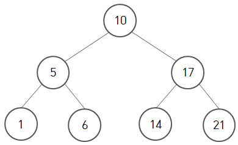</p>


1. 모든 노드의 키(Key)는 유일하다

   - Key는 노드에 기록한 데이터 값을 말합니다. 중복된 데이터 값을 갖는 노드가 없어야 합니다.

2. 왼쪽 서브 트리의 키들은 루트의 키보다 작다.

   - 루트 노드의 데이터가 10이라면, 왼쪽 서브트리에는 10보다 작은 값들만 존재해야 합니다.

3. 오른쪽 서브 트리의 키들은 루트의 키보다 크다.

   - 마찬가지로 오른쪽 서브트리에는 10보다 큰 값들만 존재해야 합니다.

4. 왼쪽과 오른쪽 서브 트리도 이진 탐색 트리이다.

   - 1~3의 조건들이 각 서브트리에 순환적으로 적용되어야 합니다.

   

이진 탐색 트리는 이진 암호화, 파일 시스템에 주로 쓰입니다.


## 이진 탐색트리 구현

### 검색

이진 탐색트리에서 60을 찾는 과정은 다음과 같습니다.

1. 루트부터 탐색을 시작합니다.
 	2. 목표 값과 현재 루트의 데이터를 비교합니다. 목표 값 < 현재 값이면 왼쪽, 반대면 오른쪽으로 이동합니다.
 	3. 일치하는 값을 찾으면 탐색을 멈춥니다.
 	4. 만약 목표 값이 없다면 null을 리턴합니다.

<p align="center">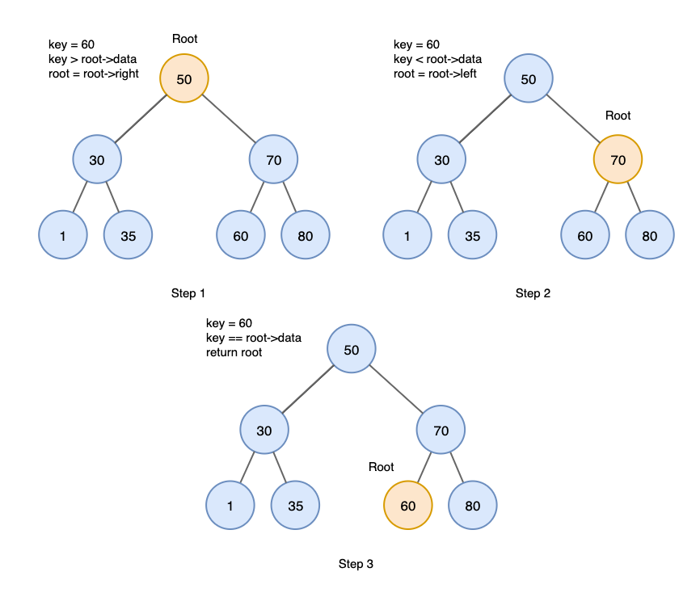</p>

```java
public Node findNode(int key) {
    // 트리가 비었을 때
    if (root == null) return null;

    Node focusNode = root;

    while (focusNode.key != key) {
        if (key < focusNode.key) {              // 현재노드보다 작으면
            focusNode = focusNode.leftChild;    // 왼쪽으로
        } else {                                // 크면
            focusNode = focusNode.rightChild;   // 오른쪽으로
        }

        // 찾으려는 노드가 없을 때
        if (focusNode == null)
            return null;
    }

    return focusNode;
}
```


### 삽입

이진 탐색트리에 값을 삽입할 때 삽입할 위치를 찾는 과정은 값을 검색하는 과정과 유사하게 진행됩니다. 10을 삽입하는 과정은 다음과 같습니다.

1. 루트에서 시작합니다.
2. 삽입 값을 현재 루트의 값과 비교합니다.  삽입 값 < 현재 값이면 왼쪽, 반대면 오른쪽으로 이동합니다.
3. null을 만나면 그 이전 루트에 연결하여 값을 삽입합니다.

값을 검색하는 과정에서 null값을 만났을 때 null을 리턴 했다면, 삽입할 때는 그 곳에 값을 삽입하게됩니다.

<p align="center">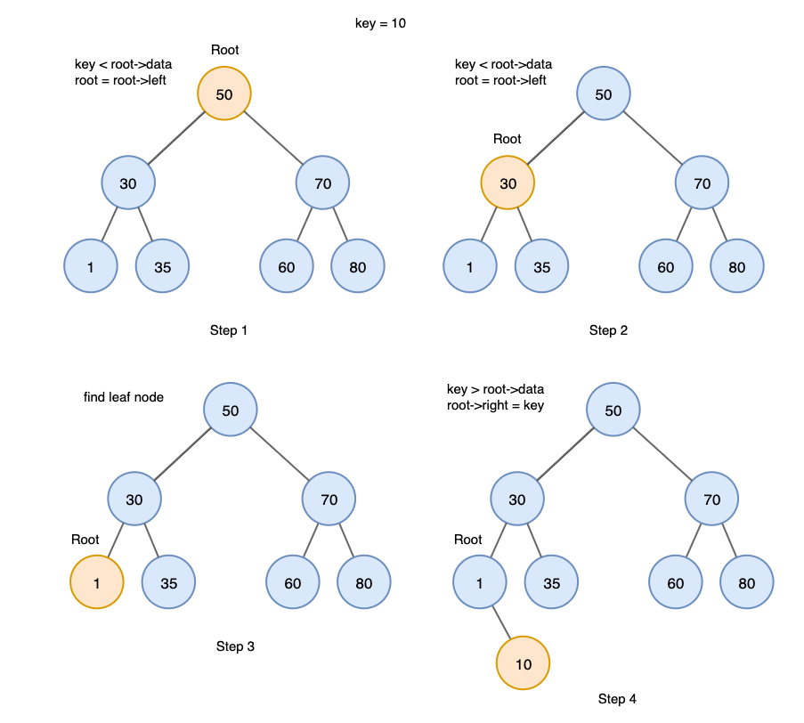</p>

```java
public void addNode(int key) {
    if (findNode(key) != null) return;  // 이미 존재하면 그냥 리턴

    Node newNode = new Node(key);

    if (root == null) {
        root = newNode; // 트리가 비어있으면 root 에 삽입
    } else {
        Node focusNode = root;  //  탐색용 노드
        Node parent;            //  탐색용 노드의 부모 노드

        while(true) {
            parent = focusNode; //  이동

            if (key < parent.key) {             //  삽입하려는 키가 현재 노드보다 작으면
                focusNode = parent.leftChild;   //  왼쪽으로 이동

                if (focusNode == null) {        //  왼쪽 노드가 비어있으면
                    parent.leftChild = newNode; //  왼쪽 노드에 삽입
                    return;
                }
            } else {                            //  삽입하려는 키가 현재 노드와 같거나 크다면
                focusNode = parent.rightChild;  //  오른쪽으로 이동

                if (focusNode == null) {        //  오른쪽 노드가 비어있으면
                    parent.rightChild = newNode;//  오른쪽 노드에 삽입
                    return;
                }
            }
        }
    }
}
```


### 삭제

이진 탐색 트리에서 값을 삭제할 때에도 삭제할 값을 검색하는 과정을 거칩니다. 그리고 삭제할 값을 찾았을 때 3가지 경우를 고려해야 합니다.

1. 삭제할 노드가 leaf 노드인 경우

   이 경우에는 해당 노드를 삭제하면 됩니다.

   <p align="center">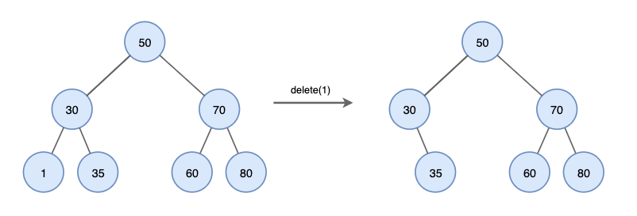</p>


2. 삭제할 노드에 자식이 하나만 있는 경우

   이 경우에는 삭제할 노드의 자식 노드를 삭제할 노드의 부모 노드에 연결한 뒤 삭제하면 됩니다.

<p align="center">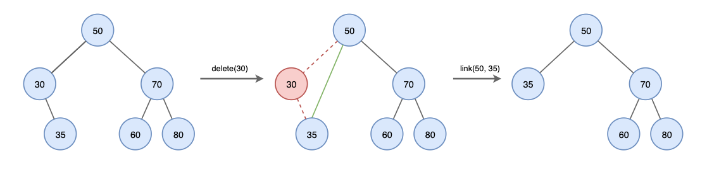</p>


3. 삭제할 노드에 자식이 둘 있는 경우

   이 경우에는 이전보다 다소 복잡해집니다. 이 때는 삭제할 노드의 왼쪽 서브 트리에 있는 값 중 가장 큰 값, 또는 오른쪽 서브 트리에 있는 값 중 가장 작은 값 중 하나를 삭제할 노드의 부모 노드에 연결해야 합니다.

<p align="center">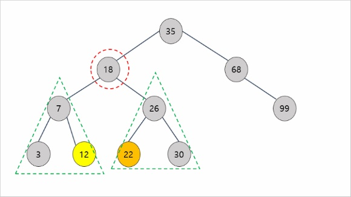</p>

​		이렇게 하는 이유는 이진 탐색 트리의 규칙을 지킬 수 있는 최선의 방법이기 때문입니다.

​		루트의 왼쪽 서브트리의 가장 오른쪽 값은 루트보다 작은 가장 가까운 수이며, 오른쪽 서브트리		의 가장 왼쪽 값은 루트보다 큰 가장 가까운 수입니다.

<p align="center">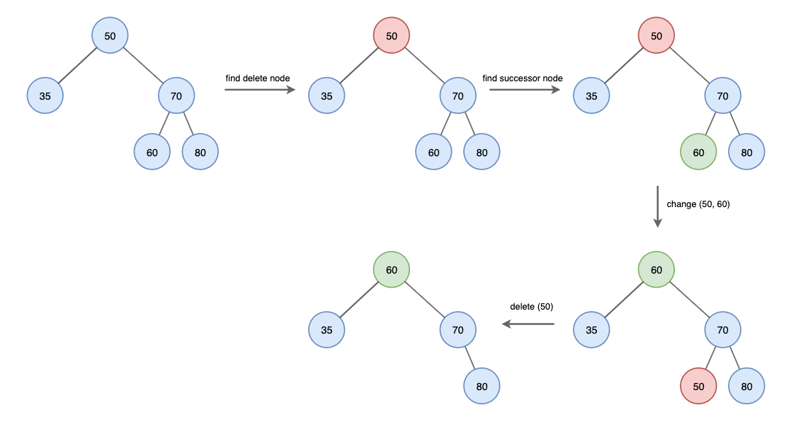</p>

​		50을 삭제하는 경우를 봅시다. 60은 루트 노드의 오른쪽 서브 트리의 가장 왼쪽 값입니다. 이 값		을 루트의 자리에 놓고 50을 60이 있던 자리에 넣은 뒤 자식이 없는 노드를 삭제할 때 처럼 삭제		하면 됩니다.

``` java
public boolean deleteNode(int key) {
    // focusNode 와 parent 가 같을 수 있는 경우는 찾으려는 key 가 root 인 경우
    Node focusNode = root;
    Node parent = root;

    boolean isLeftChild = true;

    // while 문이 끝나고 나면 focusNode 는 삭제될 노드를 가리키고, parent 는 삭제될 노드의 부모노드를 가리키게 되고, 삭제될 노드가 부모노드의 left 인지 right 인지에 대한 정보를 가지게 된다
    while(focusNode.key != key) {
        parent = focusNode; // 삭제할 노드를 찾는 과정중(while문)에서 focusNode 는 계속해서 바뀌고 parent 노드는 여기서 기억해둔다

        if(key < focusNode.key) {
            isLeftChild = true;             // 지우려는 노드가 왼쪽에 있는 노드냐 기록용
            focusNode = parent.leftChild;
        } else {
            isLeftChild = false;            // 지우려는 노드가 오른쪽에 있는 노드냐 기록용
            focusNode = parent.rightChild;
        }

        // 찾으려는 노드가 없는 경우
        if(focusNode == null) {
            return false;
        }
    }


    Node replacementNode;
    // 지우려는 노드의 자식 노드가 없는 경우
    if(focusNode.leftChild == null && focusNode.rightChild == null) {
        if (focusNode == root)
            root = null;
        else if (isLeftChild)
            parent.leftChild = null;
        else
            parent.rightChild = null;
    }
    // 지우려는 노드의 오른쪽 자식노드가 없는 경우 (왼쪽 자식 노드만 있는 경우)
    else if(focusNode.rightChild == null) {
        replacementNode = focusNode.leftChild;

        if (focusNode == root)
            root = replacementNode;
        else if (isLeftChild)
            parent.leftChild = replacementNode;
        else
            parent.rightChild = replacementNode;
    }
    // 지우려는 노드의 왼쪽 자식노드가 없는 경우 (오른쪽 자식 노드만 있는 경우)
    else if (focusNode.leftChild == null) {
        replacementNode = focusNode.rightChild;
        if (focusNode == root)
            root = replacementNode;
        else if (isLeftChild)
            parent.leftChild = replacementNode;
        else
            parent.rightChild = replacementNode;
    }
    // 지우려는 노드의 양쪽 자식노드가 모두 있는 경우
    // 오른쪽 자식 노드의 sub tree 에서 가장 작은 노드를 찾아서 지우려는 노드가 있던 자리에 위치시킨다
    else {
        // 삭제될 노드의 오른쪽 sub tree 를 저장해둔다
        Node rightSubTree = focusNode.rightChild;

        // 삭제될 노드 자리에 오게 될 새로운 노드 (오른쪽 sub tree 에서 가장 작은 값을 가진 노드)
        // 이 노드는 왼쪽 child 가 없어야 한다 (가장 작은 값이기 때문에)
        replacementNode = getRightMinNode(focusNode.rightChild);

        if (focusNode == root)
            root = replacementNode;
        else if (isLeftChild)
            parent.leftChild = replacementNode;
        else
            parent.rightChild = replacementNode;

        replacementNode.rightChild = rightSubTree;
        // 지우려는 노드의 오른쪽 sub tree 에 노드가 하나밖에 없는 경우
        if (replacementNode == rightSubTree) 
            replacementNode.rightChild = null;

        replacementNode.leftChild = focusNode.leftChild; // 지우려는 노드의 왼쪽 sub tree 를 연결시킨다
    }

    return true;
}

private Node getRightMinNode(Node rightChildRoot) {
    Node parent = rightChildRoot;
    Node focusNode = rightChildRoot;

    while (focusNode.leftChild != null) {
        parent = focusNode;
        focusNode = focusNode.leftChild;
    }

    parent.leftChild = null;
    return focusNode;
}
```


### 시간 복잡도

이진 탐색 트리의 삽입, 검색, 삭제에 대한 시간 복잡도는 **균형 상태이면 O(logN)**, **불균형 상태라면 최대 O(N)** 입니다.

<p align="center">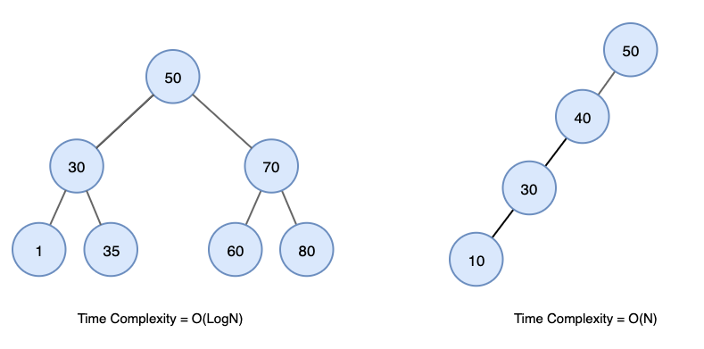</p>


## 이진 탐색트리가 중복된 데이터를 갖지 않는 이유

이진 탐색 트리는 목표 데이터 값의 빠른 탐색을 위한 자료구조입니다. 만약 이진 탐색 트리가 중복된 데이터 값을 가진다면 이진 탐색 트리에서 데이터를 탐색할 때 두가지 경우를 생각해야 할 것입니다.

1. 처음으로 발견되는 노드만 찾고, 중복 노드가 존재할 가능성을 무시한다.
   - 그렇다면 이진 탐색트리는 전혀 사용되지 않을 노드를 갖게 될 것입니다. 이는 메모리 낭비에 불과하며 잘못된 자료구조입니다.
2. 중복 노드가 존재할 가능성이 있으므로 중복 노드를 모두 탐색한다.
   - 그렇다면 일치하는 데이터를 찾았지만 중복 노드를 찾기 위해서 계속 탐색을 진행할 것입니다. 이는 시간의 낭비이며 빠른 탐색에 맞지 않는 자료구조입니다.


#### 관련 문제

[백준 5639 이진 검색 트리](https://www.acmicpc.net/problem/5639)

[백준 18240 이진 탐색 트리 복원하기](https://www.acmicpc.net/problem/18240)

---

# 우선순위 큐와 힙 [☝](#알고리즘)

## 우선순위 큐

일반적으로 큐(Queue)는 먼저 들어온 데이터가 먼저 나가는 선입선출(First in-First out) 구조입니다.  하지만, 우선순위 큐는 데이터가 들어온 순서가 아닌 데이터의 **우선 순위가 높은 데이터가 먼저 나가는 큐**를 말합니다. 우선순위 큐는 **주로 힙(Heap)이라는 자료구조로 구현**합니다. 또한 우선순위 큐는 **데이터의 우선 순위를 비교해야 하므로 그 데이터는 Comparable 하거나 comparator를 생성자에 넣어서 비교 연산이 가능하도록** 해야 합니다.


## 힙 

힙(Heap)은 완전 이진 트리에 있는 노드 중에서 키 값이 가장 큰 노드나 가장 작은 노드를 찾게 만든 자료구조입니다. 힙은 이진탐색트리와 달리 중복된 값이 허용됩니다.

<p align="center">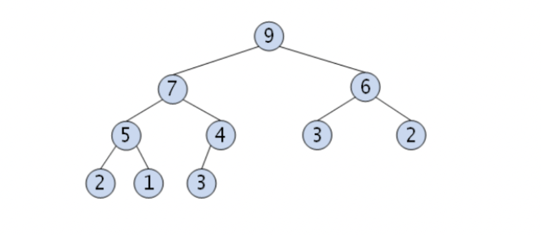</p>

- 최대 힙
  - 키 값이 가장 큰 노드를 찾기 위한 완전 이진 트리
  - 부모 노드의 키 값 >= 자식 노드의 키 값
  - 루트 노드:  키 값이 가장 큰 노드


<p align="center"></p>

- 최소 힙
  - 키 값이 가장 작은 노드를 찾기 위한 완전 이진 트리
  - 부모 노드의 키 값 < 자식 노드의 키 값
  - 루트 노드: 키 값이 가장 작은 노드
- 힙에서는 루트 노드의 원소만을 삭제 할 수 있습니다.
  - 루트 노드의 원소를 삭제하여 반환한다.
  - 루트 노드를 다시 구한다.


## 힙 구현

힙은 일반적으로 배열을 이용하여 구현합니다. 힙은 완전 이진 트리이므로 중간에 비어있는 요소가 없기 때문에 배열의 공간을 모두 사용하기 때문입니다.

<p align="center">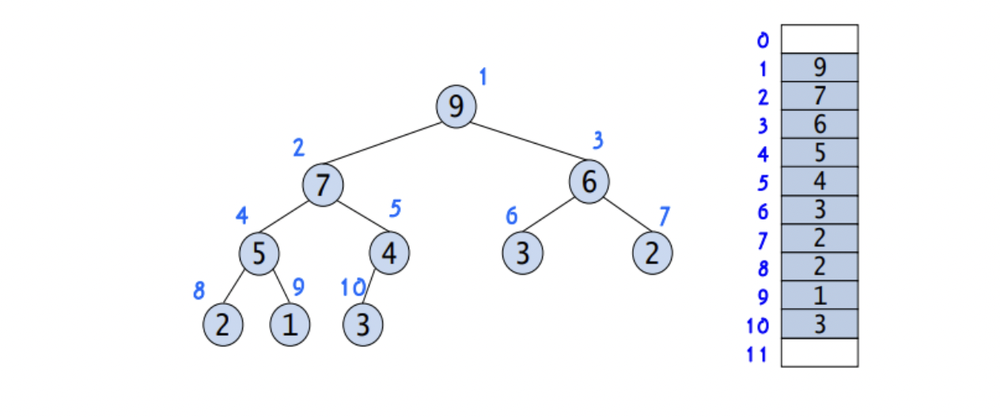</p>

**자식노드를 구하고 싶을 때**

- 왼쪽 자식노드 index = (부모 노드 index) * 2
- 오른쪽 자식노드 index = (부모 노드 index) * 2 + 1

**부모노드를 구하고 싶을 때**

- 부모 노드 index = (자식노드 index) / 2


### 삽입

힙에 데이터를 삽입하는 방법은 다음과 같습니다.

1. 완전 이진트리의 마지막 노드에 이어서 새로운 노드를 추가한다.
2. 추가된 새로운 노드를 부모의 노드와 비교하여 교환한다.
3. 힙 구조를 만족할 때 까지 2를 반복한다.

힙에 3을 삽입하는 과정은 다음과 같습니다.

<p align="center">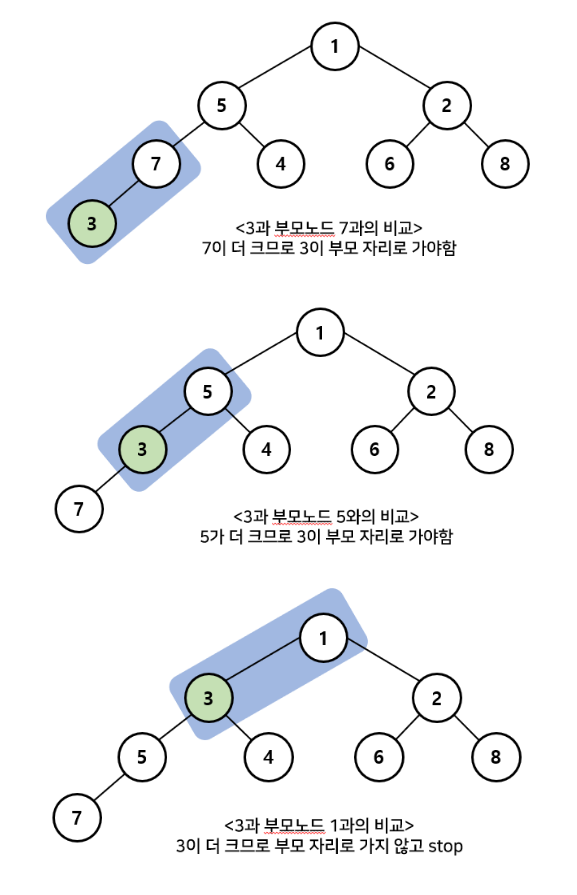</p>

### 삭제

힙에서 데이터를 삭제하는 방법은 다음과 같습니다.

1. 루트 노드가 가장 우선 순위가 높으므로 루트 노드를 삭제한다.
2. 루트 노드가 삭제된 빈자리에 완전 이진트리의 마지막 노드를 가져온다.
3. 루트 자리에 위치한 새로운 노드를 자식 노드와 비교하여 교환한다.
4. 힙 구조를 만족할 때 까지 3을 반복한다.

<p align="center">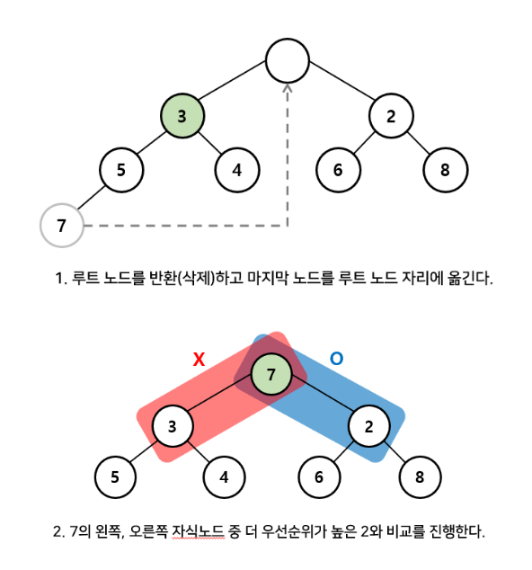</p>


## 힙의 시간 복잡도와 우선순위 큐를 힙으로 구현하는 이유

우선순위 큐 == 힙이 아닙니다. 힙은 우선순위 큐를 구현할 수 있는 여러 자료구조 중 하나입니다. 하지만 우선순위 큐는 보통 힙으로 구현합니다. 그 이유는 시간 복잡도에서 가장 유리하기 때문입니다.

만약 배열로 구현한다면 우선 순위가 높은 순서대로 배열의 가장 앞부분부터 넣을 때 우선 순위가 높은 데이터는 맨 앞의 index를 이용하는 것으로 쉽게 찾을 수 있습니다. 하지만 우선 순위가 중간인 데이터를 삽입한다면 삽입하는 위치를 찾고, 뒤의 데이터를 모두 한 칸 씩 밀어야 합니다. 그러므로 정렬된 배열에서는 삽입은 O(n), 삭제는 O(1)의 시간 복잡도를 가집니다. 정렬되지 않은 배열이라면 삽입은 O(1)이고, 삭제할 때 삭제할 값을 찾아야 하므로 O(n)의 시간 복잡도를 가집니다.

연결리스트로 구현할 때도 배열과 크게 다르지 않습니다. 정렬 유무에 따라 배열과 같은 시간 복잡도를 가집니다.

하지만 힙으로 구현한다면  삽입과 삭제과정에서 모두 부모 노드와 자식 노드 간의 비교만 이뤄지므로 O(log2n)의 시간 복잡도를 가집니다. 

정리하면 배열과 연결리스트는 정렬 여부에 따라 삽입과 삭제에서 O(n)과 O(1)의 시간 복잡도를 가지게 되고, 힙은 일관적으로 O(log2n)의 시간복잡도를 가집니다. 그래서 편차가 심한 배열과 연결리스트 보다는 힙으로 구현을 합니다.


#### 관련 문제

[백준 11279 최대 힙](https://www.acmicpc.net/problem/11279)

[백준 1655 가운데를 말해요](https://www.acmicpc.net/problem/1655)

[백준 11000 강의실 배정](https://www.acmicpc.net/problem/11000)


<br />

---

# 구간 트리 [☝](#알고리즘)

일차원 배열의 특정 구간에 대한 질문을 빠르게 대답하는 데 활용되는 자료구조

대표적으로 구간 원소들의 합, 구간 원소들의 최솟값(RMQ, Range Minimum Query) 등에 대한 질의를 지원한다.

## 구간 트리(Segment Tree) 초기화


- 배열의 각 구간을 표현하는 **이진 트리** 형태
- 구간 트리의 루트는 배열의 전체 구간(`[0, n-1`)을 표현
- 각 트리(i)의 왼쪽 자식(2*i)과 오른쪽 자식(2*i+1)은 해당 구간을 반으로 나눈 왼쪽 부분와 오른쪽 부분을 표현
- 리프 노드는 구간의 크기가 1인 경우
- 전체 구간 크기가 2의 제곱꼴이라면 노드가 `2*(h+1)-1`개인 **완전 이진 트리**가 완성되겠지만, 2의 제곱꼴이 아니더라도 남는 노드는 빈 공간으로 남겨두고 `2*(h+1)-1` 크기의 배열로 표현하는 것이 편함.
- **구간 트리의 각 노드는 해당하는 구간의 계산 결과를 저장**해둔다. 따라서 최소 구간 문제의 경우 각 구간의 최솟값을, 구간의 합 문제의 경우 각 구간의 원소들의 합을 노드에 저장해둔다.
- 어떤 구간이 주어지더라도 해당 구간은 **구간트리 노드에 포함된 구간들의 합집합**으로 표현할 수 있다.

<br />


## 구간 트리 질의


구간 트리로 해결하는 가장 대표적인 문제인 구간 최소 문제(RMQ, Range Minimum Query)를 보자. 

### 원리

원하는 구간을 포함하는 구간 집합 중 집합의 크기가 최소인 구간을 찾는다.
1. 만약 현재 구간이 원하는 구간을 전혀 포함하지 않는다면 무한대를 반환한다.
2. 만약 현재 구간이 원하는 구간에 완전히 포함된다면 현재 노드(구간의 최솟값을 저장한 상태)를 반환한다.
3. 위의 두 경우가 아닌 경우(즉, 현재 구간이 원하는 구간을 포함하되 전부를 포함하지 않거나 아니면 최소 크기가 보장되지 않은 경우)에는 현재 구간을 반으로 나눠 위의 과정을 다시 반복하고 난 뒤 결과 중 최솟값을 반환한다.

### 시간 복잡도

구간 트리의 레벨은 `O(log n)`이며 질의를 위해 최대 구간 트리의 레벨 만큼 확인하면 되므로 `O(log n)`의 연산이 필요하다.

### 구현

```java
class SegmentTreeRMQ
{
    static int sTree[];        // 세그먼트 트리
    
    // 두 값을 비교해 더 작을 값을 반환하는 함수
    static int minVal(int x, int y) {
    	return (x < y) ? x : y;
    }
    
    // 구간의 중간 위치를 인덱스로 구하는 함수
    static int getMid(int s, int e) { 
    	return (s + e) / 2;
    }
    
    // 주어진 배열(전체 구간)에 맞는 완전 이진 트리 만들기
    static void treeInit(int arr[], int n) {
    	// 트리의 높이
    	int x = (int) (Math.ceil(Math.log(n) / Math.log(2)));
    	// 트리 최대 크기 (이렇게 직접 계산하지 않고 n*4를 하게되면 쉽게 모든 배열 원소를 포함하는 트리를 만들 수 있지만 메모리 낭비가 발생할 수 있음)
    	int max_size = 2 * (int) Math.pow(2, x) - 1;
    	sTree = new int[max_size];
    
    	// 생성한 트리에 배열의 원소 삽입
    	nodeInit(arr, 0, n-1, 1);
    }
    
    // 세그먼트 트리 초기화(각 노드에 각 구간의 최솟값을 저장)
    static int nodeInit(int arr[], int arrStart, int arrEnd, int node) {
    	// 리프노드 혹은 자식 노드들이 이미 각자 구간의 최솟값을 계산하여 저장하고 있는 경우 
    	if (arrStart == arrEnd) return sTree[node] = arr[arrStart];
    
    	// 구간을 반으로 나눠가며 재귀적으로 자식 노드들에 각 노드가 포함하는 구간의 최솟값을 저장
    	int mid = getMid(arrStart, arrEnd);
    	return sTree[node] = minVal(nodeInit(arr, arrStart, mid, 2*node), nodeInit(arr, mid+1, arrEnd, 2*node+1));
    }
    
    // 구간 최소를 구하는 메서드
    static int RMQ(int treeStart, int treeEnd, int queryStart, int queryEnd, int node) {
    	// 현재 노드에 표현된 구간이 탐색을 원하는 구간을 완전히 배제한다면 무한대 반환
    	if (treeStart > queryEnd || treeEnd < queryStart) return Integer.MAX_VALUE;
    
    	// 현재 노드에 표현된 구간이 탐색을 원하는 구간에 포함된다면 노드(구간의 최솟값)에 저장된 값 반환
    	if (queryStart <= treeStart && queryEnd >= treeEnd) return sTree[node];
    
    	// 현재 노드에 표현된 구간이 탐색을 원하는 구간을 일부 포함할 경우 현재 구간을 왼쪽 부분와 오른쪽 부분으로 나눠 다시 질의
    	int mid = getMid(treeStart, treeEnd);      // 현재 노드의 구간을 나눔
    	// 왼쪽 구간에 대해 질의한 결과와 오른쪾 구간에 대해 질의한 결과 중 최솟값을 채택
    	return minVal(RMQ(treeStart, mid, queryStart, queryEnd, 2*node), RMQ(mid+1, treeEnd, queryStart, queryEnd, 2*node+1));
    }
    
    public static void main(String args[]) {
    	int arr[] = {1, 3, 2, 7, 9, 11};
    
    	// 주어진 배열에 맞는 트리 생성
    	treeInit(arr, arr.length);
    
    	int queryStart = 2;    // 탐색 원하는 구간 시작 지점
    	int queryEnd = 3;      // 탐색 원하는 구간 종료 지점
    
    	System.out.println(
    	"Minimum of values in range [" + queryStart + ", " + queryEnd + "] is = " + RMQ(0, arr.length-1, queryStart, queryEnd, 1));
    }
}
```

> 만약 구간 합을 구하는 문제로 바꾸어 풀고싶다면 `nodeInit()` 메서드에서 각 노드에 구간의 최솟값을 저장하지 말고 구간합을 계산해서 저장하면 된다.

<br />

## 구간 트리 갱신

구간 트리 초기화 단계에서 주어진 배열대로 트리를 만들었다. 하지만 이후 배열의 원소를 바꾸어 트리에 다시 반영해야할 수 있다. 구간 트리를 갱신하는 방법에 대해 보자.

### 원리

원하는 구간을 포함하는 구간 집합 중 집합의 크기가 최소인 구간을 찾는다.
1. 만약 현재 구간이 원하는 구간을 전혀 포함하지 않는다면 pass
2. 만약 현재 구간이 원하는 구간에 완전히 포함된다면 현재 노드의 값을 갱신한다.
3. 위의 두 경우가 아닌 경우(즉, 현재 구간이 원하는 구간을 포함하되 전부를 포함하지 않거나 아니면 최소 크기가 보장되지 않은 경우)에는 현재 구간을 반으로 나눠 위의 과정을 다시 반복하며 값을 갱신한다.

### 시간 복잡도

변경을 원하는 원소를 포함하는 구간은 구간 트리에 `O(log n)`개 존재하므로 특정 원소를 변경할 때도 `O(log n)`만큼의 연산만 수행하면 된다.

### 구현

```java
void updateTree(int[] arr, int treeStart, int treeEnd, int node, int index, int diff) {
    // 현재 노드에 표현된 구간이 탐색을 원하는 구간을 완전히 배제한다면 pass
    if (treeStart > index || treeEnd < index) return;

    // 값을 변경할 배열 원소와 해당 원소 변화가 영향을 미치는 모든 부모 노드의 값을 변경(최솟값 변경)
    sTree[node] += diff;
    
    // 최종 배열 원소까지 값을 변경했다면 재귀 종료
    if (start == end) return;
    
    // 값의 변경을 원하는 원소가 포함된 모든 구간의 최솟값을 바꿔주기 위해 재귀적으로 탐색
    int mid = getMid(treeStart, treeEnd);      // 현재 트리의 구간을 나눔
    // 값의 변경을 원하는 원소가 포함된 구간의 최솟값을 모두 바꿔줌
    updateTree(arr, treeStart, mid, 2*node, index, diff);
    updateTree(arr, mid+1, treeEnd, 2*node+1, index, diff);
}
```

### PS 문제 추천

[Baekjoon Online Judge > 2042-구간 합 구하기](https://www.acmicpc.net/problem/2042)

[2021 카카오 채용연계형 인턴십 > 표 편집](https://programmers.co.kr/learn/courses/30/lessons/81303)

---

# 상호 배타적 집합 [☝](#알고리즘)

상호 배타적 집합(disjoint set)은 서로소 집합 또는 Union-Find라고도 합니다. 전체 집합에서 공통 원소를 가지지 않는 여러 부분 집합들을 저장하고 조작하는 자료구조입니다. 

## 상호 배타적 집합 연산

- Make(initialize): n개의 원소가 각각의 집합에 포함되어 있도록 초기화 한다.

  ```java
  	private static void make() {
  		for (int i = 0; i < N; i++) {
  			parents[i] = i;
  		}
  	}
  ```

- find: 어떤 원소 a가 속한 집합을 반환한다.

  - find 연산의 결과 값 비교로 두 원소가 현재 같은 집합에 속하는지 알 수 있다.

  ```java
  	private static int find(int a) {
  		if(a==parents[a]) return a;
  		return find(parents[a]);
  	}
  ```

- union: 두 원소 a,b 가 주어질 때 이들이 속한 두 집합을 하나로 합친다.

  ```java
  	private static void union(int a , int b) {
  		int aRoot = find(a);
  		int bRoot = find(b);
  		if(aRoot == bRoot) return; // 둘은 같은 집합
  		
  		parents[bRoot] = aRoot;
  	}
  ```

  

## 상호 배타적 집합 표현

1. 배열

   - 1차원 배열 belongsTo[i] = i번 원소가 속하는 집합의 번호라고 둔다.

   - make 연산을 하면  belongsTo[i]  = i가 될 것이다.

   - find 연산을 하면 i가 속하는 집합의 번호를 O(1)로 구할 수 있다.

   - 하지만 union 연산을 했을 때 배열을 순회하면서 i가 속하는 집합을 갱신해주어야 하므로 O(N)이 걸린다. 

     

2. 트리

   - 한 집합에 속하는 원소들을 하나의 트리로 묶어 주기 때문에 트리들의 집합으로 표현한다.
   - make 연산을 하면 각 노드들이 자기 자신을 root로 가리킬 것이다.
   - find 연산을 하면 노드가 가리키는 값들을 루트가 나올 때 까지 타고 가서 root값을 가져오게 된다. 트리의 높이만큼의 시간이 걸리므로 일반적으로 O(logN)로 구할 수 있다.
   - union 연산을 하면 노드 중 한 쪽이 가리키는 root노드가 다른 한쪽의 root 노드를 가리키게 하면 된다. 이 연산 자체는 O(1)이지만 내부적으로 find를 사용하기 때문에 O(logN)으로 구할 수 있다.
   - 그래서 **상호 배타적 집합은 트리로 표현**한다.


## 최적화

하지만 트리로 표현했을 때 union연산의 결과로 트리의 구조가 한 쪽으로 기울어지는 문제가 생길 수 있습니다. 이 때 트리의 높이가 n이라면 find와 union 모두 O(n)의 시간 복잡도를 가지게 됩니다.

이 문제를 해결하는 방법은 크게 두 가지 입니다.


1. 랭크에 의한 합치기(Union by rank)

   - 항상 높이가 더 낮은 트리를 높은 트리에 붙이는 방법입니다. 그러면 트리의 높이가 계속해서 높아지는 것을 막을 수 있습니다.

   - 구현할 때 높이 정보를 저장하는 rank 배열을 만들어서 해당 노드가 한 트리의 root인 경우 해당 트리의 높이를 저장하도록 합니다.

   - 높이가 같은 트리끼리 합치면 트리의 높이를 1 높여 줍니다.

   - (a)에서 6과 1를 union 할 때 6를 1에 연결합니다. 만약 반대가 된다면 트리의 rank가 증가했을 것입니다.

   <p align="center">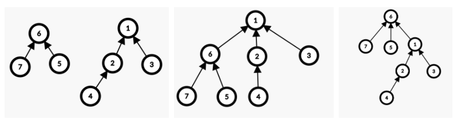</p>

   ```java
   	private static void union(int a , int b) {
   		int aRoot = find(a);
   		int bRoot = find(b);
   		if(aRoot == bRoot) return; // 둘은 같은 집합
           
           //a와 b의 rank를 비교하여 더 낮은 값이 a로 오게 한다.
           if(rank[a] > rank[b]) swap(a, b); 
           
           parent[a] = b; //a를 b에 연결한다.
           //a와 b의 rank가 같다면 b의 rank를 증가시킨다.
           if(rank[a] == rank[b]) rank[b]++; 
       }
   ```

   

2. 경로 압축(path compression)

   - find 연산을 할 때 해당 노드가 연결되어 있는 경로를 따라 root를 찾아갑니다.
   - 이 때 연산으로 얻어낸 root를 해당 노드에 바로 연결한다면 다음에 find 연산을 할 때 해당 노드의  root를 한 번에 찾을 수 있게 됩니다.
   - (a)에서 find(0)을 수행하면 트리의 형태가 (b)로 바뀝니다.

   <p align="center">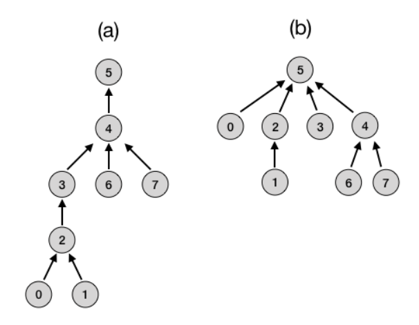</p>

   ```java
   private static int find(int a) {
   	if(a==parents[a]) return a;
   	return parents[a] = find(parents[a]);
   }
   ```


## 사용 예

- 그래프의 연결성 확인하기

  - 서로 연결된 노드는 같은 집합에 포함되어 있다고 할 수 있다.
  - 각 노드의 루트를 비교하여 문제를 해결한다.
  - [크루스칼 최소 스패닝 알고리즘](##크루스칼의-최소-스패닝-트리-알고리즘)

  

- 가장 큰 집합 찾기

  - 루트 노드에 현재 트리에 속한 노드의 개수를 저장한다면 가장 큰 집합을 찾을 수 있다.

    ```java
        private static void make() {
        	parents = new int[V+1];
        	for (int i = 1; i < V+1; i++) {
                //root가 음수이면 음수의 크기 만큼 노드를 갖고 있다고 표현 할 수 있다. 
    			parents[i] = -1; 
    		}
        }
        
        private static int find(int a) {
            //parents[a]가 음수이면 root이므로 그 값을 리턴한다.
        	if(parents[a] < 0) return a;
        	return parents[a] = find(parents[a]);
        }
        
        private static void union(int a, int b) {
        	int aRoot = find(a);
        	int bRoot = find(b);
        	
            // aRoot가 -1이면 자기 자신만 있는 집합이므로 구별해줍니다.
        	if(aRoot != -1 && aRoot == bRoot) return;
        	
            //연결하는 root의 parents값을 더해서 새로운 트리의 크기를 저장할 수 있다.
        	parents[aRoot] += parents[bRoot];
        	parents[bRoot] = aRoot;
        	return;
        }
    ```


### 관련 문제

[백준 1717 집합의 표현](https://www.acmicpc.net/problem/1717)

[백준 10775 공항](https://www.acmicpc.net/problem/10775)

---

# 트라이 Trie [☝](#알고리즘)

키와 값을 쌍으로 갖는 연관 배열 데이터를 저장하는 트리 자료 구조

주로 자연어 처리(NLP) 분야에서 문자열 탐색을 위해 사용한다. 문자열의 각각의 문자 단위로 색인을 구축한 형태이다.

## 트라이 원리

### 트라이를 이용한 문자열 저장


<p align="center"></p>

> 1. 각 노드가 배열로 구성된 트리를 생성한다.
> 2. 저장하려는 문자열의 모든 문자들을 확인하며 아래 과정을 시행한다.
> 3. 루트 노드(문자 배열)에서 문자열의 첫번째 문자에 해당하는 인덱스로 이동한다.
> 4. 해당 인덱스에 연결된 자식 노드가 존재하지 않는다면 새로운 노드(문자 배열)를 할당한다. 이후 새로운 노드에서 두번째 문자에 해당하는 인덱스로 이동한다.
> 5. 해당 인덱스에 연결된 자식 노드가 존재한다면 해당 노드의 두번째 문자에 해당하는 인덱스로 이동한다.
> 6. 문자열의 모든 문자를 다 저장할 때까지(즉, 문자열 길이만큼) 위의 과정을 반복한다. 마지막 문자를 저장하고 나서는 배열 값을 `true`로 설정하여 하나의 문자열이 완전히 저장됨을 표시한다.

위의 과정에서 주목할 점은 **접두사가 동일한 문자열**을 저장할 경우 **최소 하나 이상의 노드를 공유**한다는 것이다!

## 트라이의 시간 복잡도

위의 방식대로 문자열을 저장할 경우 **한 문자열을 탐색할 때 고작 `O(1)`의 연산**만 필요하게 된다.

아무리 트리 노드가 많이 존재하더라도, 심지어는 전세계 모든 인구인 80억명의 이름이 저장된 트라이라고 할지라도, 오직 `O(1)`의 시간만이 걸린다. 그 이유는 한 문자열을 탐색하기 위해서는 해당 문자열이 갖고 있는 문자 노드만을 탐색하기 때문이다. 루트 노드에서부터 **해당 문자열의 길이** 만큼의 자식 노드만 타고 들어가기 때문에, 다른 탐색 알고리즘과 달리 **저장된 문자열의 개수에 영향을 받지 않는다**는 점이 트라이의 큰 특장점이다.

## 트라이의 공간 복잡도

우수한 시간적 성능을 자랑하는 트라이의 치명적인 한계는 바로 메모리를 많이 사용한다는 것이다.

트라이를 이용해 한국의 5천만 인구의 이름을 저장한다고 생각해보자. 한국에서 가장 긴 이름은 `"박하늘별님구름햇님보다사랑스러우리"`로 17자이다. 이 이름을 저장하기 위해서는 한글의 모든 음절을 배열로 담은, 길이가 `11,172인 배열`이 `17개`가 필요하고 총 `189,924`만큼의 메모리(1음절을 1byte로 가정)가 필요하다. 이름의 길이가 길어서 생긴 문제라고 말할 수도 있겠지만, 가장 보편적인 3자 이름 역시 `11,172인 배열`이 `3개`가 필요하고 총 `33,516`만큼의 메모리가 필요하다. 한 명의 이름을 저장하는데도 이렇게 많은 메모리를 사용하는데 이런 방식으로 `5천만`명의 이름을 저장한다면 어마어마한 크기의 메모리가 필요하게 될 것이다.(물론 같은 성을 사용하거나 돌림자를 사용하는 이름은 노드를 같이 사용할 수 있어 조금은 효율적이라고 말할 수 있다.)

트라이의 공간 복잡도는 대략 `O(포인터 크기 * 포인터 배열의 길이 * 전체 노드 개수)`가 된다. 따라서 트라이는 **시간적 성능과 공간적 성능을 맞바꾼** 대표적인 예로 볼 수 있다.

## Java를 이용한 트라이 구현

```java
class Trie {
    final int ALPHABET_SIZE = 26;         // 포인터 배열의 길이(표현할 수 있는 문자 개수)

    class Node {
        Node[] children = new Node[ALPHABET_SIZE];     
        boolean isEndOfWord;              // 저장하려는 문자열의 마지막 문자 여부

        public Node() {
            for (int i=0; i<ALPHABET_SIZE; i++) {
                children[i] = null;       // 포인터 배열 초기화
            }

            isEndOfWord = false;          // 마지막 문자 여부 초기화
        }
    }

    Node root;                            // 문자열의 첫번째 문자

    public void insert(String key) {
        int length = key.length();        // 탐색하려는 문자열 길이
        int alphabetIdx;                  // 문자열의 각 문자의 인덱스
        Node curAlphabet = root;          // 현재 탐색중인 문자열의 문자

        for (int level=0; level<length; level++) {
            alphabetIdx = key.charAt(level) - 'a';                    // 문자열의 각 문자의 인덱스 구하기
            Node nextAlphabet = curAlphabet.children[alphabetIdx];    // 문자열의 다음 문자

            if (nextAlphabet == null) {         // 찾으려는 문자에 연결된 자식 노드가 없을 경우
                nextAlphabet = new Node();      // 새로운 노드 생성 뒤 자식 노드로 연결
            }

            curAlphabet = nextAlphabet;         // 찾으려는 문자의 자식 노드를 현재 노드로
        }

        curAlphabet.isEndOfWord = true;         // 문자열의 모든 문자에 대해 삽입이 끝났다면 마지막 문자의 노드는 true로 변경하여 하나의 문자열이 저장됐음을 표시
    }

    public boolean search(String key) {
        int length = key.length();        // 탐색하려는 문자열 길이
        int alphabetIdx;                  // 문자열의 각 문자의 인덱스
        Node curAlphabet = root;          // 현재 탐색중인 문자열의 문자

        for (int level=0; level<length; level++) {
            alphabetIdx = key.charAt(level) - 'a';
            Node nextAlphabet = curAlphabet.children[alphabetIdx];

            if (nextAlphabet == null) {         // 탐색하려는 문자열이 존재하지 않는 경우
                return false;
            }

            curAlphabet = nextAlphabet;         // 찾으려는 문자의 자식 노드를 현재 노드로
        }

        return (curAlphabet.isEndOfWord);       // 탐색하려는 문자열이 존재하는 경우
    }
}
```

## PS 문제 추천

[2020 KAKAO BLIND RECRUITMENT > 가사검색](https://programmers.co.kr/learn/courses/30/lessons/60060)

<br>

---

# 그래프

---

# 그래프의 표현과 정의 [☝](#알고리즘)
어떤 자료나 개념을 표현하는 정점(vertex)들의 집합 V와 이들을 연결하는 간선(edge)들의 집합 E로 구성된 자료구조

주로 현실 세계의 사물이나 추상적인 개념 간의 연결관계를 표현할 때 사용

## 그래프 관련 용어

- 노드 (Node): 위치를 말함, 정점(Vertex)라고도 함

- 간선 (Edge): 위치 간의 관계를 표시한 선으로 노드를 연결한 선이라고 보면 됨 (link 또는 branch 라고도 함)
- 인접 정점 (Adjacent Vertex) : 간선으로 직접 연결된 정점(또는 노드)
- 참고
  - 정점의 차수 (Degree): 무방향 그래프에서 하나의 정점에 인접한 정점의 수
  - 진입 차수 (In-Degree): 방향 그래프에서 외부에서 오는 간선의 수
  - 진출 차수 (Out-Degree): 방향 그래프에서 외부로 향하는 간선의 수
  - 경로 길이 (Path Length): 경로를 구성하기 위해 사용된 간선의 수
  - 단순 경로 (Simple Path): 처음 정점과 끝 정점을 제외하고 중복된 정점이 없는 경로
  - 사이클 (Cycle): 단순 경로의 시작 정점과 종료 정점이 동일한 경우

## 그래프의 종류


### 방향 그래프

그래프의 각 간선이 방향이라는 속성을 갖는 그래프

### 가중치 그래프

그래프의 각 간선이 가중치(weight)라는 송석을 갖는 그래프

### 다중 그래프

두 정점 사이에 두 개 이상의 간선이 있을 수 있는 그래프

### 트리

간선을 통해 두 정점을 잇는 방법이 딱 하나밖에 없는 그래프

### 이분그래프

그래프의 정점들을 겹치지 않는 두 개의 그룹으로 나눠서 서로 다른 그룹에 속한 정점들 사이에만 간선이 존재하도록 만들 수 있는 그래프

### DAG

사이클 없는 방향 그래프(Directed Acyclic Graph)

기본적으로 방향 그래프, 한 점에서 출발해 자기 자신으로 돌아오는 경로가 없는 경우

## 그래프의 경로

그래프에서 경로란 끝과 끝이 연결된 간선들을 순서대로 나열한 것


주어진 그림에서 1에서 5로 가는 경로는 
(1,2),(2,4),(4,5)와 같이 표현.
간단하게 1-2-4-5로도 표현

## 그래프의 표현 방법

V = 정점의 수

### 인접 리스트

그래프의 각 정점마다 해당 정점에서 나가는 간선의 목록을 저장해서 그래프를 표현

각 정점마다 하나의 연결 리스트를 갖는 방식으로 구현

### 인접 행렬

인접 리스트가 두 정점의 연결 관계를 확인하기위해 모든 리스트를 뒤져야한다는 단점 보완

|V|X|V| 크기의 행렬(|V|는 정점의 갯수)로 표현한다.

간**선의 수가 $V^2$에 비해서 훨씬 적은 경우 인접리스트를 사용하는 것이 유리하고**

**간선의 수가 $V^2$에 비례하는 경우 인접행렬을 사용하는 것이 유리하다.**

### 암시적 그래프 표현

그래프를 직접 메모리에 표현하지않고 그래프 구조만 사용하는 것이 유리한 경우

- 입력이 그래프의 형태를 띄지않는 문제의 경우(ex. 배열로 주어진 미로)
- 그래프의 크기가 아주 큰데 실제 사용하는 부분은 그래프의 일부분인 경우

---

# DFS [☝](#알고리즘)

DFS(Depth-First Search,깊이 우선 탐색)은 그래프의 모든 노드를 탐색하는 가장 단순한 방법입니다.

정점의 자식들을 먼저 탐색하는 방식으로 다음의 순서를 따릅니다.

1. 현재 정점과 인접한 간선들을 하나씩 검사한다.
2. 아직 방문하지 않은 정점으로 향하는 간선이 있다면 그 간선을 따라간다.
3. 더 이상 갈 곳이 없는 막힌 정점에 도달할 때까지 반복한다.
4. 더이상 갈 곳이 없다면 가장 마지막에 지난 간선을 따라 돌아가 더 이상 방문할 정점이 없을 때까지 반복한다.

각 정점이 정수형인 경우를 예시로 설명하겠습니다.


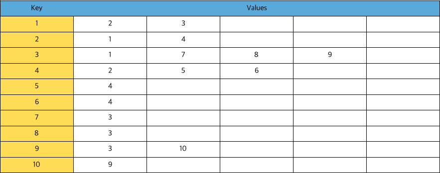

위와 같이 만들어진 그래프를 DFS로 탐색하는 그림은 다음과 같습니다.


## Java로 그래프를 표현하는 방법

정점의 개수를 n, 간선의 개수를 m,  연결관계에 있는 노드를 (node1, node2)의 순서쌍으로 하면, 다음과 같이 그래프를 표현할 수 있습니다.

```java
Map<Integer, ArrayList<Integer>> graph = new TreeMap<Integer, ArrayList<Integer>>();
int n = 0, m = 0
Scanner sc = new Scanner(System.in);
n = sc.nextInt();
m = sc.nextInt();
//초기화 해줘야지 아래의 반복문에서 nullPointException 발생하지않는다.
for(int i = 0;i<n;i++){
  graph.put(i+1,new ArrayList<>());
}
for(int i = 0;i<m;i++){
  int n1 = 0, v1 = 0;
  node1 = sc.nextInt();
  node2 = sc.nextInt();
  graph.get(n1).add(node2);
  graph.get(node2).add(node1);
}
```

## DFS 알고리즘 구현

스택을 활용해서 구현할 수 있습니다.

```java
//code
public void dfsWithoutRecursion(int start) {
  Stack<Integer> stack = new Stack<Integer>();
  boolean[] isVisited = new boolean[adjVertices.size()];
  stack.push(start);
  while (!stack.isEmpty()) {
    int current = stack.pop();
    isVisited[current] = true;
    visit(current);
    for (int dest : adjVertices.get(current)) {
      if (!isVisited[dest])
        stack.push(dest);
    }
  }
}
```

재귀호출을 통해 메서드 스택을 이용해서 구현하는 방법도 있습니다.

```java
public void dfs(int start) {
  boolean[] isVisited = new boolean[adjVertices.size()];
  dfsRecursive(start, isVisited);
}
void dfsRecursive(int current, boolean[] isVisited) {
  isVisited[current] = true;
  visit(current);
  for (int dest : adjVertices.get(current)) {
    if (!isVisited[dest])
      dfsRecursive(dest, isVisited);
  }
}
```


## 시간 복잡도

일반적으로 DFS의 시간복잡도는 정점의 수를 V, 간선의 수를 E라고 할 때 O(V+E) 입니다.

---

# BFS [☝](#알고리즘)

BFS(너비 우선 탐색)은 그래프를 탐색하는 방법 중 하나입니다.

정점들과 같은 레벨에 있는 노드(형제 노드)들을 먼저 탐색하는 방법으로 다음의 순서를 따릅니다. 

1. 현재 정점과 인접한 간선들을 하나씩 검사합니다.

2. 현재 노드에서 방문할 수 있는 노드를 전부 방문합니다.

3. 전부 방문한 후 그 다음 레벨의 노드를 방문합니다.

4. 더 이상 방문할 곳이 없다면 탐색을 종료합니다.

   

   


## BFS 알고리즘 구현

queue와 배열을 이용해서 구현할 수 있습니다.

```java
//code
static void bfs(Map graph,int start_node){
  Queue<Integer> need_visit = new LinkedList<>();
  Queue<Integer> visited = new LinkedList<>();
  need_visit.add(start_node);

  while(need_visit.isEmpty()==false){
    int node = need_visit.poll();
    if(!visited.contains(node)){
      visited.add(node);
      ArrayList<Integer> temp = (ArrayList<Integer>) graph.get(node);
      for(int data : temp) need_visit.add(data);
    }
  }
  for(int data : visited)System.out.print(data+" ");
}
```

## 시간복잡도

일반적으로 BFS의 시간복잡도는 정점의 수를 V, 간선의 수를 E라고 할 때 O(V+E) 입니다.

---

# 최단 경로 알고리즘 [☝](#알고리즘)

### 최단 경로 문제란 무엇일까요?

최단 경로 문제란 두 노드를 잇난 가장 짧은 경로를 찾는 문제입니다. 즉, 가중치 그래프에서 간선의 가중치의 합이 최소가 되도록하는 경로를 찾는 것입니다.

그렇다면 최단 경로 문제는 어떤 종류가 있을까요??

1. 단일 출발 및 단일 도착 최단 경로 문제
2. 단일 출발 최단 경로 문제
3. 전체 쌍 최단 경로 문제

---

## 다익스트라 [☝](#알고리즘)

다익스트라 알고리즘은 최단 경로의 문제 종류 중 단일 출발 최단 경로 문제에 속합니다. 

그 이유는 다익스트라 알고리즘이 하나의 정점에서 다른 모든 정점 간의 가장 짧은 거리를 구하는 알고리즘이기 때문입니다.

### Basic idea

```java
//init
S = {v0}; distance[v0] = 0; 
for (w 가 V - S에 속한다면)//V-S는 전체 정점에서 이미 방문한 정점을 뺀 차집합.
	if ((v0, w)가 E에 속한다면) distance[w] = cost(v0,w); 
	else distance[w] = inf;

//algorithm
S = {v0};
while V–S != empty {
  //아래의 코드는 지금까지 최단 경로가 구해지지않은 정점 중 가장 가까운 거리를 반복한다는 의미
	u = min{distance[w], w 는 V-S의 원소};//---1
	
  S = S U {u}; 
  V–S = (V–S)–{u};
	for(vertex w : V–S)
		distance[w] = min{distance[w],distance[u]+cost(u,w)}//update distance[w];---2
}
```

위의 코드에서 1로 마킹한 부분에대한 설명을 하겠습니다.

먼저 length[v]는 최단 경로의 길이를 의미하고 distance[w]는 시작점에서부터의 최단 경로의 길이를 의미합니다.

S는 시작점을 포함해서 현재까지 최단 경로를 발견한 점들의 집합을 의미합니다.

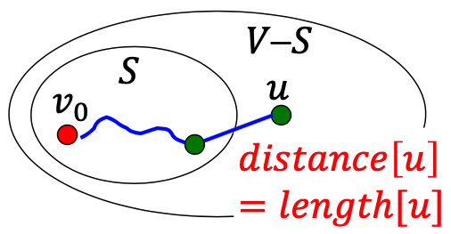

u = min{distance[w], w 는 V-S의 원소}의 의미는 u까지의 최단 거리의 길이는 distance[u] 와 같다는 의미입니다. 

둘이 같다는 것은 다음처럼 증명할 수 있습니다.

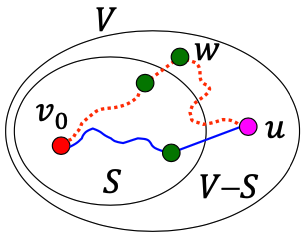

1. distance[u] > length[u]라고 가정해보겠습니다.
2. P를 시작점부터 u까지의 최단 경로라고 하면
3. P의 길이 = length[u]입니다.
4. P는 S에 속하지않는 최소 1개의 정점을 가집니다. 그렇지않다면 P의 길이 = distance[u]가 됩니다.
5. P의 경로에 속하면서 S에 속하지않는 시작점에서 가장 가까운 점을 w라 하겠습니다.
6. 그렇게 된다면 distance[u] > length[u] >= length[w] 가 성립하고, length[w] = distance[w]이기 때문에  이로부터
   **distance[u] > distance[w]**를 유추해낼 수 있습니다.
7. 이는 다익스트라 알고리즘은 아직 최단경로가 찾아지지않은 정점들만 선택한다는 정의에 어긋납니다.(지금 보는 점보다 가까운 경로가 존재한다면 이전 탐색에서 걸러져서 S에 포함되어있기 때문입니다.)

그렇기 때문에 distance[u] = length[u]입니다.

다음으로는 distance[w]를 업데이트하는 부분입니다.

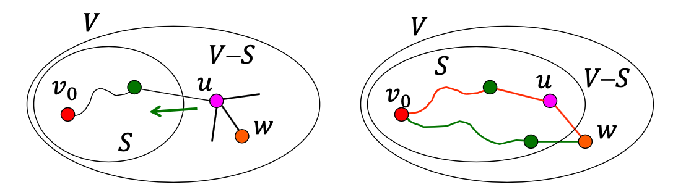

위의 그림에서와 같이 시작점 v0에서 u를 거쳐 w로 가는 경로와 v0에서 w로 가는 경로의 길이 중 가까운 경로를 distance[w]로 설정하고 S와 V-S를 최신화해줍니다.

distance[ ]를 업데이트할 때 각각의 간선들이 2번씩 체크되는데 그 이유는 다음과 같습니다.

1. 

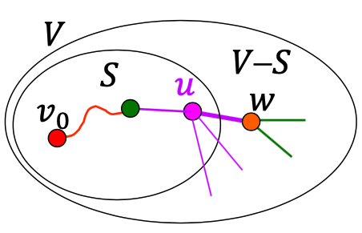

아직 최단 경로를 찾지 못한 정점 중 u에 인접한 정점들의 거리를 업데이트 할 때 u와 w를 연결하는 간선이 체크가 됩니다. 

2.

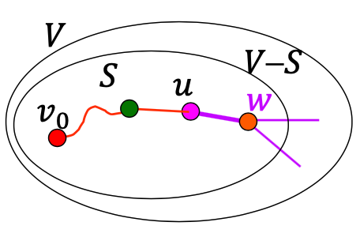

정점 w의 최단 경로가 찾아졌기 때문에, w는 S에 속하게됩니다. 아직 최단 경로를 찾기 못한 정점들에서 w까지의 거리를 업데이트하는 과정에서 u에서 w로의 간선이 다시 한 번 체크됩니다.


이런 방식으로 코드를 작성하면 각 정접들에대해서 u에 인접한 모든 간선을 살펴보는 연산이 추가되기 때문에 최악의 경우 시간복잡도가 O(𝑛^2)가 되버립니다. 이를 개선하는 방법으로는 대표적으로 우선순위 큐를 사용하는 방법(O( 𝑛 + 𝑚 log 𝑛))과 피보나치 힙을 사용하는 방법(O(𝑛 log 𝑛 + 𝑚))이 있습니다. 

피보나치 힙에대한 내용은 [피보나치 힙](https://en.wikipedia.org/wiki/Fibonacci_heap) 을 확인해주시고, 지금은 우선순위 큐에대한 내용을 다루겠습니다.

### 다익스트라 알고리즘 로직(우선순위 큐)

- 첫 번째 정점을 기준으로 연결되어있는 정점들을 추가해가면서 최단 거리를 갱신합니다.

  첫 정점부터 각 노드 사이의 거리를 저장하는 배열을 만든 후에 첫 정점의 인접 노드 간의 거리부터 먼저 계산하면서, 첫 정점부터 해당 노드 사이의 가장 짧은 거리를 해당 배열에 업데이트 합니다. 이런 로직은 현재의 정점에서 갈 수 있는 정점들부터 처리한다는 점에서 BFS와 비슷합니다. 

  다양한 다익스트라 알고리즘이 있지만 가장 개선된 형태인 우선순위 큐를 사용하는 방식을 다뤄보겠습니다.

  먼저 우선 순위 큐를 간단하게 설명하면 MinHeap 방식을 사용해서 현재 가장 짧은 거리를 가진 노드 정보를 먼저 꺼냅니다.

  꺼낸 노드는 다음의 과정을 반복합니다.

  1. 첫 정점을 기준으로 배열을 선언핸 첫 정점에서 각 정점까지의 거리를 저장합니다.
     - 초기에는 첫 정점의 거리를 0, 나머지는 무한대(inf)로 저장합니다.
     - 우선순위 큐에 순서쌍 (첫 정점, 거리 0) 만 먼저 넣어줍니다. 
  2. 우선순위 큐에서 노드를 꺼냅니다.
     - 처음에는 첫 정점만 저장된 상태이기때문에 첫번째 정점만 꺼내집니다.
     - 첫 정점에 인접한 노드들 각각에대해서 첫 정점에서 각 노드로 가는 거리와 현재 배열에 저장되어있는 첫 정점에서 각 정점까지의 거리를 비교합니다.
     - 배열에 저장되어 있는 거리보다, 첫 정점에서 해당 노드로 가는 거리가 더 짧은 경우, 배열에 해당 노드의 거리를 업데이트 합니다.
     - 배열에 해당 노드의 거리가 업데이트된 경우, 우선순위 큐에 해당 노드를 넣어줍니다.
  3. 2번의 과정을 우선순위 큐에서 꺼낼 노드가 없을 때까지 반복합니다.

- 우선순위 큐를 사용하면 지금까지 발견된 가장 짧은 거리의 노드에대해서 먼저 계산을 해서 더 긴 거리로 계산된 루트에 대해서는 계산을 스킵할 수 있다는 장점이 있습니다.

pseudo 코드는 다음과 같습니다. 

```java
found[], distance[]를 초기화
construct min_heap(V-{s});
for(i = 0; i < n-2; i++) { //𝑛−1iterations(=Θ(𝑛))---(1) 
  distance[u]가 최소인 정점 u를 선택합니다. //Θ(1) found[u] = T;로 바로 배열로 접근 가능
  min_heap에서 정점 u를 제거; //O(log𝑛)---(2)
  for(every vertex w adjacent to u) //Θ(𝑚)total---(a)
      if(found[w] == F && distance[u] + cost(u,w) < distance[w]){
        distance[w] = distance[u] + cost(u,w);
        adjust heap(w); //𝑂(log𝑛)foreachedgecheck---(b) 
  } // distance[w]가 수정됐기 때문에 heap을 조정해주는 for문
}
```

### 시간 복잡도

위의 pseudo code에서 다음 2가지 과정을 거칩니다.

(1),(a) - 각 정점마다 인접한 간선들을 모두 검사하는 과정 -> 𝑂(𝑛)

(2),(b) - 우선순위 큐에 정점/거리 정보를 넣고 삭제하는 과정 -> 𝑂(log𝑛)

따라서 전체 알고리즘은 O((𝑛+𝑚)log𝑛)입니다.

---

## 벨만-포드 [☝](#알고리즘)

다익스트라 알고리즘이 한 시작점에서 다른 모든 정점까지의 최단 거리를 구하는 유용한 알고리즘이지만, 음수 간선이 있는 그래프의 경우에는 그 정당성이 보장되지 않습니다. 벨만-포드 알고리즘은 이런 문제점을 해결하는 알고리즘입니다.
벨만-포드 알고리즘은 다익스트라 알고리즘과 똑같은 단일 시작점 최단 경로 알고리즘이지만, 음수 간선이 있는 그래프에 대해서도 최단 경로를 찾을 수 있습니다. 또한 그래프에 음수 사이클이 있어서 최단 거리가 제대로 정의 되지않을 경우도 알려줍니다.

벨만-포드 알고리즘은 시작점에서 각 정점까지 가는 최단 거리의 상한선을 적당하게 예측한 뒤에 예측 값과 실제 최단 거리 사이의 오차를 반복적으로 줄여가는 방식으로 동작합니다.
벨만-포드 알고리즘은 너비 우선 탐색을 기반으로 작동합니다.
수행 과정에서 각 정점까지의 최단 거리의 상한을 담은 배열 upper[ ]을 유지합니다.
이 값은 알고리즘이 진행되면서 점점 줄어들며, 알고리즘이 종료되는 시점에는 실제 최단 거리를 담게 됩니다.

### 벨만-포드의 동작 과정
1. 알고리즘이 시작되는 시점에는 그래프의 구조에 대해서 아는 것은 시작점에서 시작점까지의 최단 거리가 0이라는 것 뿐입니다. 그렇기 때문에 upper[s] = 0으로 초기화하고, 나머지 원소들은 모두 아주 큰 수인 INF = Integer.MAX_VALUE 와 같이 초기화를 합니다.
2. 벨만-포드 알고리즘은 이 예측값을 실제 최단 거리에 더 가깝게 갱신하기 위해서 다음과 같은 최단 거리의 특성을 이용합니다.
> 시작점에서 u와 v까지의 최단 거리 dist[u]와 dist[v]라 할 때 다음 조건은 항상 참입니다. w(u,v)는 u에서 v까지의 거리를 의미합니다.
> dist[v] <= dist[u] + w(u,v)

이 속성을 이용하면 upper의 값을 실제 최단 거리에 가깝게 보정할 수 있습니다.
upper[u] + w(u,v) < upper[v]인 상황을 통해서 예를 들어보겠습니다.
u까지 가는 최단 거리는 항상 upper[u]이거나 upper[u]보다 짧습니다. 그 뒤에 (u,v)를 붙인 경로의 길이는 최대 upper[u]+w(u,v)이기 때문에, upper[v]를 upper[u]+w(u,v)로 줄이는 것이 가능합니다.

3. 벨만-포드 알고리즘은 위와 같은 과정을 모든 간선에 대해서 반복적으로 실행하면서, 최종적으로 실제 최단 거리를 구할 수 있게됩니다.

### 벨만-포드의 종료 조건과 정당성 증명
하지만 위와 같은 방식으로는 몇 번이나 어떤 순서로 완화를 해야할지가 명확하지 않습니다. 
또한 , upper가 실제 최단 거리와 같아진 다는 것을 어떻게 알 수 있을까요? 그리고 어떤 정점을 택하더라도 upper[u] = dist[u]가 되는 것이 확실할까요?

모든 간선에대해서 완화를 시도하는 작업을 x번 반복하면 x개 이하의 간선을 사용하는 최단 경로들을 전부 찾을 수 있습니다.

따라서 모든 간선이 전부 완화가 실패할 때까지 반복하면 모든 최단 경로를 찾을 수 있습니다.
그렇다면 몇 번을 반복해야 최단 경로를 구할 수 있을지 미리 알 수 있는 방법은 없을까요??
음수 사이클이 없는 그래프에서 최단 경로가 한 정점을 2번 지나는 일이 없다는 특징을 이용하면, 최단 경로가 포함하는 간선의 상한선을 쉽게 알 수 있습니다.

최단 경로는 최대 |V|개의 정점을 갖기 때문에 최대 |V|-1개의 간선을 가질 수 있습니다.
따라서 모든 간선에 대한 완화 과정은 전체 |V|-1번이면 충분합니다.

그렇다면 음수 간선이 존재하는 경우에는 최단 거리를 어떻게 구할 수 있을까요?

### 벨만-포드의 음수 사이클의 판정
그래프에 음수 사이클이 존재할 경우 벨만-포드 알고리즘도 의미없는 값을 반환하게됩니다. 하지만 간단한 변형을 통해서 벨만-포드 알고리즘이 음수 사이클의 존재 여부를 판정하게 만들 수 있습니다.
벨만-포드 알고리즘은 그래프가 음수 사이클이 존재하면 의미없는 값을 반환하는 것이 아니라 음수 사이클이 존재한다는 오류를 반환하게 합니다.

음수 사이클의 존재 여부를 판정하려면 |V|-1번 모든 간선에 대한 완화를 시도하는 대신 1번 더 해서 |V|번 완화를 시도하면 됩니다. 그래프에 음수 사이클이 없다면 |V|-1번만 반복해도 모든 최단 거리를 찾을 수 있기 때문에, 마지막 반복의 완화는 전부 실패할 것이기 때문입니다. 반면, 음수 사이클이 있는 경우에는 |V|번째 반복에도 항상 완화가 한 번은 성공합니다.

### 구현
```java
int V;//그래프의 정점의 개수
ArrayList<Edge> adj = new ArrayList<Edge>();

int[] d = new int[V+1];
void bellmanford(int start){
	for(int i = 1;i<=n;i++){
		d[i] = Integer.MAX_VALUE;
	d[start] = 0;
	for(int i = 1;i<=n-1;i++){
		for(int j = 0;j<adj.size();j++){
			Edge temp = adj.get(j);
			if(d[temp.end] > d[temp.start] + temp.weight){
				d[temp.end] = d[temp.start] + temp.weight;
			}
		}
	}
}
class Edge{
    int start;
    int end;
    int weight;

    public Edge(int start, int end, int weight) {
        this.start = start;
        this.end = end;
        this.weight = weight;
    }
}
```
### 실제 경로 계산하기
벨만-포드 알고리즘을 수행하는 과정에서 각 정점을 마지막으로 완화시킨 간선들을 모으면 스패닝 트리를 얻을 수 있습니다. 각 정점을 마지막으로 완화시킨 간선들은 항상 최단 경로 위에 있기 때문에, 각 정점에서부터 스패닝 트리의 루트인 시작점까지 거슬러 올라가는 경로는 항상 시작점에서 해당 경로까지의 최단경로가 됩니다.
이는 너비 우선 탐색이나 다익스트라 알고리즘과 비슷한 방식으로 실제 정점의 목록을 계산할 수 있습니다.

---

## 플로이드의 모든 쌍 최단 거리 알고리즘 [☝](#알고리즘)
다익스트라 알고리즘과 벨만-포드 알고리즘은 시작점을 기준으로 다른 정점들까지의 최단 경로를 구하는 알고리즘입니다.
하지만 문제에 따라서는 한 개의 시작점이 아닌 모든 정점 쌍에 대해서 둘 사이의 최단 거리를 구해야 할 때도 있습니다. 
이런 문제를 다익스트라나 벨만-포드 알고리즘을 이용해서 그래프의 존재하는 모든 쌍의 최단 거리를 구하면 시간 복잡도는 다음과 같습니다.
- 다익스트라
	- Linear Array 를 사용한 경우 0(V^3+VE) = 0(V^3)
	- 우선 순위 큐(min-heap)을 사용한 경우 O((V^2)*logV+VE)
- 벨만-포드
	- O(V^2E) = O(V^4) 
이보다 조금 더 빠르고 간단한 방법으로 모든 쌍 간의 최단 거리를 구하는 방법이 플로이드의 모든 쌍 최단 거리 알고리즘입니다.

플로이드 알고리즘은 그래프의 모든 정점 쌍의 최단 거리를 저장하는 2차원 배열 dist[ ][ ]를 계산하는 방식으로 동작합니다. 이 때, dist[u][v]는 u에서 v로 가는 최단 거리를 의미합니다.

플로이드 알고리즘은 경로의 경유점이라는 개념을 이용해서 동작합니다.
> 정점의 경유점
> 두 정점 u,v를 잇는 어떤 경로가 있고 그 경로는 시작점u와 끝점 v를 항상 지난다고 가정하겠습니다.  
> 이 경로는 다른 정점들을 지나쳐 갈 수 있습니다. 그 이유는 u와 v를 직접 연결하는 간선이 없거나, 다른 정점을 경유해서 가는 경로가 전체 경로가 더 짧을 수 있기 때문입니다. 이 때 경로가 거쳐가는 정점들을 경유점이라고 합니다.
정점 집합 S에 포함된 정점만을 경유점으로 사용해서 u에서 v로 가는 최단 경로의 길이를 Ds(u,v)라고 하겠습니다. 

S에 포함된 정점만을 경유점으로 사용해 u에서 v로 가는 최단 경로를 알고있다고 가정하겠습니다. S 중에 정점을 하나 골라서 x라고 하면, 최단 경로는 x를 경유할 수도 있고 경유하지 않을수도 있습니다.

1. 경로가 x를 경유하지 않는다 : 이 경로는 S- {x} 에 포함된 정점들만을 경유점으로 사용합니다.
2. 경로가 x를 경유한다 : 이 경로는 u에서 x로 가는 구간과 x에서 v로 가는 구간으로 나눌 수 있습니다. 이 2개의 부분 경로들은 각각 u와 x, x와 v를 잇는 최단 경로들이어야 합니다. 
당연하게도 두 개의 부분 경로들은 x를 경유하지않으며, 따라서 S-{x}에 포함된 정점들만을 경유점으로 사용합니다.

S를 경유점으로 사용해 u에서 v로 가는 최단 경로는 위 2가지 중 더 짧은 경로가 될 것입니다.
Ds(u,v)를 다음과 같이 재귀적으로 정의할 수 있습니다.


위의 점화식을 살짝만 수정하면 모든 쌍에대한 최단 거리 문제를 동적 계획법으로 해결할 수 있습니다.

표기법을 살짝 고쳐서 Ck = D_s_k라 하면 다음과 같이 표현할 수 있습니다.

이 점화식은 C_k의 모든 값은 C_(k-1)에만 의존하기 때문에 동적 계획법을 이용할 수 있습니다.

### 구현
구체적인 구현에 앞서 플로이드 알고리즘의 프로토타입은 다음과 같습니다.
d[k,i,j] = set{1,2,...,k} 에 포함되는 i에서 j 로 가는 최단 경로
k가 0인 경우에는 중간 경로 없는 vertex i에서 vertex j로 바로 가는 경로이기 때문에 d[0,i,j] = w[i,j] 입니다.
```java
for(int k = 0;k<n;k++){
	for(int i = 0;i<n;i++){
		for(int j = 0;j<n;j++){
			if(k == 0) d[k][i][j] = w[i,j];
			else {
				
			if(d[i][k] != MAX_VALUE && d[k][j] != MAX_VALUE)
				d[k][i][j] = min(d[k-1][i][j],d[k-1][i][k] + d[k-1][k][j]);//음수 싸이클 방지
			}
		}
	}
}
```
위의 코드에서 볼 수 있듯 플로이드 알고리즘의 시간복잡도는 3중 for문을 돌기 때문에 O(|V|^3)입니다. 공간복잡도 역시 3차원 배열을 사용하기 때문에 (|V|^3) 입니다.
여기서 공간 복잡도를 줄일 수 있는 방법이 있습니다.
k번째 case를 계산할 때 k-1번째의 연산으로 부터 저장된 정보가 overwrite 될 수 있습니다. 그 이유는 출발점이나 도착점이 k번 정점일 때 사용 가능한 경유점의 목록에 k가 추가되는 것은 아무 의미가 없기 때문에, 이를 구분하지 않고 써도 되기 때문입니다.
예를 들면, **지하철 역에 들러 학교로 가는 최단 경로**와 **지하철역과 학교를 들러 학교로 가는 최단 경로**는 똑같기 때문입니다.
이런 이유로 우리는 더이상 3차원 배열을 사용해서 k번째 연산과 k-1번째 연산을 구분할 필요없이 한 개의 2차원 배열을 이용해서 코드를 짤 수 있습니다.
```java
for(int k = 0;k<n;k++){
	for(int i = 0;i<n;i++){
		for(int j = 0;j<n;j++){
			if(d[i][k] != MAX_VALUE && d[k][j] != MAX_VALUE) d[i][j] = min(d[i][j],d[i][k] + d[k][j]);//음수 싸이클 방지
		}
	}
}
```
2차원 배열을 사용하면 시간 복잡도는 그대로지만 공간 복잡도는 O(|V|^3)에서 O(|V|^2)로 줄일 수 있습니다.

양의 간선인 경우에는 경유 효과가 없는 출발지와 경유지가 같은 상황과 (출발지 = 도착지, 도착지 = 경유지)인 상황을 배제해서 실행시간을 줄일 수 있습니다.
```java
for(int k = 0;k<N;k++) {
	for(int i = 0;i<N;i++) {
		if(i == k) continue;// 출발지 = 경유지인 상황은 경유 효과가 없으니 비교할 필요x - 1
		for(int j = 0;j<N;j++) {
			//if(i==j||j==k) continue;// 출발지 = 도착지, 도착지 = 경유지인 상황은 경유 효과가 없으니 비교할 필요x - 2
			if(d[i][k] != MAX_VALUE && d[k][j] != MAX_VALUE) d[i][j] = min(d[i][j],d[i][k] + d[k][j]);
		}
	}
}

```
1번은 효과적으로 줄일 수 있지만, 2번은 그렇지않습니다.

그 아래의 비교연산을 생략하지만 **continue에 걸리는 조건들은 값의 갱신을 만들지 않는 값** 이기 때문에 for(int j = 0;j<N;j++) 반복문은 0부터 N-1까지 실행 됩니다. 따라서 불필요한 if문으로 작용할 수 있기 때문에 큰 효과를 볼 수 없는 경우가 있기 때문에, 상황에따라서 비교하는 연산만 2번 할 가능성이 있기 때문에 잘 보고 사용하는 것이 중요합니다.

최종적으로 경유 효과가 없는 경우를 제외한 플로이드 워샬 알고리즘의 코드는 다음과 같습니다.
```java
for(int k = 0;k<N;k++) {
	for(int i = 0;i<N;i++) {
		if(i == k) continue;// 출발지 = 경유지인 상황은 경유 효과가 없으니 비교할 필요x - 1
		for(int j = 0;j<N;j++) {
			//if(i==j) continue;// 출발지 = 도착지가 0인 경우에만 해당
			if(d[i][k] != MAX_VALUE && d[k][j] != MAX_VALUE) d[i][j] = min(d[i][j],d[i][k] + d[k][j]);
		}
	}
}
```

### 문제 추천
[다익스트라](https://www.acmicpc.net/problem/19701)
[플로이드](https://www.acmicpc.net/problem/11404)
[벨만-포드](https://www.acmicpc.net/problem/13317)

---

# 최소 스패닝 트리 [☝](#알고리즘)
최소 스패닝 트리(MST)는 그래프에서 만날 수 있는 최소 비용 문제 중 모든 정점을 연결하는 간선들의 가중치의 합이 최소가 되는 트리를 의미합니다.

그렇다면 스패닝 트리는 무엇일까요??
## 스패닝 트리
n개의 정점으로 이루어진 무향 그래프에서 n개의 정점과 n-1개의 간선으로 이루어진 트리를 신장트리라 합니다. 다른 말로, 원래 그래프의 정점 전부와 간선의 부분 집합으로 구성된 부분 그래프 입니다. 이 때, 스패닝 트리에 포함된 간선들은 정점들을 트리 형태로 전부 연결해야 합니다.
이런 특징들로부터 우리는 스패닝 트리가 유일하지 않고 여러개가 존재합니다. 
가중치 그래프의 여러 개의 스패닝 트리 중 가중치의 합이 가장 작은 트리를 찾는 문제입니다.

---

## 크루스칼의 최소 스패닝 트리 알고리즘 [☝](#알고리즘)
크루스칼의 알고리즘은 상호 배타적 집합 자료 구조를 사용하는 좋은 예입니다. 
크루스칼 알고리즘을 접근하기 전에 다음 질문의 답을 생각해보겠습니다.
> 가중치가 가장 작은 간선과 가중치가 가장 큰 간선 중 어느 쪽이 최소 스패닝 트리에 포함될 가능성이 높을까?

대부분 가중치가 가장 작은 간선일 것입니다. 크루스칼의 알고리즘은 여기서 출발합니다.

그래프의 모든 간선을 가중치의 오름차순으로 정렬합니다. 그 후, 스패닝트리에 하나씩 추가합니다. 이때 주의할 점은, 간선들이 사이클을 이루지 않게 해야하는 것입니다. 그렇기 때문에, 가중치가 작다고 무조건 간선을 트리에 더하는 것이 아닌, 결과적으로 사이클이 생기는 간선을 제외한 간선 중 가중치가 가장 작은 간선들을 트리에 추가합니다.

이처럼 크루스칼 알고리즘은 모든 간선을 한 번씩 감사한 뒤 종료합니다.
다음은 크루스칼 알고리즘이 최소 스패닝 트리를 만드는 과정을 표현한 그림입니다.


### 크루스칼 알고리즘의 구현
```java
import java.io.BufferedReader;
import java.io.IOException;
import java.io.InputStreamReader;
import java.util.Arrays;
import java.util.Comparator;
import java.util.StringTokenizer;

public class KuruskalTest {

    static class Edge implements Comparable<Edge> {
        int start, end, weight;
        public Edge(int start,int end, int weight){
            this.start = start;
            this.end = end;
            this.weight = weight;
        }
        @Override
        public int compareTo(Edge o){
            return Integer.compare(this.weight,o.weight);
        }
    }
    static int V;
    static int E;
    static BufferedReader br = new BufferedReader(new InputStreamReader(System.in));
    static StringTokenizer st;
    static Edge[] edgeList;
    public static void main(String[] args) throws IOException {
        st = new StringTokenizer(br.readLine()," ");
        V = Integer.parseInt(st.nextToken());
        E = Integer.parseInt(st.nextToken());

        edgeList = new Edge[E];
        for(int i = 0;i<E;i++){
            st = new StringTokenizer(br.readLine()," ");
            int start = Integer.parseInt(st.nextToken());
            int end = Integer.parseInt(st.nextToken());
            int weight = Integer.parseInt(st.nextToken());
            edgeList[i] = new Edge(start,end,weight);
        }
        Arrays.sort(edgeList);//오름차순
        make();// 모든 정점을 각각 집합으로 만들고 출발한다.
        //간선 하나씩 시도하며 트리를 만든다.
        int cnt = 0,result = 0;
        for(Edge edge : edgeList){
            if(merge(edge.start,edge.end)){
                result += edge.weight;
                if(++cnt == V-1) break;// 신장트리 완성.
            }
        }
        System.out.println(result);

    }
    static int[] parents;
    static void make(){
        parents = new int[V];
        for(int i = 0;i<V;i++){
            parents[i] = i;
        }
    }
    //u가 속한 트리의 루트 번호를 반환한다.
    static int find(int u){
        if(u == parents[u]) return u;
        //return find(parent[u]); --- 기울어진 트리의 경우 비효율적
        //최적화(Path Compression)
        return parents[u] = find(parents[u]);
    }
    //u가 속한 트리와 v가 속한 트리를 합친다..
    static boolean merge(int u, int v){
        u = find(u);
        v = find(v);
        //u와 v가 이미 같은 트리에 속하는 경우는 걸러낸다.
        if(u ==v) return false;
        parents[u] = v;
        return true;
    }
}

```
### 정당성 증명
1. 크루스칼 알고리즘이 선택하는 간선 중 그래프의 최소 스패닝 트리 T에 포함되지않는 간선이 있다고 가정
2. 이 중 첫번째로 선택되는 간선을 (u,v)라 하자. T는 이 간선을 포함하지않기 때문에, u와 v는 T에서 다른 경로로 연결되어 있을 것이다.
3. 이 경로를 이루는 간선 중 하나는 반드시 (u,v)와 가중치가 크거나 같아야한다.(그 이유는 모두 (u,v)보다 가중치가 작다면 크루스칼 알고리즘이 이미 이 간선들을 모두 선택해서 u와 v를 연결했을 것이기 때문에 (u,v)가 선택됐을리 없다.
4. 따라서 이 경로 상에서 (u,v) 이상의 가중치를 갖는 간선을 하나 골라서 T에서 지워버리고 (u,v)를 추가해도 스패닝 트리는 유지되면서 가중치의 총합은 줄거나 같을 것입니다.
5. 하지만 T가 이미 최소 스패닝 트리라고 가정했기 때문에, (u,v)를 포함하면서 최소 스패닝 트리가 되어야합니다.
6. 따라서 (u,v)를 선택한다고 하더라도 남은 간선들을 잘 선택하면 항상 최소 스패닝 트리를 얻을 수 있습니다.
1~6의 성질은 마지막 간선을 추가해 스패닝 트리가 완성될 때까지 성립하기 때문에, 마지막에 얻은 트리는 항상 최소 스패닝 트리가 됩니다.

### 시간복잡도
DisJointSet에대한 연산은 실질적으로 상수기간이기 때문에,실제 트리를 만드는 for문의 시간복잡도 O(|E|)입니다. 따라서 크루스칼 알고리즘의 전체 시간복잡도는 간선 목록의 정렬에 걸리는 시간 O(|E|log|E|)가 됩니다. 간선 목록의 정렬하는 시간이 알고리즘 전체 시간 중에 지배적으로 크기 때문에, 간선의 수가 많아지면 크루스칼 알고리즘은 효율이 떨어집니다.

---

## 프림의 최소 스패닝 트리 알고리즘 [☝](#알고리즘)
프림의 알고리즘은 다익스트라 알고리즘과 거의 같은 형태를 띠고 있습니다.
크루스칼 알고리즘이 여기저기서 산발적으로 만들어진 트리의 조각들을 합쳐서 스패닝 트리를 만든다면, 프림 알고리즘은 하나의 시작점으로 구성된 트리에 간선을 하나씩 추가하는 방식으로 진행됩니다. 그렇기 때문에, 항상 선택된 간선들은 중간 과정에서도 연결된 트리를 만듭니다.

프림 알고리즘은 선택할 수 있는 간선들 중 가중치가 가장 작은 간선을 선택하는 과정을 반복합니다. 
아래는 프림 알고리즘을 이용해서 최소 스패닝 트리를 만드는 과정을 표현한 그림입니다.

파란색으로 표현된 선은 이번 단계에서 고려할 간선이고, 그 중 선택된 간선을 하늘색으로 표현했습니다. 초록색 선은 이미 선택된 간선들을 의미합니다.

### 프림 알고리즘의 구현
```java
import java.io.BufferedReader;
import java.io.IOException;
import java.io.InputStreamReader;
import java.util.StringTokenizer;

public class PrimTest {
    public static void main(String[] args) throws IOException {
        BufferedReader br = new BufferedReader(new InputStreamReader(System.in));
        int N = Integer.parseInt(br.readLine());
        int[][] adjMatrix = new int[N][N];
        boolean[] visited = new boolean[N];
        int[] minEdge = new int[N];

        StringTokenizer st = null;
        for(int i = 0;i<N;i++){
            st = new StringTokenizer(br.readLine()," ");
            for(int j = 0;j<N;j++){
                adjMatrix[i][j] = Integer.parseInt(st.nextToken());
            }
            minEdge[i] = Integer.MAX_VALUE;
        }

        int result = 0;//최소 신장 트리 비용
        minEdge[0] = 0;//임의의 시작점 0의 간선 비용을 0으로 세팅 index는 아무거나 상관없다.
        for(int i = 0;i<N;i++){
            // 1. 신장 트리에 포함되지않은 정점 중 최소간선비용의 정점 찾기
            int min = Integer.MAX_VALUE;
            int minVertex = -1;//최소간선비용의 정점번호
            for(int j = 0;j<N;j++){
                if(!visited[j] && min>minEdge[j]){
                    min = minEdge[j];
                    minVertex = j;
                }
            }
            visited[minVertex] = true;//신장트리에 포함시킴.
            result += min;//간선비용 누적.

            //2. 선택된 정점 기준으로 신장트리에 연결되지않은 타 정점과의 간선 비용 최소로 업데이트
            for (int j = 0; j < N; j++) {
                //인접 안해있으면 인풋이 0이므로 걔가 최소가 되어버림.
                if(!visited[j] && adjMatrix[minVertex][j]!=0 && minEdge[j] > adjMatrix[minVertex][j]){
                    minEdge[j] = adjMatrix[minVertex][j];
                }
            }
        }
        System.out.println(result);
    }
}
```
다익스트라 알고리즘의 구현과 비슷한 코드입니다.
각 정점에대해서 지금까지 알려진 최단 거리를 저장하는 것이 아닌, 마지막 간선의 가중치를 저장하는 방식으로 구현했습니다.
우선 순위 큐를 이용해서 최소 간선 비용의 정점을 찾으면 코드를 최적화 할 수 있습니다. 이렇게 구현을 하면, 우선순위 큐는 minEdge[ ]가 증가하는 순서로 정렬해서 담고있게 됩니다.

### 정당성 증명
크루스칼 알고리즘의 증명과 똑같이 증명할 수 있습니다.

### 크루스칼 vs 프림
크루스칼이 간선 위주였다면 프림은 정점을 위주로 풀어나가는 알고리즘입니다.
둘은 이미 만들어진 트리에 인접한 간선을 고려하는지의 여부를 제외하면 완전히 똑같은 알고리즘입니다.

### 문제 추천
[MST](https://www.acmicpc.net/problem/1197)

---

# 네트워크 유량 [☝](#알고리즘)
네트워크 유량이란 유방향 그래프에 용량이 존재하는 것이다. 유량의 시작 정점을 Source, 끝 정점을 Sink라고 한다.<br>
이 때, Source에서 Sink로 흘려보낼 수 있는 최대 유량(flow)을 구하는 문제를 네트워크 유량 문제라고 한다.

- `유량(flow)` : 두 정점 사이에서 현재 흐르는 양
- `용량(capacity)` : 두 정점 사이에 최대로 흐를수 있는 양
- `잔여 용량(residual capacity)` : 두 정점 사이에서 현재 더 흐를 수 있는 유량. (용량 - 유량)
- `소스(source)` : 유량이 시작되는 정점. 보통 S로 표현
- `싱크(sink)` : 유량이 도착하는 정점. 보통 T로 표현
- `증가 경로(augmenting path)` : S에서 T로 유량이 흐르는 경로 

<p align="center"></p>

위 이미지와 같은 네트워크 유량이 있다고 하자.

S에서 1로 갈 수 있는 유량은 2, 2로 갈 수 있는 유량은 3이다.<br>
S에서 1로 2만큼 유량이 흘러갔다면, 1에서 T로 용량은 3이지만 S에서 1로 흘러 들어온 2만큼만 유량을 보낼 수 있다.<br>
마찬가지로, S에서 2로 갈 수있는 유량은 3이라 3을 흘려 보냈더라도 2에서 T로 흐를 수 있는 용량이 2라서 2만큼만 유량을 보낼 수 있다.<br>
결과적으로 위 그래프는 S에서 T로 4를 흘러보내주게 되고, 최대 유량이 4라고 한다.

네트워크 유량 문제가 성립하기 위해서는 3가지 약속이 있다.<br>
일단 네트워크 유량에서는 위에서" S에서 1로 갈 수 있는 유량은 2, 2로 갈 수 있는 유량은 3이다"<br>
라는 표현을 `c(S,1)` = 2, `c(S,2)` = 3 이라고 간단하게 표현할 수 있다.

- `c(u,v)` : `capacity` 정점 u에서 v로 가는 간선의 용량
- `f(u,v)` : `flow` 정점 u에서 v로 실제 흐르는 유량
- `r(u,v)` : `residual` 정점 u에서 v로 가는 잔여 용량 `r(u,v)` =  `c(u,v)` - `f(u,v)`

**1) 용량 제한 속성 `f(u,v)` <= `c(u,v)` :**

두 간선 사이에서 흐르는 유량은 용량을 넘을 수 없다.
 
**2) 유량의 대칭성 `f(u,v)` = `-f(v,u)` :**

u->v로 2만큼 흐른다면, v->u엔 -2만큼 흐른다.
쉽게 생각하면, 'u->v로 2만큼 나가고 v->u로 2만큼 들어온다.' 라고 이해하면 된다.

**3) 유량 보존의 법칙 `∑f(u,v)` = 0 :**

S 와 T를 제외하고는 각 정점에서 들어오는 유량과 나가는 유량이 일치해야 한다.
그래서 유량의 대칭성 때문에 S와 T를 제외하고 유량을 모두 합하면 0이 되어야 한다.

---

# 포드-풀커슨 알고리즘 [☝](#알고리즘)
최초의 네트워크 유량 알고리즘<br>
개념과 구현이 간단하다.

### 개념
1. 각 간선의 용량을 입력받는다.
2. DFS(포드-풀커슨)또는 BFS(에드몬드-카프)를 이용하여 `r(u,v)` > 0인 증가 경로를 찾는다.
3. 찾은 증가 경로 상에서 `r(u,v)`이 가장 낮은 엣지를 찾는다.
4. 잔여 용량만큼 S에서 T까지 유량을 흘려보낸다(경로의 모든 엣지에 유량 추가).
5. 더 이상 증가 경로가 발견이 되지 않을 때까지 반복한다.

아래 그래프를 가지고 포드-풀커슨 알고리즘의 과정을 살펴 보면,

<p align="center"></p>

S->a->T 라는 증가 경로를 먼저 찾고, 그 다음 S->b->T라는 증가 경로를 찾아서 최대 유량을 찾을 수도 있다.

<p align="center"></p>

하지만, 만약 S->a->b->T라는 증가 경로를 가장 먼저 찾았는데, 이때 흘려 보낼수 있는 플로우는 1을 보내고 나니 그 다음 유량을 흘려 보낼 수 있는 루트를 찾아보니 없다.

여기서 위에서 살펴 보았던 **2) 유량의 대칭성** `f(u,v)` = `-f(v,u)`의 개념이 이용된다.<br>
현재 `c(a,b)`는 1이다. 그리고 `c(b,a)`는 경로가 존재하지 않으니 0이다.<br>
그리고 `f(a,b)`도 방금 **S->a->b->T** 라는 증가 경로로 유량이 흘렀기 때문에 1이 되고, 유량의 대칭성에 의해서 `f(b,a)`은 -1이 된다.

<p align="center"></p>

그러면 놀랍게도 잔여 용량 `r(b,a)`(`c(b,a)` - `f(b,a)`)은 0 - (-1)로, b에서 a로 흐르는 잔여 용량이 1이 된다.<br>
즉, 유량을 하나 보내는 것은 반대 방향으로도 유량을 하나 보낼 수 있는 작업이 동반된다고 생각하면 된다.<br>
이렇게 Back-Edge라고 불리는 역간선 덕분에 포드-풀커슨 알고리즘이 성립 가능하게 된다.

그러면 결과적으로는 어떤 경로를 선택하든 최대 유량을 구할 수 있다.

### 시간복잡도
시간복잡도는 O((V+E)F) 인데, E가 V를 도미넌트 하므로 보통 O(EF)라고 표현한다.

<p align="center"></p>

위와 같은 케이스가 포드-풀커슨 알고리즘의 워스트 케이스인데,  증가경로 한개당 플로우 1밖에 보낼 수 없다.<br>
그래서 DFS를 플로우 수만큼 사용해야 하는데 플로우 수가 크다면 스택 오버플로우가 발생할 수 있다.<br>
이러한 케이스는 BFS로 문제를 해결하는 에드먼드-카프 알고리즘에서 극복이 가능하다고 한다.

#### 대표문제
[백준 6086 : 최대 유량](https://www.acmicpc.net/problem/6086)

네트워크 유량 문제는 포드-풀커슨 알고리즘 외에도 에드먼드-카프 알고리즘, 최소컷, 이분매칭 MCMF, 디닉 알고리즘의 개념들과 그래프를 어떻게 설계해야하는지에 대한 다양한 방법들에 대한 공부가 필요하다고 합니다...

---

# 에드몬드-카프 알고리즘 [☝](#알고리즘)

---

# 네트워크 모델링 [☝](#알고리즘)

---

# 이분 매칭 [☝](#알고리즘)

---

# 정렬

---

# 삽입 정렬 [☝](#알고리즘)

삽입 정렬(`insertion sort`)는 자료 배열의 모든 요소를 앞에서부터 차례대로 이미 정렬된 배열 부분과 비교하여, 자신의 위치를 찾아 삽입함으로써 정렬을 완성하는 알고리즘이다.

`k` 번째 반복 후 결과 배열은, 앞쪽 `k+1` 항목이 정렬된 상태이다.

배열이 길어질수록 효율이 떨어지지만, 구현이 간단한 정렬 방법이다.

### 과정

- 31 25 12 22 11
- 31 [25] 12 22 11
- **25** 31 [12] 22 11
- **12** 25 31 [22] 11
- 12 **22** 25 31 [11]
- **11** 12 22 25 31

### 코드

```java
void insertionSort(int[] arr) {
	for (int i = 1; i < arr.length; i++) {
		int temp = arr[i];
		int loc = i - 1;
		while ((loc >= 0) && (arr[loc] > temp)) {
			arr[loc+1] = arr[loc];
			loc--;
		}
		arr[loc+1] = temp;
	}
}
```

### 시간복잡도

n개의 데이터가 있을 때, 최악의 경우 `(n*(n-1))/2` 번 비교하므로 시간복잡도는 `O(n^2)`

# 선택 정렬 [☝](#알고리즘)

선택 정렬(`selection sort`)은 제자리 정렬 알고리즘의 하나로, 다음과 같은 순서로 이루어진다.

1. 주어진 리스트 중에 최소값을 찾음
2. 그 값을 맨 앞에 위치한 값과 교체
3. 맨 처음 위치를 뺀 나머지 리스트를 같은 방법으로 교체

선택 정렬은 알고리즘이 단순하며 사용할 수 있는 메모리가 제한적인 경우에 사용시 성능 상의 이점이 있다.

### 과정

- 9 1 6 8 4 3 2 [0]
- **0** [1] 6 8 4 3 2 9
- 0 **1** 6 8 4 3 [2] 9
- 0 1 **2** 8 4 [3] 6 9
- 0 1 2 **3** [4] 8 6 9
- 0 1 2 3 **4** 8 [6] 9
- 0 1 2 3 4 **6** [8] 9

### 코드

```java
void selectionSort(int[] arr) {
	int indexMin, temp;

	for (int i = 0; i < arr.length-1; i++) {
		indexMin = i;
		for (int j = i+1; j < arr.length; j++) {
			if (arr[j] < arr[indexMin]) indexMin = j;
		}
		temp = arr[indexMin];
		arr[indexMin] = arr[i];
		arr[i] = temp;
	}
}
```

### 시간복잡도

최선, 평균, 최악의 경우에서 선택 정렬에 소요되는 비교 회수는 `(n*(n-1))/2` 이므로 `O(n^2)` 이다.

---

# 버블 정렬 [☝](#알고리즘)

버블 정렬(`bubble sort`)은 두 인접한 원소를 검사하여 정렬하는 방법이다.

상당히 느리지만 코드가 단순하기 때문에 자주 사용된다.

양방향으로 번갈아 수행하면 칵테일 정렬이 된다.

### 과정

- [55] [07] 78 12 42
- **07** [55] [78] 12 42 → 처음 패스
- 07 55 [78] [12] 42
- 07 55 **12** [78] [42]
- 07 55 12 **42** 78
- [07] [55] 12 42 78 → 두번째 패스
- 07 [55] [12] 42 78
- 07 **12** [55] [42] 78
- 07 12 **42** [55] [78]
- [07] [12] 42 55 78 → 세번째 패스
- 07 [12] [42] 55 78 → 네번째 패스
- 07 12 [42] [55] 78 → 다섯번째 패스
- 07 12 42 55 78 → 정렬 완료

### 코드

```java
void bubleSort(int[] arr) {
	int temp = 0;
	for (int i = 0; i < arr.length-1; i++) {
		for (int j = 1; j < arr.length-i; j++) {
			if (arr[j] < arr[j-1]) {
				temp = arr[j-1];
				arr[j-1] = arr[j];
				arr[j] = temp;
			}
		}
	}
}
```

### 시간복잡도

정렬의 여부와 상관없이 모든 배열의 요소를 계속 비교하기 때문에 `O(n^2)` 의 시간 복잡도를 갖는다.

---

# 병합 정렬 [☝](#알고리즘)

## 병합정렬(Merge Sort)이란?
하나의 리스트를 두 개의 균등한 크기로 분할하고 분할된 부분 리스트를 정렬한 다음, 두 개의 정렬된 부분 리스트를 합하여 전체가 정렬된 리스트가 되게 하는 방법이다.

일반적인 방법으로 구현했을 때 이 정렬은 **안정 정렬**에 속하며, **분할 정복 알고리즘**을 활용한 알고리즘이다.

최선/최악의 경우 일정하게 `O(nlogn)`의 시간복잡도를 보장

<br>

> 안정 정렬(Stable Sort)이란?
> 
> 중복된 값을 입력 순서와 동일하게 정렬하는 정렬 알고리즘의 특성
> ex) 삽입정렬, 병합정렬, 버블정렬

<br>

## 병합정렬의 과정
병합정렬은 크게 3가지 스텝으로 이루어져 있다.

1. 분할(Divide) : 입력 배열을 같은 크기의 2개 부분 배열로 분할한다.
2. 정복(Conquer) : 부분 배열을 정렬한다. 부분 배열의 크기가 충분히 작지 않으면 **순환 호출**을 이용하여 다시 분할 정복 방법을 적용한다.
3. 결합(Combine) : 정렬된 부분 배열들을 하나의 배열에 합병한다.

<br>

<p align="center">

</p>

<br>

* 2개의 정렬된 리스트를 합병(merge)하는 과정

1. 2개의 리스트의 값들을 처음부터 하나씩 비교하여 두 개의 리스트의 값 중에서 더 작은 값을 새로운 리스트(sorted)로 옮긴다.
2. 둘 중에서 하나가 끝날 때까지 이 과정을 되풀이한다.
3. 만약 둘 중에서 하나의 리스트가 먼저 끝나게 되면 나머지 리스트의 값들을 전부 새로운 리스트(sorted)로 복사한다.
4. 새로운 리스트(sorted)를 원래의 리스트(list)로 옮긴다.

<br>

### 병합정렬 구현

``` java

public static int[] list; // 정렬할 배열
public static int[] sorted; // 정렬된 결과를 저장할 임시 배열

public static void main(String[] args){
  list = new int[]{};  // 정렬할 배열 입력
  sorted = new int[list.length];  // 임시배열 선언
  
  // end 지점의 원소까지 검사하기 때문에 list.length-1! (list.length로 실행하면 ArrayIndexOutOfBoundsException 에러 발생)
  mergeSort(0, list.length-1);
}

public static void mergeSort(int start, int end) { 
  if (start < end) { 
    // 중간 위치를 계산하여 리스트를 균등 분할 - 분할(Divide)
    int mid = (start + end) / 2;
    
    mergeSort(start, mid);  // 앞쪽 부분 리스트 정렬 - 정복(Conquer)
    mergeSort(mid+1, end);  // 뒤쪽 부분 리스트 정렬 - 정복(Conquer)
    
    // 정렬된 2개의 부분 배열을 합병하는 과정 - 결합(Combine)
    int left = start;
    int right = mid + 1;
    int idx = left;
    
    while (left <= mid || right <= end) { // 안정 정렬이기 때문에 index를 유지 
      // 첫번째 분할에서 원소를 가져오는 경우
      // 1. 두번째 분할의 원소를 이미 다 가져온 경우
      // 2. 첫번째 분할에서 가져오지 않은 원소가 있고, 첫번째 분할의 첫 원소 값이 두번째 분할의 첫 원소 값보다 작은 경우
      if (right > end || (left <= mid && list[left] <= list[right])) {  
        sorted[idx++] = list[left++]; 
      } else { // 두번째 분할에서 원소를 가져오는 경우
        sorted[idx++] = list[right++]; 
      } 
    } 
    
    // 정렬을 마친 후 다시 원래 배열에 저장
    for (int i=start;i<=end;i++) { 
      list[i] = sorted[i]; 
    } 
  } 
}
```

<br>

## 병합정렬의 특징
### 장점 👍
* 안정적인 정렬방법
  * 데이터의 분포에 영향을 덜 받는다. 즉, 입력데이터가 무엇이든 정렬되는 시간은 동일하다.(O(nlogn)으로 동일)
* 만약 레코드를 **연결 리스트(Linked List)** 로 구성하면, 링크 인덱스만 변경되므로 데이터의 이동은 무시할 수 있을 정도로 작아진다.
  * 제자리 정렬(in-place sorting)로 구현할 수 있다.
* 따라서 크기가 큰 레코드를 정렬할 경우 연결 리스트를 사용한다면, 병합정렬은 다른 어떤 정렬 방법보다 효율적이다.

<br>

### 단점 👎
* 만약 레코드를 **배열(Array)** 로 구성하면, 임시 배열이 필요하다.
  * 제자리 정렬(in-place sorting)이 아니다.
* 레코드들의 크기가 큰 경우에는 이동 횟수가 많으므로 매우 큰 시간적 낭비를 초래한다.

<br>

> 제자리 정렬(in-place sorting)이란?
> 
> 주어진 메모리 공간 외에 추가적인 공간을 필요로 하지 않는 정렬 방식

<br>

### 연결 리스트로 병합정렬을 구현하는 경우

**1. 쪼갠다(재귀적으로)**
- 각 단계에서 연결 리스트를 2개의 연결 리스트로 분리시켜준다.  
   head -> Node1 -> Node2 -> Node3 -> Node4 이면 
   head -> Node1 -> Node2, head2 -> Node3 -> Node4 으로.

**2. 정렬하면서 합친다.**
- 노드의 Next를 변경해주는 것을 통해 정렬하면서 합친다.
- 합치는 과정은 head가 2개였던 것을 1개로 합쳐주며 이뤄짐.

<br>

### 관련 문제
[백준 1517번 버블 소트](https://www.acmicpc.net/problem/1517)

<br>

---

# 힙 정렬 [☝](#알고리즘)

힙 정렬(Heap Sorting)은 최대 힙 트리나 최소 힙 트리를 구성해 힙의 특성을 이용하여 정렬 하는 알고리즘입니다.

최대 힙과 최소 힙에 대한 자세한 설명은 [힙](##힙) 을 참고하세요.


## 특징

힙 정렬의 가장 큰 특징은 힙 트리 구조를 만들어야 한다는 점입니다.

힙 트리를 만드는 알고리즘(Heapify Algorithm)은 하나의 노드를 선택해서 두 자식 중에서 더 큰 자식과 자신의 위치를 바꾸는 과정을 힙 구조를 만족할 때 까지 전체 노드에 대해 반복하는 작업입니다. 


## 과정

1. 정렬해야 할 n개의 요소들로 최대 또는 최소 힙(완전 이진 트리 형태)을 만든다.

2. 힙의 루트 값과 마지막 index 값을 교환한다.
3. 정렬이 필요한 index를 1 줄인다.
4. index가 0이 될 때까지 2~3을 반복한다.


예를 들어 {7, 6, 5, 8, 3, 5, 9, 1, 6}을 최대 힙으로 오름차순으로 정렬한다면 다음과 같은 과정을 거칩니다.

<p align="center">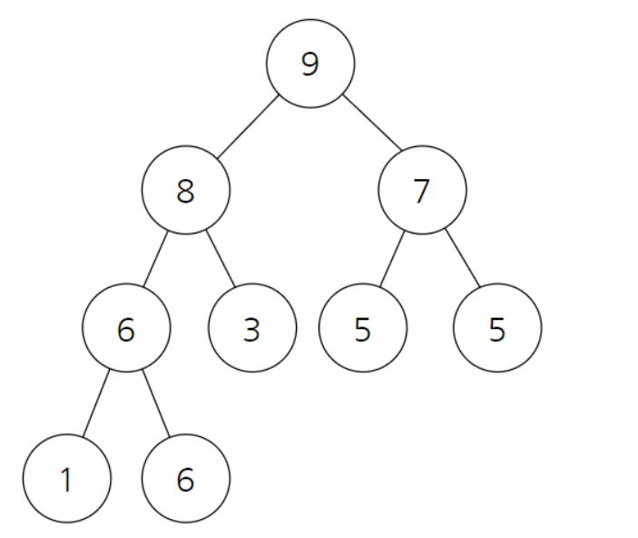</p>

- 처음 최대 힙 구조를 만들면 9가 root로 오게 됩니다.


<p align="center">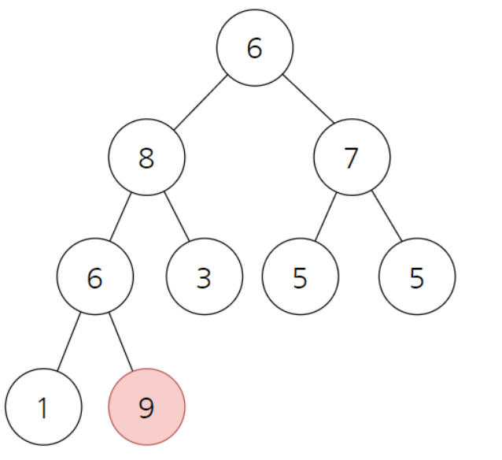</p>

- 그러므로 root와 가장 마지막 노드의 값을 교환하면 다음과 같아집니다. 이 때 9는 정렬 된 index이므로 heap의 마지막 index는 1의 값이 있는 곳으로 감소합니다. 

<p align="center">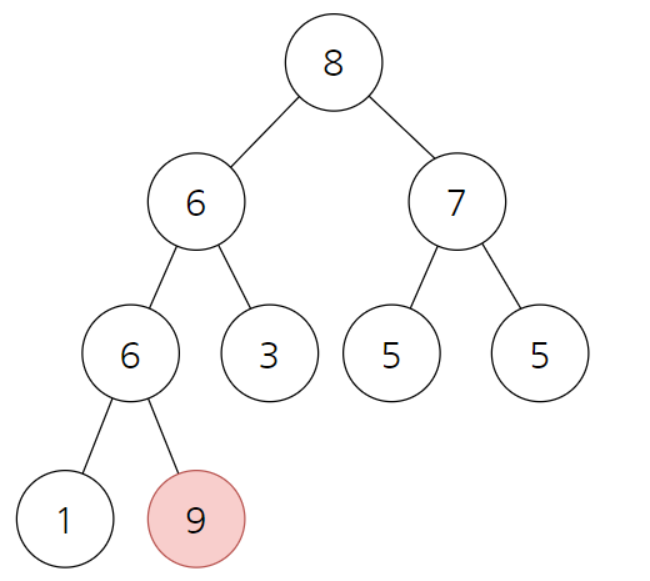</p>


- 다시 최대 힙 구조를 만들면 root에 8이 오게 됩니다.


<p align="center">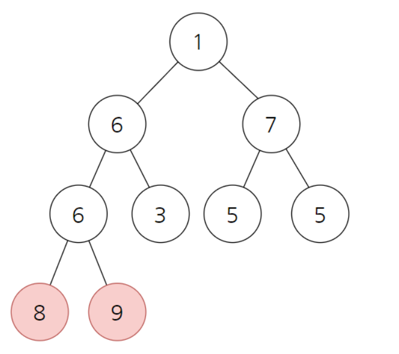</p>

- 위의 과정을 반복합니다.

  

## 구현

```java
//최대 힙을 이용한 오름차순 정렬 구현


public void sort(int arrA[]) {
    int size = arrA.length;

    // 힙 트리 생성
    // i: 각 서브 트리의 루트 노드
    for (int i = size / 2 - 1; i >= 0; i--)
        heapify(arrA, size, i);

    // heap의 root값(최댓값)을 배열의 마지막 값과 swap. 
    // i값을 뒤에서부터 0까지 반복하여 뒤에 값부터 최댓값이 채워진다.
    for (int i=size-1; i>=0; i--) {

        //arrA[0]이 root, arrA[i]가 배열의 마지막 값
        int x = arrA[0];
        arrA[0] = arrA[i];
        arrA[i] = x;

        // 힙 트리 생성
        heapify(arrA, i, 0);
    }
}

// node i의 서브트리 간에 최대 힙의 조건을 만족하도록 트리를 생성한다.
// heapSize는 배열의 아직 정렬되지 않은 index 범위를 의미합니다.
void heapify(int arrA[], int heapSize, int i) {
    int largest = i; // node i가 최대 값이라고 가정
    int leftChildIdx  = 2*i + 1; // left = 2*i + 1
    int rightChildIdx  = 2*i + 2; // right = 2*i + 2

    // 왼쪽 자식 노드가 루트 노드보다 크다면 자식 노드의 index를 저장한다.
    if (leftChildIdx  < heapSize && arrA[leftChildIdx ] > arrA[largest])
        largest = leftChildIdx ;

    // 오른쪽 자식 노드가 루트 노드보다 크다면  자식 노드의 index를 저장한다.
    if (rightChildIdx  < heapSize && arrA[rightChildIdx ] > arrA[largest])
        largest = rightChildIdx ;

    // 최대 값 노드의 index가 변경되었다면 값을 swap한다.
    if (largest != i) {
        int swap = arrA[i];
        arrA[i] = arrA[largest];
        arrA[largest] = swap;

        // swap한 구조가 최대 힙 트리를 만족할 때 까지 위의 과정을 반복한다.
        heapify(arrA, heapSize, largest);
    }
}
```


## 시간 복잡도

데이터 갯수가 n개이고, 힙 구조를 만들 때 완전 이진 트리에 데이터를 삽입하는데 O(log n) 이므로  O(N*logN)의 시간 복잡도를 가집니다. 


<br>

----

# 퀵 정렬 [☝](#알고리즘)

## 퀵 정렬의 개념

임의의 피봇(pivot)을 기준으로 해당 피봇 값보다 작은 데이터는 피봇의 왼쪽에, 큰 데이터는 피봇의 오른쪽에 배치한 뒤, 왼쪽 부분과 오른쪽 부분을 다시 퀵 정렬 방법으로 정렬하는 알고리즘

전체 데이터를 2개의 부분으로 분할한 뒤, 각각의 부분을 다시 퀵정렬하는 전형적인 `분할-정복 알고리즘`

중복적인 데이터에 대해 정렬 후에 정렬 전의 순서가 유지되지 않는 불안정 정렬이다.

**접근법**

```java
quick_sort(int[] list, int left, int right) {
    if (left < right) {
        int pivot = partition(list, left, right);
        quick_sort(list, left, pivot-1);
        quick_sort(list, pivot+1, right);
    }
}

```

### 피봇을 기준으로 분할하기

퀵 정렬 구현의 핵심은 위 알고리즘의 `partition()`부분인 전체 배열을 피봇을 기준으로 두 부분으로 분할하는 것이다. 분할의 원리는 다음과 같다.


> 1. 배열의 임의의 원소를 `pivot`, 가장 첫번째 원소를 `low`, 가장 마지막 원소를 `high`이라고 지정한다.
> 2. `low` 값이 `pivot` 보다 작을 동안 `low` 인덱스를 증가시킨다. 반복문이 계속될 때까지 조건에 부합하는 원소들은 `pivot`의 왼쪽 부분 리스트가 된다.
> 3. `high` 값이 `pivot` 보다 클 동안 `high` 인덱스를 감소시킨다. 반복문이 계속될 때까지 조건에 부합하는 원소들은 `pivot`의 오른쪽 부분 리스트가 된다.
> 4. 2와 3의 반복문을 탈출하여 도달한 위치는 각각 `low` 값이 `pivot` 보다 크고, `high` 값이 `pivot` 보다 작은 경우이므로, 이 때 멈춘 두 원소 자리를 교환한다.
> 5. `low`와 `high`의 위치가 엇갈리지 않을 때까지 2~3의 과정을 반복한다.
> 6. `low`와 `high`의 위치가 엇갈리는 때 `high`와 `pivot`의 자리를 교환한다. 최종적으로 `pivot`의 위치를 기준으로 왼쪽에는 `pivot`보다 작은 원소들이, 오른쪽에는 `pivot`보다 큰 원소들이 위치하게 된다.

### 퀵 정렬 시간 복잡도

- 분할
    n개의 원소를 가진 배열을 정렬한다고 하면, 배열은 각 단계에서 `partition()`을 거칠 때마다 `n/2`, `n/4`, `n/8` ..., `n/(2^k)` 의 크기로 분할된다. 이 과정은 배열의 원소 개수가 1개가 될 때까지 반복되므로 `n/(2^k) = 1`일 때까지 반복된다. 따라서 `k = log n`만큼의 연산이 수행된다.
- 원소 교환
    각 왼쪽 부분와 오른쪽 부분에서는 교환을 위해 거의 부분의 모든 원소들을 확인해야 하므로 각 부분의 원소 개수만큼(`n`) 연산이 수행된다.

위 계산 결과 최종적으로 평균 `O(n log n)`의 시간복잡도를 보이게 된다.

하지만 매번 단 하나의 원소를 가진 부분와 나머지 원소들을 가진 부분으로 나뉘는 경우 등, 배열의 초기값이나 피봇의 선택 방법에 따라 최악의 경우 `O(n^2)`의 시간 복잡도를 보일 수 있다.

### 구현

```java
class QuickSort {
    static int low;       // 왼쪽 커서
    static int high;     // 오른쪽 커서
    static int pivot;    // 피봇

    // 원소 교환
    static void swap(int[] arr, int i, int j) {
        int temp = arr[i];
        arr[i] = arr[j];
        arr[j] = temp;
    }

    // 분할
    static void partition(int[] arr, int left, int right) {
        low = left;                               // 왼쪽 커서
        high = right;                           // 오른쪽 커서
        pivot = arr[(low+high)/2];     // 피봇

        do {
            while(arr[low] < pivot) low++;
            while(arr[high] > pivot) high--;
            if (low <= high) swap(arr, low++, high--);
        } while(low <= high);
    }

    // 퀵 정렬
    static void quickSort(int[] arr, int left, int right) {
        partition(arr, left, right);
        if (left < high) quickSort(arr, left, high);
        if (low < right) quickSort(arr, low, right);
    }
}
```

<br />

## 듀얼 피봇 퀵 정렬(Dual Pivot Quick Sort)

피봇 1개를 기준으로 삼아 정렬하는 퀵 정렬에서 나아가 피봇 2개를 기준으로 정렬하는 알고리즘

임의의 피봇 2개를 기준으로 `pivot1` 보다 작은 부분, `pivot1` ~ `pivot2` 사이의 부분, `pivot2` 보다 큰 부분으로 나눈 뒤 각 부분을 다시 듀얼 피봇 퀵 정렬 방법으로 정렬한다.

`pivot2`는 항상 `pivot1`보다 크도록 설정해야함을 주의한다.


### 듀얼 피봇 퀵 정렬 시간 복잡도

퀵 정렬과 달리 3부분으로 나누기때문에 `Θ(nlog3n)`정도의 연산이 기대된다. 하지만 최악의 경우에는 퀵 정렬과 같이 `O(n^2)`의 시간 복잡도를 피할 수 없다.

<br />

---

# 기수 정렬 [☝](#알고리즘)

기수 정렬은 흔히 말하는 n진법으로 나타낸 수에서 각 자릿수별로 **비교 없이** 수행하는 정렬 알고리즘입니다.

비교를 하는 대신 버킷이라 부르는 배열 이용해서 정렬을 합니다.

시작하는 자리수에 따라서 다음과 같이 분류합니다.

LSD - 낮은 자리수부터 높은 자리수 순서로 진행

MSD - 높은 자리수부터 낮은 자리수 순서로 진행

MSD 정렬은 문자열이나 고정된 길이의 정수 표현의 정렬을 할 때 적합하고, 세분화하거나 재귀를 사용하는 경우에 사용하기 좋습니다.
또한, 가장 큰 자리수부터 시작해서 점진적으로 정렬을 완성해나가기 때문에 끝까지 탐색을 안하고도 정렬이 완료될 수 있다는 장점이 있습니다.
하지만 정렬 과정에서 길이가 짧은 수를 가장 긴 길이의 숫자로 확장하고서 정렬하기 때문에, 구현이 복잡해질 수 있습니다.

둘의 성능적인 차이는 없지만 구현상의 편의성 때문에 LSD에 관한 설명으로 이후 설명을 하겠습니다.

동작하는 방식을 나타내면 다음과 같습니다.


### 구현

```java
import java.util.Arrays;

public class radixSort {

    public static void main(String[] args) {
        int[] data = new int[]{170, 45, 75, 90, 2, 24, 802, 66};
        data = radixSort(data,3,10);
        System.out.println(Arrays.toString(data));
    }

    /**
     *
     * @param data 정수 배열
     * @param numLen 숫자의 최대 자리수
     * @param radix 기수(10진법인 경우 10)
     */
    public static int[] radixSort(int[] data, int numLen,int radix){
        int[] count = new int[radix];//특정 자리에서 숫자들을 카운트하는 배열
        int[] temp = new int[data.length];//정렬된 배열을 담을 임시 공간(bucket)
        int idx, nowRadix;//idx : index, nowRadix : 현재 확인하는 자리수에 해당하는 숫자
        for(int i = 0;i<numLen;i++){
            for(int j = 0;j<radix;j++){
                count[j] = 0;
            }//자리수별로 정렬하기 때문에 초기화를 진행해야한다.
            System.out.println(Arrays.toString(count));
            nowRadix = (int)Math.pow((double)radix,(double)i);
            for(int j = 0;j<data.length;j++){
                idx = (int)(data[j]/nowRadix)%radix;
                count[idx] = count[idx]+1;
            }//각 숫자가 몇 번 나오는지 count
            for(int j = 1;j<radix;j++){
                count[j] = count[j] + count[j-1];
            }//계수 정렬을 위한 카운트의 누적합을 구한다.
            for(int j = data.length-1;j>=0;j--){
                idx = (int)(data[j]/nowRadix)%radix;
                temp[count[idx]-1] = data[j];
                count[idx] = count[idx]-1;
            }//count 배열을 통해서 각 항목의 위치를 결정
            data = Arrays.copyOf(temp,temp.length);
        }
        return data;

    }

}

```


## 시간복잡도

정렬할 숫자의 자리수를 d라고 하면 O(dN)이 됩니다.

## 장점

문자열, 정수에대한 정렬이 가능하며 퀵소트 등의 O(NlogN) 알고리즘보다 빠르게 동작할 수 있습니다.

## 단점

부동 소수점은 정렬을 할 수 없습니다.

중간 결과를 저장하는 bucket 공간이 필요합니다.
숫자의 길이가 길어지면 메모리를 많이 사용하기 때문에 사용이 불가능해집니다.

---

# 계수 정렬 [☝](#알고리즘)

- Counting Sort
- 배열 내에 원소 값들의 개수를 저장하는 방식을 사용

## 특징

- 비교없이 정렬 가능
- 시간복잡도는 O(n)으로 O(nlogn)인 Quick Sort보다 빠르다.
- 배열에 포함된 숫자의 최댓값만큼 메모리를 할당해야 하기 때문에 메모리 낭비가 발생할 수 있다.
- 배열 내의 숫자가 특정 범위로 한정되어 있을 경우 사용하면 좋다.

## 구현 방법

1. 배열 내에 원소 값들의 개수를 저장하는 Counting Array를 만든다.


2. Counting Array의 요소들에 대해서 직전 요소들의 값을 더해준다.


3. 입력 배열과 동일한 크기의 출력 배열을 생성하고 입력 배열 순서대로 출력 배열에 요소들을 채워넣는다.

(1) arr의 index 0부터 시작한다. sorted_arr[count_arr[arr[i]] - 1]에 arr[i]삽입한다. count_arr[arr[i]]에서 1을 뺀다.


<br/>

(2) arr의 index 1로 이동한다.


<br/>

(3) arr의 index 2로 이동한다.


<br/>

(4) arr의 index 3로 이동한다.


<br/>

(5) arr의 index 4로 이동한다.


<br/>

(6) arr의 index 5로 이동한다.


<br/>
(7)  arr의 index 6로 이동한다.


															    
## 코드

```java
public static void main(String[] args) {
        // 배열 내 최대 크기의 수
        final int MAX = 3;
        int[] arr = {1, 0, 2, 1, 2, 1, 3};

        // counting array
        int[] count_arr = new int[MAX + 1];
        // 입력 배열과 동일한 크기의 출력 배열
        int[] sorted_arr = new int[arr.length];

        // 1. counting array를 만든다.
        for(int i = 0, len = arr.length; i < len; i++)
            count_arr[arr[i]]++;

        // 2. 누적합을 만들어준다.
        for(int i = 1; i < MAX + 1; i++)
            count_arr[i] += count_arr[i - 1];

        // 3. 입력 배열의 역순으로 출력 배열에 요소들을 채워 넣어준다.
        for(int i = 0; i < arr.length; i++)
            sorted_arr[--count_arr[arr[i]]] = arr[i];
}
```

## 문제 추천

[수 정렬하기3](https://www.acmicpc.net/problem/10989)

---

# 셸 정렬 [☝](#알고리즘)

셸 정렬은 우선적으로 버블 정렬과 삽입 정렬에 대한 이야기가 필요하다.

버블 정렬이나 삽입 정렬이 수행되는 과정은 이웃하는 원소끼리의 자리 이동으로 원소들이 정렬된다.

버블 정렬이 오름차순으로 정렬하는 과정에서 작은 숫자가 배열의 앞부분으로 매우 느리게 이동한다.

그리고 삽입 정렬의 경우는 만일 배열의 마지막 원소가 가장 작은 숫자일 경우 그 숫자가 배열의 맨 앞으로 이동해야 하므로, 모든 다른 숫자들이 1칸씩 뒤로 이동해야한다.

셸 정렬은 이러한 단점을 보완하기 위해서 삽입 정렬을 이용하여 배열 뒷부분의 작은 숫자들을 앞부분으로 빠르게 이동시키고,

동시에 앞부분의 큰 숫자들은 뒷부분으로 이동시키고, 그리고 가장 마지막에는 삽입 정렬을 수행하는 알고리즘이다.

<p align="center"></p>
<br>

#### 셸 정렬 아이디어

만약 아래와 같이 값이 저장된 배열이 존재한다고 하자.

> **30 60 90 10 40 80 40 20 10 60 50 30 40 90 80**

먼저 간격 (gap)이 5가 되는 숫자끼리 그룹을 만든다.

<p align="center"></p>

각 그룹 별로 삽입 정렬을 수행한 결과를 1줄에 나열해 보면 다음과 같다.

> **30 30 20 10 40   /   50 40 40 10 60   /   80 60 90 90 80**

간격이 5인 그룹 별로 정렬한 결과

- 80과 90같은 큰 숫자가 뒷부분으로 이동하였고,
- 20과 30같은 작은 숫자가 앞부분으로 이동하였다.

그 다음엔 간격을 5보다 작게 하여, 예를 들어, 3으로 하여, 3개의 그룹으로 나누어 각 그룹별로 삽입 정렬을 수행한다.

- 이때에는 각 그룹에 5개의 숫자가 있다.

최종적으로 마지막에는 반드시 간격을 1로 놓고 수행해야 한다.

- 그 이유는, 다른 그룹에 속해 서로 비교되지 않은 숫자가 있을 수 있기 때문이다.
- 즉, 모든 원소를 1개의 그룹으로 여기는 것이고, 이는 삽입 정렬 그 자체이다.
- 삽입 정렬은 대강 정렬이 되어있는 상태에서 좋은 성능을 발휘한다.

```
// 수도코드
A[N]; // 크기가 N인 정렬되지 않은 배열
shell_Sort(A);

shell_Sort(A){
	gap = [ g0 > g1 > ... > gk = 1 ]; // 큰 gap부터 차례로 저장된 gap배열, 마지막 gap은 반드시 1
	for(g : gap){
		for(i = 0; i < g; i++) { // gap 만큼 반복한다
			insertion_Sort(i, gap); // 삽입 정렬
		}
	}
}

insertion_Sort(i, gap){
	for(j = i + gap; j < N; j += gap){ // gap만큼 점프하며 삽입 정렬 수행
		for(x = i; x < j; x += gap){
			if(A[x] > A[j]){
				swap(A, x, j);
			}
		}
	}
}

swap(A, i, j){
	temp = A[i];
	A[i] = A[j];
	A[j] = temp;
}

```

<p align="center"></p>

만약 gap의 5라서 5개의 그룹이 구분되면, 각 그룹별로 삽입 정렬을 수행한다.

이 과정으로 인해 앞에 있는 큰 수가 빠르게 뒤로 가고, 뒤에 있는 작은 수가 빠르게 앞으로 올 수 있게 된다.

gap을 차차 줄여가며, 최종적으로 gap을 1을 둔 삽입 정렬을 시행한다.

삽입 정렬은 이미 어느정도 정렬이 된 상태일수록 효율이 **O(n)** 에 가까워 진다.
<br>

#### 시간복잡도

셸 정렬의 최악 경우의 시간복잡도는 **O(n^2)** 이며, 셸 정렬의 수행 속도는 간격 선정에 따라 좌우된다.

셸 정렬은 1959년에 발표될 정도로 역사가 오래된 정렬 알고리즘인 만큼, 이 알고리즘에 대한 많은 실험들이 진행되어왔다.

그 중 가장 유명한 gap 설정 방법인 히바드(Hibbard) 간격을 사용하면 **O(n^(1.5))** 라고 한다.

히바드 간격은 시작 간격을 2^k - 1로 두고 k를 1씩 줄여서 2^k -1, ... , 15, 7, 3, 1로 간격을 설정하는 방법이다.

이 후 많은 실험을 통한 현재까지의 셸 정렬의 최적의 시간복잡도는 **O(n^(1.25))** 으로 알려지고 있다.

아직까지는 가장 좋은 간격이 무엇인지 밝혀지지 않기 때문에, 셸 정렬의 시간 복잡도는 아직 풀리지 않은 문제 이다.

지금까지 알려진 가장 좋은 성능을 보인 간격은 Marcin Ciura이 밝혀낸 1750, 701, 301, 132, 57, 23, 10, 4, 1 이라고 한다.

마지막으로 정리하자면, 셸 정렬은 입력 크기가 매우 크지 않은 경우에 매우 좋은 성능을 보인다.

셸 정렬은 임베디드(Embedded) 시스템에서 주로 사용되는데, 셸 정렬의 특징인 간격에 따른 그룹 별 정렬 방식이 H/W로 정렬 알고리즘을 구현하는데 매우 적합하기 때문이라고 한다.															    
