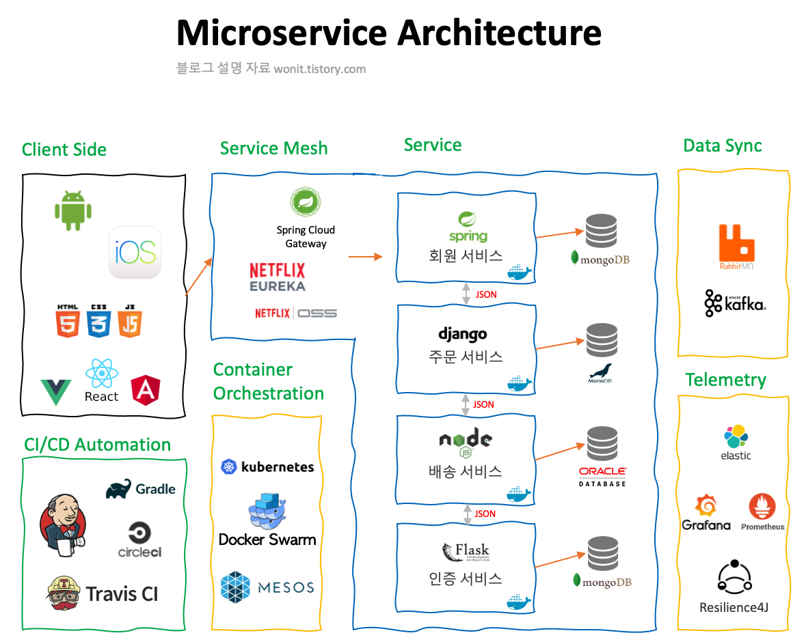
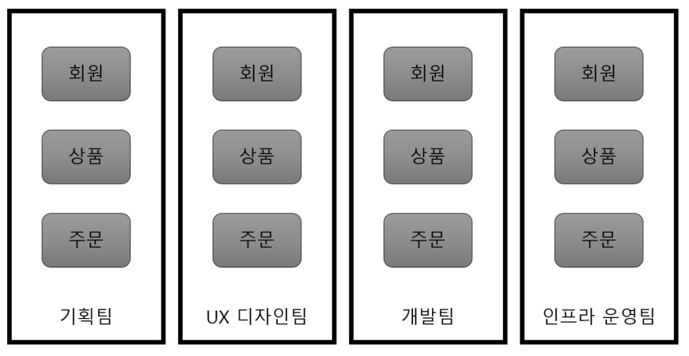
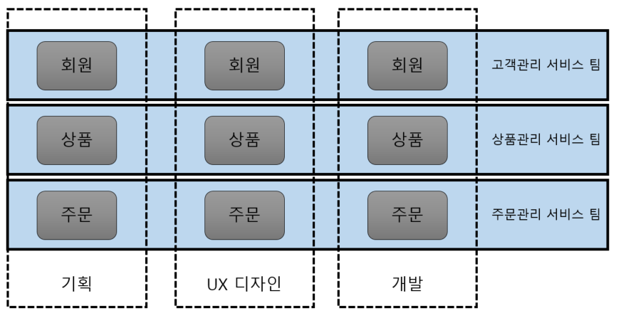

# 개발상식
- [클린코드](#클린코드)
- [리팩토링](#리팩토링)
	- 리팩토링 기법
- 시큐어코딩
- [애자일](#애자일) 
- [TDD](#TDD)
- [DDD](#DDD)
- [MSA](#msa(microservices-architecture))
- [OOP](#oop)
- [OOP의 5가지 설계 원칙](#oop의-5가지-설계-원칙)
- [함수형 프로그래밍](#함수형-프로그래밍)
- DevOps
- 3rd Party
- Git , Github, Gitlab
- [REST API](#rest-api)
- [Argument vs Parameter](#Argument-vs-Parameter)
- [Sync vs Async](#동기vs비동기)
- XSS
- [도커와 쿠버네티스](#도커란)

# 클린코드
## 클린 코드란?
클린 코드란 효율성이 있고,가독성이 좋은 다른 사람이 고치기 쉬운 코드를 의미합니다.
주의깊게 짠 코드로 중복 피하기, 한 기능만 수행, 제대로 표현, 작게 추상화 등이 잘 적용된 코드를 클린 코드라고 합니다.

## 의미 있는 이름을 사용
### 의도가 분명한 이름 -> 가독성 올라감
다음 두 코드를 비교해보겠습니다.
```java
public List<int[] getThem(){
	List<int[]> list1 = new ArrayList<int[]>();
	for(int[] x : theList)
		if(x[0] == 4) list1.add(x);
	return list1;
}
```
```java
public List<int[] getFlaggedCells(){
	List<int[]> flaggedCell = new ArrayList<int[]>();
	for(int[] cell : gameBoard)
		if(x[0] == 4) flaggedCell.add(cell);
	return flaggedCell;
}
```
두 코드는 변수와 함수의 이름만 다를 뿐 완벽하게 같은 구조입니다.
하지만 첫번째 코드에서는 각 요소가 뭘 의미하는지 알 수 없습니다. 반면 아래의 코드는 flag된 셀의 정보를 얻어오는 코드임을 명확하게 알 수 있습니다. 이처럼 이름만 잘 지어줘도 코드의 가독성이 올라가며 코드를 처음보는 사람도 쉽게 이해할 수 있는 코드가 됩니다. 
위의 코드에서 int[] 가 의미하는 대신 간단한 클래스인 Cell을 만들어 관리한다면 정확히 어떤 일을 하는 코드인지 이해가 쉬워집니다. 
```java
public List<int[] getFlaggedCells(){
	List<Cell> flaggedCell = new ArrayList<Cell>();
	for(Cell cell : gameBoard)
		if(cell.isFlagged()) flaggedCell.add(cell);
	return flaggedCell;
}
```
### 그릇된 정보를 담으면 안된다. 
ex) Map을 사용해서 회원 목록을 저장한 경우 memberList라고 쓰는 경우에 다른 사람은 List 자료형을 사용한 것으로 오해할 수 있습니다. 이런 경우 memberMap과 같은 이름을 지어줘야합니다.
또한 account, accounts 등과 같이 서로 비슷한 이름을 사용하면 가독성이 떨어지기 때문에 사용하지않도록 주의해야합니다.

XYZControllerForEfficientHandlingOfString이라는 이름을 사용하고 조금 떨어진 곳에 XYZControllerForEfficientStorageOfString이라는 이름을 사용하면 가독성이 떨어집니다.

소문자 l과 대문자 O를 조심한다. lll1l1 O0OO0 를 언뜻 봤을 때 바로 l,1 그리고 0,O를 구분해내는 것은 쉬운 일이 아니다. 오죽하면 이들이 구분이 잘되는 폰트까지 나왔을까요.
### 의미 있는 구분
```java
public static void copyCharArray(char a1[],char a2[]){
	for(int i = 0;i<a1.length;i++){
		a2[i] = a1[i];
	}
}
```
```java
public static void copyCharArray(char[] source,char[] destination){
	for(int i = 0;i<source.length;i++){
		destination[i] = source[i];
	}
}
```
위의 두 코드는 a1,a2를 source와 destination으로 바꾼 차이 밖에 없는 코드입니다.
이름만 바꿨을 뿐인데 어떤 내용인지 훨씬 이해하기 쉬워졌습니다.

또한 읽는 사람이 차이를 알 수 있도록 이름을 구분해줘야합니다.
ex) moneyAmount, money는 구분이 안되고, customerInfo와 customer는 구분이 안됩니다.

### 발음하기 쉬운 이름을 사용
생성된 날짜를 저장하는 변수를 genymdhms(generate year-month-day-hour-minute-second)라고 해놓으면 코드를 놓고서 토론이나 리뷰를 진행할 때 큰 어려움이 생깁니다. 

### 검색하기 쉬운 이름을 사용
문자 하나를 사용하는 이름과 상수는텍스트 코드에서 쉽게 눈에 띄지않습니다. 학생당 들을 수 있는 강의 수가 최대 7개인 경우를 예시로 들어보겠습니다. 
MAX_CLASSES_PER_STUDENT로 해놓는다면 눈에 잘 들어오고 이후에 코드 내에서 grep으로 찾기도 쉽습니다.
반면, 7로 해놓은 경우 코드 내에서 다른 의미로 7이 쓰인 경우가 있으면 그 경우와 구분하기도 어렵습니다.
또한  최대 강의수가 7개에서 10개로 변경되는 경우 MAX_CLASSES_PER_STUDENT을 사용하는 경우는 값을 7에서 10으로만 바꿔주면 됩니다. 하지만 7로 해놓은 경우는 해당하는 항목을 전부 찾아서 10으로 바꿔줘야합니다.
가독성 뿐만 아니라 유지보수 측면에서도 검색하기 쉬운 이름을 사용하면 큰 이점을 가져올 수 있습니다.

### 클래스 이름은 명사나 명사구로 메서드 이름은 동사나 동사구로


## 함수 설계
### 작게 만들어라
if문 / else문/ while문 등에 들어가는 블록은 1~2줄 정도가 적당합니다. 그 방법은 블록 안에서 함수를 호출하도록 설계하는 것이 중요합니다. 이런 방식을 사용하면 함수의 이름을 적절하게 짓는다면 코드를 이해하기도 쉬워집니다.
이 말은 중첩 구조가 생길만큼 함수가 커져서는 안된다는 의미로 들여쓰기 수준은 1단이나 2단을 넘어셔면 안됩니다.(실제 면접에서 코테 코드 리뷰를 받으면서 들었던 내용입니다.)
### 한 가지만 해라
“함수는 한 가지를 해야하고, 그 한 가지를 잘 해야하고, 그 한 가지만을 해야합니다.”
이 문장에서 한 가지는 과연 어떤 것을 의미할까요?
다음 예시를 먼저 확인해보겠습니다.
다음과 같은 기능을 하는 함수는 몇 가지 기능을 하는 함수일까요?
1. 페이지가 테스트 페이지인지 판단한다.
2. 테스트 페이지라면 설정 페이지와 해제 페이지를 넣는다.
3. 페이지를 HTML로 렌더링한다.
세 가지라고 생각할 수 있겠지만 위의 함수는 추상화 수준이 하나입니다.
솔직히 함수가 몇 가지를 하는지 판단하는 것은 헷갈리는 일입니다. 이런 헷갈림을 최소화하기 위해서 다음 3개의 기준으로 판단하는 것이 좋습니다.
1. 추상화 수준이 1개인지를 확인합니다. 추상화 수준에서 여러 단계로 나눠서 수행하기 위해서 하는 것이 함수를 만드는 목적 중 하나이기 때문에, 추상화 수준이 하나라면 해당 함수는 한 가지만 하는 것입니다. 
2. 함수 내에서 의미 있는 이름으로 다른 함수를 추출할 수 있다면 그 함수는 여러 작업을 하는 것입니다. 
예를 들어, 2차원 배열을 탐색할 때, 배열의 범위를 벗어나는지 확인을 하는 코드가 있다면 이는 함수를 outOfBoundCheck와 같은 이름의 함수로 추출할 수 있습니다. 이렇게 함수로 추출하지않으면 2차원 배열을 탐색하는 함수는 한 가지 이상을 하는 것이됩니다.
3.  한 함수에서 섹션이 나눠지는지 체크합니다. 여러 개로 나눠진다면 여러 작업을 한다는 증거이므로 함수 내에서 섹션이 나눠지는지를 체크해주는 것만으로도 한 가지만 하는지 확인이 가능합니다.
### 함수 당 추상화 수준은 하나로
한 함수 내에 추상화 수준을 섞으면 특정 표현이 근본 개념인지 세부사항인지 구분하기 어렵기 때문에 코드를 읽는 사람이 헷갈립니다. 
예시를 통해서 추상화 수준에 대한 설명을 해보겠습니다.
```TEXT
설정 페이지와 해제 페이지를 포함하려면, 설정 페이지를 포함하고, 테스트 페이지 내용을 포함하고, 해제 페이지를 포함한다.--(1)
	설정 페이지를 포함하려면, 슈아면 슈트 설정 페이지를 포함한 후 일반 설정 페이지를 포함한다.--(2)
	슈트 설정 페이지를 포함하려면, 부모 계층에서 "SuiteSetUp" 페이지를 찾아 include 문과 페이지 경로를 추가한다.--(3)
	부모 계층을 검색하려면...--(4)
```
 위의 글에서 보면 위에서 아래로 읽어내려갈 수록 추상화 수준이 낮아집니다. 위와 같은 문장의 구조로 위에서 아래로 문단을 읽어내려가듯이 코드를 구현하면 추상화 수준을 일관되게 유지하기가 쉬워집니다.

### 서술적인 이름을 사용하라
isTestable, includesetupAndTeardownPages, countFlaggedCell과 같이 서술적인 이름을 사용해서 읽는 사람이 어떤 기능을 하는지 예측할 수 있도록 해주는 것이 중요합니다.
### 함수 인수
함수에서 이상적인 인수 개수는 0개 입니다. 인수가 3개를 넘어가면 인수마다 유효한 값으로 모든 조합을 구성해 테스트하기가 상당히 부담스러워지기 때문에, 함수의 인수는 3개 이하로 하는 것이 좋습니다. 
### 부수 효과를 일으키지마라
함수에서 한 가지만을 해야하기 때문에 부수 효과를 일으키면 안됩니다. 예를 들어서 로그인을 담당하는 함수를 구현하며 다음과 코드를 작성했다고 해보겠습니다.
```java
public class UserValidator{
	private Cryptographer cryptographer;
	public boolean checkPassword(String userName, String password){
		User user = UserGateway.findByName(userName);
		if(user != User.NULL){
			String codedPhrase = user.getPhraseEncodedByPassword();
			String phrase = cryptographer.decrypt(codedPhrase, password);
			if("Valid Password".equals(phrase)){
				Session.initialize();
				return true;
			}
		}
		return false;
	}
}
```
언뜻 보기에는 별문제가 없어보이는 함수입니다.
하지만 Session.initialize() 호출이 있는 것이 문제가 됩니다. 함수의 이름에는 세션을 초기화한다는 정보를 알 수 없습니다. 그래서 함수 이름만 보고서 함수를 호출하는 사용자가 사용자를 인증하면서 기존 세션 정보를 지워버릴 가능성이 생깁니다. 이런 부수 효과는 시간적인 결합을 초래해서 세션을 초기화해도 괜찮은 경우에만 호출이 가능합니다. 특히나 이렇게 부수적인 효과로 숨겨진 경우에는 문제를 찾기가 어렵기 때문에 함수의 이름에 세션을 초기화한다는 것을 명시해주는 것이 좋습니다.

### 명령과 조회를 분리해라
함수는 뭔가를 수행하거나 뭔가에 답하거나 둘 중 하나만 해야합니다. 즉, 객체의 상태를 변경하거나 객체 정보를 반환하거나 둘 중 하나만 해야합니다.
```java
public boolean set(String attributes, String value){ --(1)
	...존재 여부 체크
	try{
		Attributes.setAttribute(value);
	}catch(Exception e){
		throw SetAttributeFailException();
	}
	return true;
}
...
if(set("username","SSAFY"))... --(2)

if(attributeExists("username")){ --(3)
	setAttribute("username","SSAFY");
	...
}
...
```
위의 코드에서 (2)번에 해당하는 코드는 username이 SSAFY로 설정되어있는지 확인하는 코드일까요? 아니면 username을 SSAFY로 설정하는 코드일까요?
(1)번을 만든 개발자는 “set”을 동사로 의도해 attributes를 value로 세팅에 성공하면 true를 리턴하게 해놓았는데, if문 안에 있으니 형용사처럼 느껴저 username이 SSAFY라면으로 생각하게됩니다. 이런 혼란을 방지하기 위해서 (3)과 같이 명령과 조회를 분류하는 방식을 사용해야합니다.

### 오류 코드보다 예외를 사용해라
위의 코드에서 (1)을 보면 세팅을 하는 부분에서 try-catch문을 사용했습니다. 해당 부분을 if-else를 사용해서 구현을 해도 되지만 try-catch를 분리해서 코드를 작성한다면 원래 코드에서 오류 처리 코드를 구분할 수 있기 때문에 코드가 깔끔해집니다. 
try-catch문을 사용할 때, 코드 구조에 정상 동작과 오류 처리 동작이 뒤섞이는데 Try-catch 블록을 별도의 함수로 뽑아낸다면 이런 문제점을 해결할 수 있습니다. 그 이유는 오류처리도 한 가지 작업이기 때문에, 함수가 한 가지만 해야한다는 원칙을 따르기 위해서 오류처리도 별도의 함수로 뽑아내는 것이 중요합니다.

### 반복하지마라
특정 조건에 따라서 데이터들을 정렬을 해야하는 경우를 생각해보겠습니다. 
데이터마다 정렬하는 방식을 오름차순 정렬하는 상황인데, 어느 날 고객 데이터를 분석한 결과 고객들이 내림차순 정렬된 결과를 선호한다는 소식을 들었습니다.
이 때, 알고리즘을 하나의 함수로 만들어 놓지않고, 각각의 데이터마다 구현을 해야한다면, 어느 하나의 데이터라도 구현을 빼먹는 순간 오류가 발생합니다.
그래서 반복되는 부분은 함수로 따로 빼줘서 반복을 줄여주는 것이 중요합니다. 

### 함수를 짜는 방법
함수를 짜는 방법은 글짓기와 같습니다. 처음에는 길고 복잡하며 중복된 부분을 신경쓰지않고 코드를 작성합니다. 그 후 코드를 점점 다듬으면서 함수를 만들고, 이름을 바꾸고, 중복을 제거해줍니다. 그 과정에서 메서드의 크기를 줄이고, 순서가 바뀌기도합니다. 또한, 클래스를 쪼개기도 합니다. 이런 과정을 거쳐서 위에서 설명한 조건들을 만족하는 코드를 작성하게됩니다.
처음부터 위의 조건을 다 만족하는 코드를 짜는 것은 거의 불가능한 일이기 때문에 차근차근 고쳐나가는 연습을 하는 것이 중요합니다.

## 주석
주석은 나쁜 코드를 보완하지 못합니다. 코드로 의도를 표현하는 것이 중요합니다. 주석은 코드로 의사 전달이 제대로 안된 경우를 만회하기 위해서 사용한다고 생각하는 것이 중요합니다. 코드의 내용은 최대한 코드로 표현을 하고 코드로 표현하는 것이 불가능한 경우나 주석 사용이 불가피한 경우에만 유용합니다.  그 이유는 좋은 주석이 있고 나쁜 주석이 있기 때문입니다. 

### 좋은 주석
1. 법적인 주석
2. 정보를 제공하는 주석
3. 의도를 설명하는 주석
4. 의미를 명료하게 밝히는 주석
5. 결과를 경고하는 주석
6. TODO 주석
7. 중요성을 강조하는 주석
8. 공개 API에서 Javadocs
### 나쁜 주석
1. 이해하기 어려운 주석
다른 코드를 뒤져봐야하는 주석은 코드를 읽는 사람과 제대로 소통하지 못하는 주석입니다. 
2. 같은 이야기를 중복하는 주석
3. 오해의 여지가 있는 주석
4. 의무적으로 다는 주석
5. 이력을 기록하는 주석
6. 있으나 마나한 주석
7. 함수나 변수로 표현할 수 있는 주석
8. 닫는 괄호에 다는 주석
9. 주석으로 처리한 코드
10. HTML 주석
11. 전역 정보
## 정리
1. 검색 가능한 이름을 사용하기 (Use a searchable name.)
2. 함수명은 반드시 동사로. (Function name should be verbs.)
함수는 동작 하나만. 
3. 함수의 인수는 3개이하 적당. 많을 경우에는 Object로 정리해서 param 사용.
4. 함수의 파리미터에 boolean 을 둬서 액션 2개 이상을 구현하기 보다는, 함수를 2개로 구분하는 것을 추천. 
5. 변수명은 너무 축약하지 말것. 이해할 수 있는 변수명으로~! 
<br>


<br>

<br>

# 리팩토링

*마틴 파울러 - 『리팩토링: 코드 품질을 개선하는 객체지향 사고법』를 정리한 글들을 참고하였습니다.*

<br>

겉으로 보이는 프로그램의 동작이 바뀌지 않으면서 코드 내부 구조를 개선하는 방법. 버그 발생 가능성을 최소화하면서 코드를 정리하는 정형화된 방법이다. 코드의 디자인을 개선하는 작업이지 성능을 최적화시키는 것은 아니다. 시간을 따로 내어 모든 것을 미리 생각하는 것 보다는 개발을 진행하면서 지속적으로 좋은 디자인을 찾아야 한다. 

<br>

<br>

## 리팩토링을 하는 이유

1. 리팩토링은 소프트웨어의 디자인을 개선시킴으로써 가독성을 높이고 유지보수가 용이해진다.

2. 새로운 코드를 쉽게 추가할 수 있다.

3. 버그를 쉽게 찾도록 도와준다.

4. 프로그램을 빨리 작성하도록 도와준다.

5. 코드 중복을 최소화하여 각 작업에 대한 코드가 오직 한 곳에 있게 할 수 있다. 


<br>

<br>


## 리팩토링이 필요한 시기


<br>

### 중복된 코드(Duplicated Code)

동일한 코드 구조가 두 곳 이상에서 중복으로 사용될 때, 이를 하나로 통일하면 프로그램을 개선할 수 있다. 

- 한 클래스의 두 메소드 안에 중복된 코드가 있는 경우 -> 메소드 추출
- 한 클래스의 두 하위 클래스에 중복된 코드가 있는 경우 -> 메소드 추출, 메소드 상향
- 서로 연관없는 두 클래스에 중복된 코드가 있는 경우 -> 메소드 추출 후 클래스 or 모듈로 분리


<br>

### 긴  메소드(Long Method)

메소드들은 그 기능을 쉽게 알 수 있는 이름을 가져야 하며 코드를 분석하지 않아도 쉽게 기능을 알 수 있어야 한다. 따라서 메소드 길이는 짧아야하고 이를 위해 메소드를 과감하게 쪼개야 한다. 이때, 쪼갠 메소드의 이름은 기능 수행 방식이 아니라 메소드의 기능을 나타내는 이름으로 정해야 한다.

- 기본적으로 메소드 길이를 줄이기 위해 메소드를 추출
- 메소드내에 매개변수, 임시변수가 많다면 추출이 까다로우므로 매개변수와 임시변수를 줄임 -> 매개변수를 객체로, 임시변수를 메소드 체인으로 전환
- 위 작업을 수행해도 매개변수, 임시변수가 많다면 해당 메소드를 메소드 객체로 전환


<br>

### 방대한 클래스(Large Class)

클래스의 기능이 많아질수록 인스턴스 변수의 수도 증가하고 인스턴스 변수가 많을수록 중복된 코드가 존재할 확룔도 높아진다. 

- 연관된 인스턴스 변수들을 묶어 또다른 클래스, 하위 클래스, 모듈 등으로 추출


<br>

### 긴 매개변수(Long Parameter LIsts)

메소드의 매개변수가 길어지게 되면 이해하기 어렵고 사용하기 어려워진다. 객체 지향 코드에서는 객체가 변수를 가지고 있고 해당 객체를 통해 데이터를 얻을 수 있기 때문에 매개변수 리스트를 하나의 객체에서 가져올 수 있으면 매개변수를 객체로 전환한다. 


<br>

### 수정의 산발(Divergent Change)

하나의 기능을 수정할 때마다 여러 메소드를 수정해야 한다면 좋은 코드라고 볼 수 없다. 따라서 하나의 클래스가 하나의 책임만 가질 수 있게 여러 클래스로 추출하여야한다. 


<br>

### 기능의 산재(Shotgun Surgery)

'수정의 산발'과 비슷하지만 반대되는 개념. 하나의 기능을 수정할 때마다 여러 클래스들을 수정해야 한다면 이역시 좋은 코드가 아니다. 

- 메소드 이동, 필드 이동 등을 사용해 수정한 부분을 하나의 클래스 안으로 넣거나 새로운 클래스를 생성해야 한다. 


<br>

### 잘못된 소속 (Feature Envy)

어떠한 메소드가 자신이 속한 클래스가 아닌 외부 클래스에 대한 접근이 더 많다면 잘못된 설계로 볼 수 있다. 따라서 해당 메소드를 더 자주 접근하는 클래스로 옮겨야 한다. 메소드 중 일부분만 추출해서 옮길 수도 있다. 


<br>


### 데이터 뭉치 (Data Clumps)

동일한 여러 데이터들이 여러 클래스에 위치해 있는 경우, 즉 하나의 데이터 뭉치로 존재하는 값들은 하나의 객체로 생성해야 한다.


<br>


### 강박적 기본 타입 사용 (Primitive Obsession)

데이터 이용 시 기본 타입만 사용하지 말고 객체도 잘 사용해야 한다. 보통 Money 클래스(개수와 화폐 단위 묶기), 전화번호, 이메일, 우편번호와 같은 특수 문자열 클래스 등을 객체를 잘 사용하지 않으려는 경향이 있는데 이러한 습관은 좋지 않다.

*『리팩토링: 코드 품질을 개선하는 객체지향 사고법』*

<br>


### switch 문 (Switch Statements)

객체지향 코드의 특징 중 하나는 switch 구문이 비교적 적게 쓰인다는 점이다. swicth 문을 쓰게되면 반드시 코드 중복이 발생하게 되고 객체지향 코드에서는 swicth 문 보다 다형성 개념을 적용해 코드를 분리, 재정의 하는 것이 좋다. 

- 메소드 추출로 switch문을 뽑아내고 메소드들을 다형성을 적용한 클래스로 옮긴다.


<br>


### 게으른 클래스 (Lazy Class)

get/set 메소드만 가지고 다른 것은 아무것도 없는 등 클래스가 별다른 기능을 가지지 않는 경우가 있다. 클래스 생성, 유지 자체가 비용이 발생하기 때문에 필요 없는 클래스는 삭제 후 클래스를 직접 삽입(Inline Class)하는 것이 좋다. 


<br>


### 임시 필드(Temporary Field)

객체 내의 인스턴스 변수가 특정 상황에서만 사용되는 경우가 있다. 보통 객체는 들어 있는 모든 인스턴스 변수를 사용할 것이라 예상하기 때문에 어떤 변수가 특정한 상황에서만 사용된다면 코드를 파악하기 어려워 진다. 이런 경우에는 변수와 메소드를 묶어 하나의 클래스로 추출한다. 


<br>


### 메시지 체인 (Message Chains)

어떤 객체를 얻기 위해 다른 객체에 물어보고, 그 객체는 또 다른 객체에 물어보고, 다시 다른 객체에게 물어보고... 이와 같이 메시지 체인이 발생할 수 있다. 이러한 경우 중간에 특정 관계가 변하게 되면 어떤 객체를 얻기 위한 코드들도 수정되야 한다. 이 경우 대리 객체 은폐(Hide Delegate)를 적용해야 한다. 


<br>


### 불필요한 주석 (Comments)

특정 메소드에서 어떤 코드의 기능을 설명하는 주석이 길어지게 된다면 메소드 추출이 필요할 수도 있다. 또한, 메소드를 추출하고 난 뒤에도 기능을 설명할 주석이 필요하다면 메소드명 변경을 해야 한다.


<br>

<br>

<br>

# 애자일
## 애자일 이란?
* ‘Agile = 기민한, 날렵한’ 이란 뜻으로 좋은 것을 빠르게 취하고, 낭비 없게 만드는 다양한 방법론을 통칭해 일컫는 말

* 절차보다는 사람이 중심이 되어 **변화에 유연하고 신속하게 적응하며, 효율적인 시스템을 개발**하는 방법론

* **반복적/점증적인 짧은 개발주기, 위험도를 감소시키고 고객의 요구사항 수용의 민첩성이 강조**된 개발 방법론

<br>

## 애자일 방법론의 진행 과정
* 애자일 방법론은 **계획 → 설계(디자인) → 개발(발전) → 테스트 → 검토(피드백)** 순으로 반복적으로 진행됩니다. 계획을 세운 후 다음 단계까지 기다려서 절차대로 진행하는 워터폴 모델과 달리 먼저 진행 후 분석, 시험, 피드백을 통하여 개선하여 나가는 진행 모델입니다.

<br>
<p align="center">

</p>

1. **계획 및 분석** : 고객과 사용자가 원하는 바를 파악하여 타당성을 조사하고 SW 기능과 제약조건을 정의하는 명세서 작성, 대상이 되는 문제 영역과 사용자가 원하는 task를 이해하는 단계
2. **설계(디자인)** : 기획의도에 맞는 설계 및 디자인 추가 및 수정하는 단계
3. **개발(발전)** : 설계단계에서 만들어진 설계서를 바탕으로 프로그램을 작성, 코딩, 디버깅, 단위/통합테스트 수행
4. **테스트** : 발생 가능한 실행 프로그램 오류를 발견, 수정하는 단계
5. **검토(피드백)** : 기획의도를 파악하고 시험결과와 기획의 따라 수정할 부분을 제시하는 단계

<br>

## 애자일 방법론의 특징
* 고객과 개발자의 **지속적인 소통**을 통하여 변화하는 요구사항을 신속하게 수용한다.
* 개발자 개인의 가치보다는 팀의 목적을 우선시하며 **고객의 의견을 가장 우선시**한다.
* **팀원들과의 주기적인 회의 및 제품 시현**을 통한 방지를 점검한다.
* 진행하면서 프로그램을 시행해보고 **고객으로부터 피드백**을 받는다.
* 내부 구조 형성을 통한 **비용절감**에 힘쓰는 동시에 **프로그램 품질 향상**을 위해 노력한다.

<br>

## 애자일 방법론의 장/단점
### 장점 👍
* **프로젝트 계획에 걸리는 시간을 최소화**할 수 있다.
* 점진적으로 테스트할 수 있어서 **버그를 쉽고 빠르게 발견할 수 있다.**
* 계획 혹은 기능에 대한 **수정과 변경에 유연**하다.
* 고객 요구사항에 대한 **즉각적인 피드백에 유연하며 프로토타입 모델을 빠르게 출시**할 수 있다.
* 빠듯한 기한의 프로젝트를 **빠르게 출시**할 수 있다.

### 단점 👎
* 확정되지 않은 계획 및 요구사항으로 인한 **반복적인 유지보수 작업이 많다.**
* 고객의 요구사항 및 계획이 크게 변경될 경우 모델이 무너질 수 있다.
* 개인이 아닌 팀이 중심이 되다 보니 **공통으로 해야 할 작업들이 많을 수 있다.** (회의, 로그 등)
* 반복적인 업무로 속도는 빠를 수 있으나 **미흡한 기능들에 대한 대처가 필요**하다.
* 확정되지 않은 계획으로 **개발 진행 시 이해하지 못하고 진행하는 부분이 많을 수 있다.**

<br>

## 애자일 방법론의 종류
### 익스트림 프로그래밍(Extreme Programming, XP)
* 문서를 강조하지 않고 테스트를 우선하는 개발 방식, **개발 초기부터 테스트를 병행**하는 개발 방법론
* 고객과 함께 **2주 정도의 반복개발**
* 의사소통, 피드백, 단순성, 용기, 존중 강조

<br>
<p align="center">

</p>

1. **유저스토리** : 사용자 요구사항 수집, 의사소통 도구
2. **구조적 스파이크** : 설계상,기술상  잠재적 위험을 탐지하기 위한 간단한 프로그램, 기술적인 문제를 줄이고 유저 스토리 기반 개발일정에 대한 신뢰도 상승
3. **릴리즈 계획** : 전체 프로젝트 배포계획 확립
4. **주기** : XP핵심, 상황에 따른 릴리즈 및 계획수정
5. **승인 테스트** : 릴리즈 전의 인수 테스트(블랙박스 테스트), 고객수행
6. **작은 릴리즈** : 주기의 마지막 단계, 빠른 피드백

<br>

### 스크럼(Scrum)
* 30일마다 동작 가능한 제품을 제공하는 **스플린트를 중심**, 팀을 중심으로 한 반복적이고 점진적인 개발 방법론
* **제품 백로그**를 바탕으로 기술적으로 분할되고 **재해석된 스프린트**를 통해 구현하는 개발 방법론
* XP는 변화수용, 스크럼은 **선감지 처리 관점**

<br>
<p align="center">

</p>

#### 구성요소
* **Sprint** : 반복주기 (Iteration, 30days)
* **Product Backlog** : 제품의 요구사항 목록
* **Sprint Backlog** : 해당 Sprint기간에 수행해야하는 Task 목록
* **Daily Scrum Meeting** : 매일 15분 정도 짧게 진행하는 미팅 (계획, 실적, 위험 공유)
* **Review** : Sprint 완료 시 고객 검토, Feedback을 받아 다음 Product Backlog에 적용
* **Retrospective Meeting** : Scrum Team에서 운영중인 시험 리뷰 및 개선 미팅
* **Burn Down/Up Chart** : 하나의 스프린트에 대한 소멸/완성 그래프

#### 역할자
* **Product Owner** : 요구사항을 정의하고 Product Backlog 업데이트
* **Scrum Team** : Product Backlog 구현
* **Scrum Master** : 제 3자 입장에서 Product Owner와 Scrum Team이 Scrum방법론을 제대로 진행 할 수 있도록 지원

***따라서 Scrum을 적용하려면 조직의 역할/구성/감리/산출물 등 다양한 영역에서 변화를 주어야 함***

<br>

### KANBAN (칸반)
* **연속적 흐름 처리** 방식. **칸반 보드**로 시각화되고 각각 단계는 열로 표시

<br>
<p align="center">

</p>

#### 구성요소
* **Kanban Board** : 프로세스를 가진 Board와 스토리카드를 이용하여 업무 흐름제어
* **Process** : 실제 업무가 이루어지는 단계 및 업무 수행을 통한 산출물 작성
* **Work Queue** : 대기형렬, 개발 대기, 테스트 대기, 배포/릴리즈 대기 과정
* **Total Work Time (총 주기 시간)** : 총 작업의 수행시간, 개별 업무의 Cycle Time의 합으로 구성

<br>

----

# TDD

TDD(Test Driven Development)는 테스트 주도 개발이라는 뜻으로 만들고자하는 기능의 내용을 담고 있으면서 만들어진 코드를 검증까지 해줄 수 있도록 테스트 코드를 먼저 만들고 테스트를 성공하게 해주는 코드를 작성하는 방식의 개발 방법입니다.

그렇다면 테스트는 과연 무엇일까요?

## 테스트는 무엇인가

테스트는 만든 코드에 확신을 가질 수 있게 해주는 도구입니다. 테스트를 통해 검증한 코드는 정상적으로 작동한다는 확신을 가질 수 있으며, 변화한 부분 이외의 부분은 검증이 완료된 상태이기 때문에, 변경한 부분으로 인해 발생하는 변화만 신경쓰면 되기 때문에 변화에 유연하게 대처할 수 있게 해줍니다.

테스트는 개발자가 의도한대로 코드가 정확히 작동하는지 확인하는 것이기 때문에, 테스트하려는 대상에 집중할 수 있는 사이즈로 만드는 것이 중요합니다. 그렇기 때문에 관심사의 분리를 통해서 적당한 사이즈로 단위 테스트를 만들어야합니다.

단위 테스트를 하는 이유는 웹 개발을 예시로 설명을 해보겠습니다.

웹 개발 초기에 회원 가입 기능을 개발하고 있는 상황을 생각해보면, DB에 데이터가 잘 들어가는지 확인을 하려고 할 때, 단위 테스트를 사용하지않으면, 프론트 코드까지 작성을 해서 데이터를 넘겨받아와서 저장하는 기능까지 구현을 해놓은 다음에 제대로 작동하는지 확인해야합니다. 이런 식으로 개발을 하면, 문제가 발생했을 때, 어디서 발생했는지 확인이 힘들 뿐만 아니라 초기에 간단하게 대응할 수 있었던 문제를 엄청 복잡한 과정을 통해 해결해야하는 일이 생길 수 있습니다. 그렇기 때문에 관심사에 맞는 크기의 단위 테스트를 만들어 테스트 하는 것이 중요합니다.

그렇다면 테스트를 작성할 때 어떤 점을 유의해야하는지 알아보겠습니다.

### 1. 테스트는 자동으로 수행되도록 코드로 만드는 것이 중요하다.

테스트를 진행할 때, 입력에 실수가 있어서 오류가 나면 다시 테스트를 반복해야하고, 테스트를 실행하기위해서 서버를 띄우고 프로그램을 배치한 후, 테스트 용으로 브라우저를 띄우고 주소를 입력해야하는 귀찮은 작업도 필요합니다. 하지만 자동으로 수행되도록 코드를 만들어놓으면 이런 시간을 단축할 수 있으며 **자주 반복이 가능**합니다.

### 2. 지속적인 개선과 점진적인 개발을 위한 테스트를 해야한다.

작성한 코드를 만든 후에 이를 검증하는 테스트 코드를 만들어두면, 코드를 개선하는 작업을 할 때 유리합니다. 혹시 개선 과정 중간에 설계를 잘못하거나, 수정에 실수가 있었다면 테스트를 통해서 바로 확인을 할 수 있기 때문입니다.

그렇기 때문에 이전까지 구현 해놓았던 기능들이 문제 없음을 검증한다면, 조금씩 기능을 추가하면서 테스트트하는 점진적인 개발이 가능해집니다. 테스트를 통해 기존에 만들어둔 기능들이 새로운 기능을 추가하느라 수정한 코드에 영향을 받지않고 잘 작동하는지까지도 확인할 수 있기 때문에, 개발 전단계에 걸쳐 테스트는 필수적입니다.

### 3. 테스트 결과는 일관성이 있어야한다.

코드에 변경사항이 없다면 테스트는 항상 동일한 결과를 내야합니다.
테스트가 외부 상태에 따라서 성공하기도 하고, 실패하기도 한다면 그 테스트는 좋은 테스트라고 할 수 없습니다.

### 4. 포괄적인 테스트를 해야한다.

2번에서 관심사에 따른 단위 테스트를 진행해야한다고 말했는데, 갑자기 포괄적으로 테스트를 해야한다는 말이 나와서 의아할 수 있습니다.

하지만 여기서 말하는 포괄적인 테스트라는 것은 성공하는 테스트만 골라서 만들면 안된다는 뜻입니다.

평소에는 정상적으로 잘 동작하는 것처럼 보이지만 막상 특별한 상황이 되면 엉뚱하게 동작한다면, 이는 추후에 큰 문제를 만들 수 있고 원인을 찾기 힘들어서 고생할 수 있습니다.
"항상 네거티브 테스트를 먼저 만들어라"라는 말이 있을만큼 부정적인 케이스를 먼저 만드는 테스트 습관을 들이는 것이 중요합니다.

## 테스트가 이끄는 개발

앞서 설명했던 것처럼 테스트 주도 개발은 만들고자하는 기능의 내용을 담으면서 만들어진 코드를 검증할 수 있는 코드를 먼저 만든 후에, 그 테스트를 성공하게 해주는 코드를 작성하는 방식의 개발방법입니다.

이는 테스트를 만들어가면서 개발하는 방법이 주는 극대화한 방법입니다.

> 실패한 테스트를 성공시키기위한 목적이 아닌 코드는 만들지 않는다

는 TDD의 기본 원칙입니다. 

TDD는 테스트를 먼저 만들고 그 테스트가 성공하도록 하는 코드만 만드는 방식으로 진행하기 때문에, 테스트를 빼먹지 않고 만들 수 있습니다. 그리고 테스트를 작성하는 시간과 애플리케이션 코드를 작성하는 시간의 간격이 짧아져 전체적인 개발 시간이 짧아집니다.

테스트를 만들어뒀기 때문에, 코드를 작성하면 바로바로 테스트를 실행해볼 수 있기 때문입니다. 

TDD에서는 테스트를 작성하고 이를 성공시키는 코드를 만드는 작업의 주기를 가능한 짧게 가져가도록 권장됩니다. 그래서 TDD 방식은 [애자일](#애자일) 을 통한 개발을 할 때 필수적입니다.

### TDD의 장점

1. 코드를 만들어 테스트를 실행하는 그 간격이 매우 짧기 때문에 개발한 코드의 오류를 빠르게 발견할 수 있습니다. 빨리 발견된 오류는 쉽게 대응이 가능하기 때문에 TDD를 통해서 개발을 하면 개발시간을 단축할 수 있습니다.

2. 테스트 코드는 애플리케이션 코드보다 상대적으로 작성하기 쉽고 각 테스트가 독립적이기 때문에, 코드의 양에 비해서 작성하는 시간이 얼마 걸리지않습니다.

3. 개발하고 싶은 기능을 일반 언어가 아닌 테스트 코드로 표현해서, 마치 코드로 된 설계문서처럼 만들어놓을 수 있습니다. 이렇게 설계 문서처럼 만들어 놓은 후에 실제 기능을 가진 애플리케이션 코드를 만들고 나면, 그 테스트를 바로 실행해서 설계한대로 코드가 작동하는지 확인할 수 있습니다.

   이때 테스트가 실패하면 설계한 대로 코드가 만들어지지 않았다는 것을 바로 알 수 있습니다. 이 과정에서 문제가되는 부분을 알 수 있고, 다시 코드를 수정하고 테스트를 수행해서 테스트가 성공하도록 코드를 계속 다듬어가면서 테스트를 끝내면 코드의 구현과 테스트라는 두가지 작업이 동시에 끝나기 때문에 정말 효율적입니다.

   
   
----

# DDD

## DDD(도메인 주도 설계)

### DDD의 등장
아키텍쳐 분석 설계와 프로젝트 진행에 있어서 가장 중요한 것중의 하나가 "고객의 요구 사항을 어떻게 파악할것이며 이를 어떻게 모델화 하느냐?" 입니다. 모델 자체가 목적이 아니라 모델이라는 공통된 언어를 사용하여 고객과 소통을 하고 요구 사항을 가급적 정확하게 도출하여 나중에 미도출된 요구사항이나 잘못 분석된 요구사항이 없도록 하는 것이 중요한 포인트 중에 하나입니다.

그리고 프로젝트중에는 프로젝트 구성원, 고객, 각기 다른팀, 비지니스 전문가, 분석가, 아키텍트들간의 생각하고 있는 개념이나 목표가 서로 다른 경우가 있습니다. 그래서 시스템을 구축해놓고 나면 결국 각자가 생각한것과 다른 결과물이 나오거나 구현이 서로 기대했던 바와 달라서 모듈간 통합에서 문제가 발생하거나 많은 비용과 자원이 소요되는 경우가 있습니다.

이런 모든 문제의 공통적인 원인은 프로젝트의 구성원 자체가 현재 프로젝트의 목적,현황,디자인,업무,각자의 역할등 프로젝트에 대한 Context 에 대해서 제대로 이해하지 못해서 발생하는 문제입니다. 어떻게 보면 Communication의 문제입니다.
 프로젝트내에서 이 Context 가 제대로 공유된다면 같은 생각과 같은 현황 파악으로 인해서 프로젝트가 잘못된 방향으로 흘러가는 것을 상당 부분 예방할 수 있습니다.

이러한 관점에서 시작된것이 Domain Driven Design 인데, 기본적으로 도메인(업무 또는 현업)과 개발팀간 그리고 각기 다른 업무 개발팀간의 의사소통 방법과 소프트웨어 디자인 방법에 대해서 설명하고 있습니다.

### Domain이란?
도메인의 사전적 의미는 '영역'이라는 뜻입니다. 소프트웨어 개발에서 말하는 도메인은 '프로그램이 쓰이는 대상 분야'이고,
**소프트웨어로 해결하고자 하는 문제 영역**입니다.

도메인이 무엇인가에 대해서 쉽게 이해하려면
"도메인이 무엇인지"보다는 "도메인에 포함되는 것이 무언인가?" 에 대해서 생각하면 쉽습니다.

이커머스 시스템을 예로 들면, 이커머스 분야에서는 주문, 상품, 결제 같은 개념이 필요합니다. 이 개념들이 이커머스 시스템의 도메인에 속합니다. 의료 시스템에서는 주문, 배송이란 개념은 필요 없다. 병원, 의사, 진료 같은 개념이 필요합니다.
즉, 시스템마다 포함하는 개념 및 요소가 다르게 되고, 이를 도메인이라고 부릅니다.


## DDD란?
1) 비즈니스 Domain별로 나누어 설계하는 방식입니다. 

2) DDD의 핵심 목표는 "Loosly coupling", "High cohesion"입니다.
  (어플리케이션 또는 그 안의 모듈간의 의존성은 최소화하고, 응집성은 최대화)

3) DDD는 Strategic Design과 Tactical Design으로 나눌 수 있습니다. Strategic Design은 개념 설계이고 Tactical Design은 프로그래밍하기 위한 구체적 설계라고 할 수 있습니다.
 
## 도메인 모델을 정제하기 위한 프로세스


1. 시나리오 정의 내리기
2. 시나리오에 맞춰 모델 구성
3. 해당 모델로 코딩
4. 시나리오를 수정
5. 문제가 생기면 위의 사항들을 반복


### 1. 시나리오 구성 (Strategic Design)

Domain을 기준으로 Context에 대해 생각하고 이를 기준으로 디자인 하는 것을 Strategic Design이라고 합니다.

Context 란 특정 객체 혹은 상황이 벌어지는 주변 환경을 말합니다. 가장 쉬운 예로 가게 안에 접시에 담긴 피자와 혹은 길에 버려진 피자를 생각해 봅시다. 같은 피자이지만 피자가 매장 안의 접시에 있는지 혹은 길에 있는지에 따라 유료, 무료의 차이가 생기게 되고 사실상 다른 것으로 간주될 수 있습니다. 이처럼 같은 사물이나 행동 양상이 벌어지는 상황에 집중하여 디자인을 하는 것이 Strategic Design 의 핵심이라고 할 수 있다.

Strategic Design을 이해하기 위해 간단한 예로 주택을 짓는 경우를 생각해 봅시다. 우리가 원하는 집을 짓기 위해서 우리가 하는 행동 절차는 다음과 같습니다.

1. 어떤 주택을 지을지 생각을 해 본다.
2. 주택을 지을 때 어떤 핵심적인 가치에 집중하여 집을 지을지를 선택합니다. 가령 헛간이 넓어야 한다던가, 수영장이 커야 한다. 가 중점적인 사항을 명시합니다.
3. 그 형상을 실제 집으로 만들어 내기 위해 모델링을 하고
4. 이를 토대로 구체적인 설계도를 그려 나갑니다. 이 설계도에는 집의 아주 구체적인 부분들이 명시되게 됩니다.


이렇게 DDD를 통한 설계 과정에서 사용되는 용어는 다음과 같습니다.

먼저 집 전체에 대한 설계의 전체를 우리는 **domain** 이라고 부르며, 커다란 집의 각각의 부분 집합인 헛간, 농장, 수영장 등 큰 파트들을 **subdomain** 이라고 부릅니다. 또 각각의 subdomain에 대해 각 subdomain의 문맥적 상황을 **bounded context** 라고 부르며, 실제 subdomain의 구체적인 형상을 나타내는 것을 domain model 이라고 부릅니다.

여기서 bounded context 가 가지는 의미는 바로 특정 모델이 어떤 bounded context 에 속하는 가에 따라서 다른 의미를 가지기 때문입니다. 가령, 주택 건축시에 정문에서 caretaker라는 모델이 있다면 이는 바로 경비원을 말하는 것일 겁니다. 하지만 caretaker라는 단어가 메인 주거 건물 안에서 가지는 의미는 이와 다를 수 있습니다.

이 내용을 간단히 정리하면 다음과 같습니다.

<h4> Context </h4>

의미를 결정하는 것 처럼 보이는 단어 나 문장이 나타나는 설정으로, 모델에 관한 문장은 context 안에서만 이해될 수 있다.
주택을 구성하는 각 부분 구간들에 대한 환경을 말한다.

<h4> Model </h4>

도메인의 특정 양상을 묘사하는 추상화 시스템으로 도메인과 관련된 문제를 해결하는 데 사용된다.

<h4> Ubiquitous Language </h4>

소프트웨어를 만들기 위해서는 많은 사람들이 원활히 소통해야 하고 여기에는 다양한 용어들이 사용된다.

가령, 기획자, 디자이너, 개발자가 모인 자리에서 각자 서로의 언어로 대화를 한다면 이는 원활한 커뮤니케이션을 심각하게 저해하게 된다. 이 경우에 필요한 것이 Ubiquitous Language이며 이는 domain model 을 둘러싼 언어구조를 말한다.

이 언어는 팀 전체가 각각의 업무 파트에서 공통적으로 사용될 수 있어야 하며, 실제 개발의 측면에서 모든 기획자, 디자이너, 개발자가 공통된 어휘를 사용해야 서로간에 이견이 없을 것이며 이러한 공통된 어휘를 ubiquitous language라고 합니다.

<h4> Bounded Context </h4>
위에서 설명한 Context에 대한 구체적인 설명으로, 특정 모델이 정의되고 적용될 수 있는 영역을 이야기 합니다.
주택을 짓는 경우에 빗대어 생각해 볼 때, Bounded Context는 주택 전체를 구성하는 헛간, 농장, 수영장, 메인 주택 등의 큰 요소들 각각을 둘러싼 상황을 의미합니다.

특정 모델은 어떤 bounded context에 놓이는가에 따라 다르게 이해될 수 있습니다.
실제 소프트웨어를 구축함에서의 예를 들면 가령 sales를 담당한하는 subdomain이 있을 수 있고, 이를 지원하는 support와 accounting 라는 subdomain 이 존재할 수 있습니다. 이러한 각각의 subdomain이 놓인 환경인 bounded context 내에서 특정 모델 customer 가 보여지는 시각은 매우 상이할 수 있습니다. sales 팀에서 고객을 보는 시각은 주로 사회적 관심사, 좋아하는 것, 욕구 등의 것일 겁니다. 하지만 accounting의 측면에서는 사용자는 그저 하나의 계정으로써 그 사람의 결제정보 만이 중요한 정보일 수 있습니다. 즉 각기 다른 bounded context에서 ubiquitous language는 비록 표현은 같지만 다른 의미를 가지게 됩니다.

<h4> Context Map <h4>
각 bounded context들 사이의 관계를 말하며 즉, 주택 건축시에 헛간, 뒷간, 수영장 등 큰 요소들이 어떤식으로 서로 연관이 되어 있는지를 나타낸다.

<h4> Domain Model </h4>
Domain Model 이란 실제 세계를 반영하는 구체적인 설계로, 주택 건축시에 주택을 구성하는 메인 주택의 구체적인 설계도를 말한다.

### 2. 모델 구성하기 (Tactical Design)

Strategic Design을 통해 설계한 모델을 프로그래밍을 통해 구체적인 설계를 하는 것이 Tactical Desgin입니다.

DDD를 하기 위하여 도메인부터 생각해 봐야합니다. 쇼핑몰을 만들 때 주문이라는 도메인을 보죠. 이 도메인에는 어떠한 시나리오들이 있을까요?

- 사용자가 제품을 주문서를 통해 주문한다.
- 사용자가 주문한 내용을 취소한다.
- 사용자가 주문서를 확인한다.

이 정도만 봐도 도메인 모델들이 보여집니다. <사용자>, <제품>, <주문서> 등이 있습닏아.

```Java
* 주문서 모델 

public class OrderForm {
    private String orderId;
    private String userId;
    private List<Item> itemList;
    private String address;
}

* 사용자 모델

public class User {
    private String userId;
    private String userName;
    private String password;
}

* 아이템 모델

public class Item {
    private String itemId;
    private String itemName;
}
```

위는 모델을 간단하게 코드로 구현한 것입니다. 
하지만 모델을 구성하면서 참고해야할 DDD의 권고 사항과 기본 요소들이 더 있습니다.

- Entity, Value
- 모델에 set 메서드를 무조건 추가하는것은 자제
- Aggregate

<h4> Entity & Value </h4>

>Entitye
고유한 식별자를 갖는 모델

> Value
1. Value 모델은 불변을 원칙으로 합니다.
2. 식별자가 존재하지 않습니다.
3. 의미를 명확하게 표현하거나 두 개 이상의 데이터가 하나의 범위로 묶일 수 있는 경우 Value 모델로 이용합니다.

위와 같은 정의를 보았을 때 Entity는 쉽게 이해가는 모델입니다. 위에서 정의한 OrderForm, User, Item들은 각각 id로 식별자가 존재하기 때문에 모두 Entity 모델입니다. 
하지만 Value의 경우는 조금 다르게 해석됩니다. 예시를 보겠습니다.

위의 모델 예시에서 주문서 모델 내에 address(주소)는 단순히 String으로 저장해도 이용하는데 문제는 없습니다.
하지만 시, 도, 군, 상세주소 등으로 나눌 수 있겠죠? 즉, 두 개 이상의 데이터가 하나의 범위로 묶일 수 있습니다.

그리고 주소는 주소 그 자체가 식별자이지 따로 식별자를 두는 것은 어색합니다. User의 경우에는 userName이 중복이 가능하다면 userName만 가지고는 식별할 수는 없으니 식별자를 두는것이 타당하지만요.

따라서 Address를 Value 모델로 바꾸면 아래와 같습니다.

```Java
* 개선된 주문서 모델

public class OrderForm {
    // Entity 모델
    private String orderId;
    private String userId;
    private List<Item> itemList;
    private Address address;
}

private class Address {
    // Value 모델
    private String city;
    private String dong;
    private String detailAddress;
}
```

<h4> set 메서드를 마음대로 추가하면 안되는 이유 </h4>

- 도메인의 핵심 개념이나 의도를 망칠 수 있다.
- set 메서드를 사용하는 것은 도메인 객체가 불완전한 상태로 존재 할 수 있다는 것이다.
- 불완전한 상태로 존재하는 도메인 자체는 또 다른 도메인으로 나뉠 수 있다.
- 불완전한 상태의 도메인을 막으려면 생성 시점에 필요한 것을 전달해 주어야 한다.

즉, 도메인의 개념에 맞게 사용하려면 set 메서드가 아닌 생성자를 사용해서 객체를 선언하고 사용해야한다는 것입니다.


 예를 들어서 위의 User(사용자) 도메인 모델에서 password를 관리하는 상황을 예시로 들어보겠습니다. 
일반적으로 DB에 password 그대로 저장하는 일은 드뭅니다. 보안을 위해 인코딩을 거쳐서 저장하는 것이 일반적이죠.

DDD 설계 원칙을 적용하지 않았을 때에는 아래와 같이 생각할 수 있습니다.
> User를 처음 등록할 때 Controller에서 User객체로 받았다면 그 객체에서 password를 get->인코딩->set->User객체 DB 저장 해야겠네?!

위와 같은 상황에서 DDD설계 원칙을 적용한다고 했을 때   <인코딩을 하는 행위>는 <setPassword>가 아니라 <encodePassword>가 되는 것입니다. 단순히 set메서드를 만들어 필드값만 변경하는 메소드를 만들지 말고 Entity가 해야할 행위를 구현하는 메서드를 만들라는 의미입니다.

물론 단순히 필드값을 변경하는 행위가 있을 수 있고 set과 다름없이 동작하는 로직이더라도 그 메소드의 이름은 <set...>이 아니게 될겁니다.

그래서 User 엔티티 모델이 encodePassword라는 메소드를 가지게 하고 비지니스 로직 중간에 해당 메서드를 통해서 사용하는 형태가 됩니다.

```Java
* password 인코딩이 추가된 User 모델

public class User {
    private String userId;
    private String userName;
    private String password;
    
    public static void encodePassword() {
    	encode(this.password);
    }
}
```

<h4> Aggregate </h4>

- 관련 객체를 하나로 묶은 군집
- Aggregate는 군집에 속한 객체들을 관리하는 루트 엔티티를 갖는다.
- Aggregate로 묶어서 바라보면 좀 더 상위 수준에서 도메인 모델 간의 관계를 파악할 수 있다.
- Aggregate에 속한 객체는 유사하거나 동일한 라이프사이클을 갖는다.
- 한 Aggregate에 속한 객체는 다른 애그리거트에 속하지 않는다.
- 대부분의 Aggregate는 한개의 엔티티 객체를 가지며, 두 개 이상의 앤티티로 구성되는 애그리거트는 드물게 존재한다.
- 각 Aggregate는자기 자신을 관리할뿐 다른 애그리거트는 관리하지 않는다.
(예) 주문 애그리거트는 배송지 변경, 주문 상품 변경 등 자신은 관리하지만 회원 비밀번호 변경, 상품 가격 변경 등은 하지 않는다.


*주문(Order) Aggregate: 주문, 배송지 정보, 주문자, 주문목록, 총 결제금액의 하위 모델이 있다. 이때 이 하위 개념을 표현한 모델을 하나로 묶어서 '주문'이라는 상위 개념으로 표현할 수 있다.

즉, 주문은 Root Aggregate가 된다.

Root Aggregate를 중점으로 종속되어 있는 엔티티들은 동일한 라이프사이클(하나의 트랜잭션)을 가진다.


----

# MSA(Microservices Architecture)

MSA(Microservices Architecture)는 하나의 큰 어플리케이션을 여러 개의  작은 어플리케이션으로 쪼개어 변경과 조합이 가능하도록 만든 아키텍쳐입니다.

Microservices 는 특정 도메인을 중심으로 비즈니스 로직을 처리하는 핵심 기능 서비스입니다. 

각 서비스는 다른 서비스들과 API 같은 수단으로 서로 통신하며 독립적으로 작동할 수 있습니다. 

MSA는 SOA(Service-Oriented Architecture)가 발전된 형태로 생각할 수 있습니다.

[Monolithic vs SOA vs Microservice 비교](https://wonit.tistory.com/487)


## Monolithic VS Microservices

<p align="center"></p>

**Monolithic Architecture**는 소프트웨어의 모든 구성요소가 한 프로젝트에 통합되어있는 아키텍쳐입니다.

즉, 하나의 프로젝트에 코드가 모여있고 하나의 파일로 구성됩니다. 보통 DB, View, Controller로 구성된 컴포넌트들이 **하나의 프로젝트에서 관리**되고 **하나의 공통된 DB**를 바라보고 있다는 특징이 있습니다. 

아직까지는 많은 소프트웨어가 Monolithic 형태로 구현되어 있습니다. 특히 소규모 프로젝트에는 Monolithic Architecture가 테스트 및 배포 파이프라인 구성이 간단하고 유지보수가 용이하기 때문에 훨씬 합리적입니다. 

하지만 일정 규모 이상의 서비스, 혹은 수백명의 개발자가 투입되는 프로젝트에서 Monolithic Architecture은 뚜렷한 한계를 보입니다.

- **서비스 간의 의존성이 크고** 서비스/프로젝트가 커지면 커질수록, 영향도 파악 및 전체 시스템 구조의 파악에 어려움이 있습니다.
- 작은 수정에도 시스템 전체를 빌드해야 하며, 빌드 시간 및 테스트 시간, 그리고 배포 시간이 기하급수적으로 늘어나게 됩니다.
- 서비스를 부분적으로 scale-out하기가 어렵습니다.
- 부분의 장애가 전체 서비스의 장애로 이어지는 경우가 발생하게 됩니다. => Single point of failure
  - ex) 상품, 주문, 결제 서비스 중 하나라도 에러가 발생하면 어플리케이션의 다른 모든 서비스를 사용할 수 없다.

**Microservices Architecture**는 서비스가 커지면서 생겼던 Monolithic Architecture의 한계들을 어느정도 보완해 줄 수 있습니다.

- 서비스를 분리하였기 때문에 서비스 간의 의존성이 낮습니다.
  - 서비스별로 신기술과 최적화된 기술(ex.데이터베이스 구조)을 독립적으로 사용 할 수 있습니다.
- 서비스 단위로 빌드, 테스트 및 배포가 가능하며, 전체 서비스의 중단 없이 서비스 별 배포가 가능합니다. 

- 서비스는 개별 프로세서에서 동작하기 때문에 새로운 컨테이너에 대한 추가가 자유롭습니다. 그래서 특정 서비스에  대한 scale-out이 용이합니다.
- 장애가 발생한 서비스의 격리가 가능하여 장애가 전체 서비스로 확장될 가능성이 낮습니다.


## MSA의 문제점

<p align="center"></p>

그림을 보더라도 알 수 있지만 MSA를 구축하는 일은 **쉬운 일이 아닙니다.**

MSA는 매우 복잡한 아키텍쳐로, 전체 서비스가 커짐에 따라 그 복잡도가 기하급수적으로 늘어날 수 있습니다.

그래서 다음과 같은 문제점을 생각할 수 있습니다.

- 설계 제약 사항 증가

  - 서비스 간 호출 시 API를 사용하기 때문에 네트워크 에러가 발생할 수 있고 통신 비용이나, Latency가 그만큼 늘어나게 됩니다.

  - 각 서비스가 다른 서버에 분리 배포되어있기 때문에 서버 URL이 각기 다를 수 밖에 없습니다. 이를 처리하기 위한 **API Gateway**가 필요합니다.

- 테스트 / 트랜잭션
  - 서비스가 분리되어 있기 때문에 테스트와 트랜잭션의 복잡도가 증가하고, 많은 자원을 필요로 합니다.

- 데이터 관리
  - 데이터가 여러 서비스에 걸쳐 분산되기 때문에 한번에 조회하기 어렵고,  데이터의 정합성 또한 관리하기 어렵습니다.

- 개인이 관리해야 할 서비스의 증가

  - 물리적으로 서비스가 늘어나기 때문에 담당 범위가 늘어납니다.

  - 분리된 서비스를 따로 개발하다 보면 기술 스택의 차이가 발생할 수 있습니다.

    

> API Gateway
>
> MSA의 문제점 중 하나는 각 서비스가 다른 서버에 분리 배포되어있기 때문에 서버 URL이 각기 다를 수 밖에 없습니다. 이때 API Gateway는 API 서버 앞 단에서 모든 API 서버들의 End-Point를 단일화하여 묶어주는 역할을 합니다. 또한 거미줄처럼 복잡한 서비스간의 API호출 구조도 단순화 시켜줍니다. 그 외에 라우팅, 로드밸런싱, 인증 역할 등등 여러 역할을 수행합니다.


## MSA는 언제나 유용한가?

MSA는 복잡한 웹 시스템에 맞춰 개발된 API기반의 서비스 지향적 아키텍처 스타일입니다. MSA가 유행을 하고 있지만 꼭 정답은 아닙니다. 아키텍처 모델에 따라 시스템에 대한 설계뿐만 아니라 팀의 구조나 프로젝트 관리 방법까지 달라지기 때문에 업무나 비즈니스 특징에 따라 적절한 아키텍처가 선택되어야 합니다. 

- Monolithic Architecture 프로젝트의 팀 예시

<p align="center"></p>


- Microservices Architecture 프로젝트의 팀 예시

<p align="center"></p>

MSA가 서비스의 재사용 성, 유연한 아키텍처구조, 대용량 웹 서비스에 적합한 구조 등 많은 장점을 가지고 있지만 개개인의 높은 숙련도가 필요한 편입니다. 프로젝트의 목적이나 팀의 상황에 맞는 유연한 선택이 필요합니다.


#### Reference

https://www.redhat.com/ko/topics/microservices/what-are-microservices

https://tech.kakao.com/2021/09/14/msa/

https://wonit.tistory.com/487

http://clipsoft.co.kr/wp/blog/%EB%A7%88%EC%9D%B4%ED%81%AC%EB%A1%9C%EC%84%9C%EB%B9%84%EC%8A%A4-%EC%95%84%ED%82%A4%ED%85%8D%EC%B2%98msa-%EA%B0%9C%EB%85%90/

https://velog.io/@tedigom/MSA-%EC%A0%9C%EB%8C%80%EB%A1%9C-%EC%9D%B4%ED%95%B4%ED%95%98%EA%B8%B0-1-MSA%EC%9D%98-%EA%B8%B0%EB%B3%B8-%EA%B0%9C%EB%85%90-3sk28yrv0e

------

# OOP
## OOP(Object Oriented Programming)란?
OOP란 **객체 지향 프로그래밍** 즉, 절차 지향 프로그래밍이 아닌 **객체의 관점에서 프로그래밍을 한다**는 것이다.

<br>

<p align="center">


</p>

프로그래밍에서 필요한 데이터를 **추상화**시켜 상태와 행위를 가진 **객체**를 만들고 그 객체들 간의 유기적인 **상호작용을 통해 로직을 구성**하는 프로그래밍 방법이다.

<br>

### 절차 지향 프로그래밍 VS 객체 지향 프로그래밍
* **절차 지향 프로그래밍**
  * 물이 위에서 아래로 흐르는 것처럼 **순차적인 처리**를 중요시하는 프로그래밍 기법이다.
  * 가장 대표적인 언어로 **C언어**가 있다.
  * 컴퓨터의 처리구조와 유사해 **실행속도가 빠르다.**
  * 코드의 순서가 바뀌면 동일한 결과를 보장하기 어렵다.

* **객체 지향 프로그래밍**
  * 실제 세계의 사물들을 **객체로 모델링**하여 개발을 진행하는 프로그래밍 기법
  * 가장 대표적인 언어로 **C++, Java**가 있다.
  * 캡슐화, 상속, 다형성 등과 같은 기법을 이용할 수 있다.
  * 절차 지향 언어보다 **실행속도가 느리다.**

<br>

## OOP의 기본 구성 요소
<p align="center">

</p>

> 붕어빵 틀 = **클래스**, 붕어빵의 실체 = **인스턴스**, 붕어빵 한 마리 = **객체**, 굽기() = **인스턴스화**

<br>

### 클래스(Class)
* 개념
  * 객체를 만들어 내기 위한 설계도 혹은 틀
  * 연관되어 있는 `변수(상태)`와 `메소드(행위)`의 집합

### 객체(Object)
* 개념
  * 소프트웨어에서 구현할 대상
  * 클래스에 선언된 모양 그대로 생성된 실체

* 특징
  * **‘클래스의 인스턴스(instance)’** 라고도 부른다.
  * 객체는 모든 인스턴스를 대표하는 포괄적인 의미를 갖는다.
  * OOP의 관점에서 클래스의 타입으로 선언되었을 때 **‘객체’** 라고 부른다.

### 인스턴스(Instance)
* 개념
  * 설계도를 바탕으로 소프트웨어에 구현된 구체적인 실체
  * 즉, 객체를 소프트웨어에 실체화하면 그것을 **‘인스턴스’** 라고 부른다.
  * 실체화된 인스턴스는 메모리에 할당된다.

* 특징
  * 인스턴스는 객체에 포함된다고 볼 수 있다.
  * OOP의 관점에서 객체가 메모리에 할당되어 실제 사용될 때 **‘인스턴스’** 라고 부른다.
  * 인스턴스는 어떤 원본(추상적인 개념)으로부터 **‘생성된 복제본’** 을 의미한다.

<br>

## OOP의 장/단점
### 장점 👍
* **코드 재사용이 용이하다.**
  * 남이 만든 클래스를 가져와서 이용할 수 있고 상속을 통해 확장해서 사용할 수 있다.

* **유지보수가 쉽다.**
  * 절차 지향 프로그래밍에서는 코드를 수정할 때 일일이 찾아 수정해야하는 반면, 
  * 객체 지향 프로그래밍에서는 수정할 부분이 클래스 내부에 멤버 변수 혹은 메서드로 있기 때문에 해당 부분만 수정하면 된다. 

* **대형 프로젝트에 적합하다.**
  * 클래스 단위로 모듈화시켜서 개발할 수 있으므로 대형 프로젝트처럼 여러명, 여러 회사에서 개발이 필요할 시 업무 분담하기 쉽다.

### 단점 👎
* **처리속도가 절차 지향 프로그래밍에 비해 상대적으로 느리다.**

* **객체가 많으면 용량이 커질 수 있다.**

* **설계시 많은 시간과 노력이 필요하다.**

<br>

## OOP의 특징
1. 추상화 (Abstraction)
2. 캡슐화 (Encapsulation)
3. 상속(재사용성) (Inheritance)
4. 다형성 (Polymorphism)

<br>

## 1. 추상화
어떤 영역에서 필요로 하는 속성이나 행동을 추출하는 작업

<br>

<p align="center">

</p>

* `인터페이스`와 `구현`을 분리함으로써, 객체가 가진 특성 중 필수 속성만으로 객체를 묘사하고 유사성만을 표현하며 세부적인 상세 사항은 각 객체에 따라 다르게 구현되도록 할 수 있다.
* Java에서는 **인터페이스**, **추상클래스**를 활용할 수 있다.

<br>

### 인터페이스
* 클래스의 템플릿, 껍데기만 있는 클래스라 할 수 있다.
* 인터페이스는 멤버 변수, 멤버 함수를 가질 수 없고, **추상 메소드와 상수**만 가질 수 있다.
* 여러 클래스의 사용 방법이 같음을 보장한다.
* 인터페이스를 구현하는 구체 클래스에서 **추상 메소드들을 모두 구현**해주어야 한다.
* 인터페이스는 **다중 상속**이 가능하고, **인터페이스끼리 상속이 가능**하다.

### 추상 클래스
* **추상 메소드를 하나 이상 가진 클래스**이다.
* 하위 클래스를 참조하여 상위 클래스의 객체를 생성하며, 하위 클래스를 제어하기 위해 사용한다.
* 추상 클래스의 생성자로 **객체 생성이 불가**하다.

<br>

## 2. 캡슐화
하나의 객체에 대해 그 객체가 **특정한 목적을 위한 필요한 변수나 메소드를 하나로 묶는 것**

따라서 클래스를 만들 때 사용할 **변수**와 그 변수를 가지고 특정한 액션, 즉 **메소드**를 관련성 있게 클래스에 구성해야한다.

<br>

### 정보은닉
* 캡슐화를 하는 중요한 목적은 바로 **정보은닉**이다.
  
* 유저 정보를 가지고 있는 User라는 객체에서 유저의 정보가 `public`으로 선언되어 있다면, 누구든 접근해서 유저 정보를 변경할 수 있다.
  
* 그렇기 때문에 `private`로 해서 데이터를 보호해서 접근을 제한해야한다.
  
* 이렇게 보호된 변수는 **getter**나 **setter** 등의 메서드를 통해서만 간접적으로 접근이 가능하도록 하는 것이 캡슐화의 중요한 목적이다.

<br>

### 정보은닉이 왜 필요할까?
* **높은 응집도**와 **낮은 결합도**를 유지할 수 있도록 설계하여 요구사항을 변경할 때 유연하게 대처하기 위해서
  
* 한 클래스가 변경이 발생하면 변경된 클래스에 의존하는 다른 클래스들도 변경해야 할 가능성이 커지기 때문이다.

> **응집도**(Cohesion) : 클래스나 모듈 안의 요소들이 얼마나 밀접하게 관련되어 있는지를 나타낸다. <br>
> **결합도**(Coupling) : 어떤 기능을 실행하는 데 다른 클래스나 모듈들에 얼마나 의존적인지를 나타낸다.

<br>
  
**캡슐화** -> **정보은닉** (private, getter, setter) -> **높은 응집도, 낮은 결합도**

<br>

## 3. 상속
상속이란 기존 상위 클래스에 근거하여 새롭게 클래스와 행위를 정의할 수 있게 도와주는 개념이다.

기존 클래스에 기능을 가져와 **재사용**할 수 있으면서도 동시에 새롭게 만든 클래스에 **새로운 기능을 추가**할 수 있게 만들어 준다.

<br>

### 상속의 장점 👍
* 상위 클래스를 재사용해서 하위 클래스를 빨리 개발할 수 있도록 한다.

* 반복된 코드의 중복을 줄여준다.

* 유지 보수의 편리성을 제공해 준다.

* 객체의 다형성을 구현할 수 있다.

### 상속의 단점 👎
* 상위 클래스의 변경이 어려워진다.
  * 부모 클래스에 의존하는 자식 클래스가 많을 때, 부모 클래스의 변경을 자식 클래스에게 많은 영향을 끼친다.

* 불필요한 클래스가 증가할 수 있다.
  * 유사 기능 확장 시, 필요 이상의 불필요한 클래스를 만들어야 하는 상황이 발생할 수 있다.

* 상속이 잘못 사용될 수 있다.
  * 같은 종류가 아닌 클래스의 구현을 재사용하기 위해 상속을 받게 되면 문제가 발생할 수 있다.
  * 상속받는 클래스가 부모 클래스와 IS-A 관계가 아닐 때 이에 해당한다.

<br>

### 해결책
1. 객체 조립(컴포지션)을 사용한다.
    * 필드에서 다른 객체를 참조하는 방식으로 구현된다.

2. 상속은 IS-A 관계가 성립하고, 재사용 관점이 아닌 기능의 확장 관점일 때 사용한다.

<br>

## 4. 다형성
다형성은 상속을 통해 기능을 확장하거나 변경하는 것을 가능하게 해준다.

* 즉, 다형성은 형태가 같은데 다른 기능을 하는 것을 의미한다.

* 이를 통해 코드의 재사용, 코드 길이 감소가 되어 유지보수가 용이하도록 도와준다.

다형성을 구현하는 방법은 대표적으로 **오버로딩**, **오버라이딩**이 있다.

<br>

### 오버로딩 (Overloading)
같은 이름의 메소드를 사용하지만 메소드마다 다른 용도로 사용되며 그 결과물도 다르게 구현할 수 있게 만드는 개념

오버로딩이 가능하려면 **메소드끼리 이름은 같지만 매개변수의 갯수나 데이터 타입이 다르면** 오버로딩이 적용
* _매개 변수는 같고, 리턴 타입이 다를 때는 성립하지 않는다._

<br>

``` java
public class OverloadingTest{
  
  public void test(){
    System.out.println("사용자 없음");
  }
  
  public void test(String name){
    System.out.println("사용자 이름 = " +name);
  }
  
  public void test(String name, int money){
    System.out.println("사용자 이름 = "+name+" , 사용료 = "+money);
  }
  
  // 리턴 타입이 다르므로 오버로딩 적용 X
  public String test(String name){
    System.out.println("사용자 이름 = " +name);
    return name;
  }
}
```

<br>

### 오버라이딩 (Overriding)
부모 클래스에서 상속받은 자식 클래스에서 부모클래스에서 만들어진 메소드를 **자식 클래스에서 다시 재정의해서 사용하는 것**을 말한다.

``` java
public class Employee{
  
  public String name;
  public int age;
  
  public void print(){
    System.out.println("사원의 이름 = "+this.name+", 나이 = "+this.age);
  }
}

// Emplyee 상속
public class Manager extends Employee{
  
  String jobOfManage;
  
  // Employee의 print() 메소드 오버라이딩
  public void print(){
    System.out.println("사원의 이름 = "+this.name+", 나이 = "+this.age);
    System.out.println("관리자 "+this.name+"은 "+this.jobOfManage+" 담당입니다.");
  }
}
```

<br>

----

# OOP의 5가지 설계 원칙

SOLID

- [SRP(단일 책임 원칙)](#srp)
- [OCP(개방 폐쇄 원칙)](#ocp)
- [LSP(리스코프 치환 원칙)](#lsp)
- [ISP(인터페이스 분리 원칙)](#isp)
- [DIP(의존관계 역전 원칙)](#dip)

디자인 패턴이 특별한 상황에서 발생하는 문제에대한 구체적인 솔루션이라면

객체지향 설계원칙은 좀 더 일반적인 상황에서 적용가능한 설계기준입니다.

객체지향의 5가지 원칙을 지키면 객체지향의 가장 큰 장점을 극대화 할 수 있습니다.

## SRP

단일 책임 원칙

"한 클래스는 하나의 책임만을 가져야한다"는 원칙입니다.

예를들면 커뮤니티 사이트에서 회원 정보를 관리할 때, 회원의 정보와 회원이 작성한 게시글에대한 정보까지 하나의 클래스에서 관리하면 게시글에대한 변경사항이 있을 때, 회원 클래스를 수정해야합니다.

이처럼 변경사항이 있을 때, 그 변경에대해서 그와 관련된 부분만 수정할 수 있도록 설계해야한다는 원칙이 단일 책임 원칙입니다.

단일 책임 원칙에서 가장 중요한 것은 각각의 클래스가 가지는 책임의 범위를 적절하게 잘 조절하는 것입니다.

## OCP

개방 폐쇄 원칙

"확장에는 열려있고 변경에는 닫혀있다."는 원칙입니다.

여기서 확장과 변경의 의미는 다음과 같습니다.

확장 - 기능을 변경하거나 확장하는 것을 의미

변경 - 확장된 기능을 사용하는 코드를 수정하는 것을 의미

다형성을 활용해서 인터페이스를 구현한 새로운 클래스를 만들고 거기에 새로운 기능을 구현해주는 방식입니다.

예를들면, 게시판에 업로드를 하는 부분에대한 기능의 확장이 있을 때, 업로드 기능을 사용하는 부분에서는 기존에 사용하던 방식을 그대로 사용할 수 있도록 하는 것을 의미합니다.

하지만, 구현 객체를 변경하려면 클라이언트 코드를 변경해야하기 때문에, 객체를 생성하고, 연관관계를 맺어주는 별도의 조립, 설정자가 필요합니다. 

→ 이 과정을 스프링이 대신 해줍니다^^

## LSP

리스코프 치환 원칙

"인터페이스를 구현한 구현체 즉, 하위 클래스는 인터페이스의 규약을 다 지켜야한다."는 원칙입니다.

인터페이스를 구현한 구현체의 신뢰성을 올리기위한 원칙으로 상위 타입의 객체를 하위 타입의 객체로 형변환 해도 정상적으로 작동할 수 있도록 하기 위해서 적용합니다.

## ISP

인터페이스 분리 원칙

"인터페이스의 기능을 적당한 크기로 나눠서 인터페이스를 더 명확하고 대체 가능성을 높여야한다"는 원칙입니다.

특정 클라이언트를 위한 인터페이스 여러 개가 범용 인터페이스 하나보다 더 좋다는 의미입니다.

예를 들면, 커뮤니티 사이트에서 북마크 기능을 개발할 때, 회원 북마크 기능과 게시글 북마크 기능을 개발을 할 때, 북마크 기능 전체에대한 범용 인터페이스보다는 회원 북마크용 인터페이스와 게시글 북마크용 인터페이스를 만들어두는게 좋습니다. 

## DIP

의존관계 역전 원칙

"추상화에 의존해야지, 구체화에 의존하면 안된다."라는 원칙입니다.

의존성 주입은 이 원칙을 따르는 방법 중 하나입니다. 

OCP와 연관이 있는 원칙입니다.

클라이언트 코드가 구현 클래스가 아닌 인터페이스를 바라보게해서, 인터페이스에서 어떤 구현 클래스를 사용할지 선택하게 하는 방식입니다.

이런 방식으로 개발해야하는 이유는 역할에 의존하지않고 구현에 해당하는 구현체에 의존하게되면 변경시에 불필요한 코드 수정이 많이 발생하기 때문입니다.

OCP와 마찬가지로 다형성만으로는 구현 객체를 변경할 때, 클라이언트 코드도 변경해야하기 때문에 DIP를 지키기 어렵습니다. 

→ 그래서 스프링이 필요합니다!

<hr>

# 함수형 프로그래밍
## 프로그래밍 패러다임

프로그래밍 패러다임이란 프로그래머에게 프로그래밍의 관점을 갖게 해서 코드를 어떻게 작성할 지 결정하는 역할을 한다.

(예) 객체지향 프로그래밍은 프로그래머들이 프로그램을 상호작용하는 객체들의 집합으로 볼 수 있게 하고, 함수형 프로그래밍은 상태값을 지니지 않는 함수값들의 연속으로 생각할 수 있게 한다.

프로그래밍 패러다임과 프로그래밍 언어와의 관계는 프로그래밍 언어가 여러 프로그래밍 패러다임을 지원하기도 하기 때문에 복잡할 수 있다.

(예) C++은 절차적 프로그래밍, 객체 기반 프로그래밍, 객체 지향 프로그래밍, 제네릭 프로그래밍의 요소들을 지원하도록 설계되었다. 

자바, 자바스크립트, 코틀린, 고는 객체지향 프로그래밍 언어이지만 최신 버전에서 함수형 프로그래밍을 지원하게 되어 객체 지향 프로그래밍, 함수형 프로그래밍을 지원하고 있다.

하나의 언어를 가지고도 다양한 프로그래밍 패러다임을 통해 코드를 작성하는 방법이 바뀔 수 있다.

#### 새로운 프로그래밍 패러다임을 통해서는 새로운 방식으로 생각하는 법을 배우게 되고 코드를 작성하게 된다.

## 프로그래밍 패러다임 종류

### 명령형 프로그래밍 (HOW)
컴퓨터가 수행할 명령들을 순서대로 써 놓은 것, 무엇을 할 것인지를 나타내기보다 어떻게 할 건지를 설명하는 방식

- 절차지향 프로그래밍
- 객체지향 프로그래밍

### 선언형 프로그래밍 (WHAT)
프로그램이 어떻게 할 건지를 설명하기보다는 무엇을 할 것인지를 설명하는 방식

- 함수형 프로그래밍

### 명령형 프로그래밍 VS 선언형 프로그래밍

>예) 친구에게 라면을 끓여 달라고 말하는 경우
>
> 명령형 프로그래밍(HOW): 끓는 물에 면 넣고 스프 넣고 파 썰어서 3분동안 끓여줘.
>
> 선언형 프로그래밍(WHAT): 라면 1개만 끓여줘

## 함수형 프로그래밍
**순수 함수를 조합해서 소프트웨어를 만드는 방식**

대부분의 코드를 순수 함수로 나누어 문제를 해결하는 기법으로, 복잡하게 나열된 명령형 방식의 코드를 작은 문제로 나누고 함수로 작성함으로써 코드의 가독성을 높이고 유지보수를 용이하게 해준다.

1958년 이미 LISP이라는 함수형 프로그래밍 언어가 등장했지만 주로 사용되는 프로그래밍 패러다임이 아니었다. 

하지만, AI, IoT, 빅데이터, 비트코인 등 방대한 데이터를 빠르게 계산해서 병렬적이면서 안정적으로 처리하는 것의 중요성이 부각되면서 함수형 프로그래밍이 사용되고 있다.

### 함수형 프로그래밍을 이해하기 위해 필요한 개념

#### 1. 순수 함수
동일한 인자를 넣었을 때 항상 동일한 결괏값을 반환하며 함수의 실행이 외부에 영향을 전혀 끼치지 않도록 해야 한다.

```java
int z = 0;

// 순수 함수 O
int plus(int x, int y) {
	return x + y;
}

// 순수 함수 X
void plus(int x, int y) {
	z = x + y;
}
```
함수에서 외부의 상태값을 참조하거나 외부의 상태를 변경하지 않는다.

순수 함수는 부작용(Side Effect)가 없다.

부작용(Side Effect)란 함수를 호출하면 외부의 상태가 변경되거나 예상하지 못한 에러가 발생하는 것을 말합니다.

외부의 상태나 함수에 인자로 전달되는 데이터의 상태를 변경하지 않기 때문에 부작용이 없으므로 불변성을 유지하기 때문에 여러가지 동시다발적인 멀티쓰레딩 환경에서도 안정적으로 동작할 수 있고 동기화 없이 병렬 처리를 진행할 수 있다.

#### 2. 1급 객체 & 고차 함수
1급 객체란 다음을 만족하는 객체이다.

- 변수나 데이터 구조 안에 담을 수 있다.

- 파라미터로 전달할 수 있다.

- 반환값으로 사용할 수 있다.

- 동적으로 프로퍼티 할당이 가능하다.
(프로퍼티란 필드와 메소드 간 기능의 중간인 클래스 멤버의 특수한 유형이다. 
프로퍼티의 읽기와 쓰기는 일반적으로 게터(getter)와 세터(setter) 메소드 호출로 변환된다. 
Java에는 없는 개념으로 C#의 예제를 첨부합니다.)
```c#
class Pen 
{
    private int color; // private field
    
    // public property
    public int Color 
    {  
        get
        {
            return this.color;
        }
        set 
        {
            if (value > 0) {
                this.color = value;
            }
        }
    }
}
```
```c#
Pen pen = new Pen( );

pen.color = 17;
int color = pen.Color;
```
고차 함수는 다음을 만족하는 함수로 1급 객체이다.

- 함수를 파라미터로 받는 함수

- 함수를 리턴하는 함수

#### 3. 부수 효과
부수 효과란 함수의 실행으로 인해 외부에 영향을 끼치는 것을 의미한다. 
- 예외나 오류가 발생하며 실행이 중단되는 경우
- 데이터베이스, 파일 시스템, 네트워크와 같은 함수의 외부 세계에 영향을 주는 경우
- 함수 외부 변수의 값이 변경되는 경우
- 객체의 필드값을 설정하는 경우

#### 4. 참조 투명성
참조 투명성이란 함수가 외부의 영향을 받지 않는 것을 의미한다. 

함수의 결과는 오로지 입력 파라미터에만 의존하고 외부의 영향은 일절 받지 않는다.

참조 투명성을 가진 코드는 아래와 같은 특징들을 가진다.

1. self-contained(자기 충족적): 함수 외부에 의존하는 코드가 없고, 함수 사용자 입장에서는 유효한 매개변수만 전달하면 된다.
2. deterministic(결정론적): 동일한 매개변수에 대해서는 항상 동일한 결과가 나온다.
3. No Exception: Exception을 던지지 않는데, out of memory error 나 stack overflow error가 발생할 수는 있어도 사용자가 잘못한 것이 아니며 버그로 취급된다.
4. 데이터베이스, 파일 시스템, 네트워크 등의 외부 기기로 인해 동작이 멈추지 않는다.

### 함수형 프로그래밍 특징

1. 함수형 프로그래밍은 참조 투명성을 가지기 때문에 동일한 입력에 대해서 동일한 결괏값을 반환하기 때문에 문제가 발생했을 경우 원인을 찾기 쉽다.

2. 함수형 프로그래밍은 부수 효과가 없기 때문에 테스트하기가 쉽다.

3. 함수형 프로그래밍은 순수 함수를 조합해서 소프트웨어를 만드는 방식이기 때문에 구성하기가 쉽다. 
부수 효과가 없기 때문에 예외도 없고 값의 변경도 일어나지 않으며 동시성 문제 역시 발생하지 않는다.

순수 함수가 1급 객체로 간주되고 참조 투명성을 지킨다.

### 함수형 프로그래밍 예제

#### 1. 람다
함수형 인터페이스를 구현해서 익명 객체(클래스)를 생성하기 위한 간단한 표현식

자바 8부터 함수형 프로그래밍 방식을 지원하며 이를 람다식이라고 한다.
```
( parameters ) -> expression body        // 인자가 여러 개이고 하나의 문장으로 구성
( parameters ) -> { expression body }        // 인자가 여러 개이고 여러 문장으로 구성
( ) -> { expression body }        // 인자가 없고 여러 문장으로 구성
( ) -> expression body        // 인자가 없고 하나의 문장으로 구성
```
#### 2. 함수형 인터페이스
람다식을 선언하기 위한 인터페이스로 @FunctionalInterface 애노테이션을 지정해야 한다.
인터페이스는 단 하나의 메소드만을 선언해야 한다.

- 함수형 인터페이스 정의
```java
@FunctionalInterface
public interface PrintWhat {
	void print(String str);
}
```

- 람다식으로 익명 함수 객체 생성
```java
PrintWhat what = (str) -> {System.out.println("print what: " + str);};
	
String lambda = "Lambda";
what.print(lambda);
```

#### 명령형과 선언형 코드 차이
```java
import java.util.*;
public class Test {
	public static void main(String[] args) {

		Integer[] arr = {1, 2, 3};
		// 명령형
		for(int i = 0, size = arr.length; i <size; i++) {
			System.out.println(arr[i] * arr[i]);
		}
		
		// 선언형, 함수형 프로그래밍
		// stream() : 컬렉션, 배열 등의 저장 요소를 하나씩 참조하며 함수형 인터페이스를 적용하면서 반복적으로 처리할 수 있도록 해준다.
		// map(함수형 인터페이스 function) : stream을 통해 하나씩 참조하는 데이터를 특정한 형태로 변환하는데 사용된다.
		// forEach() : stream과 map을 거친 데이터를 대상으로 특정한 연산을 수행한다.
		Arrays.asList(arr).stream()
			.map(i -> i * i)
			.forEach(System.out::println);
	}
}
```

<hr>

# REST API
**REST API는 REST(REpresentational State Transfer) 아키텍처 스타일을 준수하는 API**입니다. REST API에 대해 이해하기 위해 먼저 API와 REST가 각각 무엇을 나타내는지 살펴봅시다.

## API

API(Application Programming Interface)는 응용 프로그램에서 사용할 수 있도록, 운영 체제, 프로그래밍 언어 또는 특정 서비스가 제공하는 기능을 제어할 수 있게 만든 인터페이스입니다.

> ### 인터페이스
>
> 서로 다른 두 개의 시스템, 장치 사이에서 정보나 신호를 주고받는 경우의 접점이나 경계면입니다. 사용자가 기기를 쉽게 동작시키는데 도움을 주는 시스템을 의미합니다. 예를 들어 사람과 컴퓨터는 키보드, 모니터, 마우스와 같은 인터페이스를 통해 정보와 신호를 주고 받습니다.

- API는 프로그램과 프로그램 사이의 인터페이스
- 클라이언트, 서버와 같은 서로 다른 프로그램에서 요청과 응답을 주고받을 수 있도록 만든 체계

## REST

REST는 HTTP를 이용해서 기계간의 통신이 일어날때 HTTP의 잠재력을 최대한으로 이끌어내는 소프트웨어 아키텍처의 한 형식입니다. **HTTP를 이용하는 모범 방법론**이라고 할 수 있습니다. 아키텍쳐 스타일은 일반적인 표준이나 프로토콜과는 다르다는 점을 주의해야합니다.

최근의 서버 프로그램은 여러 웹 브라우저 뿐만 아니라 아이폰, 안드로이드 앱 통신에 대응해야 합니다. 즉 멀티 플랫폼, 멀티 디바이스를 지원해야하는 것입니다. 그렇기 때문에 매번 서버를 새로 만드는 수고를 들이지 않기 위해선 **범용적인 사용성을 보장하는 서버 디자인이 필요**합니다. REST 는 이러한 범용성을 보장하는 아키텍쳐입니다.

구체적으로 REST는 **HTTP URI(Uniform Resource Identifier)를 통해 자원(Resource)을 명시하고, HTTP Method(POST, GET, PUT, DELETE)를 통해 해당 자원에 대한 CRUD Operation을 적용하는 것**을 의미합니다.

리소스는 서버에 있는 데이터를 말합니다. 예를 들어 블로그 서비스에서는 id, title, content와 같은 필드들로 이루어진 post라는 리소스가 존재할 것입니다.
<br><br>


- HTTP URI(Uniform Resource Identifier)를 통해 자원(Resource)을 명시
- HTTP Method(POST, GET, PUT/PATCH, DELETE)를 통해 해당 자원에 대한 동작을 명시
- 서버와 클라이언트가 데이터를 주고받는 형식은 json, xml, text, rss 등이 있으며 Key와 Value를 활용하는 json을 주로 사용

### REST의 구성요소

1. 자원(Resource): URI
   - 모든 자원에 고유한 ID가 존재하고, 이 자원은 Server에 존재한다. -자원을 구별하는 ID는 ‘/groups/:group_id’와 같은 HTTP URI 다.
   - Client는 URI를 이용해서 자원을 지정하고 해당 자원의 상태(정보)에 대한 조작을 Server에 요청한다.
2. 행위(Verb): HTTP Method
   - HTTP 프로토콜의 Method를 사용한다.
   - HTTP 프로토콜은 GET, POST, PUT, DELETE 와 같은 메서드를 제공한다.
3. 표현(Representation of Resource)
   - Client가 자원의 상태(정보)에 대한 조작을 요청하면 Server는 이에 적절한 응답(Representation)을 보낸다.
   - REST에서 하나의 자원은 JSON, XML, TEXT, RSS 등 여러 형태의 Representation으로 나타내어 질 수 있다.
   - JSON 혹은 XML를 통해 데이터를 주고 받는 것이 일반적이다.

### REST 6가지 원칙

REST는 다음과 같은 여섯가지 디자인 원칙을 지키는 것을 내용으로 합니다.

1. Server-Client(서버-클라이언트 구조)

- 클라이언트와 서버 애플리케이션은 서로 간에 완전히 독립적이어야 한다.
- 자원이 있는 쪽이 Server, 자원을 요청하는 쪽이 Client가 된다.
- REST Server: API를 제공하고 비즈니스 로직 처리 및 저장을 책임진다.
- Client: 사용자 인증이나 context(세션, 로그인 정보) 등을 직접 관리하고 책임진다.
- 클라이언트와 서버의 역할이 구분되어 개발 내용이 명확해지고 의존성이 줄어든다.

2. Uniform Interface(인터페이스 일관성)

- 요청이 어디에서 오는지와 무관하게, 동일한 리소스에 대한 모든 API 요청은 동일하게 보여야 한다.
- URI로 지정한 Resource에 대한 조작을 통일되고 한정적인 인터페이스로 수행한다.
- HTTP 표준 프로토콜에 따르는 모든 플랫폼에서 사용이 가능하다.
- 특정 언어나 기술에 종속되지 않는다.

3. Stateless(무상태)

- HTTP와 같이 REST 역시 무상태성을 갖는다(Client의 context를 Server에 저장하지 않음).
- 즉, 세션과 쿠키와 같은 context 정보를 신경쓰지 않아도 되므로 구현이 단순해진다.
- Server의 처리 방식에 일관성을 부여하고 부담이 줄어들며, 서비스의 자유도가 높아진다.

4. Cacheable(캐시 처리 가능)

- 가급적이면, 리소스를 클라이언트 또는 서버측에서 캐싱할 수 있어야 한다.
- 웹 표준 HTTP 프로토콜을 그대로 사용하므로 웹에서 사용하는 캐싱 기능을 적용할 수 있다.
- HTTP 프로토콜 표준에서 사용하는 Last-Modified 태그나 E-Tag를 이용하면 캐싱 구현이 가능하다.
- 캐시 사용을 통해 응답시간이 빨라지고 REST Server 트랜잭션이 발생하지 않기 때문에 전체 응답시간, 성능, 서버의 자원 이용률을 향상시킬 수 있다.

5. Layered System(계층화)

- Client는 REST API Server만 호출한다.
- REST Server는 다중 계층으로 구성될 수 있다.
- API Server는 순수 비즈니스 로직을 수행하고 그 앞단에 보안, 로드밸런싱, 암호화, 사용자 인증 등을 추가하여 구조상의 유연성을 줄 수 있다.
  또한 로드밸런싱, 공유 캐시 등을 통해 확장성과 보안성을 향상시킬 수 있다.
- PROXY, 게이트웨이 같은 네트워크 기반의 중간 매체를 사용할 수 있다.

6. Code-On-Demand(optional)

- Server로부터 스크립트를 받아서 Client에서 실행한다.
- 반드시 충족할 필요는 없다.

## REST API 디자인 가이드(설계 규칙)

REST API 설계의 핵심 내용은 다음 두가지 입니다. 이 두가지는 꼭 기억하도록 합시다.

1. URI로 통해 자원(Resource)을 명시하고
2. HTTP Method를 통해 해당 자원에 대한 동작을 명시한다.

### 핵심 설계 규칙

> 참고 리소스 원형  
> 도큐먼트 : document는 1개의 개체를 나타내는 것으로 객체 인스턴스, Datbase의 record와 유사한 개념  
> 컬렉션 : 단일 Resource(document)들의 묶음. 새로운 Resource를 추가할 때, 또는 단일 Resource가 아닌 다량의 Resource가 필요할 때 collection Resource를 호출

1. URI는 정보의 자원을 표현해야 한다.

- resource는 동사보다는 명사를, 대문자보다는 소문자를 사용한다.
- resource의 도큐먼트 이름으로는 단수 명사를 사용해야 한다.
- resource의 컬렉션 이름으로는 복수 명사를 사용해야 한다.
  ```
  GET /Member/1   # REST를 제대로 적용하지 않은 URI
  GET /members/1  # 올바른 URI
  ```

2. 자원에 대한 행위는 HTTP Method(GET, PUT/PATCH, POST, DELETE 등)로 표현한다.

- URI에 행위에 대한 동사 표현이 들어가면 안됨

  ```
  GET /members/delete/1   # REST를 제대로 적용하지 않은 URI
  DELETE /members/1       # 올바른 URI

  GET /members/show/1     # REST를 제대로 적용하지 않은 URI
  GET /members/1          # 올바른 URI

  GET /members/insert/2   # REST를 제대로 적용하지 않은 URI
  POST /members/2         # 올바른 URI
  ```

- HTTP Method 정리
  |Method|역할|
  |---|---|
  |POST|리소스 생성|
  |GET|리소스 조회|
  |PUT|리소스 전체수정|
  |PATCH|리소스 부분수정|
  |DELETE|리소스 삭제|

### 이외에 URI 설계 규칙

1. 슬래시 구분자(/ )는 계층 관계를 나타내는데 사용한다.
   - Ex) http://restapi.example.com/houses/apartments
2. URI 마지막 문자로 슬래시(/ )를 포함하지 않는다.
   - URI에 포함되는 모든 글자는 리소스의 유일한 식별자로 사용되어야 하기 때문에 혼동을 주지 않도록 URI 경로의 마지막에는 슬래시(/)를 사용하지 않는다.
   - Ex) http://restapi.example.com/houses/apartments/ (X)
3. 하이픈(- )은 URI 가독성을 높이는데 사용
   - 불가피하게 긴 URI경로를 사용하게 된다면 하이픈을 사용해 가독성을 높인다.
4. 밑줄( \_ )은 URI에 사용하지 않는다.
   - 밑줄은 보기 어렵거나 밑줄 때문에 문자가 가려지기도 하므로 가독성을 위해 밑줄은 사용하지 않는다.
5. URI 경로에는 소문자가 적합하다.
   - URI 경로에 대문자 사용은 피하도록 한다.
6. 파일확장자는 URI에 포함하지 않는다.
   - 메시지 바디 내용의 포맷을 나타내기 위한 파일 확장자를 URI 안에 포함시키지 않고 Accept header를 사용한다.
   - Ex) http://restapi.example.com/members/soccer/345/photo.jpg (X)
   - Ex) GET / members/soccer/345/photo HTTP/1.1 Host: restapi.example.com Accept: image/jpg (O)
7. 리소스 간에는 연관 관계가 있는 경우
   - /리소스명/리소스 ID/관계가 있는 다른 리소스명
   - Ex) GET : /users/{userid}/devices (일반적으로 소유 ‘has’의 관계를 표현할 때)
   - https://gmlwjd9405.github.io/2018/09/21/rest-and-restful.html

### HTTP 응답 상태 코드 규칙

REST API는 URI 규칙을 지키는 것 뿐만 아니라 리소스에 대한 응답을 잘 내어주는 것까지 포함되어야 합니다. 정확한 응답의 상태코드만으로도 많은 정보를 전달할 수가 있기 때문입니다.(더 자세한 내용은 HTTP 상태코드 관련 글 참고)
|상태 코드|의미|
|---|---|
|200|요청 정상 수행|
|201|리소스 생성 요청 정상 수행(POST 요청시)|
|400|부적절한 요청|
|401|인증되지 않은 클라이언트의 보호된 리소스 요청|  
|405|클라이언트가 요청한 리소스에서는 사용 불가능한 Method를 이용했을 경우|
|301|요청한 리소스에 대한 URI가 변경 되었을 때|
|500|서버에 문제가 있을 경우 사용하는 응답 코드|

## REST API와 RESTful API

REST API와 RESTful API는 같은 의미입니다. RESTful은 "REST하게 만들어진"이라는 의미를 갖고 있습니다. ‘REST API’를 제공하는 웹 서비스를 ‘RESTful’하다고 할 수 있으며 REST 원리를 따르는 시스템은 RESTful이란 용어로 지칭된다.

## References

https://www.ibm.com/kr-ko/cloud/learn/rest-apis  
https://gmlwjd9405.github.io/2018/09/21/rest-and-restful.html  
https://www.redhat.com/ko/topics/api/what-is-a-rest-api  
https://sanghaklee.tistory.com/57  
https://meetup.toast.com/posts/92


<hr>

<br>

# Argument vs Parameter

## 전달인자와 매개변수

### 전달인자(Argument)
부모 함수에서 자식 함수를 호출할 때 자식 함수에게 전달하고자 하는 값

### 매개변수(Parameter)
부모 함수에서 자식 함수를 호출할 때 전달되는 값을 받기 위해 선언된 변수

<br>

> 💡 전달인자와 매개변수의 가장 큰 차이점은 **전달인자는 값**(value) 을 의미하고, **매개변수는 변수**(variable)를 의미한다는 것!
> - 일부는 "인자"라는 표현이 잘못되었고 "인수"라는 표현이 더 알맞다고 하는데 사실 인자냐 인수냐가 중요한 것이 아니라 "전달인자"와 "매개변수"의 차이를 아는 것이 더 중요하다.

---

#### 예제

```java
class ArguNParam {
    public static void main(String[] args) {
        String group = "CS 스터디";
        cheer(6, "모두");          // 인자값 6과 인자값 "모두"를 cheer()에 전달
        cheer(6, group);          // 인자값 6과 변수 group에 저장된 값인 "CS 스터디"를 cheer()에 전달
        saySlogan();                // 인자가 필요 없는 메서드
    }

    // 매개변수를 2개 갖는 메서드
    public static void cheer(int class, String group) {
        System.out.println(class + "반 " + group + " 파이팅!!!");
    }
    
    // 매개변수를 갖지 않는 메서드
    public static void saySlogan() {
        System.out.println("열정 6기 핫식스");
    }
}
```

[출력 결과]

```markdown
6반 모두 파이팅!!!
6반 CS 스터디 파이팅!!!
열정 6기 핫식스
```

- 부모 함수인 `main()` 메서드에서 자식 함수인 `cheer()` 메서드를 호출하는 과정에서 `cheer()` 메서드의 기능을 사용하기 위해 **정수 값과 문자열 값을 전달 인자**로 전달
- 부모 함수인 `main()` 메서드에서 자식 함수인 `cheer()` 메서드를 호출하는 과정에서 `main()` 메서드가 넘겨주고자 하는 값을 **전달 받아 매개변수로 저장**
- 매개변수가 필요 없는 메서드는 인자로 넘겨줄 값도 없고 저장할 값이 없으니 저장 대상인 매개변수도 없음

<br>

## 전달인자의 특징

- **실제로 힙 메모리에 할당되어 있는 값**
- 매개변수의 **수와 자료형에 일치하는 값**만 인자로 전달할 수 있다.

## 매개변수의 특징

- 메서드 호출 시 선언되어, 전달되는 값을 저장한다.
- 따라서 메서드가 호출되기 전까지 **매개변수는 실제로 값을 갖고 있지 않는다**.
- 매개변수가 선언된 **메서드 내에서만 유효**한 변수이다.

<br>

## 함수 호출 시 전달인자를 매개변수로 저장하는 로직

1. 부모 함수에서 자식 함수 호출이 발생한다. 이때 전달인자를 통해 전달하고 싶은 값을 함께 보낸다.
2. 자식 함수는 함수 호출 스택(stack)에 push된다. 
3. 이때 호출된 함수의 정보를 유지하기 위해 스택 공간에 해당 함수를 위한 메모리가 할당된다. 이 스택의 메모리 크기는 매개변수, 지역변수 등을 고려하여 할당된다.
4. 전달인자로 전달된 값을 스택에 할당된 매개변수 메모리에 저장한다.

<br>

## Call by Value

값에 의한 호출

함수 호출 시 전달인자로 넘겨준 **값을 복사**하여 매개변수 메모리에 저장. 즉, **값만을 넘겨주는 방식**

따라서 원본 데이터의 값은 호출된 함수에 저장된 매개변수 값과 **별개의 메모리에 저장**되어 있으므로 함수 호출에 따른 원본 데이터 값의 변화가 일어나지 않는다.

## Call by Reference

참조(주소)에 의한 호출

함수 호출 시 전달인자로 넘겨준 **주소를**를 매개변수 메모리에 저장. 즉, **주소로 접근하여 얻을 수 있는 실제 대상**을 넘겨주는 방식

따라서 원본 데이터의 주소를 참조하여 원본 데이터 값에 접근할 수 있고 이를 대상으로 연산을 하므로 **함수 호출에 따른 원본 데이터 값의 변화가 발생**한다!

<br>

## Java에서의 함수 호출

🌟 Java는 무조건 `Call by Value` 방식으로 함수를 호출한다!!!

### 기본형 전달인자의 함수 호출

예제

```java
class CallByValue {
    public static void main(String args[]){
        int from = 10;      // 원본 데이터
        int to = 20;

        System.out.println("swap 전 from : " + from + ", to : " + to);
        swap(from, to);     // swap() 메서드에 원본 데이터를 인자로 하여 함수 호출
        System.out.println("swap 후 from : " + from + ", to : " + to);
    }

    public static void swap(int n1, int n2) {       // 매개변수에 인자로 넘어온 값을 복사하여 저장하여 복사된 값만 사용
        int temp = n1;
        n1 = n2;
        n2 = temp;
    }
}
```

[출력 결과]

```markdown
swap 전 from : 10, to : 20
swap 후 from : 10, to : 20
```

위 예제 코드로 알 수 있듯이 기본형 자료형을 전달인자로 넘겨 함수 호출을 할 경우, 자식 함수는 부모 함수의 원본 데이터의 **값을 복사**하여 연산에 사용하기때문에 `swap()` 함수 호출 전후로 원본 데이터 값이 같다.

이렇게 기본형은 당연히 `Call by Value` 방식을 따른다는 것을 알 수 있다. 하지만 참조형의 경우 무척 헷갈릴 수 있다.

### 참조형 전달인자의 함수 호출

예제

```java
class MyInt {           // 사용자 정의 객체 - 참조형 자료형
    int num;

    MyInt(int num) {
        this.num = num;
    }

    @Override
	public String toString() {
		return Integer.toString(num);
	}
}

class CallByValue2 {
    public static void main(String args[]){
        MyInt from = new MyInt(10);      // 원본 데이터
        MyInt to = new MyInt(20);

        System.out.println("swap 전 from : " + from + ", to : " + to);
        swap(from, to);     // swap() 메서드에 원본 데이터를 인자로 하여 함수 호출
        System.out.println("swap 후 from : " + from + ", to : " + to);
    }

    public static void swap(MyInt n1, MyInt n2) {       // 매개변수에 인자로 넘어온 참조형 데이터의 주소값을 복사하여 사용
        int temp = n1.num;      // 복사된 주소값으로 실제 객체의 값에 접근하여 변경가능
        n1.num = n2.num;
        n2.num = temp;
    }
}
```

[출력 결과]

```markdown
swap 전 from : 10, to : 20
swap 후 from : 20, to : 10
```

위 예제 코드를 보면 `swap()` 메서드 호출로 인해 원본 데이터 값이 변경되었기때문에 `Call by Reference` 방식으로 전달인자를 넘겨준 것처럼 보인다. 

하지만, 자바에서 참조형 데이터를 전달인자로 전달할 경우 값이 복사되는 것도 아니고, 주소가 그대로 전달되는 것도 아니고, **주소 값이 복사**되어 매개변수에 저장되는 방식을 따른다.

원본 데이터 변수가 주소를 따라가 힙 메모리에 저장된 값을 참조하고 있고, 동시에 매개변수 역시 복사된 동일한 주소 값을 따라가 힙 메모리에 저장된 값을 참조하게 된다. 원본 데이터 변수와 별개로 호출된 메서드의 매개변수는 힙 메모리의 객체를 가리키는 새로운 지역 변수가 생성된 것이므로 **서로 다른 변수가 같은 값을 동시에 가리키고 있는 형태**인 것이다.


따라서 아무리 함수 호출로 인해 원본 데이터 값이 바뀐 것처럼 보이더라도 별개의 변수를 사용하고 있으므로 자바에서는 무조건 `Call by Value`에 의해 함수를 호출하고 전달인자를 넘겨준다고 이해해야 한다.

위 예제가 헷갈린다면 아래 예제를 함께 보는 것도 좋을 것 같다.

예제

```java
class MyInt {           // 사용자 정의 객체 - 참조형 자료형
    int num;

    MyInt(int num) {
        this.num = num;
    }

    @Override
	public String toString() {
		return Integer.toString(num);
	}
}

class CallByValue3 {
    public static void main(String args[]){
        MyInt from = new MyInt(10);      // 원본 데이터
        MyInt to = new MyInt(20);

        System.out.println("swap 전 from : " + from + ", to : " + to);
        changeValue(from, to);     // swap() 메서드에 원본 데이터를 인자로 하여 함수 호출
        System.out.println("swap 후 from : " + from + ", to : " + to);
    }

    public static void changeValue(MyInt n1, MyInt n2) {       // 매개변수에 인자로 넘어온 참조형 데이터의 주소값을 복사하여 사용
        n1.num = 100;       // 복사된 주소값으로 실제 객체의 값에 접근하여 변경가능
        n2 = n1;            // n2에는 n1의 복사된 주소값을 할당할 뿐 n2는 원본 데이터 to와 별개임
    }
}
```

[출력 결과]

```markdown
change 전 from : 10, to : 20
change 후 from : 100, to : 20
```

위 예제 코드에서 `changeValue()` 메서드가 호출되면 매개변수 `n1`, `n2`에는 원본 데이터 `from`과 `to`를 가리키는 주소값이 복사되어 저장된다. 따라서 `n1`, `n2`와 `from`, `to`는 서로 다른 별개의 변수들이 동일한 값을 참조하고 있는 것이다.


이러한 논리로 `changeValue()` 메서드의 두번째 라인이 실행되면 지역변수인 `n2`에 `n1`의 복사된 주소값을 할당할 뿐이므로 원본 데이터인 `to`에는 영향을 미치지 않는다.

단, 매개변수에 저장된 복사된 값으로도 객체의 값에 접근할 수 있으므로 `changeValue()` 메서드의 첫번째 라인에 의해 원본 데이터 `from` 객체의 값은 변경된다.

<hr>

<br>

# 동기vs비동기

## 동기

> 요청을 보냈을 경우 응답이 돌아올 때까지 기다리는 방식

- 요청을 보낸 스레드는 응답이 돌아올 때까지 기다리고 있고 다른 스레드는 어떠한 작업도 처리하지 않는다.

- 요청을 보내고 응답을 받는 방식으로 진행되기 때문에 프로그램이 순차적으로 수행된다.

- 순차적인 수행으로 코드 간 시간 순서 관계가 있다.

### 장점
- 설계가 간단하다.
- 순차적으로 코드가 실행되기 때문에 로직을 파악하기 쉽다.

### 단점
- 응답이 돌아올 때까지 아무런 작업을 하지 못하고 대기해야 한다.

## 비동기

> 요청을 보내도 응답을 기다리지 않고 작업을 계속 수행하는 방식

- 요청을 보낸 스레드는 응답이 돌아올 때까지 멈춰있지만 다른 스레드는 작업을 계속 이어나간다.

- 동기와 달리 프로그램의 수행이 순차적이지 않다.

- 보통 비동기 개념이 필요한 경우 서버와의 통신(네트워크 작업)을 위해 사용한다.

### 장점
- 요청 후에 다른 작업을 할 수 있기 때문에 자원을 효율적으로 사용할 수 있다.

### 단점
- 동기와 다르게 설계가 복잡하다.

<hr>

# 도커란?

도커는 **'컨테이너 기반의 오픈소스 가상화 플랫폼'**
- 도커로 컨테이너를 띄운다.
- 컨테이너란?<br>
  애플리케이션 & 애플리케이션을 구동하는 환경을 격리한 공간<br>
  컨테이너에 프로그램을 띄워서 돌린다고 생각하면 된다.<br>
  보통 마이크로 서비스로 사용된다.<br>
    - 거대한 어플리케이션을 기능별로 나누어 변경/조합이 가능하게 한 것
    - 컨테이너를 사용하면 하나의 큰 어플을 서비스 단위로 잘라 빠르게 배포 가능.
    - 그리고 각각 분리해서 쓰니 변경사항이 분리된 다른 기능들에 영향 미치지 않음.

<br>

**기존의 가상머신(VM)과 컨테이너의 차이점**
<p align="center">

</p>

- 기존의 가상머신(VM) 서버
    - Server -> Hypervisor -> 각각의 Guest OS가 설치된 VM 구동
    - 가상 머신의 모든 자원을 사용
- 컨테이너 서버 <br>
    - Server -> Host OS -> Docker Engine -> Container 올리기
    - CPU, RAM, Disk, Network와 같은 운영체제의 자원을 필요한 만큼 컨테이너에 할당
    - 효율적!! 배포가 빠름!! but 컨테이너 하나가 자원을 많이 사용하면 장애 발생.
- 도커가 가진 컨테이너는 독립적이고 동적이다.
    - if, 당신의 app이 인기가 많아지면 그 컨테이너의 수를 늘리고, 다시 트래픽이 줄면 해당 컨테이너 수를 줄이면 된다. 
    - 즉, 도커 덕분에 매번 새로운 서비스를 만들 때마다 새로운 서비스를 사고, 설정할 필요가 없음
    - 하나의 같은 서버에 각기 다른 환경의 컨테이너를 설정할 수 있고, 이 컨테이너들은 각각 분리, 독립되어 있는 것이기 때문에 더욱 효율적
    <br>

```
쉽게 말하자면!
가상 컴퓨팅은 한 물리적 컴퓨터 안에 각각 OS를 가동하는 가상 컴퓨터들이 물리적 자원을 분할해서 쓰기 때문에 성능에 한계가 있음!
도커는 OS단까지 내려가는게 아니라 실행 환경만 독립적으로 돌리는 거라서 컴퓨터에 직접 요소들을 설치한거랑 별 차이 없는 성능을 낼 수 있음!
```
<br>

Youtube ["도커가 뭐고 왜 쓰는건가요?"](https://youtu.be/tPjpcsgxgWc)

<br>

# 쿠버네티스란?
<p align="center">

</p>

쿠퍼네티스는 **'컨테이너 오케스트레이션 툴'**
- 오케스트레이션이란?<br>
컨테이너 수가 많아지면 관리와 운영에 있어 어려움이 있음. <br>
이러한 다수의 컨테이너 실행을 관리 및 조율하는 시스템.
오케스트레이션 엔진을 통해 컨테이너의 생성과 소멸, 시작 및 중단 시점 제어, 스케줄링, 로드 밸런싱, 클러스터링 등 컨테이너로 어플리케이션을 구성하는 모든 과정을 관리할 수 있음.

