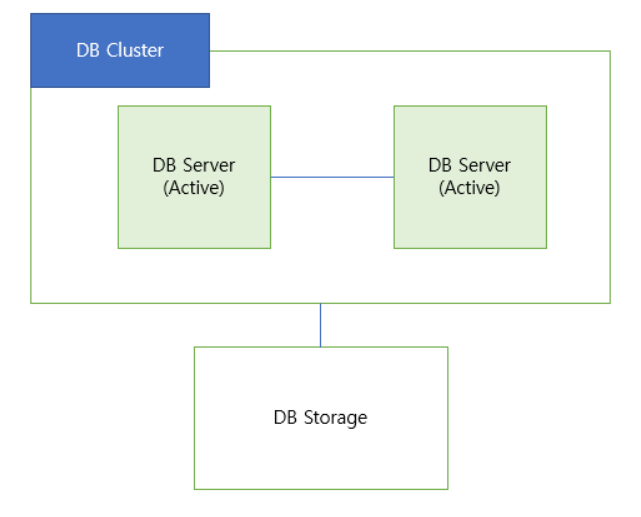
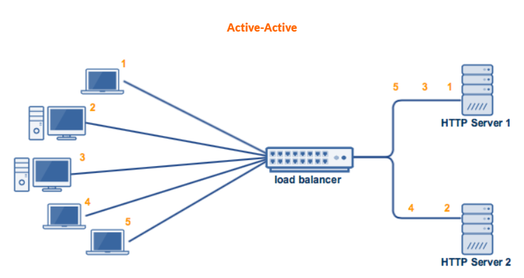
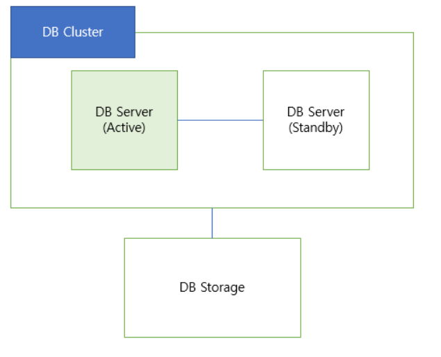

# Database

- [키](#키)

- [SQL - 기초 Query](#sql---기초-query)

- [SQL - JOIN](#JOIN)

- [SQL Injection](#sql-injection)

- [SQL vs NoSQL](#SQLvsNoSQL)

- [Anomaly와 정규화](#anomaly와-정규화)

- [인덱스](#인덱스)

- [트랜잭션](#트랜잭션)

- [트랜잭션 격리 수준](#트랜잭션-격리수준)

- [레디스](#레디스)

- [Hint](#hint)

- [클러스터링](#클러스터링(Clustering))

- [리플리케이션](#리플리케이션(Replication))

- [데이터베이스 튜닝](#데이터베이스-튜닝)

  


# 키
## 정의

  테이블에서 튜플을 구별하는 역할을 하는 속성

## 특성

- 유일성

  한 릴레이션에서 모든 튜플은 서로 다른 키 값을 가져야 한다.
  
- 최소성

  꼭 필요한 최소한의 속성들로만 키를 구성한다.


## 종류

1. 후보키

    유일성과 최소성을 만족하는 키

2. 슈퍼키
   
    유일성을 만족하지만 최소성을 만족하지 못하는 속성
    
4. 기본키
   
    후보키 중에서 기본적으로 사용하기 위해 선택한 키
    
    개체 무결성 제약조건: 기본키를 구성하는 모든 속성은 널 값을 가질 수 없다.
    
5. 대체키
   
    기본키로 선택되지 못한 후보키

7. 외래키
  
    다른 릴레이션의 기본키를 참조하는 속성
    
    참조 무결성 제약조건: 외래키는 참조할 수 없는 값을 가질 수 없다.
    

<br>

----

# SQL - 기초 Query

## SQL이란?
SQL이란 Structed Query Language(구조적 질의 언어)의 줄임말로, **관계형 데이터베이스 관리 시스템(RDBMS)** 의 데이터를 관리하기 위해 설계된 특수 목적의 프로그래밍 언어이다.

관계형 데이터베이스 관리 시스템에서 자료의 검색과 관리, 데이터베이스 스키마 생성과 수정, 데이터베이스 객체 접근 조정 관리를 위해 고안되었다. 

많은 데이터베이스 관련 프로그램들이 SQL을 표준으로 채택하고 있다.

SQL의 구성요소로는 크게 3가지 **데이터 정의어(DDL)**, **데이터 조작어(DML)**, **데이터 제어어(DCL)** 으로 구성된다. 

<br>

**+) 테이블이란?** 

테이블이란 항상 이름을 가지고 있는 리스트로, 데이터가 저장되어있는 공간을 의미한다.

테이블은 **행(ROW)** 과 **열(COLUMN)** 그리고 거기에 대응하는 **값(FIELD)** 으로 구성되어 있다. 

<p align="center">

</p>

<br>

## SQL의 언어적 특성
1. SQL은 대소문자를 가리지 않는다. (단, 서버 환경이나 DBMS 종류에 따라 데이터베이스 또는 필드명에 대해 대소문자를 구분하기도 한다)
2. SQL 명령은 반드시 `세미콜론(;)`으로 끝나야 한다.
3. 고유의 값은 `따옴표(")`로 감싸준다.
   ```sql 
   SELETE * FROM EMP WHERE NAME = 'James';
   ```

4. SQL에서 객체를 나타낼 때는 백틱(\`\`)으로 감싸준다.  
   ```sql 
   SELETE \`COST\`, \`TYPE\` FROM \`INVOIVE\`;
   ```

5. 주석은 일종의 도움말로, 주석 처리된 문장은 프로그램에서 동작하지 않는다. 한 줄 주석은 문장 앞에 `--`를 붙여서 사용한다.
   ```sql 
   -- SELETE * FROM EMP;
   ```

6. 여러 줄 주석은 `/* */`으로 감싸준다.

<br>

## SQL과 일반 프로그래밍 언어의 차이점
<p align="center">

</p>
<br>

## SQL 데이터 종류
1. **int** 

   정수 자료형으로, 예를 들어 물건의 가격, 수량 등을 저장하는 데 사용된다.

   해당 자료형을 통해 -2147483648 ~ 2144483647의 값을 저장할 수 있다.

2. **float** 

   실수 자료형으로, int는 소수점 이하의 부분이 없지만 float는 3.14와 같이 소숫점 이하의 부분까지 저장한다.

   따라서 사람들의 키나 몸무게 등처럼 소숫점 아래까지 저장해야 하는 경우에 사용한다.

3. **char**

   문자열 자료형으로, char(nn)과 같은 방식으로 사용한다. 이 경우 nn글자를 저장하게 된다.

   예를 들어 char(5) 일 경우, 5글자를 저장하며 5글자가 되지 않을 경우 공백을 추가하여 5글자를 맞춘다.

   'elice'와 같이 작은따옴표를 이용해 문자열인 것을 표시한다.

4. **varchar**

   문자열 자료형으로, char과 다른 점은 char의 경우 정해진 글자보다 짧으면 공백을 추가하지만 varchar은 공백을 추가하지 않고 그대로 저장한다.
   
   varchar2와 동의어이다.

5. **date**

   년, 월, 일을 저장하는 날짜 자료형으로, 예를 들어 1945년 8월 15일을 나타내기 위해서는 '1945-08-15'라고 작성한다.

   해당 자료형을 통해 '1001-01-01'~ '9999-12-31'까지 저장할 수 있다.

6. **datetime**

   년, 월, 일, 시, 분, 초까지 저장하는 날짜와 시각 자료형이다.

   예를 들어 1945년 8월 15일 12시 0분 0초를 나타내기 위해서는 '1945-08-15 12:00:00'라고 작성한다.

   해당 자료형을 통해 '1001-01-01 00:00:00'~ '9999-12-31 23:59:59'까지 저장할 수 있다.

7. **time**

   시간, 분, 초를 저장하는 시간 자료형이다.

   예를 들어 10시간 13분 35초를 나타내기 위해서는 '10:13:35'라고 작성한다.

   해당 자료형을 통해 '-838:59:59' ~ '838:59:59'까지 저장할 수 있다.

<br>

## 데이터 정의어(DDL) - CREATE, ALTER, DROP, TRUNCATE문

테이블이나 관계의 구조를 생성하는데 사용하며 CREATE, ALTER, DROP, TRUNCATE문 등이 있다.

### CREATE 문

* 테이블을 구성하고, 속성과 속성에 관한 제약을 정의하며, 기본키 및 외래키를 정의하는 명령이다.

* **PRIMARY KEY** 는 기본키를 정할 때 사용하고, **FOREIGN KEY** 는 외래키를 지정할 때 사용하며, **ON UPDATE** 와 **ON DELETE** 는 외래키 속성의 수정과 튜플 삭제 시 동작을 나타낸다.

* **NOT NULL** (NULL 값을 가질 수 없음), **UNIQUE** (같은 값이 있으면 안됨), **DEFAULT** num(값이 입력되지 않은 경우 기본값 num을 저장) 등 속성에 제약사항을 추가할 수 있다.

``` sql
CREATE TABLE NewBook (
bookname    VARCHAR2(20)   NOT NULL,
publisher    VARCHAR2(20)   UNIQUE,
price    NUMBER   DEFAULT 10000,
PRIMARY KEY (bookname, publisher));
```

<br>

### ALTER 문

* ALTER문은 생성된 테이블의 속성과 속성에 관한 제약을 변경하며, 기본키 및 외래키를 변경한다.

* **ADD, DROP** 은 속성을 추가하거나 제거할 때 사용한다.

* **MODIFY** 는 속성의 기본값을 설정하거나 삭제할 때 이용한다.

``` sql
-- NewBook 테이블에 VARCHAR2(13)의 자료형을 가진 isbn 속성 추가
ALTER TABLE NewBook ADD isbn VARCHAR2(13);

-- NewBook 테이블의 isbn 속성의 데이터 타입을 NUMBER형으로 변경
ALTER TABLE NewBook MODIFY isbn NUMBER;

-- NewBook 테이블의 isbn 속성을 삭제
ALTER TABLE NewBook DROP COLUMN isbn;
```

<br>

### DROP 문

* DROP문은 테이블 자체를 삭제하는 명령이다.

* 테이블의 구조와 데이터를 모두 삭제하므로 사용에 주의해야 함(데이터만 삭제하려면 DELETE)

``` sql
DROP TABLE NewBook;
```

<br>

### TRUNCATE 문

* 테이블에 있는 데이터를 모두 제거하는 명령이다. (한번 삭제시 돌이킬 수 없음.)

``` sql
TRUNCATE TABLE NewBook;
```

<br>

## 데이터 조작어(DML) - SELECT, INSERT, DELETE, UPDATE문

테이블에 데이터를 검색, 삽입, 수정, 삭제하는데 사용하며 SELECT, INSERT, DELETE, UPDATE문 등이 있다.

여기서 SELECT 문은 특별히 Query문(질의어)라고도 한다.

### CRUD란?

Create(생성), Retrieve(검색), Update(수정), Delete(삭제)의 첫 자를 따서 만든 단어이다.

* Create : 데이터베이스 객체 생성

   : INSERT INTO (새로운 레코드 추가)

* Update : 데이터베이스 객체 안의 데이터 수정

   : UPDATE (특정 조건의 레코드의 컬럼 값 수정)

* Delete : 데이터베이스 객체의 데이터 삭제

   : DELETE (특정 조건의 레코드 삭제)

* Retrieve : 데이터베이스 객체 안의 데이터 검색

   : SELETE (조건을 만족하는 레코드를 찾아 특정 컬럼 값(모두 표시하려면 * )을 표시)

<br>

### INSERT 문

* 테이블에 새로운 튜플을 삽입하는 명령으로, 대량삽입(Bulk Insert)란 한번에 여러 개의 튜플을 삽입하는 방법이다.

* **INSERT INTO** 테이블(필드이름1, 필드이름2) **VALUES** (값1, 값2);

``` sql
-- Book 테이블에 새로운 도서 '스포츠 의학' 삽입
INSERT INTO Book(bookid, bookname, publisher)
       VALUES (14, '스포츠 의학', '한솔의학서적');
```

<br>

### UPDATE 문

* UPDATE문은 특정 속성 값을 수정하는 명령이다.

* **UPDATE** 테이블 **SET** 필드이름1=값1, 필드이름2=값2 **WHERE** 조건문;

``` sql
-- Customer 테이블에서 고객번호가 5인 고객의 주소를 '대한민국 부산'으로 변경
UPDATE Customer
SET address='대한민국 부산'
WHERE custid = 5;
```

<br>

### DELETE 문

* DELETE문은 테이블에 있는 기존 튜플을 삭제하는 명령이다.

* **DELETE FROM** 테이블 **WHERE** 조건문;

``` sql
-- Customer 테이블에서 고객번호가 5인 고객 삭제
DELETE FROM Customer
WHERE custid=5;

-- 모든 고객 삭제
DELETE FROM Customer;
```

<br>

### SELETE 문

* 테이블에 저장된 데이터를 검색하는 명령어이다.

* **SELETE** 컬럼명 **FROM** 테이블명 **WHERE** 조건문;

* WHERE절에 조건으로 사용할 수 있는 술어

<p align="center">

</p>

* 집계 함수의 종류 

<p align="center">

</p>

<br>

``` sql
-- 가격이 10,000원 이상 20,000원 이하인 도서 검색
SELETE *
FROM Book
WHERE price BETWEEN 10000 AND 20000;

-- 도서 이름에 '축구가 포함된 출판사 검색
SELETE bookname, publisher
FROM Book
WHERE bookname LIKE '%축구%';

-- 도서를 가격의 내림차순으로 검색, 만약 가격이 같다면 출판사의 오름차순으로 검색
SELETE *
FROM Book
ORDER BY price DESC, publisher ASC;

-- 2번 김연아 고객이 주문한 도서의 총 판매액 구하기
SELETE SUM(saleprice) AS 총매출
FROM Orders
WHERE custid=2;

-- 서점의 도서 판매 건수 구하기
SELECT COUNT(*)
FROM Orders;
```

<br>

## 데이터 제어어(DCL) - GRANT, REVOKE문

데이터 접근을 통제하기 위해 데이터의 사용 권한을 관리하는데 사용하며, GRANT, REVOKE문 등이 있다.

* 권한의 유형과 종류
  
1. 시스템 권한
   
   * CREATE USER : 계정 생성 권한

   * DROP USER : 계정 삭제 권한
   
   * DROP ANY TABLE : 테이블 삭제 권한
   
   * CREATE SESSION : 데이터베이스 접속 권한
   
   * CREATE TABLE : 테이블 생성 권한
   
   * CREATE VIEW : 뷰 생성 권한
   
   * CREATE SEQUENCE : 시퀀스 생성 권한
   
   * CREATE PROCEDURE : 함수 생성 권한

2. 객체 권한
   
   * ALTER : 테이블 변경 권한
   
   * INSERT : 데이터 조작 권한

   * DELETE : 데이터 조작 권한
   
   * SELECT : 데이터 조작 권한
   
   * UPDATE : 데이터 조작 권한
   
   * EXECUTE : PROCEDURE 실행 권한

<br>

### GRANT 문

* 특정 데이터베이스 사용자에게 특정 작업에 대한 수행 권한을 부여한다.

```sql
GRANT 권한1, 권한2 TO 사용자계정;

GRANT 권한1, 권한2 ON 객체명 TO 사용자계정;
```

<br>

### REVOKE 문

* 특정 데이터베이스 사용자에게 특정 작업에 대한 수행 권한을 박탈하거나 회수 한다.

```sql
REVOKE 권한1, 권한2 FROM 사용자계정;

REVOKE 권한1, 권한2 ON 객체명 FROM 사용자계정;
```

<br>

### 트랜잭션 제어 (COMMIT, ROLLBACK, CHECKPOINT문)

안전한 거래를 보장하기 위해, 즉 동시에 다수의 작업을 안전하게 처리하기 위해 사용한다.

* COMMIT : 트랜잭션 확정
* ROLLBACK : 트랜잭션 취소
* CHECKPOINT : 복귀지점 설정

<br>

---

<br>

# JOIN

여러 테이블을 하나의 테이블처럼 논리적으로 연결하여 사용하는 방법

일반적으로, 둘 이상 테이블에서 데이터가 필요한 경우 JOIN을 시도한다.


## JOIN과 집합 연산자의 차이

- 집합 연산자 : 두 개 이상의 SELECT문의 결과 값을 세로로 연결한 것
- JOIN : 두 개 이상의 테이블 데이터를 가로로 연결한 것

<br>

## EQUI JOIN

두 테이블의 특정 열의 값들이 정확하게 일치할 때 이를 기준으로 데이터를 연결하는 방법

- Default Join 방법
- 일반적으로 PK, FK 관계에 의해 JOIN을 시도하지만 일반 컬럼을 기준으로 JOIN을 시도하는 것도 가능
- JOIN하려는 두개 이상 테이블이 동일한 이름의 컬럼을 사용한다면 SELECT 시 반드시 테이블 명을 밝혀야함
- N개의 테이블을 JOIN할 경우 최소 N-1개의 JOIN 조건이 필요함
  
### SQL 형태

> Q. 회사 직원들의 사번, 이름과 함께 해당 직원들이 속한 부서번호와 부서명을 조회한다.
>
> - 직원 테이블의 직원이 속한 부서번호 정보가 담긴 열과 부서 테이블의 부서번호 열을 기준으로 JOIN하면 두 테이블의 부서번호가 동일할 때 직원 정보와 각 부서명을 바로 연결할 수 있다.

```sql
SELECT e.empno, e.ename, e.deptno, d.dname
FROM emp e, dept d
WHERE e.deptno = d.deptno;
```

- 위의 쿼리문과 같이 `=` 연산자를 이용하여 완전히 일치하는 특정 열을 기준으로 조인
- JOIN 조건을 `ON` 절이나 `WHERE` 절에 부여할 수 있음
    - 단, OUTER JOIN을 시도할 경우 여러 조건과 함께 JOIN 조건을 `ON` 절로 부여하는 것과 `WHERE` 절로 부여할 때 결과가 달라지므로 주의

## INNER JOIN

- EQUI JOIN과 함께 Default Join 방법으로 사용됨
- SQL 형태는 EQUI JOIN과 같음

### INNER JOIN과 EQUI JOIN

- EQUI JOIN : `=` 연산자를 이용하여 `ON` 절이나 `WHERE` 절에 조건을 부여하여 JOIN하는 방법
- INNER JOIN : JOIN 조건을 만족하는 행에 대해서만 결과 값이 나오는 JOIN

### INNER JOIN과 OUTER JOIN
- INNER JOIN : 두 테이블의 **교집합**으로 JOIN하는 개념
- OUTER JOIN : 두 테이블의 **합집합**으로 JOIN하는 개념

```python
for x in A : 
    for x in B : 
        if (A.x = B.x) JOIN
```

위와 같이 A 테이블과 B 테이블의 x 열을 기준으로 JOIN을 시도하는 경우

INNER JOIN은 아무리 A 테이블에 x 열이 존재한다고 하더라도 **B 테이블의 x열의 값과 같지 않다면 그 값은 결과에 포함되지 않는다**. 따라서 내부 for문에 해당하는 B 테이블 조건이 결과의 핵심이다.

반면 OUTER JOIN은 A 테이블과 B 테이블의 각각의 **x 열의 값이 같지 않다고 할지라도 외부 for문에 해당하는 A 테이블에 값이 존재한다면 결과에 포함시킨다**. 따라서 외부 for문에 해당하는 A 테이블 조건이 결과의 핵심이다. 만약 외부 for문에 B 테이블을, 내부 for문에 A 테이블을 조건으로 둔다면 결과는 위 경우와 반대로 **외부 for문에 해당하는 B 테이블에 존재하는 값을 기준으로 결과에 포함시킨다**.

<br>

## NON-EQUI JOIN

한 테이블의 열의 값이 다른 테이블 열의 값과 정확히 일치하지 않지만 JOIN을 시도해야하는 경우 사용하는 방법

- EQUI JOIN과 달리 `=` 연산자는 사용할 수 없고(값이 정확히 일치하지 않음), `Between`, `>`, `>=`, `<`, `<=` 등 다른 연산자를 이용해 JOIN 조건을 부여해야 함.

### SQL 형태

> Q. 회사 직원들의 사번, 이름과 함께 해당 직원들의 급여 등급을 조회한다.
>
> - 직원 테이블의 직원 급여 열과 급여등급 테이블의 급여 하한선과 상한선 열들을 **비교하여** JOIN하면 직원의 급여와 급여가 **속하는 범위**의 등급을 연결할 수 있다.

```sql
SELECT e.empno, e.ename, e.salary, s.grade
FROM emp e, salgrade s
WHERE e.salary BETWEEN s.losal AND s.hisal;
```

- 위의 쿼리문과 같이 `=`가 아닌 다른 연산자를 이용하여 연산자 결과 범위에 포함되는 값을 결과로 도출

<br>

## OUTER JOIN

JOIN 조건에 만족하지 않는 레코드를 결과에 포함하고자 할 때 사용하는 JOIN 방법

어느 한쪽 테이블에는 데이터가 존재하는데 다른쪽 테이블에는 해당 데이터가 존재하지 않는 경우 INNER JOIN을 한다면 검색 결과에 누락이 발생할 수 있음

따라서 **합집합**을 구하고자 할 때 사용할 수 있음

### OUTER JOIN 방법

- LEFT [OUTER] JOIN : JOIN 키워드의 왼쪽 테이블을 기준으로 해당 테이블에 속한 데이터는 모두 포함
- RIGHT [OUTER] JOIN : JOIN 키워드의 오른쪽 테이블을 기준으로 해당 테이블에 속한 데이터는 모두 포함
- FULL [OUTER] JOIN : JOIN 키워드의 양쪽 테이블을 기준으로 모든 테이블에 속한 데이터를 포함

### SQL 형태

> Q. 회사 모든 직원들의 사번, 이름과 함께 해당 직원들의 부서명을 조회한다. 단, 아직 부서를 배치받지 못한 직원까지 포함하여 회사의 모든 직원들이 조회되어야 한다.
>
> - 직원 테이블의 부서 번호 열과 부서 테이블의 부서 번호 열의 값이 일치하는 경우를 JOIN한다. 단, 직원 누락이 발생하면 안되므로 **직원 테이블의 모든 데이터가 포함되는 OUTER JOIN**을 한다.

```sql
SELECT e.employee_id, e.last_name, d.department_name
FROM employees e LEFT JOIN departments d
ON e.department_id = d.department_id;
```


- 모든 데이터가 포함되어야하는 테이블의 위치에 따라 LEFT와 RIGHT 조건을 부여하여 사용한다.

<br>

## SELF JOIN

한 테이블의 열을 같은 테이블 내 다른 열과 연결하는 방법으로, 같은 테이블을 2개 이상의 테이블인 것처럼 사용할 수 있음

- 주로 데이터 간 **계층형 관계**를 표현할 수 있을 때 사용
    - ex) 선후배 관계, 상사와 부하 직원 관계, 게시글과 답글 관계 등
- FROM 절 뒤에 동일한 테이블 명을 2번 표현하되, 둘을 구분하기 위해 반드시 **별칭**을 기재해야 함
- 컬럼 역시 어떤 기준 테이블인지 테이블 별칭에 연결하여 표현해야 함

### SQL 형태

> Q. 회사 직원들의 이름과 함께 자신의 상사 번호, 상사 이름, 상사의 직원 번호를 조회한다.
>
> - 직원 테이블의 상사 번호 열과 직원 테이블의 직원 번호 열의 값이 동일한 경우를 JOIN한다.

```sql
SELECT e1.last_name, e1.manager_id, e2.last_name, e2.employee_id
FROM employees e1, employees e2
WHERE e1.manager_id = e2.employee_id;
```


- 동일하지만 서로 다른 목적을 위해 중복된 두 테이블을 구분해야 함. 따라서 별칭을 꼭 지어줘야 함.

<br>

## Cartesian JOIN(Cross JOIN)

- JOIN 조건의 오류로 인해 한 테이블에 있는 모든 레코드가 다른 테이블의 레코드와 JOIN이 되는 경우
- A 테이블 레코드 수가 `a`개, A 테이블 레코드 수가 `b`개라면 카티시안 조인 결과 `a*b`개의 결과가 도출됨.
- 서로 관계가 없는 레코드도 함께 묶여 결과로 출력되므로 필요없는 결과가 중복되거나 지나치게 많은 결과가 출력될 수 있음

### SQL 예제

> Q. 도시명과 나라명을 조회한다.
>
> - 두 테이블의 JOIN 기준 없이 JOIN하므로 레코드의 컬럼 간 의미가 없는 레코드가 저장됨.

```sql
SELECT country_name, city
FROM countries, locations;
```


- 위의 결과 23개의 city 레코드 수와 25개의 country_name 레코드 수가 곱해져 총 575개의 결과가 도출됨.
- 의도적으로 위와 같은 결과를 도출하려는 것이 아니라면, `WHERE`절 혹은 `ON` 절에 JOIN 조건을 명시해야함.

> Q. 각 나라 별 도시를 조회한다.

```sql
SELECT c.country_name, l.city
FROM countries c, locations l
WHERE c.country_id = l.country_id;
```


> Q. 모든 나라의 도시를 조회한다.

```sql
SELECT c.country_name, l.city
FROM locations l RIGHT JOIN countries c
ON c.country_id = l.country_id;
```


<br>

## ANSI JOIN

미국 국립 표준 협회(American National Standards Institute,ANSI)에서 지정한 SQL 문법

### NATURAL JOIN

두 테이블의 JOIN할 열들이 완전히 동일한 필드명(컬럼명)을 가질 경우 해당 열들을 JOIN

- 단, 두 테이블의 열이 같은 필드명을 가지고 있다고 할지라도, **서로 다른 데이터를 포함한 채로 필드명만 동일**할 수도 있으므로 주의하여 사용해야 한다.

#### SQL 형태

> Q. 회사 직원 별 직무를 조회한다.
>
> - 직원 테이블의 직무 번호와 직무 테이블의 직무 번호가 일치하는 경우 JOIN

```sql
SELECT last_name, job_title
FROM employees NATURAL JOIN jobs;
```

<br>

### JOIN ~ USING

두 테이블의 JOIN 기준 열을 USING에 명시하여 JOIN하는 방법

#### SQL 형태

> Q. 회사 직원 별 직무를 조회한다.
>
> - 직원 테이블의 직무 번호와 직무 테이블의 직무 번호가 일치하는 경우 JOIN

```sql
SELECT last_name, job_title
FROM employees JOIN jobs
USING(job_id);
```

<br>

### JOIN ~ ON

두 테이블 간 공통된 이름의 열이 존재하지 않거나, 일반 쿼리 조건인 `WHERE` 절과 구분하기 위해 `ON`절에 기준을 명시하여 JOIN하는 방법

#### OUTER JOIN에서의 WHERE과 ON

> Q. IT 부서에서 일하는 회사 직원들의 이름을 조회한다.
>
> - 직원 테이블의 부서 번호 열과 부서 테이블의 부서 번호 열의 값이 일치하는 경우를 JOIN한다. 단, 직원 누락이 발생하면 안되므로 **직원 테이블의 모든 데이터가 포함되는 OUTER JOIN**을 한다.

```sql
SELECT e.last_name, d.department_name
FROM employees e LEFT JOIN departments d
ON e.department_id = d.department_id
WHERE d.department_name = 'IT';
```


- 위의 쿼리 결과 `WHERE`절로 IT부서 직원들을 필터링 한 뒤, JOIN을 한다.
- 따라서 IT부서 직원들이 아니라면 결과에 포함되지 않는다.

```sql
SELECT e.last_name, d.department_name
FROM employees e LEFT JOIN departments d
ON e.department_id = d.department_id
AND d.department_name = 'IT';
```


- 위의 쿼리 결과 `ON`절을 통째로 기준으로 삼아 JOIN을 한다.
- 따라서 바깥 for문에 해당하는 employees 테이블의 데이터가 안쪽 for문에 해당하는 departments 테이블의 데이터를 하나씩 확인하며 부서 번호가 동일하고 IT부서라면 JOIN으로 관계를 표현하지만, 그렇지 않을 경우에도 **employees 테이블에 속한 데이터면 결과에 포함**한다.

OUTER JOIN 시 `ON`과 `WHERE` 사용에 따라 다른 결과가 나올 수 있으므로 주의해야 한다. 만약 필터링으로 결과 데이터를 축소해야 한다면, 1번 예시처럼 **JOIN 조건은 `ON`에, 필터링 조건은 `WHERE`에 표현**하는 것이 좋다.

<br>

---

<br>


# SQL Injection

## SQL 인젝션이란?

SQL 인젝션은 웹 사이트의 보안상 허점을 이용해 특정 SQL 쿼리문을 전송해 공격자가 원하는 데이터베이스의 중요한 정보를 가져오는 해킹 기법이다.

대부분 클라이언트가 입력한 데이터를 제대로 필터링하지 못하는 경우에 발생한다.

공격의 쉬운 난이도에 비해 피해가 상당하기 때문에 보안 위협 1순위로 불릴만큼 중요한 기법이다.

## SQL 인젝션의 종류와 공격 방법

### Error based SQL Injection

> 논리적 에러를 이용한 SQL 인젝션

가장 많이 쓰이고, 대중적인 공격 기법이다.

```sql
SELECT * FROM Users WHERE id = 'INPUT1' AND password = 'INPUT2'
```

```sql
SELECT * FROM Users WHERE id = ' ' OR 1=1 -- 'AND password = 'INPUT2'
--> SELECT * FROM Users
```

첫번째 쿼리문은 일반적으로 로그인 시 많이 사용되는 SQL 구문이다.

해당 구문에서 입력값에 대한 검증이 없음을 확인하고, 악의적인 사용자가 임의의 SQL 구문을 주입했다.

주인된 내용은 **`' OR 1=1--`** 으로 WHERE 절에 있는 ' 를 닫아주기 위한 ' 와 OR 1=1 라는 구문을 이용해 WHERE절을 모두 참으로 만들고, —를 넣어주어서 뒤의 구문을 주석 처리를 해준 것이다.

매우 간단한 구문이지만 결론적으로 Users 테이블에 있는 모든 정보를 조회하게 됨으로써 가장 먼저 만들어진 계정으로 로그인에 성공하게 된다.

보통 관리자 계정을 맨 처음으로 만들기 때문에 관리자 계정으로 로그인할 수 있게 되며, 악의적인 사용자는 관리자의 권한을 이용해 또 다른 2차피해를 발생시킬 수 있게 된다.

### UNION based SQL Injection

> UNION 명령어를 이용한 SQL 인젝션

UNION은 여러개의 SQL문을 합쳐 하나의 SQL 문으로 만들어주는 방법이다.

정상적인 쿼리문에 Union 키워드를 사용해 인젝션에 성공하면, 원하는 쿼리문을 실행할 수 잇게 된다.

Union Injection을 성공하기 위해서는 두 테이블의 컬럼 수가 같아야 하고, 데이터 형이 같아야 한다는 두 가지의 조건이 있다.

```sql
SELECT * FROM Board WHERE title like '%INPUT%' OR contents like '%INPUT%'
```

```sql
SELECT * FROM Board WHERE title LIKE '% ' 
UNION SELECT null, id, password FROM Users 
-- %' AND contents '% UNION SELECT null, id, password FROM Users -- %'

```

첫번째 쿼리문은 Board라는 테이블에서 게시글을 검색하는 쿼리문이다.

입력값을 title과 content 컬럼의 데이터랑 비교한 뒤 비슷한 글자가 있는 게시글을 출력한다.

여기서 입력값으로 Union 키워드와 함께 컬럼 수를 맞춰서 SELECT 구문을 넣어주게 되면 두 쿼리문이 합쳐져서 하나의 테이블로 보여지게 된다.

현재 인젝션한 구문은 사용자의 id와 password를 요청하는 쿼리문이다.

인젝션이 성공하게 되면, 사용자의 개인정보가 게시글과 함께 화면에 보여지게 된다.

password를 그대로 DB에 저장하지는 않겠지만 인젝션이 가능하다는 점에서 이미 그 이상의 보안위험에 노출되어 있다.

이 공격도 역시 입력값에 대한 검증이 없기 때문에 발생한다.

### Blind SQL Injection

> Boolean based Blind SQL 인젝션

Blind SQL Injection은 데이터베이스로부터 특정한 값이나 데이터를 전달받지 않고 단순히 참과 거짓의 정보만 알 수 있을 때 사용한다.

로그인 폼에 SQL Injection이 가능하다고 가정했을 때, 서버가 응답하는 로그인 성공과 로그인 실패 메시지를 이용해 DB의 테이블 정보 등을 추출한다.

즉, 쿼리를 삽입하였을 때 쿼리의 참과 거짓에 대한 반응을 구분할 수 있을 때 사용되는 기술이다.

```sql
SELECT * FROM Users WHERE id = 'INPUT1' ANS password = 'INPUT2'
```

```sql
SELECT * FROM Users WHERE id = ' abc123' and 
ASCII(SUBSTR((SELECT name FROM information_schema.tables 
WHERE table_type='base table' limit 0,1),1,1)) > 100 --
```

위 쿼리는 Blind Injection을 이용해 DB의 테이블명을 알아내는 방법이다.

인젝션이 가능한 로그인 폼을 통해 악의적인 사용자는 임의로 가입한 abc123이라는 아이디와 함께 뒤의 구문을 주입한다.

해당 구문은 MySQL에서 테이블 명을 조회하는 구문으로 limit 키워드를 통해 하나의 테이블만 조회하고, SUBSTR 함수로 첫 글자만, 그리고 마지막으로 ASCII를 통해 ascii 값으로 변환한다.

만약 조회되는 테이블 명이 Users 라면 'U' 가 조회될 것이고, 뒤의 100이라는 숫자와 값을 비교하게 된다.

거짓이면 로그인 실패, 참이 될 때까지 뒤의 100이라는 숫자를 변경해가면서 비교한다.

참이 나오는 것을 통해 단기간 내에 테이블 명을 알아낼 수 있다.

> Time based SQL

어떤 경우에는 응답의 결과가 항상 동일해 해당 결과만으로 참과 거짓을 판별할 수 없는 경우가 있을 수 있다.

이런 경우 시간을 지연시키는 쿼리를 주입(Injection)하여 응답 시간의 차이로 참과 거짓 여부를 판별할 수 있다.

사용되는 함수는 MySQL 기준 SLEEP 과 BENCHMARK 이다.

```sql
SELECT * FROM Users WHERE id = 'INPUT1' AND password = 'INPUT2'
```

```sql
SELECT * FROM Users WHERE id = ' abc123' OR 
(LENGTH(DATABASE())=1 AND SLEEP(2)) 
-- ' AND password = 'INPUT2'
```

위 쿼리문은 Time based SQL Injection을 사용해 현재 사용하고 있는 데이터베이스의 길이를 알아내는 방법이다.

로그인 폼에 주입되었으며 임의로 abc123이라는 계정을 생성한다.

악의적인 사용자가 해당 구문을 주입하면, LENGH 함수는 문자열의 길이를 반환하고, DATABASE 함수는 데이터베이스의 이름을 반환한다.

주입된 구문에서, LENGTH(DATABASE()) = 1 가 참이면 SLEEP(2) 가 동작하고, 거짓이면 동작하지 않는다.

이를 통해 숫자 1 부분을 조작해 데이터베이스의 길이를 알 수 있다.

만약 SLEEP 이라는 단어가 치환 처리되었다면, 다른 방법으로 BENCHMARK 나 WAIT 함수를 사용할 수 있다.

### Stored Procedure SQL Injection

> 저장된 프로시저에서의 SQL Injection

저장 프로시저(Stored Procedure)은 일련의 쿼리들을 모아 하나의 함수처럼 사용하기 위한 것이다.

공격에 사용되는 대표적인 저장 프로시저는 MS-SQL에 있는 xp_cmdshell로 윈도우 명령어를 사용할 수 있게 된다.

단, 공격자가 시스템 권한을 획득해야 하므로 공격난이도가 높으나 공격에 성공한다면 서버에 직접적인 피해를 입힐 수 있는 공격이다.

### Mass SQL Injection

> 다량의 SQL Injection 공격

기존 SQL Injection과 달리 한번의 공격으로 다량의 데이터베이스가 조작되어 큰 피해를 입히는 것을 의미한다.

보통 MS-SQL을 사용하는 ASP 기반 웹 애플리케이션에서 많이 사용되며, 쿼리문은 HEX 인코딩 방식으로 인코딩해 공격한다.

보통 데이터베이스 값을 변조해 데이터베이스에 악성스크립트를 삽입하고, 사용자들이 변조된 사이트에 접속 시 좀비 PC로 감염되게 한다.

이렇게 감염된 좀비 PC들은 DDos 공격에 사용된다.

## SQL 인젝션 대응방안

### 입력 값에 대한 검증

SQL Injection에 사용되는 기법과 키워드는 엄청 많다.

따라서 사용자의 입력 값에 대한 검증이 필요하다.

서버 단에서 화이트리스트를 기반으로 검증해야 하며, 블랙리스트를 기반으로 검증하게 되면 차단리스트를 많이 등록해야 하고, 하나라도 빠지면 공격에 성공하게 된다.

공백으로 치환하는 방법도 많이 쓰이는데, 이 방법도 취약한 방법이다.

예시로 SE**SELECT**LECT 라고 입력 시 중간의 SELECT가 공백으로 치환되면 SELECT 라는 키워드가 완성된다.

공백 대신 공격 키워드와를 의미 없는 단어로 치환되어야 한다.

### Prepared Statement 구문 사용

Prepared Statement 구문을 사용하게 되면, 사용자의 입력 값이 데이터베이스의 파라미터로 들어가기 전 DBMS가 미리 컴파일하여 실행하지 않고 대기한다.

그 후 사용자의 입력 값을 문자열로 인식하여 공격쿼리가 들어간다고 해도, 사용자의 입력은 이미 의미 없는 단순 문자열이기 때문에 전체 쿼리문도 공격자의 의도대로 작동하지 않는다.

### Error Message 노출 금지

공격자가 SQL Injection을 수행하기 위해서는 데이터베이스의 정보(테이블, 컬럼 명)가 필요하다.

데이터베이스 에러 발생 시 따로 처리하지 않는다면, 에러가 발생한 쿼리문과 함께 에러에 관한 내용을 반환해주기 때문에 공격자에게는 힌트가 될 수 있다.

따라서 데이터베이스에 대한 오류가 발생할 때는 사용자에게 보여줄 수 있는 페이지를 제작하거나 메시지박스를 띄우도록 해야 한다.

### 웹 방화벽 사용

웹 공격 방어에 특화되어있는 웹 방화벽을 사용하는 것도 하나의 방법이다.

웹 방화벽은 소프트웨어형, 하드웨어형, 프록시형 세 가지 종류로 나눌 수 있다.

소프트웨어형은 서버 내에 직접 설치하는 방법이고, 하드웨어형은 네트워크 상에서 서버 앞 단에 직접 하드웨어 장비로 구성하는 것이며 마지막으로 프록시형은 DNS 서버 주소를 웹 방화벽으로 바꾸고 서버로 가는 트래픽이 웹 방화벽을 먼저 거치도록 하는 방법이다.

----

<br>

# SQLvsNoSQL

### [SQL (Structured Query Language) ]
SQL은 RDBMS (관계형 데이터베이스 관리 시스템)의 데이터를 관리하기 위해 설계된 프로그래밍 언어입니다.  SQL의 예시로는 *MySQL, PostgreSQL* 등이 있습니다.
> 이 글에서는 SQL을 곧 RDBMS (관계형 데이터베이스) 로 사용함

### [NoSQL (Not Only Structured Query Language) ]
NoSQL은 앞서 말한 SQL보다 덜 제한적인 모델을 이용해 데이터의 저장 및 검색 메커니즘을 제공합니다. NoSQL의 예시로는 *mongoDB, redis* 등이 있습니다.

## 데이터의 구조 (Structure)

### [SQL]

###### 출처 : https://siyoon210.tistory.com/130

SQL에서는 엄격한 스키마(데이터 저장 구조)를 원칙으로 하기 때문에 **스키마를 준수하지 않는 형식의 데이터는 저장할 수 없습니다.**

### [NoSQL]

###### 출처 : https://siyoon210.tistory.com/130
NoSQL에서는 정해진 스키마가 없습니다. SQL에서는 정해진 스키마를 따르지 않는다면 데이터를 추가할 수 없었지만, **NoSQL에서는 다른 구조의 데이터를 같은 컬렉션에 추가할 수 있습니다.**

> NoSQL에서는 레코드를 document,  테이블을 Collection이라고 부릅니다.


## 데이터의 관계 (Relationship)

### [ SQL ]

###### 출처 : https://mjmjmj98.tistory.com/43

데이터들을 여러개의 테이블에 나누어서, 데이터들의 중복을 피할 수 있습니다. 

만약 사용자가 구입한 상품들을 나타내기 위해서는, Customers(사용자), Products(상품), Orders(주문한 상품) 여러 테이블을 만들어야 하지만, 각각의 테이블들은 다른 테이블에 저장되지 않은 데이터를 가지고 있습니다. (중복된 데이터가 없습니다.)

이런 명확한 구조는 장점이 있습니다. **하나의 테이블에서 중복없이 하나의 데이터만을 관리하기 때문에, 다른 테이블에서 부정확한 데이터를 다룰 위험이 없습니다.**


### [ NoSQL ]

###### 출처 : https://mjmjmj98.tistory.com/43
반면 NoSQL에서는 보통 하나의 컬렉션(SQL에서의 테이블)에 관련 데이터를 모두 작성합니다. 

일반적으로 관련 데이터를 동일한 컬렉션에 넣습니다. (RDBMS처럼 여러 테이블에 나누어 담지 않습니다.) 많은 Order(주문한 상품)이 있는 경우, 일반적인 정보를 모두 포함한 데이터를 Orders 컬렉션에 저장합니다. (즉, 관계형데이터 베이스에서 사용했던 Users나 Products 정보 또한 Orders에 포함해서 한꺼번에 저장됩니다.)

따라서 **여러 테이블 / 컬렉션에 조인할 필요없이 이미 필요한 모든 것을 갖춘 문서를 작성하게 됩니다.** (실제로 NoSQL DB에는 조인이라는 개념이 존재하지 않습니다.) 대신 컬렉션을 통해 데이터를 복제하여 각 컬렉션 일부분에 속하는 데이터를 정확하게 산출하도록 합니다.

이런 방식은 SQL과 다르게 중복된 데이터가 생기게 됩니다. 그래서 데이터를 업데이트 할 때마다 주의해야 합니다. (예를 들어 Customer에 John의 email을 추가했는데, Orders에는 이를 업데이트하지 않으면 문제가 발생합니다.)


## 데이터의 확장성 (Scalability)
두 종류의 데이터베이스를 비교할 때 살펴 봐야할 또 하나의 중요한 개념은 **확장(Scaling)** 입니다. (데이터베이스 서버의 확장성)

확장은 **수직적(vertical) 확장**과 **수평적(horizontal) 확장**으로 구별할 수 있습니다. 
- 수직적 확장이란 단순히 데이터베이스 서버의 성능을 향상시키는 것입니다. 
- 반면에 수평적 확장은 더 많은 서버가 추가되고 데이터베이스가 전체적으로 분산됨을 의미합니다. 

### [ SQL(vertical scale)]
데이터가 저장되는 방식 때문에 SQL은 일반적으로 수직적 확장만을 지원합니다.

### [NoSQL(horizontal scale)]
반면에 NoSQL에서는 수평적 확장이 가능합니다.


## SQL vs NoSQL 장단점

### [SQL]
#### 장점
- 명확하게 정의된 스키마, **데이터의 무결성 보장**
- 데이터의 관계 덕분에 데이터는 중복없이 한 번만 저장됩니다.

#### 단점
- 상대적으로 덜 유연합니다. **데이터 스키마는 사전에 계획**되어야 합니다. (나중에 수정하기가 번거롭거나 불가능 할 수도 있음)
- 관계를 맺고 있기 때문에 **JOIN문이 많은 매우 복잡한 쿼리**가 만들어 질 수 있습니다.
- 수평적 확장이 어렵고, 대체로 수직적 확장만 가능합니다. 즉 어떤 시점에서 (처리할 수 있는 처리량 관련하여) 성장 한계에 직면하게 됩니다.


### [NoSQL]
#### 장점
- 스키마가 없기때문에, 훨씬 더 **유연합니다.** 즉, 언제든지 저장된 데이터를 조정하고 새로운 "필드"를 추가 할 수 있습니다.
- 데이터는 애플리케이션이 필요로 하는 형식으로 저장됩니다. 이렇게 하면 **데이터를 읽어오는 속도가 빨라집니다.**
- 수직 및 수평 확장이 가능하므로 데이터베이스가 애플리케이션에서 발생시키는 모든 읽기 / 쓰기 요청을 처리 할 수 있습니다.

#### 단점
- 유연성 때문에, 데이터 구조 결정을 하지 못하고 미루게 될 수 있습니다.
- 일반적인 정보를 모두 포함한 데이터를 컬렉션에(SQL 처럼 하나의 테이블에 하나의 레코드가 아니라) 넣기 때문에 데이터 중복이 발생할 수 있습니다.
- 데이터가 여러 컬렉션에 중복되어 있기 때문에, **수정(update)를 해야 하는 경우 모든 컬렉션에서 수행**해야 합니다. (SQL에서는 중복된 데이터가 없기 때문에 한번만 수행하면 됩니다.)

## SQL vs NoSQL의 선택
SQL과 NoSQL을 적당하게 선택하기 위해서는 **어떤 데이터를 다루는지**, **어떤 어플리케이션에 사용되는지**를 고려해야 합니다.

### [SQL]
- 관계를 맺고 있는 **데이터가 자주 변경(수정)** 되는 애플리케이션일 경우 
- **변경될 여지가 없고, 명확한 스키마**가 사용자와 데이터에게 중요한 경우

### [NoSQL]
- **정확한 데이터 구조를 알 수 없거나 변경 / 확장** 될 수 있는 경우
- **읽기(read)처리를 자주**하지만, 데이터를 자주 변경(update)하지 않는 경우 (즉, 한번의 변경으로 수십 개의 문서를 업데이트 할 필요가 없는 경우)
- 데이터베이스를 수평으로 확장해야 하는 경우 ( 즉, 막대한 양의 데이터를 다뤄야 하는 경우)


<br>
<br>
<br>


# Anomaly와 정규화

<br>


## 데이터 이상(Anomaly)

잘못된 데이터베이스 설계로 인해 데이터들의 불필요한 중복이 발생할 수 있다. 테이블에서 일부 속성들이 종속으로 인해 데이터의 중복이 발생하고,  테이블 조작 시 문제가 발생하는 현상을 **데이터 이상(Anomaly)** 이라고 한다. 이상의 종류에는 3가지가 있다.

- 삽입 이상(Insertion Anomaly)

- 삭제 이상(Deletion Anomaly)

- 갱신 이상(Update Anomaly)

  <br>
  <br>

  <br>


###  삽입 이상(Insertion Anomaly)

테이블에 새로운 데이터를 삽입할 때 불필요한 데이터도 함께 삽입해야 하는 이상. 즉, 일부 데이터만 삽입하고 싶어도 입력을 원치 않는 다른 데이터까지 함께 삽입해야 하는 현상을 뜻한다.
  <br>

<p align="center">
 </p>


 <br>

<p align="center">
 </p>


위와 같이 (학번, 수강과목)이 PK인 테이블을 가정해보자. 

이때 수강과목은 정하지 않고 '엘싸'라는 학생 정보만 저장하고 싶어도 (학번, 수강과목)이 PK이기 때문에 수강과목 데이터를 비워둘 수 없다. 따라서 학생 정보만 삽입하기를 원해도 수강과목이라는 원치 않는 데이터까지 함께 삽입해야 한다.

  <br>
  <br>

### 삭제 이상(Insertion Anomaly)

테이블에서 한 튜플을 삭제할 때 연쇄적으로 삭제가 발생하는 이상. 즉, 삭제를 원치 않는 데이터들까지 함께 삭제되는 현상을 뜻한다.

 <br>

<p align="center">
 </p>


위 테이블에서 학번이 400, 수강과목 6번인 6행 데이터는 삭제하더라도 큰 문제가 없다. 하지만 학번이 200, 수강과목 2번인 2행 데이터를 삭제하게 되면 '다빈슨'이라는 학생의 정보까지 테이블 상에서 모두 사라지게 된다. 

  <br>
  <br>

### 갱신 이상(Insertion Anomaly)

튜플의 속성 값을 갱신할 때 일부 튜플들만 수정하여 데이터들 간에 불일치가 발생하는 이상. 

 <br>

<p align="center">
 </p>


'하로롱'이라는 학생의 학부가 오락부로 바뀌었다고 가정해보자. 이때 미처 다른 튜플에 있는 정보를 수정하지 못한다면 '하로롱' 학생의 학부 정보 간의 불일치가 발생하게 된다.


  <br>
  <br>
  <br>

---

  <br>

## 정규화(Normalization)

데이터 이상 방지를 위해 테이블 속성들 사이의 종속적인 관계를 고려하여 테이블을 무손실 분해하는 과정이다. 

> 1NF, 2NF, 3NF, BCNF, 4NF, 5NF, 6NF까지 총 7개의 정규형이 있다. 

비공식적으로는 3NF가 되었으면 정규화되었다고 말할 수 있으며, 실제 현업에서도 제 3NF 정도까지만 수행하고 속도, 튜딩 등 필요에 따라 비정규화(Denormalization) 과정을 수행하기도 한다.


<br>

  <br>

### 함수적 종속(Functional Dependency)

어떤 릴레이션 R이 있고 X, Y는 각각 그 부분집합이다. 이 때 X의 값을 알면 Y를 바로 식별할 수 있다면 Y는 X에 **함수적 종속**이고 X를 결정자, Y를 종속자라고 부른다.

> ex) X : (학번, 수강과목) -> Y : (성적, 이름, 학부, 등록금),  X : (학번) -> Y : (이름, 학부, 등록금)

 <br>

<p align="center">
 </p>


1. #### 완전 함수적 종속

   결정자 X, 종속자 Y가 있을 때 Y가 X의 일부에는 함수적 종속이지 않은 관계

   > ex) X : (학번, 수강과목) -> Y1 : (성적), Y2: (이름, 학부)
   >
   > Y1 성적은 X의 일부인 학번, 수강과목 각각에 대해서는 종속적이지 않다. 완전함수종속 O
   >
   > 반면, Y2 (이름, 학부)는 X의 일부인 (학번)에 대해서도 종속적이다. 완전함수종속 X

   

2. #### 부분 함수적 종속

   Y가 X에 종속이면서 X의 일부에도 함수적 종속인 관계

   > 위 예에서 Y2는 X에 부분 함수적 종속이다.

   

3. #### 이행적 함수 종속

   X, Y, Z 3개의 속성 집합이 있다. Y가 X에 종속이고 Z가 Y에 종속 즉,  X -> Y이고 Y -> Z인 관계를 가질 때 X -> Z인 관계도 성립한다. 이 때 Z는 X에 이행 함수적 종속이다. 

   > ex) X : (학번), Y : (학부), Z : (등록금) 이 때 (학번) -> (학부) -> (등록금)의 관계를 가지므로 Z는 X에 이행 함수적 종속이다.


<br>
<br>


### 제  1정규형(1NF)

모든 속성의 도메인이 원자값만으로 되어 있는 정규형이다. 테이블의 **모든 속성값들은 반드시 하나의 값만** 가져야 한다.

 <br>

<p align="center">
 </p>


위 테이블에서 수강과목 값이 여러 개를 포함하는 튜플이 존재하므로 이를 각각 분리하여 저장한다.

1NF를 만족하더라도 데이터 이상은 여전히 발생할 수 있다.

<br>
<br>

### 제  2정규형(2NF)

테이블이 1NF를 만족하고, 기본키(Primary Key)를 제외한 **모든 속성이 기본키에 대해 완전 함수적 종속을 만족하는** 정규형이다. 

 <br>

<p align="center">
 </p>


위 테이블에서 (이름, 학부, 등록금) 속성은 기본키 (학번, 수강과목)의 일부인 (학번)에도 종속이므로 부분 함수적 종속인 관계이다. 이때 테이블을 쪼갬으로써 부분 함수적 종속을 제거할 수 있다.

2NF를 만족하더라도 데이터 이상은 여전히 발생할 수 있다. 

<br>
<br>


### 제  3정규형(3NF)

테이블이 2NF를 만족하고 기본키(Primary Key)를 제외한 **모든 속성이 기본키에 대해 이행 함수적 종속을 만족하지 않는** 정규형이다. 

 <br>

<p align="center">
 </p>


위 테이블에서 (학번) -> (이름, 학부), (학부) -> (등록금) 관계를 만족하므로 (등록금) 속성은 기본키에 대해 이행 함수적 종속을 만족한다. 이때 테이블을 쪼갬으로써 이행 함수적 종속을 제거할 수 있다.

---

<br>


# 인덱스

## 정의
테이블에 대한 동작속도를 높이는 기술로 데이터베이스 조회 기능 성능을 높인다.

인덱스를 이용하면 Full Scan과 Table Scan을 줄이거나 없애서 속도를 높인다.

Full Scan 시 시간복잡도 - O(N)

인덱스 사용 시 시간복잡도 - O(logN)

테이블의 컬럼의 색인화가 일어나서 인덱스를 관리하는 파일(MYI)에서 따로 컬럼을 관리한다.

> ### 테이블 생성 시, 3개의 파일이 만들어진다.
> - MYI: 인덱스 관리 파일
> - MYD: 실제 데이터 관리 파일
> - FRM: 테이블 구조에 관한 파일
>
> 인덱스를 생성하지 않으면 MYI는 <b>빈 파일(empty)</b>이다.
> 
> MYI는 Key-RowId의 구조를 가진다. 
> 
> - Key: 인덱스로 생성한 컬럼의 값
> - RowId: 데이터가 저장된 주소 값

## 인덱스를 사용하면 좋을 상황

- SELECT와 Join이 잦은 경우
- 테이블의 데이터가 많은 경우
- SELECT를 제외한 DML(=변경)이 잘 일어나지 않는 테이블

## DML이 일어날 때 인덱스의 변화

### 1. INSERT

데이터 추가 시, 새로운 인덱스 추가

### 2. DELETE

데이터 삭제 시, 해당 인덱스가 삭제되는 대신 사용하지 않는다는 표시를 남긴다.

-> Table의 레코드 개수와 Index 개수가 달라진다.

### 3. Update

<b>DELETE + INSERT</b>

UPDATE 기능이 따로 있지 않고 DELETE 수행 후 INSERT가 일어난다.

-> 작업이 두 번 일어난다.

## 인덱스 생성
```MySQL
-- 생성 방식 2가지
-- CREATE 이용
CREATE INDEX 인덱스명 ON 테이블명(컬럼명);

-- ALTER 이용
ALTER TABLE 테이블명 ADD INDEX 인덱스명(컬럼명);
```

## 인덱스 조회
```MySQL
SHOW INDEX FROM 테이블명;
```

## 인덱스 삭제
```MySQL
ALTER TABLE 테이블명 DROP INDEX 인덱스명(컬럼명);
```
## 장점

인덱스 파일은 항상 정렬된 상태이다.

1) 원하는 데이터를 찾기 위해 테이블을 검색하는 작업을 줄이거나 없앨 수 있다.
2) 색인화된 인덱스 파일 검색으로 검색 속도를 향상시킨다.

> ### 색인화
> 특정 내용이 들어있는 정보를 쉽게 찾아볼 수 있도록 표지를 넣거나 일정한 순서에 따라 배열한 것

## 단점

테이블에 새로운 데이터를 추가하거나 갱신, 삭제가 자주 일어나면 좋지 않다.

테이블에 들어있는 데이터에만 변화가 있는 게 아니라 인덱스에도 추가, 갱신이 일어나기 때문에 오버헤드가 발생할 수 있다.

<br>
<hr>


# 트랜잭션
## 트랜잭션이란?

**데이터 베이스의 상태를 변경하는 하나의 논리적 기능을 수행하기 위한 작업의 단위**입니다. 쉽게 말해 한꺼번에 수행되어야 할 연산을 모아놓은 것이라고 할 수 있습니다. 데이터 베이스는 항상 정확하고 일관된 데이터를 유지해야하는데 트랜잭션은 이러한 성질을 유지할 수 있게 도와주는 역할을 합니다.

트랜잭션은 DB 서버에 여러 개의 클라이언트가 동시에 액세스 하거나 응용프로그램이 갱신을 처리하는 과정에서 중단될 수 있는 경우 등 데이터 부정합을 방지하고자 할 때 사용합니다. 부정합이 발생하지 않으려면 프로세스를 병렬로 처리하지 않도록 하여 한 번에 하나의 프로세스만 처리하도록 하면 되는데, 이는 효율이 너무 떨어집니다. 즉, 병렬로 처리할 수 밖에 없는 현실적인 상황으로 인해 부정합을 방지하고자 트랜잭션을 사용하는 것입니다.

트랜잭션의 중요성은 금융 소프트웨어에서 두드러지게 나타납니다. 예를 들어 A가 B에게 100만원을 송금한다고 합시다. 이러한 작업은 다음과 같은 순서로 이루어 집니다.

1. A의 계좌에서 100만원을 뺀다.
2. B의 계좌에 100만원을 더한다.

이때 1번 작업이 완료된 후 2번작업이 시작되기 전에 오류가 발생하여 시스템이 멈추게 된다면 100만원이 증발해버리는 일이 발생합니다. 따라서 이러한 작업을 수행할때는 1,2번 작업을 트랜잭션으로 묶어서 한번에 1,2번 작업이 처리되거나 오류가 발생하면 진행했던 모든 작업을 되돌려야 합니다.

## 트랜잭션의 특성

트랜잭션이 성공적으로 처리되어 데이터베이스의 무결성과 일관성을 보장하려면 4가지 특성을 만족해야 합니다. 트랜잭션의 특성을 흔히 ACID라고 합니다.

- **Atomicity (원자성)**
- **Consistency (일관성)**
- **Isolation (격리성)**
- **Durability (지속성)**

1. **Atomic (원자성)**
   - 트랜잭션을 구성하는 연산들은 데이터베이스에 모두 반영되거나 반영되지 않아야함을 의미.(all or nothing)
   - 트랜잭션 수행과정에서 오류가 발생하여 작업이 완료되지 못하면 트랜잭션 시작전 상태로 데이터베이스를 되돌려야 함.
2. **Consistency (일관성)**
   - 트랜잭션이 성공적으로 수행된 후에도 데이터베이스가 일관성 있는 상태를 유지해야함을 의미
   - 시스템이 가지고 있는 고정요소는 트랜잭션 수행 전과 트랜잭션 수행 완료 후의 상태가 같아야 함.
   - 데이터베이스의 제약조건을 위배하는 작업을 트랜잭션과정에서 수행할 수 없음을 나타냄
   - 예시: 송금 예제에서 금액의 데이터 타입을 정수형(integer)에서 문자열(string)로 변경할 수 없음
3. **Isolation (격리성)**
   - 둘 이상의 트랜잭션이 동시에 병행 실행되는 경우 현재 수행중인 트랜잭션 실행 도중 다른 트랜잭션의 연산이 끼어들 수 없음을 의미
   - 예시: A->B로 송금 과정에서 다른 트랜잭션이 B에게로 송금할 수 없음
4. **Durability (지속성)**
   - 트랜잭션이 성공적으로 완료된 이후 데이터베이스에 반영한 수행 결과는 손실되지 않고 영구적으로 유지되어야 함을 의미

- +추가: ACID는 이론적으로 트랜잭션이 보장해야할 특성입니다. 실제로는 모든 규칙을 지킬 경우 성능상 속도 저하가 생길 수 있어 트랜잭션 격리 수준을 조정합니다.

## 트랜잭션의 연산

**1. COMMIT 연산**

- **트랜잭션이 성공적으로 수행되었음을 선언하는 연산**
- commit 연산의 실행을 통해 트랜잭션의 수행이 성공적으로 완료되었음을 선언하고 결과를 최종 데이터베이스에 반영.

**2. ROLLBACK 연산**

- **트랜잭션이 수행을 실패했음을 선언하고 작업울 취소하는 연산**
- 트랜잭션 수행되는 도중 일부 연산이 처리되지 못한 상황에서는 rollback 연산을 실행하여 트랜잭션의 수행이 실패했음을 선언하고, 데이터베이스를 트랜잭션 수행 전의 일관된 상태로 되돌려야 함.

## 트랜잭션의 상태


- 활동 상태
  - 트랜잭션이 수행을 시작하여 현재 수행 중인 상태.
- 부분 완료 상태
  - 트랜잭션의 마지막 연산까지 실행했지만, Commit 연산이 실행되기 직전의 상태
- 완료 상태
  - 트랜잭션이 성공적으로 완료되어 commit 연산을 실행한 완료 상태.
- 실패 상태
  - 장애가 발생하여 트랜잭션의 수행이 중단된 상태.
- 철회 상태
  - 수행이 실패하여 rollback 연산을 실행한 상태.

## 병행제어
병행제어란 여러개의 트랜잭션이 실행될 때 트랜잭션들이 데이터베이스의 일관성을 파괴하지 않고 다른 트랜잭션에 영향을 주지 않으면서 트랜잭션을 제어하는 것을 의미합니다.

### 병행 실행시 발생 가능한 문제들
-  **분실된 갱신**: 두 개의 트랜잭션이 같은 데이터에 대해서 동시에 갱신 작업을 하면 하나의 갱신 작업이 분실되는 경
- **모순성**: 한 개의 트랜잭션 작업이 갱신 작업을 하고 있는 상태에서 또 하나의 트랜잭션이 같은 작업 구역에 침범하여 작업하게 되어 데이터베이스의 일관성을 해치는 경우
- **연쇄복귀**: 같은 자원을 사용하는 두개의 트랜잭션 중 한 개의 트랜잭션이 성공적으로 일을 수행하였다 하더라도 다른 트랜잭션이 처리하는 과정에서 실패하게 되면 두 개의 트랜잭션 모두가 복귀되는 현상
- **비완료 의존성**: 한 개의 트랜잭션이 수행과정에서 실패하였을 때, 이 트랜잭션이 회복되기 전에 다른 트랜잭션이 수행 결과를 참조하는 현상

### 병행제어 기법
1. 로킹(Locking)

트랜잭션이 어떤 데이터에 접근하고자 할 때 로킹을 수행하며 로킹을 한 트랜잭션만이 로킹을 해제할 수 있음. 트랜잭션은 로킹이 된 데이터에 대해서만 연산을 수행할 수 있으며 로킹의 단위에는 필드, 레코드, 파일, 데이터베이스 모두 로킹이 될 수 있음

- 로킹 단위가 크면 : 관리하기가 용이(로킹 오버헤드 감소), 하지만 동시성 수준이 낮아짐
- 로킹 단위가 작으면 : 동시성 수준이 높아지지만 관리가 까다로움(로킹 오버헤드 증가)

 - 2단계 로킹 규약(Two-Phase Locking Protocol)
Lock과 Unlock이 동시에 이루어지면 일관성이 보장되지 않으므로 Lock만 가능한 단계와 Unlock만 가능한 단계를 구분하며 직렬가능성을 보장함, 하지만 교착상태가 발생할 수 있음.
    - 확장단계 : 트랜잭션이 Lock만 할 수 있고 Unlock은 할 수 없음
    - 축소단계 : 트랜잭션이 Unlock만 할 수 있고 Lock은 할 수 없음
    - 예시) T1 : write(A) read(B), T2 : read(B) write(A) => dead lock 발생!

- 로킹의 종류
    - S-lock(공유잠금)
        - 공유잠금을 설정한 트랜잭션은 데이터 항목에 대해 읽기 연산(read)만 가능
        - 하나의 데이터 항목에 대해 여러 개의 공유잠금이(S-lock) 가능
        - 다른 트랜잭션도 읽기 연산(read) 만을 실행
    - X-lock(배타잠금):
        - 배타잠금을 설정한 트랜잭션은 데이터 항목에 대해서 읽기 연산(read)과 쓰기 연산(write) 모두 가능
        - 하나의 데이터 항목에 대해서는 하나의 배타잠금(X-lock)만 가능
        - 다른 트랜잭션은 읽기 연산(read)와 쓰기 연산(write) 모두 불가능

2. 타임스탬프(Time Stamp)
데이터에 접근하는 시간을 미리 정하여 정해진 시간의 순서대로 데이터에 접근하며 수행함, 직렬가능성을 보장하며 시간을 나눠 사용하기 때문에교착상태가 발생하지 않음, 하지만 연쇄복귀를 초래할 수 있음.

3. 낙관적 병행제어(Optimistic Concurrency Control)
트랜잭션 수행 동안은 어떠한 검사도 하지 않고, 트랜잭션 종료 시에 일괄적으로 검사함, 트랜잭션 수행 동안 그 트랜잭션을 위해 유지되는 데이터 항복의 지역사본에 대해서만 갱신하며 트랜잭션 종료 시에 동시성을 위한 트랜잭션 직렬화가 검증되면 일시에 DB로 반영함

4. 다중 버전 병행제어(Multi-version Concurrency Control)
하나의 데이터 아이템에 대해 여러 버전의 값을 유지하며 조회성능을 최대한 유지하기 위한 기법, 트랜잭션 간의 충돌 문제는 대기가 아니라 복귀처리 함으로 연쇄복귀초래 발생 가능성이 있음
<hr>

# 트랜잭션 격리수준
## 트랜잭션 격리수준(isolation level)이란?
트랜잭션의 네 가지 주요 성질인 원자성, 일관성, 고립성, 내구성 (ACID) 중 **고립성(isolation)** 을 구현하는 개념이다.

  * 고립성은 한 트랜잭션에서 데이터가 수정되는 과정이 다른 트랜잭션과는 독립적으로 진행되어야 한다는 특성이다.

**트랜잭션 격리수준(isolation level)** 이란 동시에 여러 트랜잭션이 처리될 때, 트랜잭션끼리 얼마나 서로 고립되어 있는지를 나타내는 것이다.

즉, 간단하게 말해 특정 트랜잭션이 다른 트랜잭션에 변경한 데이터를 볼 수 있도록 허용할지 말지를 결정하는 것이다.

<br>

격리수준은 크게 아래의 4개로 나뉜다.

* READ UNCOMMITTED
* READ COMMITTED
* REPEATABLE READ
* SERIALIZABLE

<br>

아래로 내려갈수록 트랜잭션 간 고립 정도가 높아지며, 성능이 떨어지는 것이 일반적이다.

일반적인 온라인 서비스에서는 `READ COMMITTED`나 `REPEATABLE READ` 중 하나를 사용한다.

(oracle의 기본 격리수준 = READ COMMITTED, mysql의 기본 격리수준 = REPEATABLE READ)

<br>

## 트랜잭션 격리수준의 종류
### READ UNCOMMITTED (레벨 0) - 커밋되지 않는 읽기
* 각 트랜잭션에서의 변경 내용이 `COMMIT`이나 `ROLLBACK` 여부에 상관 없이 다른 트랜잭션에서 값을 읽을 수 있다.
* 정합성에 문제가 많은 격리 수준이기 때문에 사용하지 않는 것을 권장한다.
* 아래의 그림과 같이 Commit이 되지 않는 상태지만 Update된 값을 다른 트랜잭션에서 읽을 수 있다.

<p align="center">

</p>

* **DIRTY READ** 현상 발생
  * 트랜잭션이 작업이 완료되지 않았는데도 다른 트랜잭션에서 볼 수 있게 되는 현상

<br>

### READ COMMITTED (레벨 1) - 커밋된 읽기
* RDB에서 대부분 기본적으로 사용되고 있는 격리 수준이다.
* `Dirty Read`와 같은 현상은 발생하지 않는다.
* 실제 테이블 값을 가져오는 것이 아니라 **Undo 영역에 백업된 레코드**에서 값을 가져온다.

<p align="center">

</p>

<br>

* **Non-repeatable read** 현상 발생
  * 한 트랜잭션에서 같은 쿼리를 두 번 수행할 때 그 사이에 다른 트랜잭션 값을 수정 또는 삭제하면서 두 쿼리의 결과가 상이하게 나타나는 일관성이 깨진 현상

<p align="center">

</p>

<br>

### REPEATABLE READ (레벨 2) - 반복가능한 읽기
* MySQL에서는 트랜잭션마다 `트랜잭션 ID`를 부여하여 **트랜잭션 ID보다 작은 트랜잭션 번호에서 변경한 것**만 읽게 된다.
* **Undo 공간에 백업해두고 실제 레코드 값을 변경**한다.
* 백업된 데이터는 불필요하다고 판단하는 시점에 주기적으로 삭제한다.
* Undo에 백업된 레코드가 많아지면 MySQL 서버의 처리 성능이 떨어질 수 있다.
* 이러한 변경방식은 `MVCC(Multi Version Concurrency Control)`라고 부른다.

<p align="center">

</p>

* **PHANTOM READ** 현상 발생
  * 다른 트랜잭션에서 수행한 변경 작업에 의해 레코드가 보였다가 안 보였다가 하는 현상
  * `REPETABLE READ`에 의하면 원래 출력되지 않아야 하는데 **UPDATE** 문의 영향을 받은 후 부터 출력된다.
  * 이를 방지하기 위해서는 쓰기 잠금을 걸어야 한다.

<p align="center">

</p>

<br>

### SERIALIZABLE (레벨 3) - 직렬화 가능
* 가장 단순한 격리 수준이지만 가장 엄격한 격리 수준으로 **완벽한 읽기 일관성 모드**를 제공한다.
* 다른 사용자는 트랜잭션 영역에 해당되는 데이터에 대한 **수정 및 입력 불가능**
* 성능 측면에서는 동시 처리성능이 가장 낮다.
* SERIALIZABLE에서는 `PHANTOM READ`가 발생하지 않는다. 하지만 데이터베이스에서 거의 사용되지 않는다.

<br>

## 낮은 격리수준을 활용했을 때 발생하는 현상들
이 현상들은 트랜잭션의 고립성과 데이터의 무결성의 지표로 사용된다.

1. **더티 리드 (Dirty read)** : 생성, 갱신, 혹은 삭제 중에 커밋 되지 않은 데이터 조회를 허용함으로써, 트랜잭션이 종료되면 더 이상 존재하지 않거나, 롤백되었거나, 저장 위치가 바뀌었을 수도 있는 데이터를 읽어들이는 현상이다.
2. **반복 가능하지 않은 조회 (Non-repeatable read)** : 한 트랜잭션 내에서 같은 행이 두 번 이상 조회됐는데 그 값이 다른 경우를 가리킨다. (A와 B가 마지막 남은 영화표를 예매하는데 A가 고민하는 중에 B가 표를 구매하여 A는 상반된 정보를 받게 되는 경우 등)
3. **팬텀 리드 (Phantom read)** : 한 트랜잭션 내에서 같은 쿼리문이 실행되었음에도 불구하고 조회 결과가 다른 경우를 뜻한다.

<p align="center">

</p>

<br>

----

# 레디스

## 레디스란?

- 인 메모리 데이터베이스로 메모리에 위치하고 있는 데이터베이스이다.

- 비관계형 데이터베이스(NoSQL)로 비정형 데이터를 저장한다.

- Key와 Value의 구조로 데이터를 저장한다.

- 문자열, Hash, List, Set, Sorted Set 총 5가지의 데이터 형을 지원한다.

## 레디스는 어디에 사용할까?

1. 데이터 캐싱
2. 메시지 브로커

### 데이터 캐싱

데이터베이스에 접근하지 않고 빠르게 접근할 수 있는 저장 공간에 데이터를 저장해둠으로써 빠른 Read와 Write를 가능하게 하는 방법

### 데이터 캐싱에 적합한 데이터

> 1) 자주 조회하는 데이터
>
> 2) 업데이트가 잘 일어나지 않는 데이터
>
> 3) 반복적으로 자주 요청이 들어오며 동일한 결과를 리턴하는 기능의 결과값

### 메시지 브로커

Pub & Sub 패턴에서 Publisher가 발행한 메시지를 Subscriber에게 전달해주는 역할

## 레디스의 데이터 영속성

### 영속성이란?

영원히 사라지지 않는 데이터의 특성, 데이터를 생성하고 변경하던 프로그램이 종료되어도 데이터가 사라지지 않는다.

레디스는 메모리(휘발성)에 데이터베이스가 위치하기 때문에 갑작스러운 종료에 대비하기 위한 방법이 있다.

1. RDB 방식
2. AOF 방식

### RDB 방식
>
>RDB란 .rdb 라는 파일 확장자 형태로 메모리에 있는 내용을 **스냅샷** 형태로 저장하는 방식이다.
>
>스냅샷(Snapshot)이란 한 순간의 메모리에 있는 내용을 저장하는 것이다.
>
>스냅샷은 일정 간격마다 뜨게 된다.
>
>장점
>- 메모리의 Snapshot을 뜨게 되면 서버가 꺼지고(stop or down) 재실행(restart) 시에 Snapshot을 load만 하면 되기 때문에 재실행(restart) 시간이 빠르다.
>
>단점
>
>- Snapshot을 뜨고 시간이 흐른 후 서버가 꺼지게 되면 Snapshot 이후의 데이터는 복구할 수 없다.


### AOF 방식
>
>AOF란 Append Only File을 뜻하며 write와 update와 같은 쓰기 명령을 모두 log 파일에 저장하는 형태이다.
>
>서버가 꺼지고 재실행하는 경우 log 파일에 저장된 명령들이 순차적으로 실행하며 데이터를 복구한다.
>
>장점
>- RDB의 문제점인 Snapshot 이후의 데이터 유실을 보완할 수 있다.
>
>단점
>
>- log 파일의 명령을 다시 실행해야 하기 때문에 서버 재실행 시간이 느리다.

---

# Hint

아래 Hint에 대한 모든 내용들은 `MySQL`을 기준으로 작성되었음.

힌트는 옵티마이저의 실행 계획을 원하는대로 바꿀 수 있게 해준다. <br>
옵티마이저라고 반드시 최선의 실행계획을 수립할 수는 없기 때문에, 조인이나 인덱스의 잘못된 실행 계획을 개발자가 직접 바꿀 수 있도록 도와주는 것이 힌트이다. 

힌트의 문법이 올바르더라도 힌트가 반드시 받아 들여지는 것은 아니며, 옵티마이저에 의해 선택되지 않을 수도 있고 선택될 수도 있다.

Hint는 크게 2가지로 구분할 수 있다.
1. `옵티마이저 힌트`
2. `인덱스 힌트`

`옵티마이저 힌트`와 `인덱스 힌트`는 서로 다르며, 함께 사용할 수도 있고 별도로 사용할 수도 있다.

## 옵티마이저 힌트

옵티마이저를 제어하는 방법 중 하나는, optimizer_switch 시스템 변수를 설정하는 것 이다. 이는 모든 후속 쿼리 실행에 영향을 주기 때문에, 일반적인 사용자들에게는 권장되지 않은 방법이다.

그래서 옵티마이저를 더 세밀하게 선택적으로 제어해야 할 땐, 옵티마이저 제어를 원하는 부분을 지정할 수 있는 옵티마이저 힌트를 사용하는 것이다.<br>
즉, 명령문의 한 테이블에 대한 최적화를 활성화하고 다른 테이블에 대한 최적화를 비활성화할 수 있다.<br>
명령문 내의 옵티마이저 힌트는 optimizer_switch 보다 우선시 되어 적용된다.

옵티마이저 힌트는 다양한 범위 수준에서 적용된다.

- `전역`: 힌트가 전체 문에 영향을 줌
- `쿼리 블록`: 힌트가 명령문 내의 특정 쿼리 블록에만 영향을 줌
- `테이블`: 힌트가 쿼리 블록 내의 특정 테이블에민 영향을 줌
- `인덱스`: 힌트가 테이블 내의 특정 인덱스에만 영향을 줌

### 사용 방법
옵티마이저 힌트는 /*+ .... */주석 내에 지정해야 한다.

|힌트 명|힌트 설명|적용 범위 수준|
|:----------------------------:|:------------------------------------------:|:---------------------:|
| <a href="https://dev.mysql.com/doc/refman/8.0/en/optimizer-hints.html#optimizer-hints-table-level">BKA</a><strong>,</strong> <a href="https://dev.mysql.com/doc/refman/8.0/en/optimizer-hints.html#optimizer-hints-table-level">NO_BKA</a> | 일괄 처리된 키 액세스 조인 처리에 영향| 쿼리 블록, 테이블   |
| <a href="https://dev.mysql.com/doc/refman/8.0/en/optimizer-hints.html#optimizer-hints-table-level">BNL</a><strong>,</strong> <a href="https://dev.mysql.com/doc/refman/8.0/en/optimizer-hints.html#optimizer-hints-table-level">NO_BNL</a> | MySQL 8.0.20 이전: 블록 중첩-루프 조인 처리,  MySQL 8.0.18 이상: 해시 조인 최적화,  MySQL 8.0.20 이상: 해시 조인 최적화에만 영향 | 쿼리 블록, 테이블   |
| <a href="https://dev.mysql.com/doc/refman/8.0/en/optimizer-hints.html#optimizer-hints-table-level">DERIVED_CONDITION_PUSHDOWN</a><strong>,</strong> <a href="https://dev.mysql.com/doc/refman/8.0/en/optimizer-hints.html#optimizer-hints-table-level">NO_DERIVED_CONDITION_PUSHDOWN</a> | 구체화된 파생 테이블에 대한 파생 조건 푸시다운 최적화 사용 또는 무시(MySQL 8.0.22에 추가) | 쿼리 블록, 테이블|
| <a href="https://dev.mysql.com/doc/refman/8.0/en/optimizer-hints.html#optimizer-hints-index-level">GROUP_INDEX</a><strong>,</strong> <a href="https://dev.mysql.com/doc/refman/8.0/en/optimizer-hints.html#optimizer-hints-index-level">NO_GROUP_INDEX</a> | GROUP BY 작업(MySQL 8.0.20에 추가)에서 인덱스 검색에 대해 지정된 인덱스를 사용하거나 무시 | 인덱스 |
| <a href="https://dev.mysql.com/doc/refman/8.0/en/optimizer-hints.html#optimizer-hints-table-level">HASH_JOIN</a><strong>,</strong> <a href="https://dev.mysql.com/doc/refman/8.0/en/optimizer-hints.html#optimizer-hints-table-level">NO_HASH_JOIN</a> | 해시 조인 최적화에 영향 (MySQL8.0.18만 해당)| 쿼리 블록, 테이블|
| <a href="https://dev.mysql.com/doc/refman/8.0/en/optimizer-hints.html#optimizer-hints-index-level">INDEX</a><strong>,</strong> <a href="https://dev.mysql.com/doc/refman/8.0/en/optimizer-hints.html#optimizer-hints-index-level">NO_INDEX</a> | JOIN_INDEX,  GROUP_INDEX 및 ORDER_INDEX의 조합으로  작동하거나 NO_JOIN_INDEX, NO_GROUP_INDEX 및 NO_ORDER_INDEX(MySQL 8.0.20에 추가)의 조합으로 작동| 인덱스 |
| <a href="https://dev.mysql.com/doc/refman/8.0/en/optimizer-hints.html#optimizer-hints-index-level">INDEX_MERGE</a><strong>,</strong> <a href="https://dev.mysql.com/doc/refman/8.0/en/optimizer-hints.html#optimizer-hints-index-level">NO_INDEX_MERGE</a> | 인덱스 병합 최적화에 영향| 테이블,  인덱스 |
| <a href="https://dev.mysql.com/doc/refman/8.0/en/optimizer-hints.html#optimizer-hints-index-level">JOIN_INDEX</a><strong>,</strong> <a href="https://dev.mysql.com/doc/refman/8.0/en/optimizer-hints.html#optimizer-hints-index-level">NO_JOIN_INDEX</a> | 모든 액세스 방법에 대해 지정된 인덱스 또는 인덱스를 사용하거나 무시(MySQL 8.0.20에 추가) | 인덱스 |
| <a href="https://dev.mysql.com/doc/refman/8.0/en/optimizer-hints.html#optimizer-hints-join-order">JOIN_FIXED_ORDER</a> | FROM절에 지정된 순서대로(FIXED) 테이블을 조인하도록 지시          | 쿼리 블록 |
| <a href="https://dev.mysql.com/doc/refman/8.0/en/optimizer-hints.html#optimizer-hints-join-order">JOIN_ORDER</a> |  가능하다면 힌트에 지정된 순서대로 조인하도록 지시| 쿼리 블록|
| <a href="https://dev.mysql.com/doc/refman/8.0/en/optimizer-hints.html#optimizer-hints-join-order">JOIN_PREFIX</a> | 가장 먼저 조인을 시작 할 테이블 지정 | 쿼리 블록|
| <a href="https://dev.mysql.com/doc/refman/8.0/en/optimizer-hints.html#optimizer-hints-join-order">JOIN_SUFFIX</a> | 가장 마지막으로 조인 할 테이블 지정 | 쿼리 블록|
| <a href="https://dev.mysql.com/doc/refman/8.0/en/optimizer-hints.html#optimizer-hints-execution-time">MAX_EXECUTION_TIME</a> | 구문 실행 시간 제한| 전역 범위|
| <a href="https://dev.mysql.com/doc/refman/8.0/en/optimizer-hints.html#optimizer-hints-table-level">MERGE</a><strong>,</strong> <a href="https://dev.mysql.com/doc/refman/8.0/en/optimizer-hints.html#optimizer-hints-table-level">NO_MERGE</a> | 외부 쿼리 블록으로 병합되는 파생 테이블/뷰에  영향 | 테이블|
| <a href="https://dev.mysql.com/doc/refman/8.0/en/optimizer-hints.html#optimizer-hints-index-level">MRR</a><strong>,</strong> <a href="https://dev.mysql.com/doc/refman/8.0/en/optimizer-hints.html#optimizer-hints-index-level">NO_MRR</a> | 다중 범위 읽기 최적화에 영향| 테이블,  인덱스|
| <a href="https://dev.mysql.com/doc/refman/8.0/en/optimizer-hints.html#optimizer-hints-index-level">NO_ICP</a> | 인덱스 조건 푸시다운 최적화에 영향| 테이블,  인덱스|
| <a href="https://dev.mysql.com/doc/refman/8.0/en/optimizer-hints.html#optimizer-hints-index-level">NO_RANGE_OPTIMIZATION</a> | 범위 최적화에 영향| 테이블,  인덱스|
| <a href="https://dev.mysql.com/doc/refman/8.0/en/optimizer-hints.html#optimizer-hints-index-level">ORDER_INDEX</a><strong>,</strong> <a href="https://dev.mysql.com/doc/refman/8.0/en/optimizer-hints.html#optimizer-hints-index-level">NO_ORDER_INDEX</a> | 행을 정렬하기 위해 지정된 인덱스 또는 인덱스 사용하거나 또는 무시(MySQL 8.0.20에 추가) | 인덱스 |
| <a href="https://dev.mysql.com/doc/refman/8.0/en/optimizer-hints.html#optimizer-hints-query-block-naming">QB_NAME</a> | 쿼리 블록에 이름 할당                                        |쿼리 블록|
| <a href="https://dev.mysql.com/doc/refman/8.0/en/optimizer-hints.html#optimizer-hints-resource-group">RESOURCE_GROUP</a> | 구문을 실행하는 동안 리소스 그룹 설정                        | 전역 범위|
| <a href="https://dev.mysql.com/doc/refman/8.0/en/optimizer-hints.html#optimizer-hints-subquery">SEMIJOIN</a><strong>,</strong> <a href="https://dev.mysql.com/doc/refman/8.0/en/optimizer-hints.html#optimizer-hints-subquery">NO_SEMIJOIN</a> | Semijoin 전략에 영향, MySQL 8.0.17부터는 anti조인에도 적용 | 쿼리 블록 |
| <a href="https://dev.mysql.com/doc/refman/8.0/en/optimizer-hints.html#optimizer-hints-index-level">SKIP_SCAN</a><strong>,</strong> <a href="https://dev.mysql.com/doc/refman/8.0/en/optimizer-hints.html#optimizer-hints-index-level">NO_SKIP_SCAN</a> | 스킵 검색 최적화에 영향| 테이블,  인덱스|
| <a href="https://dev.mysql.com/doc/refman/8.0/en/optimizer-hints.html#optimizer-hints-set-var">SET_VAR</a> | 구문을 실행하는 동안 변수 설정| 전역 범위|
| <a href="https://dev.mysql.com/doc/refman/8.0/en/optimizer-hints.html#optimizer-hints-subquery">SUBQUERY</a> | 구체화에 영향,  IN-to-EXISTS 하위 쿼리 전략| 쿼리 블록|

```sql
/*+ BKA(table1) */ 

/*+ BNL(table1, table2) */

/*+ NO_RANGE_OPTIMIZATION(table3 PRIMARY) */

/*+ QB_NAME(queryblock1) */

SELECT /*+ BNL(t1) BKA(t2) */ ...
// 하나의 쿼리 블록에서 여러 힌트를 사용할 땐, 하나의 힌트 주석안에 여러개의 힌트를 선언하여 사용해야 한다.
// 즉, SELECT /*+ BNL(t1) */ /* BKA(t2) */ ... 는 안됨.
```

옵티마이저 힌트는 SELECT, UPDATE, INSERT, REPLACE, DELETE문에서 아래와 같이 사용할 수 있다.

```sql
SELECT /*+ HINT */ ...
INSERT /*+ HINT */ ...
REPLACE /*+ HINT */ ...
UPDATE /*+ HINT */ ...
DELETE /*+ HINT */ ...
```

그리고 아래와 같이 쿼리 블록으로 구분하여 사용이 가능하다.
```sql
(SELECT /*+ ... */ ... )
(SELECT ... ) UNION (SELECT /*+ ... */ ... )
(SELECT /*+ ... */ ... ) UNION (SELECT /*+ ... */ ... )
UPDATE ... WHERE x IN (SELECT /*+ ... */ ...)
INSERT ... SELECT /*+ ... */ ...
```

## 조인 순서 최적화 힌트
MySQL 8.0은 이전 버전보다 훨씬 강력하고 편의성이 강한 Optimizer hint를 제공한다.<br>
그 중 하나가 조인 순서 최적화 힌트이다.

조인 순서 최적화 힌트는 옵티마이저가 테이블을 조인하는 순서에 영향을 준다.<br>
기존의 join 순서를 제어하던 STRAIGHT_JOIN 구문등은 사용상의 여러 문제를 만들어 냈지만, 조인 순서 최적화 힌트를통해 그러한 문제를 해결하게 되었다.

### 사용 방법
```sql
HINT_NAME([@query_block_name])
HINT_NAME([@query_block_name] TABLE_NAME [, tbl_name] ...)
HINT_NAME(TABLE_NAME[@query_block_name] [, TABLE_NAME[@query_block_name]] ...)
```

HINT_NAME에 올 수 있는 조인 순서 최적화 힌트는 4가지가 있다.
- `JOIN_FIXED_ORDER`: FROM절에 지정된 순서대로(FIXED) 테이블을 조인하도록 지시 (STRAIGHT_JOIN의 힌트화)
- `JOIN_ORDER`: 가능하다면 힌트에 지정된 순서대로 조인하도록 지시
- `JOIN_PREFIX`: 가장 먼저 조인을 시작 할 테이블 지정
- `JOIN_SUFFIX`: 가장 마지막으로 조인 할 테이블 지정
<br>

지정한 TABLE_NAME의 모든 테이블에 힌트가 적용되며, TABLE_NAME은 스키마 이름으로 한정할 수 없다.<br>
TABLE_NAME에 별칭이 있는 경우 힌트는 테이블 이름이 아니라 별칭을 참조해야 한다.

```sql
SELECT
/*+ JOIN_PREFIX(t2, t5@subq2, t4@subq1)
    JOIN_ORDER(t4@subq1, t3)
    JOIN_SUFFIX(t1) */
COUNT(*) 
FROM t1 JOIN t2 JOIN t3
WHERE t1.f1 IN (SELECT /*+ QB_NAME(subq1) */ f1 FROM t4)
  AND t2.f1 IN (SELECT /*+ QB_NAME(subq2) */ f1 FROM t5);
```
`(SELECT /*+ QB_NAME(subq1) */ f1 FROM t4)` : 쿼리 블록의 이름을 subq1로 지정
`t4@subq1` : 쿼리 블록 subq1의 테이블 t4를 지정

```sql
/*+ JOIN_PREFIX(t2, t5@subq2, t4@subq1)
JOIN_ORDER(t4@subq1, t3)
 JOIN_SUFFIX(t1) */
```
`t2`, `t5@subq2`, `t4@subq1`, `t3`, `t1` 순서대로 조인

## 인덱스 힌트

Mysql를 사용을 하다보면 복잡한 쿼리의 경우 서로의 인덱스가 물리고 물려서 필요한 인덱스를 안타고 엉뚱한 인덱스를 사용하는 경우가 있다.<br>
예를 들어서 A, B, C의 인덱스가 순서대로 사용되어야 하는데 옵티마이저가 B, C, A 순으로 처리를 하여서 속도가 느려지는 경우에 이런 순서를 잡기 위해서 인덱스 힌트를 사용한다.<br>
즉, Mysql에서 제공하는 인덱스 힌트를 쓰면 강제적으로 할당한 Index를 이용하여 쿼리가 실행이 된다. <br>
하지만 JPA(hibernate)에서 사용이 불가능하기 때문에 JdbcTemplate 등을 이용하여 Native Query로 활용해야 된다.

### 사용 방법
```sql
TABLE_NAME [[AS] ALIAS] INDEX_HINT INDEX_LIST

INDEX_LIST:
    USE {INDEX|KEY}
      [FOR {JOIN|ORDER BY|GROUP BY}] (INDEX_LIST)
  | IGNORE {INDEX|KEY}
      [FOR {JOIN|ORDER BY|GROUP BY}] (INDEX_LIST)
  | FORCE {INDEX|KEY}
      [FOR {JOIN|ORDER BY|GROUP BY}] (INDEX_LIST)

INDEX_LIST:
    INDEX_NAME , INDEX_NAME ...
```

- `USE 키워드` : 특정 인덱스를 사용하도록 권장
- `IGNORE 키워드` : 특정 인덱스를 사용하지 않도록 지정
- `FORCE 키워드` : USE 키워드와 동일한 기능을 하지만, 옵티마이저에게 보다 강하게 해당 인덱스를 사용하도록 권장

<br>

- `USE INDEX FOR JOIN` : JOIN 키워드는 테이블간 조인뿐 아니라 레코드 검색하는 용도까지 포함
- `USE INDEX FOR ORDER BY` : 명시된 인덱스를 ORDER BY 용도로만 사용하도록 제한
- `USE INDEX FOR GROUP BY` : 명시된 인덱스를 GROUP BY 용도로만 사용하도록 제한

```sql
SELECT * 
FROM TABLE1 
  USE INDEX (COL1_INDEX, COL2_INDEX)
WHERE COL1=1 AND COL2=2 AND COL3=3;

SELECT * 
FROM TABLE2 
  IGNORE INDEX (COL1_INDEX)
WHERE COL1=1 AND COL2=2 AND COL3=3;

SELECT * 
FROM TABLE3
  USE INDEX (COL1_INDEX)
  IGNORE INDEX (COL2_INDEX) FOR ORDER BY
  IGNORE INDEX (COL3_INDEX) FOR GROUP BY
WHERE COL1=1 AND COL2=2 AND COL3=3;
```

---


# 클러스터링(Clustering)

클러스터링은 여러 개의 DB 서버를 구축하여 **DB 서버를 다중화** 하는 것입니다.

클러스터링 구조는 DB 서버들 간의 데이터 무결성을 유지하기 위해 **데이터를 동기화**하여 처리합니다. 

그래서 동기화하는 시간이 필요하므로 비동기 방식의 Replciation에 비해 쓰기 성능이 떨어질 수 있습니다.

데이터를 동기화 하는 방식은 클러스터링 방식과 DB 서비스에 따라 다소 차이가 있습니다.

클러스터링은 **Fail Over 기능**으로 고가용성(High Availability)을 유지하여 Single point of failure와 같은 문제를 해결할 수 있습니다.


> Fail Over : 시스템에 문제가 생기면 예비 시스템으로 자동 전환되는 기능
>
> Single point of failure(SPOF) :  부분의 문제가 전체 시스템을 정지시켜 버리는 것


## 구성 방식

### Active - Active Clustering

<p align="center"></p>

- Cluster을 이루는 DB 서버들을 모두 Active 상태로 구성합니다.
- 장점

> - 서버 하나가 중단되도 다른 서버들이 역할을 바로 수행하여 서비스 중단이 거의 없습니다.
> - 동시에 사용되는 CPU와 메모리가 증가하므로 성능을 향상시킬 수 있습니다.
> - load balance를 이용한 병렬 처리가 가능합니다.

<p align="center"></p>


- 단점

> - DB 서버들의 데이터 동기화 구현이 복잡합니다.
> - 저장소 하나를 공유하면 `병목현상`이 발생할 수 있습니다.
>
> - 여러 대의 서버를 동시에 운영하므로 비용이 크게 증가합니다.
>
> 병목 현상 : 전체 시스템의 성능이나 용량이 하나의 구성요소로 인해 제한을 받는 현상.

- Cluster들의 상태를 모니터링하는 서버를 따로 둘 수도 있습니다.
- 대표적인 서비스: Oracle의 RAC(Real Application Cluster)  [참고사이트](https://12bme.tistory.com/322)


### Active - Standby Clustering


<p align="center"></p>

- 하나의 DB 서버는 Active 상태, 나머지 서버는 Standby 상태로 구성합니다.
- Active DB 서버가 다운됐을 때 Standby  DB 서버를 Active상태로 전환합니다.
- Standby  DB서버에서 Active DB서버에 신호(Heatbeat 등)를 주기적으로 보내며 시스템 상태를  확인합니다.

- 장점

> - Active - Active에 비해 적은 비용이 듭니다.

- 단점

> - Active 서버가 다운되었을 때 다른 서버가 Active로 전환되는데 시간이 들어서 서버가 중단되는 시간이 있습니다.

- Hot-Standby : Active DB 서버가 다운되기 전에도 DB가 작동되고 있도록 구성합니다.
- Cold-Standby : 초기 세팅 후에 작동하지 않다가 Active DB 서버가 다운된 시점에 작동하는 구성합니다.
- Hot-Standby는 Cold-Standby 보다 서버 가동 시간이 짧지만 비용이 더 많이 듭니다.

---

<br>

# 리플리케이션(Replication)

리플리케이션은 여러 개의 **DB를 권한에 따라 수직적인(Master-Slave) 구조로 구축**하는 방식입니다.

리플리케이션 구조는 **데이터를 변경하는 쓰기(Insert, Update, Delete 등) 작업은 Master 가 처리**하고 **읽기(Select) 작업은 Slave가 처리**하도록 합니다.

리플리케이션 구조는 클러스터와 달리 **비동기적으로 DB 간의 데이터를 동기화**합니다. 그래서 클러스터 구조 보다 데이터의 쓰기 작업의 속도가 빠릅니다. 하지만 비동기적이므로 딜레이 차이로 어떤 DB에는 데이터가 동기화 되어 있지만 그렇지 않은 DB가 존재할 수 있습니다.

<p align="center"></p>


## 동작 방식

<p align="center"></p>

1. Master에 쓰기 트랜잭션이 수행됩니다.
2. Master는 데이터를 저장하고 트랜잭션에 대한 Binary log를 만들어 기록합니다.
3. Slave는 IO thread를 통해서 Master에 Binary log를 요청합니다.
4. Master는 Binary log를 요청 받으면 binlog dump thread를 통해서 로그를 전송합니다.
5. IO thread는 전송받은 로그로 Relay log를 만듭니다.
6. SQL thread는 Relay log를 읽어서 이벤트를 다시 실행하여 Slave에 데이터를 저장합니다.


## 구성

- Master

  - **Binary log**

    MySQL은 데이터 또는 스키마를 변경하는 이벤트들을 저장할 수 있으며, Binary log 이 이벤트들을 저장한 것입니다. Binary log는 DB를 변경하는 모든 이벤트가 저장되어 있으므로 원하는 시점으로 데이터를 복구할 수 있습니다. 그래서 Slave에서 이를 다시 실행하면 DB를 동기화 할 수 있습니다.

  - **Binlog dump thread**

    Binlog dump thread는 Slave의 I/O thread로 binary log를 요청했을 때 Master에서 이를 처리하기 위해 만든 쓰레드 입니다. Binlog dump thread는 Slave가 로그를 요청하면 binary log에 lock을 걸고, Slave로 로그를 전송합니다. 이때, binary log를 너무 긴 시간 lock하지 않기 위해서 Slave로 전송하기 전에 binary log를 읽고 바로 락을 해제합니다. binlog dump thread는 Slave가 Master에 connect 할 때 생성되지만, 여러 개의 Slave가 붙어도 단 하나의 스레드만 생성됩니다.

- Slave

  - **I/O thread**

    I/O thread는 Slave가 마지막으로 읽었던 이벤트를 기억하고 있다가 Master에게 다음 binary log 로그를 전송해달라고 요청합니다. 그리고 Master의 binlog dump thread가 로그를 보내주면 이것을 Relay log로 저장합니다. 백업을 위해서 I/O thread를 잠시 정지할 수도 있습니다. 하지만, 정지된 상황에서 Master의 binary log가 지워지면 Slave는 Master의 데이터를 복제할 수 없습니다.

  - **Relay log**

    Relay log는 Slave I/O thread를 통해서 받은 로그를 저장한 것 입니다. 보통 relay log는 SQL thread가 읽고 나면 지웁니다. 따라서 어느 정도 이상의 크기가 되지 않습니다. 하지만 SQL thread가 멈추어 있으면 relay log는 계속해서 크기가 커지게 됩니다. 그렇게 되면 I/O thread는 자동으로 새 relay log 파일을 만들어, 파일이 너무 커지는 것을 막습니다.

  - **SQL thread**

    SQL thread는 I/O thread가 만든 relay log를 읽어 실행을 시키고, relay log를 지웁니다.


## 장점 및 단점

- 장점
  - 데이터 동기화가 비동기 방식이기 때문에 지연시간이 거의 없습니다.
  - DB로 요청하는 Query의 대부분은 읽기 작업입니다. 리플리케이션 구조는 읽기 요청을 Slave에서 전담하여 처리할 수 있으므로 Slave의 Scale을 늘림으로써 부하를 분산시키고 DB의 읽기 속도를 향상 시킬 수 있습니다.
  - Slave에 데이터가 복제되며 Slave는 복제 프로세스를 일시적으로 중지할 수 있기 때문에 특정 시점의 원본 소스 데이터를 손상시키지 않고 백업이 가능합니다.
  - Master에서 현재 데이터를 동기화 한 뒤 Slave에서 서비스에 영향을 주지 않고 데이터의 분석을 실행할 수 있습니다.
  - 여러 지역 혹은 local에 Slave를 복제할 수 있으므로 지리적으로 빠른 응답속도를 보일 수 있으며 문제가 생겼을때 DB의 데이터를 복구하기 수월합니다.
- 단점
  - 데이터 동기화가 비동기 방식이기 때문에 시간차가 생겨서 Slave에 최신 데이터가 반영되지 않았을 수 있습니다.
  - Master와 Slave의 기능 및 구성의 차이로 인해 Master가 다운되었을 때 클러스터 구조 처럼 Fail over 한 시스템을 만들 수 없습니다.


## 리플리케이션 vs 클러스터

- 리플리케이션
  - 여러 개의 DB서버와 DB를 권한에 따라 수직적인 구조(master-Slave)로 구축하는 방식이다.
  - 비동기 방식으로 데이터를 동기화 한다.
  - 데이터 무결성 검사를 하지 않기 때문에 데이터가 동기화로 인한 지연시간이 거의 없다.
  - DB 간에 일관성 있는 데이터를 얻지 못할 수 있다.
- 클러스터
  - 여러 개의 DB 서버를 수평적인 구조로 구축하는 방식이다.
  - 동기 방식으로 노드들 간의 데이터를 동기화 한다.
  - 데이터를 동기화하는 시간이 필요하므로 리플리케이션에 비해 쓰기 성능이 떨어진다.
  - 1개의 DB 서버가 다운되어도 시스템 장애를 최소화 하도록 Fail Over 하게 운영할 수 있다.

-------

<br>


# 데이터베이스 튜닝

## 데이터베이스 튜닝이란?
- DB 성능 향상을 위해 필요한 작업을 변경하는 작업
- 하드웨어의 성능을 향상시키는 것이 아닌 운영체제나 데이터베이스 구조를 이해하고 시스템 모니터링 결과 등을 참고해서 성능 향상을 위해 데이터베이스 설계, 데이터베이스 환경설정, SQL 문장을 변경한다.
- DB의 성능은 데이터의 저장, 수정을 위해서만이 아닌 **실제 운영에 있어서 매우 중요**하다.
- 시스템 개발 계획, 시스템 설계, 개발 및 검수, 운영 전 단계에서 데이터베이스 튜닝을 할 수 있다. 
- 설계 단계에서부터 적극적으로 성능에 대해 고려해야 이후 성능에 대한 이슈가 적게 발생한다. 즉, 설계 단계에서 어떻게 하면 효율적인 성능을 가진 시스템을 개발할 수 있을 지에 대한 고민을 하는 것이 매우 중요하다.

## 데이터베이스 튜닝 목적
- 주어진 하드웨어 환경에서 처리량과 응답 속도를 개선하기 위함이다.
- 서비스를 운영하다 보면 새로운 기능을 추가하거나 서비스를 새로 만들 수 있고 이로 인해 운영 환경이나 데이터베이스 테이블 구조 수정, 데이터량의 증가가 발생할 수 있다. 처음엔 서비스를 운영하기에 DB 성능에 문제가 없었지만 지속적인 수정 등으로 인해 성능 저하가 발생할 수 있다. 따라서 이러한 성능 저하를 막고 원활한 운영을 위해서는 DB 튜닝이 필요하다.

## 데이터베이스 튜닝 방법
1. 시스템 현황 분석
2. 문제점 탐지 및 원인 분석
3. 목표 설정
4. 튜닝 실시
5. 결과 분석

- 데이터베이스 튜닝을 위해 운영체제나 미들웨어(WAS, DBMS) 등의 영역에서 시스템 모니터링 결과를 참고하는데, 이를 통해 성능이 떨어지는 프로그램 혹은 특정 시점이나 환경에서 성능이 저하되는 상황을 확인한다.
(미들웨어는 운영체제와 응용 소프트웨어의 중간에서 조정과 중개의 역할을 수행하는 소프트웨어이다(개발과 인프라의 중간 다리 역할). 데이터베이스 시스템, 전자 통신 소프트웨어, 메시지 및 쿼리 처리 소프트웨어가 미들웨어에 속한다.)
- 문제 상황을 정확히 분석한 후 다양한 해결 방법을 시도한다. 이때, 문제의 해결이 시스템 전체 영역에 영향을 미쳐 시스템 운영에 방해가 될 수 있기 때문에 파급 효과에 대해 고려해야 한다.


# 데이터베이스 튜닝 3단계

<table>
  <tr>
    <td>튜닝 단계</td>
    <td>튜닝 방안</td>
    <td>튜닝 사례</td>
  </tr>
  <tr>
    <td>DB 설계 튜닝</td>
    <td>
<b>DB 설계 단계에서 성능을 고려해서 설계한다.</b>
 <br/>

- 데이터베이스 모델링, 인덱스 설계 <br/>
- 데이터베이스 용량 산정 <br/>
- 데이터 파일, 테이블 스페이스 설계
(테이블 스페이스: 데이터베이스의 논리적 저장 영역 단위)
    </td>
    <td>반정규화/분산파일배치</td>
  </tr>
  <tr>
    <td>DBMS 튜닝</td>
    <td>
<b>성능을 고려해서 메모리나 블록의 크기를 지정한다.</b><br/>
- CPU, 메모리 I/O를 DB 성능을 고려해서 지정 <br/>
    </td>
    <td>Buffer 크기, Cache 크기</td>
  </tr>
  <tr>
    <td>SQL 튜닝</td>
    <td>
<b>성능을 고려해서 SQL 작성, 쿼리 문장 수정</b><br/>
- Join, Indexing, SQL Execution Plan(실행 계획)
    </td>
    <td>Hash/Join</td>
  </tr>
</table>

## 데이터베이스 튜닝 영역 별 세부 기법
<table>
  <tr>
    <td>튜닝 영역</td>
    <td>기법</td>
    <td>기법 설명</td>
  </tr>
  <tr>
    <td rowspan="6">DB 설계 튜닝 영역</td>
    <td>테이블 분할 및 통합</td>
    <td>파티션 기능, 테이블 수평/수직 분할</td>
  </tr>
  <tr>
    <td>식별자 지정/Key 설정</td>
    <td>본질/인조 식별자 정의, 클러스터링</td>
  </tr>
  <tr>
    <td>효율적 인덱스 설정</td>
    <td>인덱스 분포도 고려 10~15%</td>
  </tr>
  <tr>
    <td>정규화/반정규화</td>
    <td>테이블, 컬럼, 관계 정규화/반정규화</td>
  </tr>
  <tr>
    <td>적절한 데이터 타입 선정</td>
    <td>조인 시 연결되는 데이터 타입 일치</td>
  </tr>
  <tr>
    <td>데이터 모델링</td>
    <td>슈퍼/서브 타입, PK, 파티셔닝, 데이터 통합</td>
  </tr>
  <tr>
    <td rowspan="4">DBMS 튜닝 영역</td>
    <td>I/O 최소화</td>
    <td>실제 필요한 데이터만 Read, Query off-loading</td>
  </tr>
  <tr>
    <td>Buffer Pool 튜닝</td>
    <td>지역성 관점 데이터 관리, Keep Buffer Cache</td>
  </tr>
  <tr>
    <td>Commit/Check Point</td>
    <td>Check Point 수해주기 조절, Commit 주기 조정</td>
  </tr>
  <tr>
    <td>Thread/Reuse</td>
    <td>Middleware 기능과 연동</td>
  </tr>
    <tr>
    <td rowspan="10">SQL 튜닝 영역</td>
    <td>Undo Segment 설정</td>
    <td>Undo 영역 크기 조정</td>
  </tr>
  <tr>
    <td>옵티마이저</td>
    <td>RBO/CBO 이해, 통계정보 최신화</td>
  </tr>
  <tr>
    <td>힌트 사용</td>
    <td>지원되는 힌트 기반 실행계획 유도</td>
  </tr>
  <tr>
    <td>부분범위 처리</td>
    <td>일부만 Access, 옵티마이저 정보 제공</td>
  </tr>
  <tr>
    <td>인덱스 활용</td>
    <td>인덱스 기반 조회 속도 향상, Sort 연산 대체</td>
  </tr>
  <tr>
    <td>조인 방식/순서</td>
    <td>실행 계획 확인 후 조정</td>
  </tr>
  <tr>
    <td>동적 SQL 지양</td>
    <td>파싱(Parsing) 부하 감소를 위한 Static SQL 사용</td>
  </tr>
  <tr>
    <td>다중 처리</td>
    <td>한 번의 DBMS 호출로 여러 건 동시 처리</td>
  </tr>
  <tr>
    <td>병렬 처리</td>
    <td>하나의 SQL을 여러 개의 CPU가 분할 처리</td>
  </tr>
  <tr>
    <td>SORT 튜닝 수행</td>
    <td>인덱스 기반 MIN, MAX 구하기, TOP-N 쿼리</td>
  </tr>
</table>

#### 참고
한국데이터산업진흥원, “SQL 전문가 가이드”

한국데이터산업진흥원, “DAP 전문가 가이드”
