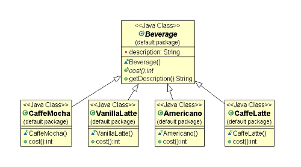
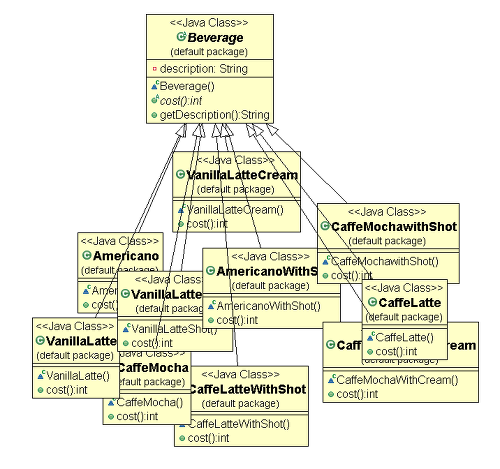
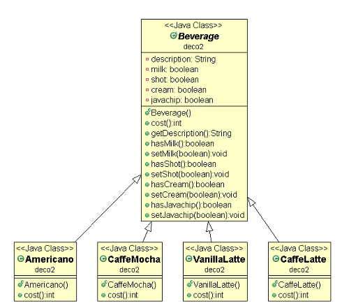
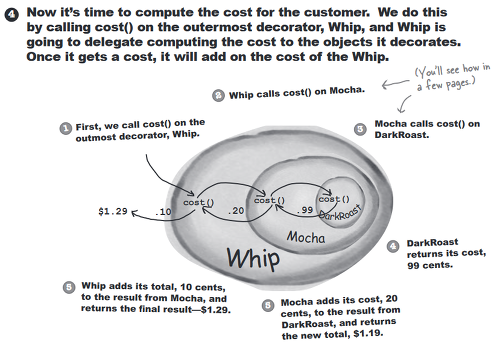
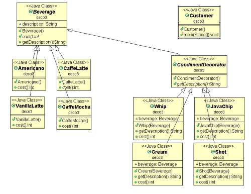
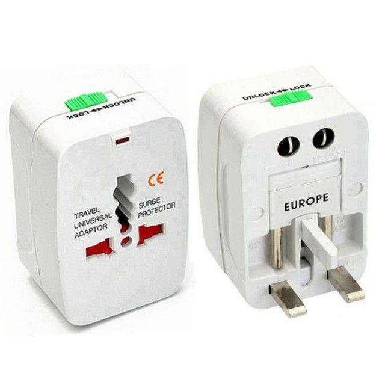
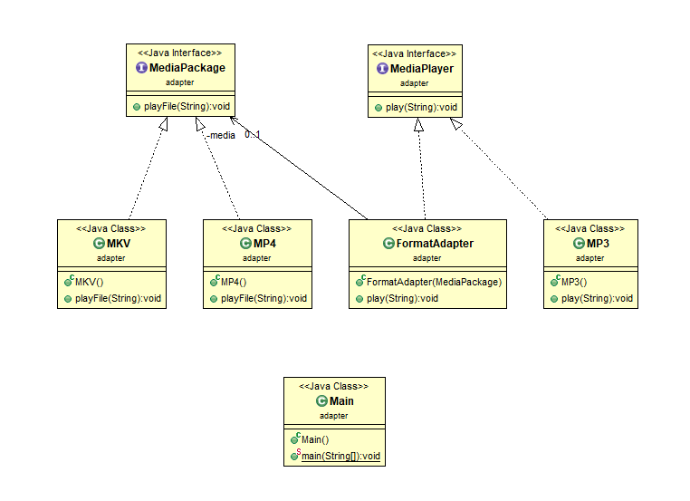

# Design Pattern

### Design Pattern이란? 
디자인 패턴은 주로 객체 지향 프로그래밍 설계 설계에서 공통적으로 발생하는 문제를 피하기 위해 자주 쓰이는 설계 방법을 패턴화한 것이다.
디자인 패턴은 의사소통 수단이 될 수 있고, 이를 참고하여 개발할 경우 개발의 효율성, 유지보수성, 운용성, 성능 최적화에 유리하다.

크게 생성, 구조, 행위 3가지 패턴으로 디자인 패턴을 구분지을 수 있다.

**1. 생성 패턴**
   - Builder
   - Prototype
   - Factory Method
   - Abstract Factory
   - [Singleton](#singleton)
   
**2. 구조 패턴**
   - Bridge
   - [Decorator](#decorator)
   - Facade
   - Flyweight
   - Proxy
   - Composite
   - [Adapter](#adapter)
   
**3. 행위 패턴**
   - Interpreter
   - Template Method
   - Chain of Responsibillity
   - Command
   - Iterator
   - Mediator
   - Memento
   - Observer
   - State
   - Strategy
   - Visitor
   
# 1. 생성패턴 
## Singleton
#### 싱글턴 패턴(Singleton Pattern)이란 생성자가 여러 차례 호출되더라도 실제로 생성되는 객체는 하나이고 최초 생성 이후에 호출된 생성자는 최초의 생성자가 생성한 객체를 리턴하는 생성패턴이다. 
- 클래스 내에서 인스턴스가 단 하나뿐임을 보장하므로, 프로그램 전역에서 해당 클래스의 인스턴스를 바로 얻을 수 있고 , 불필요한 메모리 낭비를 최소화한다.
- 키보드 리더, 프린터 스풀러 또는 공통된 객체를 여러개 생성해서 사용하는 DBCP(DataBase Connection Pool) 등 클래스의 객체를 하나만 만들어야 하는 상황에서 사용한다. 
- 싱글톤 패턴을 사용하기 위해서는 반드시 접근제한자를 이용하여 외부의 접근을 막거나, final로 reference를 변경 불가능하게 설정하여야 한다. 

#### Java
```java
public class Singleton1 {

    private static final Singleton1 instance = new Singleton1();

    private Singleton1() {}

    public static Singleton1 getInstance() {
        return instance;
    }
}

```

```java
public class Singleton2 {
    private static Singleton2 instance;

    private Singleton2() {}

    public static Singleton2 getInstance() {
        if (instance == null) {
            instance = new Singleton2();
        }
        return instance;
    }
}
```

# 2. 구조패턴 
## Decorator
#### 데코레이터 패턴(Decorator Pattern)이란 주어진 상황 및 용도에 따라 어떤 객체에 장식(기능)을 추가하는 패턴이다. 
#### 객체에 추가적인 기능을 동적으로 첨가하며, 기능 확장이 필요할 때 서브클래스 대신 쓸 수 있는 유연한 대안이 될 수 있다.

데코레이터 구조패턴은 카페를 예시로 이해하면 쉽게 이해할 수 있다.
카페에서 음료 주문을 받는 프로그램을 객체 지향 프로그래밍 관점으로 만들었다고 가정해 보자.
이 프로그램에서 카페의 음료를 설계한다면 음료가 공통적으로 가지고 있는 성질을 따로 빼서 '음료'라는 클래스로 만들고, 이것을 상속 받아 사용할 것이다.



그래서 위와 같이 가장 상위 클래스인 Beverage 클래스를 생성하고, 카페모카, 바닐라라떼, 아메리카노, 카페라떼 4가지 음료 클래스를 생성하여 Beverage 클래스를 상속받도록 하였다.

그러나 실제 카페에서는 카페모카에 샷추가를 하거나 휘핑크림 추가, 또는 아메리카노에 샷추가를 할 수 있다. 그러한 음료들까지 모두 클래스로 생성을 한다면 아래와 같이 아주 복잡해질 것이다.



보기만해도 복잡하다... 이렇게 된다면 메뉴를 1개만 새로 개발되어도 해당 메뉴의 샷추가, 휘핑추가, 자바칩추가 클래스까지 새로운 파생클래스 수십개가 추가될 것이고, 그렇게 되면 유지보수가 아주 힘들어질 것이다.

그러면 좀 더 개선해서 다양한 옵션들을 Beverage 클래스에 Boolean 타입으로 관리한다고 하자.



Beverage 클래스의 cost 메소드에서 if문으로 hasMilk, hasCream 등을 체크하여 옵션별 가격들을 더할 수 있다.

```java
public int cost() {    
        int total = 0;
        if(hasMilk()) total+=500;
        if(hasShot()) total+=400;
        if(hasCream()) total+=300;
        if(hasJavachip()) total += 700;
        
        return total;
}
```

그리고 Beverage 클래스 상속받는 메뉴들은 아래와 같이 가격을 결정지을 수 있다.

```java
public class Americano extends Beverage {

    @Override
    public int cost() {
        return 5000 + super.cost();
    }
    
}
```

위 예시는 언뜻 보면 적절하게 설계한 것처럼 보일 수 있다.
하지만 2가지 정도의 큰 문제점이 있다.

1. 새로운 옵션이 추가되거나 변경될 때 마다 슈퍼클래스인 Beverage를 고쳐야 한다. 슈퍼클래스의 변경이 잦은것은 절대 좋은 설계가 아니다.

2. Beverage에 모든 옵션을 관리하면 서브클래스에서 쓸데 없는 정보들까지 모두 상속받는다. 만약 자몽셔벗 클래스가 Beverage를 상속받았는데 불필요한 옵션인 샷추가나 휘핑까지 관리하게 되는것도 역시 좋은 설계가 아니다.

또한 hasMilk가 boolean이다 보니 옵션을 2번이상 추가할 수 없다.
그렇기 때문에 total += milk*500 + shot*500 + ...; 처럼 사용할 수 있게 int형으로 변경이 필요해 보인다.

그래서 위 설계는 객체지향 설계 5대 원칙 [SOLID](../../../tree/main/CommonSense#oop의-5가지-설계-원칙)중 특히, 2번째 [OPC](../../../tree/main/CommonSense#ocp)를 완전히 위반한 설계이다.

> OCP (Open-Closed Principle) : 클래스는 확장에 대해서는 열려 있고, 변경에 대해서는 닫혀 있어야 한다.
즉, 새로운 기능을 추가하려 할 때, 기존 슈퍼 클래스는 수정하지 않고 확장을 통해 간단하게 추가 할 수 있도록 한다!

---

그래서 프로그램을 데코레이터 패턴을 적용해 새롭게 설계하려 한다.



데코레이터 패턴의 일반적인 형태는 위와 같다.



그리고 프로그램을 데코레이터 패턴을 적용한 설계는 위와 같다.
데코레이션 중 최상위 클래스인 CondimentDecorator 클래스가 있으며, 모든 추가 옵션들은 CondimentDecorator 클래스를 상속받는다.
그리고 각각의 메뉴 클래스들과 CondimentDecorator 클래스가 Beverage 클래스를 상속받는다.

```java
public abstract class Beverage {

    // 음료 이름
    String description = "Menu Name (No title)";
    // 음료 가격
    public abstract int cost();
    // 옵션들
    public String getDescription() {
        return description;
    }
    
}
```

위는 최상위 클래스인 Beverage 클래스다.
카페에서 판매하는 모든 음료는 이 클래스를 상속 받아야 하고, cost는 추상메소드이므로 하위 클래스에서 반드시 각자의 가격으로 이 메소드를 오버라이딩하여 구현해주어야 한다. 
그렇기 때문에 Beverage 당연히 클래스도 추상클래스가 된다. 

```java
public abstract class CondimentDecorator extends Beverage {
    public abstract String getDescription();
}
```

위는 Beverage클래스를 상속받는 CondimentDecorator 클래스다.
데코레이션의 최상위 클래스로, 추가 옵션들은 모두 CondimentDecorator 클래스를 상속받는다.
CondimentDecorator 클래스는 Beverage 클래스의 getDescription() 메소드를 추상메소드로 오버라이딩하였기 때문에,
CondimentDecorator를 상속받는 옵션들이 이를 반드시 구현 해주어야 한다.
그래서 CondimentDecorator 또한 추상클래스가 되었고, 추상클래스이기 때문에 Beverage 클래스의 추상메소드인 cost()를 여기서 구현해주지 않아도 된다.

> 최상위 클래스를 상속받는 중간 클래스에서 
최상위 클래스의 메소드를 추상메소드로 오버라이딩을 할 수 있다.
최상위클래스에서 없던 의무성을 중간 클래스에서 아래로 부여할 수도 있다.

``` java
public class Americano extends Beverage {
 
    public Americano() {
    	super();
        description = "아메리카노";
    }
 
    @Override
    public int cost() {
        return 3800;
    }
 
}
```

```java
public class CaffeMocha extends Beverage {
 
    public CaffeMocha() {
        super();
        description = "카페모카";
    }
 
    @Override
    public int cost() {
        return 4800;
    }
 
}
```
Beverage 클래스를 상속받는 Americano와 CaffeMocha 클래스이다.
생성자에서 음료의 이름을 지정해주고, 추상메소드였던 cost 메소드를 오버라이딩하여 각자의 음료에 맞는 가격을 정해준다.

```java
public class Whip extends CondimentDecorator {
 
    Beverage beverage;
    
    public Whip(Beverage beverage) {
        super();
        this.beverage = beverage;
    }
 
    @Override
    public String getDescription() {
        return beverage.getDescription() + ", 휘핑크림";
    }
 
    @Override
    public int cost() {
        return beverage.cost() + 500;
    }
    
}
```

```java
public class Shot extends CondimentDecorator {
    
    Beverage beverage;
 
    public Shot(Beverage beverage) {
        super();
        this.beverage = beverage;
    }
 
    @Override
    public String getDescription() {
        return beverage.getDescription() + ", 샷";
    }
 
    @Override
    public int cost() {
        return beverage.cost() + 500;
    }
    
}

```

CondimentDecorator 클래스를 상속받는 Whip과 Shot 클래스이다.
생성자에서 전달받은 Beverage객체의 인스턴스(Americano, CaffeMocha 등 음료)의 멤버와 메소드에 접근하여 추상메소드들을 오버라이딩한다.

CondimentDecorator 클래스도 추상클래스이기 때문에 cost 추상메소드를 구현하지 않을 수 있었고, 추가로 getDescription 메소드를 추상메소드로 오버라이딩하였기 때문에 Whip과 Shot과 같은 추가 옵션 클래스에서 두 추상메소드를 모두 구현해주어야 한다.

그러면 이제 해당 데코레이터 패턴으로 디자인된 음료클래스를 고객클래스에서 어떻게 주문하는지 보자.

```java
public class Customer {
 
    public static void main(String[] args) {
        
        Beverage MyCoffee = new CaffeMocha();
        //추가시킬 옵션의 매개변수로 자신의 인스턴스를 전달
        MyCoffee = new Shot(MyCoffee);
        MyCoffee = new Shot(MyCoffee);
        MyCoffee = new Cream(MyCoffee);
        MyCoffee = new Whip(MyCoffee);
        MyCoffee = new JavaChip(MyCoffee);
        
        System.out.println("메뉴 : " + beverage.getDescription());
        System.out.println("가격 : " + beverage.cost());
        
    }
}
```

Customer 클래스에서 2샷, 크림, 휘핑크림, 자바칩까지 추가한 악마의 카페모카를 주문 한 상황을 표현해 보았다.
모든 옵션은 1번 추가에 500원이라고 설계를 했을 때, 실행 결과는
```
메뉴 : 카메모카, 샷, 샷, 크림, 휘핑크림, 자바칩
가격 : 7300
```
라고 나올 것이다.

코드에서 보았듯이 옵션을 추가할 때 자신의 인스턴스를 다시 전달함으로써, JavaChip - Whip - Cream - Shot - Shot - CaffeMocha로 감싸지는 형태로 객체가 생성되게 된다.
옵션들의 Beverage타입의 beverage 멤버를 계속 다음으로 전달하여 저런 형태의 체인이 만들어 지게 되는데,

이때 제일 외부의 JavaChip 객체의 getDescription 메소드를 실행시키면, beverage에 저장 되어 있는 Whip 객체의 getDescription으로, 그리고 이어서 Cream 객체에 있는 getDescription 메소드가 차례로 호출 되어 최종적으로 CaffeMocha 객체까지 도달하여 CaffeMocha 객체의 getDescription 메소드까지 호출하는 것이다.

그리고 리턴은 CaffeMocha 객체에 있는 description부터 차례로 리턴되면서 2개의 Shot 객체와 Cream 객체를 거치며 문자열이 계속 더해져 최종적으로는 "카메모카, 샷, 샷, 크림, 휘핑크림, 자바칩"라는 문자열이 완성된다.

cost 메소드 또한 마찬가지로 호출이 자바칩 -> ... -> 카메모카로 파고들어가서 카페모카에서 부터 차근차근 가격이 더해진다.

지금처럼 카페의 음료에 옵션을 추가하여 가격이 더해지고, getDescription에서 문자열이 더해지는 설명은 데코레이터 패턴을 이해하기 쉽게 표현한 것이고,
실질적으로는 추가적인 기능들을 덧붙이는 것으로 사용된다.
대표적으로 데코레이터 패턴이 쓰이는 곳은 우리가 가장 많이 사용하는 자바의 I/O 클래스이다. 
```java
BufferedReader br = new BufferedReader(new InputStreamReader(System.in));
br.readLine();
```
를 풀어서 본다면 
```java
BufferedReader br = new InputStreamReader(System.in);
br = new BufferedReader(br);
br.readLine();
```
처럼 데코레이터 패턴이 적용됨을 알 수 있다.

---

## Adapter
#### 어댑터 패턴(Decorator Pattern)이란 한 클래스의 인터페이스를 클라이언트에서 사용하고자 할 때, 다른 인터페이스로 변환시켜 사용하는 패턴이다. 
#### 어댑터를 이용하면 인터페이스 호환성 문제 때문에 같이 쓸 수 없는 클래스들을 연결해서 쓸 수 있다.

어댑터 패턴은 우리가 여행용 전원 어댑터를 생각해보면 이해가 쉽다.

우리가 사용하는 휴대폰, 노트북 충전기는 220V 동그란 돼지코 한국의 표준 플러그를 사용하지만, 전세계별로 이 플러그 표준이 각기 다 다르다.

일본은 동그란 모양이 아닌 || 모양을 표준으로 사용하고, 호주는 ∴ 모양을 표준으로 사용한다. 

그렇기 때문에 우리가 해당 나라에서 여행을 가서 콘센트를 사용해 충전을 하기 위해서는 아래 사진과 같은 전원 어댑터가 필요하다.



이와 같이 어댑터는 소켓의 인터페이스를 플러그에서 필요로 하는 인터페이스로 바꿔준다고 할 수 있다.

객체 지향 프로그램에서의 어댑터도 마찬가지로 일상 생활에서와 동일하게 어떤 인터페이스를 클라이언트에서 요구하는 형태의 인터페이스로 맞춰주기 위해 중간에서 연결시켜주는 역할을 한다.

아래 어댑터의 기능을 잘 표현하는  UML이 있어서 가져와 보았다.
약간의 이해를 더 돕기 위해 MediaPackage라는 이름을 VideoPlayer으로,
Media Player는 AudioPlayer라는 이름으로 변경하여 구현하였다.



아래는 AudioPlayer 인터페이스와 AudioPlayer 인터페이스를 구현하는 MP3 클래스이다.

> AudioPlayer.java
```java
public interface AudioPlayer{
   
   void play(String filename);
   
}
```

> MP3.java
```java
public class MP3 implements AudioPlayer{
   
   @Override
   void play(String filename){
      System.out.println("Playing MP3 File ♪ : "filename);
   }
   
}
```

아래는 VideoPlayer 인터페이스와 VideoPlayerr 인터페이스를 구현하는 MP4, MKV 클래스이다.

> VideoPlayer.java
```java
public interface VideoPlayer{
   
   void play(String filename);
   
}
```

> MP4.java
```java
public class MP3 implements VideoPlayer{
   
   @Override
   void play(String filename){
      System.out.println("Playing MP4 File ▶ : "filename);
   }
   
}
```

> MKV.java
```java
public class MKV implements VideoPlayer{
   
   @Override
   void play(String filename){
      System.out.println("Playing MKV File ▶ : "filename);
   }
   
}
```

아래는 VideoPlayer포맷을 AudioPlayer포맷에서도 사용할 수 있게 도와주는 FormatAdapter Class이다.
FormatAdapter Class는 AudioPlayer 인터페이스를 상속받고, 멤버 변수로 VideoPlayer를 사용한다.
생성자로 VideoPlayer를 입력받아 해당 Video 포맷을 사용하는 것이다.

> FormatAdapter.java
```java
public class FormatAdapter implements AudioPlayer{
   
   private VideoPlayer media;
   
   public FormatAdapter(VideoPlayer video){
      this.media = video;
   }
   
   @Override
   void play(String filename){
      System.out.println("Using Adapter : ");
      media.playFile(filename);
   }
   
}
```

아래 Main Class는 어댑터 패턴의 사용 예시이다.

MP3 인스턴스를 AudioPlayer 참조변수로 mp3Player 객체를 생성하였는데,

MP4 인스턴스에 어댑터를 사용하면 MP4도 mp3Player에서도 사용할 수 있게된다.

>Main.java
```java
public class Main{

   public static void main(String[] args){
   
   AudioPlayer mp3Player = new MP3();
   mp3Player.play("file.mp3");
   
   mp3Player = new FormatAdapter(new MP4());
   mp3Player.play("file.mp4");
   
   mp3Player = new FormatAdapter(new MKV());
   mp3Player.play("file.mkv");
   
   }
   
}
```

위 코드를 실행시켜보면 아래와 같이 출력이 됨을 알 수 있다.

```
> Playing MP3 File ♪ : file.mp3
> Using Adapter : Playing MP4 File ▶ : file.mp4
> Using Adapter : Playing MKV File ▶ : file.mkv
```

이렇게 어댑터 패턴을 통해 mp3Player 에서도 video 포맷의 파일을 재생시킬 수 있다. 물론 영상은 못보고 소리만 나오겠지만..

---
