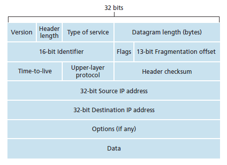
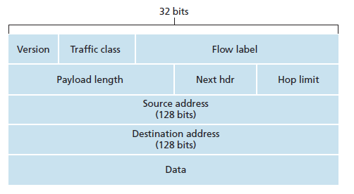
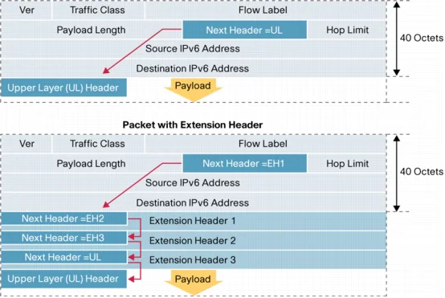

# Network 네트워크

1. [OSI 7계층](#osi-7계층)
2. [IP](#ip)
   1. [IPv4](#ipv4)
   2. [IPv6](#ipv6)
   3. [공인 IP, 사설 IP](#공인-ip-사설-ip)
3. [TCP/IP](#tcp/ip)
4. [UDP](#udp)
5. [대칭키 & 공개키](#대칭키-공개키)
6. [Load Balancing](#load-balancing)
7. [Blocking/Non-Blocking & Synchronous/Asynchronous I/O](#Blocking-vs-Non-Blocking-IO와-Synchronous-vs-Asynchronous-IO)
8. [웹 동작 방식](#웹-동작-방식)
9. [DNS](#dns)
10. [HTTP 프로토콜](#http-프로토콜)
11. [HTTP와 HTTPS](#http와-https)
12. [HTTP Method](#http-method)
13. [HTTP 상태 코드](#http-상태코드)
14. [쿠키, 세션](#쿠키-세션)
15. [JWT, OAuth](#JWT-OAuth)

# OSI 7계층

## OSI 7계층이 뭔데?🧐

OSI는 Open Systems Interconnection 의 약자입니다.

Open Systems Interconnection 이란, 개방형 시스템 상호연결입니다.

<br/>

**그럼 또 개방형 시스템은 무엇일까요?**

개방형 시스템이란 정해진 규약에 따르기를 원하는 어떠한 업체라도 그 개방형 시스템의 명세(spec.)을 사용하도록 허락된 것입니다. _(저희가 배웠던 인터페이스를 구현하는 클래스 같은 느낌이네요..)_

개방형의 반대는 독점적, 폐쇄형이라는 뜻의 Proprietary 입니다.

<br/>

OSI는 이러한 개방형 시스템들간에 연결이라는 뜻입니다.

<br/>

## 계층을 나눈 이유는?

시스템들의 계층을 나눠서 관리하는 이유는 <u>통신이 일어나는 과정을 단계별로 파악할 수 있기 때문</u>입니다.

<u>흐름을 한눈에 알아보기 쉽고</u>, 사람들이 이해하기 쉽습니다.

또한 계층을 분리함으로서 각 계층은 <u>독립적인 역할</u>을 할 수 있습니다.

독립적으로 자신의 일을 처리하고, 다른 계층으로 interconnection 할 때에 규약을 잘 지키면 되는 방식입니다.

<br/>

이렇게 역할이 분리되면서 어떤 한 계층에서 문제가 발생했을 때 다른 계층에 영향을 미치지 않고, 해결할 수 있습니다.

즉, 유지보수가 원활하게 이루어질 수 있습니다.

<br/>

각 계층은 자신보다 하위 계층을 사용하고 현재 층의 기능을 포함해 상위 계층에 제공합니다.

자바의 상속과도 비슷합니다. 계층구조를 위에서 바라봤을 때 아래쪽은 보이지 않습니다. _(오버라이딩과 유사하네요)_

따라서 최상위 계층만 보면 그 하위 계층을 모두 포함하고 있습니다.<br/>

<br/>

### 예시

> A 회사에서 개발 1팀의 모든 PC에 문제가 발생했습니다. → 라우터의 문제 (Network Layer) 이거나, 광랜을 제공하는 회선 문제 (Physical Layer) 입니다.
>
> 반면, A 회사 개발 1팀의 홍길동 씨의 PC에만 문제가 발생했다면 → 실행한 소프트웨어의 문제 (Application) 이거나, 스위치에 문제 (DataLink) 가 있는 것입니다.
>
> 위의 경우들은 해당 계층에 문제가 있다고 판단된다면, 다른 계층은 건들이지 않고 문제가 발생한 계층에서만 해결을 위한 작업을 진행합니다.

<br/>

## OSI 7계층


### 1st Layer - Physical Layer (물리 계층)

물리 계층은 말 그대로 **물리적인 하드웨어 전송 기술들**로 이루어져 있습니다.

기계적인 신호를 주고받는 역할으로, 비트(0과1) 단위로 통신합니다.

전기적, 기계적, 기능적인 특성을 이용해 통신 케이블로 데이터를 전송합니다.

<br/>

이 계층은 데이터가 무엇인지, 에러가 발생했는지 전혀 신경쓰지 않으며 <u>오직 데이터를 전송하거나 받기만 합니다</u>.

데이터를 전기적 신호로 변환해서 주고받는 기능을 합니다.

<br/>

- 장비

  통신 케이블, 리피터, 허브 등

<br/>

**케이블, 리피터, 허브를 통해 전기적인 데이터를 전송하는 계층**

<br/>

### 2nd Layer - DataLink Layer (데이터 링크 계층)

데이터 링크 계층에서는 물리 계층에서 송수신되는 데이터의 오류와 흐름을 관리합니다.

잡음이 있을 수 있는 물리적인 회신을 3계층에서 신뢰적으로 사용할 수 있도록 <u>전송 에러가 없는 통신 채널로 변환</u>시키는 계층입니다.

<br/>

이 계층에서는 **맥 주소**로 통신합니다.

**프레임** 단위로 전송되며 브리지, 스위치 등의 장비를 통해 MAC 주소를 가지고 물리 계층에서 받은 정보를 전달합니다.

프레임은 데이터를 전송 단위로 그룹화한 것입니다.

<br/>

데이터 링크 계층은 흐름 제어와 에러 제어를 담당합니다.

<u>흐름 제어</u>는 데이터를 보내는 측과 받는 측 간의 속도차를 보장하는 것입니다.

<u>에러 제어</u>는 물리 계층의 전송 오류를 검출하고 수정합니다.

또한 정확하게 수신되지 않은 패킷들을 재전송합니다.

<br/>

<u>순서화 작업</u>도 담당하는데, 이 작업은 패킷이나 ACK 신호에 일련번호를 부여하는 것입니다.

<br/>

데이터 링크 계층은 Point to Point 간 신뢰성있는 전송을 보장하기 위한 계층입니다.

프로토콜은 HDLC, 이더넷, 무선LAN, 이동통신, ATM 등 아주 다양합니다.

<br/>

- 장비

  네트워크 브릿지, 스위치

<br/>

**물리 계층의 데이터를 에러 검출, 재전송, 흐름 제어, 순서화 등의 작업으로 신뢰적인 프레임을 만들고 프레임에 MAC 주소를 부여해 전송**

<br/>

### 3rd Layer - Network Layer (네트워크 계층)

네트워크 계층에서 가장 중요한 기능은 데이터를 목적지까지 안전하고 빠르게 전달하는 기능입니다. **(라우팅)**

우리가 흔히 아는 IP 주소를 제공하는 계층이며 여기에 사용되는 프로토콜의 종류는 다양하고, 라우팅 방법도 다양합니다.

<br/>

라우팅 알고리즘을 통해 경로를 선택해 주소를 정하고 경로에 따라 패킷을 전달합니다.

주로 라우터를 사용하지만 최근에는 2계층의 장비 중 스위치에 라우팅 기능을 장착한 L3 스위치도 있다고 합니다.

<br/>

네트워크 계층은 여러개의 노드를 거칠때마다 경로를 찾아주는 역할을 합니다.

다양한 길이의 데이터를 네트워크를 통해 전달하고, 그 과정에서 전송 계층이 요구하는 서비스 품질(QoS)을 제공하기 위한 기능적, 절차적 수단을 제공합니다.

<br/>

이 계층은 <u>라우팅 (경로 제어), 흐름 제어, 오류 제어, 세그멘테이션, 인터네트워킹 등</u>을 수행합니다.

논리적인 주소**(IP)**, 즉 네트워크 관리자가 직접 주소를 할당하는 구조를 가지며 계층적입니다.

<br/>

- 장비

  라우터, L3 스위치, IP 공유기 등

<br/>

**라우팅으로 최적의 경로를 선택해 패킷을 전송하고 IP 주소를 부여함**

<br/>

### 4th Layer - Transport Layer (전송 계층)

통신을 활성화하기 위한 계층입니다. 그래서 가장 핵심적인 계층이며 또한 복잡한 계층입니다.

보통 TCP 프로토콜을 이용하며, 포트를 열어서 응용 프로그램들이 전송을 할 수 있게 합니다.

만약 아래 계층에서 데이터를 받았다면 이 계층에서 데이터를 하나로 합쳐서 상위 계층으로 전송합니다.

<br/>

네트워크가 아닌 호스트 내에 구동된 프로세스들 사이에 연결을 확립합니다.

<u>호스트의 End to End, 양 끝단의 응용 프로세스 상호 간의 통신을 지원</u>합니다.

<br/>

전송 계층은 양 끝단 사이에서 <u>투명한 데이터</u>를 주고 받도록 합니다.

상위 또는 하위 계층에서 사용하는 제어방법 및 그 내용에 관계없이 정보가 Session Layer - Transport Layer - Network Layer 간에 내용 바뀜 없이 투명하게 전송합니다.

<br/>

전송 계층은 시퀀스 넘버 기반의 오류 제어 방식을 사용합니다. 또한 특정 연결의 유효성을 제어합니다.

일부 프로토콜은 상태가 있고 (stateful), 연결 기반 (connection oriented) 입니다.

이것은 전송 계층이 패킷들의 전송이 유효한지 확인하고 전송 실패한 패킷들을 다시 전송한다는 뜻입니다.

<br/>

- 프로토콜

  TCP, UDP, SCTP 등

<br/>

**End to End 통신을 다루는 최하위 계층으로 종단간 신뢰성있고 효율적인 데이터를 전송하며, 오류 검출 및 복구와 흐름제어, 중복 검사 등을 수행**

<br/>

### 5th Layer - Session Layer (세션 계층)

데이터가 통신하기 위한 논리적인 연결을 말합니다. _(통신을 하기위한 대문이라고도 불리더라고요)_

하지만, 바로 아래 계층인 전송 계층에서도 연결을 맺고 종료할 수 있기 때문에 정확하게 어느 계층에서 통신이 끊어졌는지 판단하는 것은 한계가 있습니다.

그래서 세션 계층은 전송 계층과 무관하게 응용 프로그램 관점으로 봐야 합니다.

<br/>

주 기능은 <u>세션 설정, 유지, 종료, 전송 중단 시 복구 등</u>입니다.

세션 계층은 양 끝단의 응용 프로세스가 통신을 관리하기 위한 방법을 제공합니다.

동시 송수신 방식 (duplex), 반이중 방식 (half-duplex), 전이중 방식 (Full Duplex) 등의 통신이 있으며 체크 포인팅과 유휴, 종료, 다시 시작 과정 등을 수행합니다.

이 계층은 TCP/IP 세션을 만들고 없애는 책임을 가집니다.

<br/>

**통신하는 사용자들을 동기화하고 오류 복구 명령들을 일괄적으로 다룸. 통신을 하기 위한 세션을 확립/유지/중단 등을 수행**

<br/>

### 6th Layer - Presentation Layer (표현 계층)

<u>데이터 표현이 다른 응용 프로세스의 독립성을 제공하고, 암호화</u>합니다.

<br/>

표현 계층은 코드 간의 번역을 담당해 사용자 시스템에서 데이터의 형식상 차이를 다루는 부담을 응용 계층으로부터 덜어 줍니다.

MIME 인코딩이나 암호화 등의 동작이 이 계층에서 이루어집니다.

예시로, 문서 파일을 ASCII 인코딩으로 바꾸는 것, 해당 데이터가 TEXT인지 GIF인지 JPG 인지 구분하는 것 등의 기능을 수행합니다.

<br/>

**사용자의 명령어를 완성하고 결과를 표현. 포장/압축/암호화 기능 수행**

<br/>

### 7th Layer - Application Layer (응용 계층)

최종 목적지는 HTTP, FTP, POP3 등의 프로토콜입니다.

통신 패킷들은 위에 나열된 프로토콜에 의해 처리되며 브라우저나 메일은 프로토콜을 쉽게 사용하게 해주는 응용 프로그램입니다.

즉, 모든 통신의 양 끝은 HTTP와 같은 프로토콜입니다. _(응용 프로그램이 아님)_

<br/>

응용 계층은 응용 프로세스와 직접 관계해 <u>일반적인 응용 서비스를 수행</u>합니다.

일반적인 응용 서비스는 관련된 응용 프로세스들 사이의 전환을 제공합니다.

여러 하위 통신 프로토콜 개체에 대해 사용자 관점의 사용자 인터페이스를 제공합니다.

보통 파일 전송, 메세지 교환 등의 기능을 수행합니다.

<br/>

- 프로토콜

  HTTP, FTP, SMTP, POP3, IMAP, Telnet 등

<br/>

**네트워크 소프트웨어의 UI 부분, 사용자의 입출력(I/O) 부분을 담당**

# IP

## IPv4

### IPv4 Protocol

IPv4 Protocol은 **비신뢰적**이고 **비연결형**인 **최선형** 전송 서비스입니다. 최선형 전송의 의미는 IPv4 패킷이 유실되거나 순서에 맞지 않게 도착할 수 있다는 뜻입니다.

만약 신뢰성이 중요하다면 IPv4는 TCP와 같은 신뢰성 있는 전송 계층 프로토콜과 함께 사용되어야 합니다.

<br/>

### IPv4 Datagram

IPv4의 Datagram은 가변 길이의 패킷으로, Header와 Payload(Data)로 이뤄져 있습니다.

Header는 20에서 60바이트의 길이이며 라우팅과 같은 전송과 관련한 정보를 가지고 있습니다.



#### 출처: https://electronicspost.com/ipv4-datagram-format/

<br/>

IPv4의 각 필드의 기능은 다음과 같습니다.
| 필드 | 기능 |
| -- | -- |
| Version | IP 프로토콜의 버전을 의미하며, IPv4는 4의 값을 가집니다.|
| Header length | IPv4 Datagram은 가변의 Header를 가지며, 수신자는 전체 길이를 확인하기 위하여 필드 값에 4를 곱합니다. |
| Type of service | 8-bit로 구성되며, Datagram이 라우터에 의해 어떻게 처리되어야 할지 정의합니다. |
| datagram length (bytes) | 16-bit의 필드는 IP Datagram의 전체 바이트 크기를 의미합니다.|
| 16-bit Identifier, Flags, 13-bit Fragmentation offset | 이 세 필드는 Datagram의 크기가 하부 네트워크가 처리할 수 있는 크기보다 클 경우에 필요한 IP Datagram의 단편화와 관련이 있습니다.|
| Time-to-live | Datagram이 방문할 수 있는 최대 라우터의 수를 의미합니다. |
| Upper-layer Protocol | Datagram이 목적지에 도착하면 어느 프로토콜로 Payload가 전달되어야 할지 알려줍니다. |
| Header checksum | IP는 Header를 검사하기 위한 checksum 필드를 사용하고 있습니다. |
| 32-bit Source IP address, 32-bit Destination IP address | 이 필드는 32-bit 길이의 출발지, 목적지 주소를 의미합니다. |
| Options (if any) | Datagram Header는 40바이트까지 옵션을 가질 수 있습니다. 옵션은 필수가 아니지만, 옵션을 사용할 때 이 필드가 사용됩니다. |
| Data | 이 필드는 Payload(Data)를 의미힙니다. |

<br/>

### IPv4 주소

IPv4 주소는 오늘날 대중적으로 사용되는 IP 주소입니다.

| 진법       | IP Address                          |
| ---------- | ----------------------------------- |
| 2진법      | 11000000 10101000 00000000 00000001 |
| **10진법** | **192.168.0.1**                     |
| 16진법     | C0 A8 00 01                         |

IPv4 주소는 32-bit 주소 체계로 위와 같이 표기할 수 있는데, 일반적으로 10진수와 '.'를 이용하여 표현합니다.

10진수로 표기할 경우 8비트씩 끊어서 사용하므로 0~255 범위의 숫자를 사용하여 표현할 수 있습니다.

<br/>

### IPv4 특수 주소

IPv4에는 특수 용도로 사용되는 주소들이 있습니다.

| 특수 주소         | 기능                                                                                                                                                                                                                                |
| ----------------- | ----------------------------------------------------------------------------------------------------------------------------------------------------------------------------------------------------------------------------------- |
| Loopback          | 127.0.0.8/8 주소는 루프백 주소입니다. 이 주소를 가진 패킷은 호스트를 떠나지 않고, 호스트에 남게 됩니다. 테스트 용도로 많이 사용되며 그 중 127.0.0.1 주소는 테스트에 가장 많이 사용되는 주소입니다.                                  |
| Limited-broadcast | 255.255.255.255/32 주소는 제한된 브로드캐스트 주소입니다. 이 주소를 통해 호스트나 라우터가 네트워크 상의 모든 장치로 데이터를 보낼 수 있습니다. 하지만 대부분의 라우터에는 이러한 패킷을 차단하기 때문에 외부로는 보낼 수 없습니다. |
| This-host         | 0.0.0.0/32 주소는 디스-호스트 주소입니다. 이 주소는 현재 네트워크를 의미하며, 자신의 주소를 모를 때 사용되는 주소입니다.                                                                                                            |
| Private           | 10.0.0.0/8, 172.16.0.0/12, 192.168.0.0/16 주소는 사설 주소로 지정되어 있습니다. 이러한 주소들은 공공 인터넷에 존재하지 않으며 사설로만 사용이 가능합니다.                                                                           |
| Multicast         | 224.0.0.0/4 주소는 멀티캐스트 용도로 사용되는 주소입니다.                                                                                                                                                                           |

## IPv6

### IPv6 Protocol

IPv6 Protocol은 IPv4의 주소 고갈, IP 패킷의 형태 변경, ICMP와 같은 몇몇 보조 프로토콜의 수정을 위해 고안된 새로운 버전의 프로토콜입니다.

<br/>

### IPv6 Datagram

IPv6 Datagram은 Header와 Payload로 구성됩니다.

기본 Header는 40바이트를 차지하며, 확장 Header와 상위 계층 Data는 65,535바이트까지의 정보를 가질 수 있습니다.



#### 출처: https://electronicspost.com/ipv6-datagram-format/

<br/>

IPv4의 각 필드의 역할은 다음과 같습니다.
| 필드 | 기능 |
| -- | -- |
| Version | IP의 버전 전호를 의미합니다. IPv6에서는 6의 값을 가집니다.|
| Traffic class | IPv4의 Type of service 필드와 유사합니다. |
| Flow label | Data의 특정한 프름을 위한 특별한 처리를 제공하기 위해 사용됩니다. |
| Payload length | 기본 Header를 제외한 IP Datagram의 길이를 의미합니다. IPv6의 기본 Header의 길이는 40바이트로 고정되어 있기 때문에 페이로드의 길이만 정의하면 됩니다. |
| Next hdr | Next hdr 필드는 첫 확장 Header의 종류를 정의하거나 Datagram의 기본 Header를 뒤따르는 Header를 의미합니다. 이 필드는 IPv4의 Upper-layer Protocol 필드와 유사합니다.|
| Hop limit | IPv4의 Time-to-live 필드와 같은 목적으로 사용됩니다. |
| Source address(128bits), Destination address(128bits) | 출발지, 목적지 주소를 식별하기 위해 사용됩니다. |
| Data | IPv4와 달리 IPv6의 Data(Payload) 필드는 다른 형태와 의미를 가집니다. |

<br/>

### IPv6 Datagram Payload(Data 필드)



#### 출처: https://www.cisco.com/en/US/technologies/tk648/tk872/technologies_white_paper0900aecd8054d37d.html

<br/>

IPv6 패킷은 기본 Header와 확장 Header로 구성됩니다. 기본 Header의 길이는 40바이트로 고정되어 있지만, 부가적인 기능을 제공하기 위해 기본 Header 뒤에 6개까지 확장 Header를 붙일 수 있습니다.

- Hop-by-hop
- Destination
- Source Routing
- Frgmentation
- Authentication
- ESP

<br/>

### Ipv6 주소

IPv6는 IP 주소가 부족해짐에 따라 새롭게 고안된 IP 주소 체계입니다. 기존의 32-bit의 주소는 128-bit로 확장되었습니다.

오늘날 네트워크 기능을 가지는 장비(L3 Router, L4 Switch, PC, Server 등)들의 대부분은 IPv4 주소와 IPv6 주소를 모두 지원하고 있으며, 천천히 IPv6 주소 체계로 전환을 하고 있습니다.

| 진법       | IP Address                                  |
| ---------- | ------------------------------------------- |
| 2진법      | 1111111011110110 ... 1111111100000000       |
| **16진법** | **FEF6:BA98:7654:46E0:AFFF:F210:1124:00F1** |

16진법으로 표현된 IPv6 주소는 많은 수의 0을 포함하고 있어 매우 긴 형태를 보이고 있습니다.

이러한 경우 앞 부분의 0을 생략하고 축약된 표현을 사용할 수 있습니다. 0082는 82, 0FFE는 FFE, 0000은 0으로 표현할 수 있습니다.

연속되는 영역이 0으로만 구성되어 있다면, 더 많은 축약이 가능합니다.

> FFFF:0:0:0:EEEE:AAAA:BBBB -> FFFF::EEEE:AAAA:BBBB

위 축약은 주소당 한 번만 가능하며, 0만을 가지는 연속된 영역이 두 개 이상 존재할 경우 한 부분만 축약이 가능합니다.

## 공인 IP, 사설 IP

### 공인 IP

- 인터넷 서비스 공급자(ISP)가 제공하는 IP 주소로 공용 IP라고도 불리며 **외부에 공개되어 있는 IP**
- 전세계에서 유일한 IP를 가진다.
- 공인 IP 주소가 외부에 공개되어 있기 때문에 인터넷에 연결된 다른 PC로부터의 접근이 가능하다. 
따라서 공인 IP 주소를 사용하는 경우에는 방화벽이나 보안프로그램을 설치할 필요가 있다.

### 사설 IP

- 일반 가정이나 회사 내 등에 할당된 네트워크의 IP 주소로 로컬 IP, 가상 IP라고도 한다.
- **IPv4의 주소 부족**으로 인해 서브넷팅된 IP이기 때문에 라우터에 의해 로컬 네트워크 상의 PC나 장치에 할당된다.

전체 IP 대역 중에서 다음의 대역은 사설 IP 대역으로 설정되어 있기 때문에 사용자가 임의로 부여하고 사용할 수 있으며 인터넷 상에서 서로 연결되지 않도록 되어 있다.

<table>
<tr>
<td>구분</td>
<td>범위</td>
</tr>
<tr>
<td>A 클래스</td>
<td>
10.0.0.1 ~ 10.255.255.255
</td>
</tr>
<tr>
<td>B 클래스</td>
<td>
172.16.0.1 ~ 172.31.255.255
</td>
</tr>
<tr>
<td>C 클래스</td>
<td>
192.168.0.1 ~ 192.168.255.255
</td>
</tr>
</table>

사설 IP로 회사나 가정 내의 IP 주소를 부여하고 공유기 등에 고정 IP를 부여한 다음에 인터넷에 접속하는 방식이 널리 퍼지게 되었고, 대부분의 장비가 현재는 사설 IP를 부여하고 공유기를 통해 인터넷에 접속하게 된다.

- 공유기는 공인 IP를 가진다.
- 컴퓨터나 노트북는 사설 IP를 가지고 공유기를 통해 인터넷에 접근할 수 있다.

### 사설 IP와 공인 IP의 차이

<table>
<tr>
<td></td>
<td>공인 IP</td>
<td>사설 IP </td>
</tr>
<tr>
<td>할당 주체</td>
<td>ISP(인터넷 서비스 공급자)</td>
<td>라우터(공유기)</td>
</tr>
<tr>
<td>할당 대상</td>
<td>개인 또는 회사의 서버(라우터)</td>
<td>개인 또는 회사의 기기</td>
</tr>
<tr>
<td>고유성</td>
<td>인터넷 상에서 유일한 주소</td>
<td>하나의 네트워크 안에서 유일</td>
</tr>
<tr>
<td>공개 여부</td>
<td>내/외부 접근 가능</td>
<td>외부 접근 불가능</td>
</tr>
</table>

### NAT

- Network Address Translation의 약자로 OSI 3계층인 네트워크 계층에서 공인 IP와 사설 IP르 변환하는 역할을 한다.
- IPv4의 주소 부족으로 인해 **공인 IP 주소를 절약**하고 외부로의 침입을 차단하기 위해 사용한다.

NAT에는 Basic NAT와 NAPT  2 종류가 있고 대개 NAT라고 하면 NAPT 방식을 말한다.

### NAPT

- Network Address Port Translation의 약자로 사설 IP 주소를 가지는 여러 대의 단말이 하나의 공인 IP 주소를 통해 인터넷과 연결되는 방식
- 공인 IP 주소 절약을 목적으로 사용되며 1:N Translation 규칙을 사용한다. (1 = 공인 IP, N = 사설 IP)
- NAPT 방식을 이용하면 간략하게 아래와 같이 인터넷과 연결된다.


[출처](https://netmanias.com/ko/?m=view&id=blog&no=5826)

#### (사설 IP -> 공인 IP) 
1) 사설 IP 주소를 가진 단말이 인터넷으로 전송하고자 하면 사설 IP와 Port에 대한 공인 IP와 Port를 할당하고 NAT Binding Table에 해당 정보를 생성한다.
2) NAT Binding Table을 참조해서 사설 IP 주소를 공인 IP 주소로 변환하고 인터넷으로 전송한다.

#### (공인 IP -> 사설 IP) 
3) NAT Binding Table을 참조해서 공인 IP 주소를 사설 IP 주소로 변환해서 단말로 전송한다.

### 고정 IP

- 컴퓨터에 고정적으로 부여된 IP
- 한번 부여되면 반납하기 전까지 다른 장비에 부여할 수 없는 IP 주소
- 인터넷에서 서버를 운영하고자 할 때는 공인 IP를 고정 IP로 부여해야 한다
공인 IP를 부여받지 못하면 다른 사람이 내 서버에 접속할 수 없고, 고정 IP를 부여하지 않으면 내 서버가 아닌 다른 사람의 서버로 접속할 수 있다.

### 유동 IP

- 장비에 고정적으로 IP를 부여하지 않고 컴퓨터를 사용할 때 남아 있는 IP 중에서 돌아가면서 부여하는 IP

# TCP/IP

`TCP/IP` 는 하나의 프로토콜이 아닌 <u>TCP 프로토콜과 IP 프로토콜을 합쳐서 부르는 말</u>입니다.

**패킷 통신 방식의 인터넷 프로토콜인 IP**와 **전송 조절 프로토콜인 TCP**로 이루어져 있습니다.

`IP`는 <u>패킷 전달 여부는 보증하지 않고 논리적인 주소만을 제공하며, 패킷을 보낸 순서와 받는 순서가 보장되지 않습니다.</u>

`TCP`는 IP 위에서 동작하는 프로토콜로 <u>데이터의 전달을 보장하고 데이터를 보낸 순서와 받는 순서를 보장</u>해줍니다.

HTTP, FTP, SMTP 등의 프로토콜은 TCP를 기반으로 하고 있으며 이 프로토콜들은 IP 위에서 동작하기 때문에 묶어서 TCP/IP 로 부릅니다.

<br/>

또한 TCP/IP를 사용한다는 것은 IP 주소 체계를 따르면서 TCP의 특성을 활용해 송신자와 수신자의 논리적 연결을 생성하고 신뢰성을 유지할 수 있도록 하겠다는 의미입니다.

즉 TCP/IP 를 말한다는 것은 송신자가 수신자에게 IP 주소를 사용해 데이터를 전달하고 그 데이터가 제대로 갔는지, 너무 빠르지는 않는지, 제대로 받았다고 연락은 오는지에 대한 이야기를 하고 있는 것입니다.

<br/>

인터넷에서 무언가를 다운로드할 때 중간에 끊기거나 빠지는 부분 없이 완벽하게 받을 수 있는 이유도 TCP의 이러한 특성 때문입니다.

그렇기 때문에 HTTP, HTTPS, FTP, SMTP 등과 같이 데이터를 안정적으로 모두 보내는 것을 중요시하는 프로토콜들의 기반이 됩니다.

<br/>

## TCP (Transmission Control Protocol)

`TCP 프로토콜`은 **OSI 7 Layer 에서 4계층인 전송 계층**에 위치합니다.

TCP는 네트워크 정보 전달을 통제하는 프로토콜이자 인터넷을 이루는 핵심 프로토콜 중 하나입니다.

근거리 통신망이나 인트라넷, 인터넷에 연결된 컴퓨터에서 실행되는 프로그램간에 데이터 전송을 안정적으로, 순서대로, 에러 없이 교환할 수 있게 해줍니다.

웹 브라우저들이 www를 통해 서버에 연결할 때 사용되며, 이메일 전송이나 파일 전송에도 사용됩니다.

<br/>

**IP**가 패킷들의 관계를 이해하지 못하고 그저 <u>목적지를 제대로 찾아가는 것에 중점</u>을 둔다면 **TCP**는 통신하고자 하는 <u>양쪽 단말이 통신할 준비가 되었는지, 데이터가 제대로 전송되었는지, 데이터가 가는 도중 변질되지는 않았는지, 수신자가 얼마나 받았고 빠진 부분은 없는지</u> 등을 점검합니다.

<br/>


이런 정보들은 `TCP Header`에 담겨 있으며 Source Port, Destination Port, Sequence Number, Window size, Checksum과 같은 **신뢰성 보장**과 **흐름 제어**, **혼잡 제어**에 관여할 수 있는 요소들도 포함되어 있습니다.

또한 IP Header와 TCP Header를 제외한 TCP가 실을 수 있는 데이터의 크기를 **세그먼트(Segment)** 라고 부릅니다.

<br/>

TCP는 IP의 정보뿐만 아니라 **Port를 이용하여 연결**합니다.

한쪽 단말에 도착한 데이터가 어느 입구(Port)로 들어가야 하는지 알아야 연결을 시도할 수 있기 때문입니다.

위의 TCP Header를 보면 <u>발신지 포트주소 (Source Port)</u>와 <u>목적지 포트주소 (Destination Port)</u>를 확인할 수 있습니다.

*(예시로, 양쪽 단말에서 HTTP로 이루어진 문서를 주고받고자 할 경우 데이터 통신을 하려면 단말의 Port가 80이어야만 가능합니다.)*

<br/>

### 3-way handshake

TCP를 사용하는 송신자와 수신자는 데이터를 전송하기 전 먼저 서로 통신이 가능한지 의사를 묻고 한 번에 얼마나 받을 수 있는지 등의 정보를 확인합니다.

이는 데이터를 안전하고 빠지는 부분 없이 보내기 위한 신뢰성 있는 통신을 하기 위해서입니다.

<br/>


TCP는 TCP Header 내의 SYN, SYN/ACK, ACK Flag 를 사용해 통신을 시도합니다.

1. 송신자가 수신자에게 SYN를 보내 통신이 가능한지 확인 -> Port는 열려 있어야 함
2. 수신자가 송신자로부터 SYN를 맏고 SYN/ACK 를 송신자에게 보내 통신 준비가 되었다고 함
3. 송신자가 수신자의 SYN/ACK 를 받고 ACK를 날려 전송을 시작함을 알림

위 과정을 3-way handshake 라고 부릅니다.

<br/>

**TCP로 이루어진 모든 통신은 반드시 3-way handshake를 통해 시작**합니다.

<u>수신자가 받을 생각이 있는지 준비가 되어있는지 송신자가 보낼 준비가 되어있는지를 미리 확인한 후 통신을 시작</u>해 데이터를 안전하게 보내는 것입니다.

그리고 <u>데이터를 받았을 때 `ACK`를 송신자에게 보내 데이터가 온전히 도착했음</u>을 알립니다.

<u>송신자는 `ACK`를 받으면 수신자에게 데이터가 잘 보내졌음을 확인하고 다음 데이터를 전달할 준비</u>를 합니다.

<br/>

### 특징

1. **흐름 제어**

   **송신자**는 자신이 한 번에 얼마를 보낼 수 있는지, 수신자는 자신이 데이터를 어디까지 받았는지 계속 확인하고 TCP Header 내의 Window size 를 이용해 <u>한번에 받고, 보낼 수 있는 데이터의 양을 정합니다.</u>

   *(여기서 window 는 일정량의 데이터를 말합니다.)*

   **수신자**가 데이터를 받을 Window size를 정하고 *(3-way handshake 때 정한다.)* <u>자신의 상황에 따라 Window size 를 조절</u>합니다.

   그리고 <u>자신이 지금까지 받은 데이터의 양을 확인해 송신자에게 보내</u>는데 이를 `Acknowledgment Number` 라고 합니다.

   만약 수신자가 130번째 데이터를 받았으면, `Acknowledgment Number`에 1을 더해서 131을 보냅니다.

   이것은 현재 130번까지 받았으니 131번부터 보내면 된다는 의미입니다.

   그리고 이러한 순서 번호를 표기한 것이` Sequence Number` 입니다.

   <br/>

2. **혼잡 제어**

   **데이터가 지나가는 네트워크망의 혼잡을 제어하는 것**입니다.

   **`Slow Start`**는 연결 초기에 송신자와 수신자가 데이터를 주고받을 준비가 되어있더라도 중간 경로인 네트워크가 혼잡하다면 데이터가 안전하게 전송되지 못할 것에 대비하는 것입니다.

   **송신자**는 <u>연결 초기에 데이터 송출량을 낮게 잡고 보내면서 수신자의 수신을 확인해가며 데이터 송출량을 조금씩 늘립니다.</u>

   그러다보면 <u>현재 네트워크에서 가장 적합한 데이터 송출량을 확인할 수 있게 됩니다.</u>

   이것이 **`Slow Start`** 입니다.

<br/>

## IP (Internet Protocol)

`IP 프로토콜`은 **OSI 7 Layer 중 3 계층인 네트워크 계층**에 해당합니다.

IP는 TCP와는 달리 **데이터의 재조합이나 손실여부 확인이 불가능하며, 단지 데이터를 전달하는 역할만을 담당**합니다.

<br/>

컴퓨터와 컴퓨터 간에 데이터를 전송하기 위해서는 각 컴퓨터의 주소가 필요합니다.

**IP는 4바이트로 이루어진 컴퓨터 주소이며 3개의 마침표로 나누어진 숫자로 표시**됩니다.

*(예시 `127.0.0.1`)*

IP 주소는 하드웨어 고유의 식별 번호인 MAC 주소와 다르게 임시적으로 다른 주체(대부분 통신사)에게 받는 주소이므로 <u>바뀔 수 있습니다.</u>

<br/>


**이미지들 출처**

[https://www.sciencedirect.com/topics/computer-science/three-way-handshake](https://www.sciencedirect.com/topics/computer-science/three-way-handshake)

[http://www.ktword.co.kr/test/view/view.php?m_temp1=1889&id=1103](http://www.ktword.co.kr/test/view/view.php?m_temp1=1889&id=1103)


# UDP

**`UDP`** 는 `User Datagram Protocol` 의 약자로 **OSI 7 Layer 에서 4계층인 전송 계층**에 위치합니다.

**`TCP`** 에 대비되는 프로토콜로 신뢰성이 낮고 완전성을 보장하지 않습니다. 하지만 속도가 빠르다는 장점이 있습니다.

<br/>

## 특징

**UDP**는 **비연결성**이고, **신뢰성이 없으며**, **순서화되지 않은** Datagram 서비스를 제공합니다.

데이터 전송 단위는 **메세지** 입니다. *(TCP의 데이터 전송 단위는 **세그먼트**)*

<br/>

### UDP가 하지 않는 것

- **연결 셋업과 종료 (Connection setup/teardown)**

  TCP의 3-way Hankshaking 과 같은 연결이 필요없는 <u>비연결성 프로토콜</u>입니다. 

  그래서 **데이터그램 지향의 전송계층용 프로토콜**이라고도 많이 불립니다.

- **수신 완료했다는 알림 (Acknoledgement)**

  메세지가 제대로 도착했는지 확인하는 <u>확인응답 작업이 없습니다.</u>

- **재전송 (Congestion Control)**

- **혼잡 제어 (In-order delivery)**

  <u>흐름 제어를 위한 피드백을 제공하지 않고, 특별한 오류 검출 및 제어가 없어</u> UDP를 사용하는 프로그램 쪽에서 오류제어 기능을 스스로 갖춰야 합니다.

- **순서대로 보내기**

  수신된 메세지의 순서를 맞추는 순서제어가 없어 TCP 헤더와 달리 <u>순서번호 필드가 없습니다.</u>

- **Fragmentation**

<br/>

### UDP의 주요 기능

- **실시간 (Real-time)**

  <u>UDP는 빠른 요청과 응답이 필요한 실시간 응용에 적합</u>합니다. 

  제약 조건이 거의 없고 TCP에 비해 매우 빠르기 때문입니다.

  *(인터넷 전화, 스트리밍 등)*

- **간단한 트랜잭션 (Simple transactions)**

  TCP는 Setup과 종료, ACK를 모두 체크해야해 복잡한 transaction이 요구됩니다.

  하지만 UDP는 위의 과정을 체크하지 않기 때문에  transaction이 간단합니다.

  *(DNS, DHCP, SNMP 등)*

- **멀티캐스트 / 브로드캐스트**

  TCP는 전송측과 수신측이 서로 확인되어야 데이터를 주고받습니다.

  Point-to-point 방식으로 동작하는 TCP는 멀티캐스트와 브로드캐스트 전송이 모두 불가능합니다.

  UDP만 가능한 기능이며 <u>전송 속도에 제한이 없습니다.</u>

<br/>

### UDP 패킷 헤더 구조


TCP 헤더에 비해 매우 단순합니다.

**발신/수신 포트번호**가 존재하고 바이트 단위의 **길이**가 있습니다.

**체크섬**은 선택 항목이며 체크섬 값이 0이면 수신측은 체크섬 계산을 하지 않습니다.

기본적으로 UDP 헤더는 **고정 크기의 8 바이트**만 사용하며 <u>헤더 처리에 많은 시간이 들지 않습니다.</u>

<br>

# 대칭키-공개키

## 네트워크 보안
secure communication을 위해서는 다음의 원칙들을 고려해야합니다.
1. 기밀성
송신자와 정해진 수신자만이 전송된 메세지의 내용을 이해할 수 있어야한다.
2. 메세지 무결성
송신자와 수신자 사이의 메세지는 중간에 변형되면 안된다.
3. 엔드포인트 인증
발신자와 수신자 모두 통신에 관련된 상대방(End-point)의 신원을 확인할 수 있어야한다.
4. 운영 보안
공격자가 바이러스를 심거나 보안사항을 얻으려는 시도를 하거나, DoS 공격을 시도하는 등을 할 수 없게 안전하게 운영되어야한다.

이 중 대칭키와 비대칭키는 1번 원칙인 기밀성을 위해 사용되는 도구입니다.
## 암호화의 원칙
다음은 암호화의 요소에대한 그림입니다.

 Alice는 암호화 알고리즘에 input으로 들어갈 key를 제공합니다. 이 때, key는 숫자와 문자로 구성된 문자열입니다.
이 암호화 알고리즘은 송신자의 키와 plaintext 메세지를 받아서 output으로 암호문을 만들어냅니다.
복호화 알고리즘은 암호화 알고리즘을 통해 만들어진 암호문을 수신자의 키를 이용해서 plaintext 메세지로 바꿔줍니다.
이런 과정에서 사용되는 키는 대칭키와 비대칭키가 있습니다.
> 대칭키 : 수신자와 송신자의 키가 동일하다.
> 공개키 : 수신자와 송신자의 키가 쌍으로 사용됩니다.

## 대칭키
### stream 암호
plaintext와 같은 길이의 키 스트림을 생성해서 비트단위로 XOR연산을 수행합니다.
오류 확산의 위험이 없고, 이동통신 환경에서 구현이 용이해서 무선 데이터 보호에 많이 사용됩니다. 실시간성이 중요한 음성, 영상, 스트리밍 전송에 사용됩니다.
비트단위로 암호화를 진행해서 시간이 많이 걸리고, 데이터 흐름에 따라서 비트 단위로 순차적으로 처리해서 내부 상태를 저장하고 있어야한다는 단점이 있습니다.


### RC4
SSL/TLS나 네트워크 프로토콜에서 자주 사용되는 스트림 암호 기법으로 plaintext와 XOR 연산을 진행할 pseudorandom stream을 만듭니다.

256 바이트로 구성된 상태의 한 바이트는 암호화 키로서 사용되기 위해서 랜덤하게 선택이 됩니다.

초기화는 256바이트의 state vector를 0,1,2,…,254,255로 초기화합니다.
초기화 한 후에 키 배열을 이용해서 상태배열에대해 다음과 같이 swap을 해줍니다.


이 swap 과정 중 S[i] + S[j] 의 값에 해당하는 상태 배열의 인덱스의 원소를 키로 사용합니다.

### block 암호
다양한 보안이 적용된 인터넷 프로토콜(ex. PGP,SSL,IPsec)에서 사용되는 암호입니다.
블록 암호문에서는 암호화될 메세지는 *k bit*의 블록으로 처리됩니다.
예를들면, k = 64인 경우에는 메세지는 64 비트의 블록 단위로 나눠지고, 각각의 블록들은 독립적으로 암호화됩니다.

블록을 암호화 하기위해서는 암호는 일대일 매핑을 사용해서 k비트의 일반 텍스트 블록을 암호문의 k비트 블록에 매핑합니다.

k = 3 인 경우 아래와 같이 매핑할 수 있습니다.
이는 가능한 8!(=40320)가지 방법 중 한가지를 표시한 것입니다.
|input|output|input|output|
|----|----|----|----|
|000|110|100|011|
|001|111|101|010|
|010|101|110|000|
|011|100|111|001|

우리는 이런 각각의 매핑들을 키로 생각할 수 있습니다. 
하지만 이처럼 작은 비트로 매핑을하면 모든 경우의 수를 완전탐색으로 금방 찾아낼 수 있습니다. 이런 공격을 방지하기 위해서 k bit를 64비트나 그 이상의 비트수로 구성합니다.

비록 이런 적절한 k를 이용한 full-table block 암호가 강력한 대칭키 암호 스키마를 만들 수 있지만, 구현하는 것이 까다롭습니다. k bit 를 사용하면 송신자와 수신자 모두 (2^k)!가지의 경우의 수로 구성된 테이블을 유지해야하는데, 이는 실행이 불가능합니다. 
어찌어찌해서 다 만들었다하더라도, 키를 바꿔버리면 다시 테이블을 생성해야합니다. 

그래서 full-table 암호는 모든 입력과 출력 간에 미리 결정된 mapping을 제공하는 경우에만 사용합니다.

이런 점을 해결하기 위해서 블록 암호는 랜덤하게 조합된 테이블을 만드는 함수들을 사용합니다. 


위의 그림처럼 input을 다루기 쉬운 사이즈의 bit로 나눠서 매핑합니다.
이렇게 나눠진 chunk들은 64비트의 블록으로 합쳐진 후에, 다시 한 번 섞여서 새로운 64-bit output을 만듭니다. 
이렇게 만들어진 결과물은 64-bit input으로 사용되어 위 과정을 반복하고, 이 반복을 총 n번 반복합니다.
이 때, n번의 싸이클을 돌리는 목적은 각각의 input bit가 출력 비트의 대부분에 영향을 미치게하기 위함입니다.(chunk 안에 있는 bit는 바뀌는 것이 없기 때문)
 
### AES
AES는 128 비트 블록을 사용하고 128,192,256비트 길이의 키를 사용할 수 있습니다. 


위 그림은 다음 4가지 단계를 표현한 것입니다.
1. SubByte : 바이트 단위 형태로 블록을 교환
cf) S-box


2. Shift rows : 행과 행을 치환
3. Mix columns : 열에 속한 모든 바이트를 순환 행렬을 사용해서 함수로 열에 있는 각 바이트를 대체해서 변화시킵니다.
4. Add round key : 확장된 키의 일부와 현재 블록을 비트별로 XOR 연산해줍니다.

암호화와 복호화를 위해서 라운드 키 더하기 단계에서 시작해 10라운드를 수행합니다. 9라운드 동안은 4단계를 모두 포함하는 반복을 수행한 후에 10번째에는 3단계(mix columns제외)로 구성된 반복을 수행합니다.

라운드 키를 더하는 단계에서만 키를 사용하기 때문에 각 라운드의 시작과 끝은 라운드 키를 더하는 단계가 됩니다.

위의 4가지 단계는 비트를 뒤섞고 XOR 암호화 하는 것을 번갈아서 적용함으로서 효과적으로 보안성을 강화시킵니다.

암호화된 암호문은 암호의 역순으로 해독하면 평문을 얻어낼 수 있습니다.

[AES 진행방식](https://www.youtube.com/watch?v=mlzxpkdXP58)
## 공개키(Public Key)

대칭키를 이용한 암호화 통신은 두 communicating  당사자들이 공통된 키를 공유합니다. 이런 방법의 한가지 어려운 점은 두 참가자가 반드시 공유키에대한 동의를 해야한다는 것입니다. 참가자들이 처음 만나서 동의한 다음 그 후에 암호화로 통신이 가능할 것입니다.
그러나 지금 세상에는 네트워크 없이 통신의 참여자가 직접 만나거나 소통을 할 수 없습니다. 
그렇다면 두 참여자가 사전에 이미 알고있는 비밀키 공유 없이 암호화 통신을 할 수 있는 방법은 무엇일까요?


그 때 사용하는 것이 공개키(Public Key)입니다.
공개키 구조는 네트워크에 참여하는 모두가 볼 수 있는 공개키와 수신자만 가지고 있는 개인키로 되어있습니다. 
공개키로 암호화되어진 암호문을 수신자의 개인키를 이용해서 복호화합니다. 
이런 특징 때문에, 공격자가 암호 알고리즘과 암호키를 알아도 복호키 계산이 불가능합니다. 
공개키를 이용해서 암호화를 할 때, 주로 RSA 알고리즘을 이용해서 암호화합니다.

RSA
RSA는 소인수분해 연산을 이용합니다.
1. p와 q라고하는 2개의 서로 다른 충분히 큰 소수를 고릅니다.
2. n = pq, z = (p-1)(q-1)을 계산합니다.
3. n보다 작으면서 서로소인 정수 e를 찾습니다.
4. 그 후 d*e를 z로 나눴을 대 나머지가 1인 정수 d(ed mod z = 1)를 구합니다.
5. (n,e)는 공개키로 사용, (n,d)는 개인키로 사용
이 때, p와q를 이용해서 d,e를 계산하는 것이 가능하기 때문에, 보안상의 이유로 공개키와 개인키를 생성한 이후에는 p와 q를 지워버리는 것이 안전합니다.

이 때, e는 공개키에 이용되고, d는 개인키에 사용됩니다.
> 암호화
> C = (M^e)(mod N)
> M 은 송신자가 보내는 메세지이고, C는 암호화 값입니다.
> 이때 C의 비트 패턴은 수신자에게 보내는 암호문과 관련이 있습니다.
> 복호화
> M = (C^d)(mod N) 

다음은 love라는 단어를 암호화하고 복호화하는 과정을 나타낸 그림입니다.


그렇다면 RSA는 어떻게 암호화 알고리즘으로서 역할을 할 수 있을까요??

1. c = (m^e) mod n
2. [{(m^e) mod n}^d] mod n = (m^ed) mod n
3. (m^ed) mod n = (m^(ed mod z) mod n) = m mod n = m
4. (((m^d)mod n)^e) mod n = m^de mod n = m^ed mod n = (m^e mod n)^d mod n
위와 같이 (m^d mod n)^e와 (m^e mod n)^d 가 n에 대해서 합동이고, d와 n을 이용해서 e를 구할 수 있기 때문에 암호화 알고리즘으로서의 역할을 할 수 있습니다.


<br>

# load balancing


컴퓨터 네트워크 기술의 일종으로 둘 혹은 셋 이상의 중앙처리장치 혹은 저장장치와 같은 컴퓨터 자원들에 작업을 나누는 것을 의미합니다.

서버에 가해지는 부하(load)를 분산시켜 balance를 맞춰주는 기술입니다.

**load balancing이 필요한 이유**
서비스의 규모가 점점 커지고 클라이언트의 수가 늘어나면 기존에 사용하던 서버가 감당할 수 없는 경우 정상적인 서비스가 불가능합니다.

**방법**
scale -up : 서버의 하드웨어 성능을 올림
scale-out : 서버의 개수를 늘려서 여러대의 서버가 나눠서 작업을 수행
scale-out을 주로 사용한다고 합니다.

## 종류
OSI 7계층 기반(#osi-7계층)으로 구분해서 나뉩니다. 이 과정에서 DNS(#dns)에대한 요청과 응답이 발생합니다.


L2 - MAC 주소를 기준으로 분산 작업처리
L3 - IP주소를 기준으로 분산 작업처리


L4
Transport Layer(IP&Port) 레벨에서 분산처리(TCP,UDP)


NLB라고도 하며, TCP/UDP를 기준으로 로드밸런싱하는 역할
IP와 포트 정보를 보고 정해진 방식에 따라서 라우팅을해 로드를 분산시킵니다.
L4로드밸런서는 TLS/SSL termination의 유무에 따라서 2개의 디자인으로 분류됩니다.
1. TCP/UDP Termination 로드 밸런서


지연시간이 낮고 TLS Termination을 load balancer가 수행합니다.

2. TCP/UDP Passthrough 로드 밸런서


연결 추적과 NAT을 수행한 뒤에 각 연결에대한 패킷을 백엔드로 전달합니다.
TLS termination을 사용하지않기 때문에 로드벨런서에 가해지는 부하가 적어지기 때문에 훨씬 많은 연결 및 패킷을 처리할 수 있습니다.
또한, Termination과 다르게 DSR이 가능해집니다.

> TLS/SSL termination?
> TLS/SSL 통신이 끝났음을 통보하는 과정으로 트래픽을 암호화 및 복호화 하는 연산으로부터 백엔드 서버를 분리시키기 위한 작업입니다.
> ex) http/https 통신 


L7
Application Layer(사용자의 Request) 레벨(IP와 포트번호, 패킷의 URL 정보, 쿠키, payload 등) 정보들을 기준으로 분산처리


하위 레이어의 로드밸런서보다 세부적으로 로드 밸런싱이 가능하다는 것이 특징입니다.
MSA에서 마이크로 서비스간의 통신은 보통 HTTP를 사용합니다.
패킷 내용을 복호화해서 처리하기 때문에 이 과정에서 부하가 많이 발생할 수 있습니다.


## 주요 기술
### NAT(Network Address Translation) 
Private IP를 Public IP로 바꾸는데 사용하는 통신망의 주소 변조기로 패킷이 로드밸런서를 통과할 때 패킷의 ip/port 정보를 변경하는 역할을 합니다.
[Private IP,Public IP](#공인-ip-사설-ip)

### Tunneling
인터넷 상에 보이지않는 통로를 만들어 통신할 수 있게하는 개념. 데이터를 캡슐화해 연결된 노드만 캡슐을 해제할 수 있게 만들어줍니다.

### DSR(Direct Server Return)
로드벨런서 사용시 서버에서 클라이언트로 요청에대한 응답을 할 때, 로드밸런서(스위치의 IP주소)가 아닌 클라이언트의 IP로 응답을 보내 네트워크 스위치를 거치지않고 클라이언트를 찾아갈 수 있게 해줍니다.


## 동작 방식
## Bridge/Transparent Mode
사용자가 서비스를 요청하면 L4로 전달된 목적지 IP 주소를 real server IP 주소로 변조하고 MAC 주소를 변조해서 목적지를 찾아가는 방식
	1. 요청 전달 시 변조
	사용자 > L4 > NAT(IP/MAC 주소 변조) > real server 
	사용자가 L4를 호출하면 중간에 NAT가 목적지 IP 주소를 real server IP 주소로 변조하고 MAC 주소도 변조합니다.
	2. 응답 전달 시 변조
		- real server > NAT > L4 > 사용자 - real server에서 L4를 거치면서 출발지(source) IP 주소를 L4 가상 IP 주소로 변조한다. 동일 네트워크 대역이므로 MAC 주소는 변조하지 않습니다.
## Router Mode
Bridge/Transparent Mode와 유사하지만 출발지(source) MAC 주소도 변조됩니다.
## One Arm Mode
사용자가 real server에 접근할 때 목적지 IP는 L4 스위치 IP를 바라본다. L4에 도달하면 L4가 클라이언트에게 받은 목적지 IP 주소를 L4 IP 주소에서 real server IP와 real server MAC 주소로 변조한다. 되돌아가는 IP는 L4의 IP pool의 IP 주소로 변조합니다.
## DSR (Direct Server Return) Mode
사용자가 real server에 접근할 때 출발지와 목적지의 IP 주소를 변조하지 않고, L4에서 관리하는 real server의 MAC 주소 테이블을 확인해서 MAC 주소만 변조합니다.


## Load Balancing 알고리즘 종류
Round Robin
서버에 들어온 요청을 순서대로 돌아가면서 처리하는 방식으로 서버와 연결이 오래 지속되지않은 경우 적합합니다.

Weighted Round Robin
각 서버에 가중치를 매긴 후에 가중치가 높은 서버에 요청을 우선적으로 배정
서버마다 트래픽 처리 능력이 다른 경우에 사용이 권장됩니다.

Least Connection
연결개수가 가장 적은 서버
트래픽으로 인해서 세션이 길어지는 경우에 권장되는 방법

Weighted Least Connection
Least Connection 방식에 가중치를 적용한 방법으로 서버마다 트래픽 처리 능력이 다른 경우에 사용이 권장됩니다.

Fastest Response Time
서버가 요청에대해 응답시간을 체크해 가장 빠른 서버로 요청을 분배하는 방식

Source
사용자 IP를 해싱해서 분배하는 방식
특정 사용자가 항상 같은 서버에 접속함을 보장합니다.

## 장애대비
로드밸런서 이중화
서버를 분배하는 로드 밸런서에 문제가 생길 수 있어서 로드 밸런서를 이중화해서 대비합니다.


이중화된 로드 밸런서들은 서로의 Health Check를 수행한 후에 Main Load Balancer가 동작하지않으면 VIP(Virtual IP)는 여분의 Load Balancer로 변경하고 이후 여분의 로드밸런서로 운영하도록 하는 방식으로 장애에 대처할 수 있습니다.

<br>

# Blocking vs Non Blocking IO와 Synchronous vs Asynchronous IO

### I/O 작업

I/O란 Input/Output의 약자로 입출력 작업을 말한다.

네트워크에서는 소켓으로 연결되어 있는 다른 프로세스에게 데이터를 보내는 출력(`send()`, `write()`) 작업과 다른 프로세스로부터 데이터를 받는 입력(`recv()`, `read()`) 작업이 수행된다.

I/O 작업은 유저 프로세스(쓰레드)가 커널에 요청을 하면, 커널 레벨에서 작업을 수행한 뒤 다시 유저 프로세스에게 결과를 반환하는 방식으로 진행된다.

## 봉쇄(Blocking) 모델과 비봉쇄(Non-Blocking) 모델

프로그램 유휴 상태를 묘사, 제어권을 묘사

봉쇄(Blocking) 방법은 유저 프로세스가 커널에게 입출력 작업 요청을 위한 함수를 호출하면 커널은 작업이 완료될 때까지 함수를 반환하지 않는다. 따라서 유저 프로세스는 커널에서 **함수가 반환될 때까지 프로그램을 동작시키지 않고 대기**한다. **프로세스 제어권은 커널**에게 있다.

비봉쇄(Non-Blocking) 방법은 유저 프로세스가 함수를 호출하면 커널은 작업 완료의 여부와 상관 없이 함수를 바로 반환한다. 따라서 유저 프로세스는 **대기하지 않고 프로그램을 동작**시킬 수 있다. **프로세스 제어권은 유저 프로세스**에게 있다.

## 동기(Synchronous)와 비동기(Asynchronous)

현재 작업에 대한 응답과 다음 작업에 대한 요청 타이밍을 묘사, 데이터 상태에 대한 인지를 묘사

현재 작업에 대한 **응답을 받음과 동시에 다음 작업에 대한 요청**을 할 수 있어 **작업의 종료가 순차적**인 방법을 동기(Synchronous), 현재 작업에 대한 **응답을 받지 않아도 다음 작업을 요청**할 수 있어 **작업의 종료가 순차적이지 않은** 방법을 비동기(Asynchronous)라고 한다.

동기 방법에서는 **유저 프로세스와 커널이 모두 데이터 상태를 인지**하고 있어야 유저 프로세스가 커널에게 다음 작업을 요청할 수 있다. 따라서 유저 프로세스는 커널 프로세스처럼 데이터 상태를 인지하고 있다. 유저 프로세스는 데이터 상태를 인지하기 위해 커널에게 입출력 작업을 요청한 뒤 **지속적으로 커널에게 작업 완료 여부를 물어** 본다.

하지만 비동기 방법에서는 유저 프로세스가 현재 작업 완료와 상관 없이 다음 작업을 요청할 수 있으므로 **유저 프로세스는 데이터 상태를 인지하고 있지 않아도 된다**. 따라서 커널 프로세스가 입출력 작업을 완료했다면 **이벤트 핸들러(Callback 함수 호출)를 동작**시켜 작업 완료 여부를 유저 프로세스에게 통지함으로써 유저 프로세스는 작업의 종료 여부를 알 수 있다.

봉쇄/비봉쇄, 동기/비동기 방식은 동일한 개념이 아니기때문에 혼합되어 사용될 수 있음에 주의하자!

## Synchronous Blocking I/O


가장 기본적인 I/O 모델

유저 프로세스가 `read()`함수를 호출하면 커널은 버퍼에 데이터가 복사되기 전까지 read() **함수를 반환하지 않는다**. 함수가 반환되지 않는 동안 프로세스는 **봉쇄되어 대기하고 있으며 다른 프로세스를 진행할 수 없다**. 데이터가 입력되면 커널은 유저 프로세스에게 `read()`함수를 반환하여 데이터가 복사된다.

## Synchronous Non-Blocking I/O


유저 프로세스가 `read()` 함수를 호출하면 커널은 데이터 **복사 여부와 무관하게 바로 `read()`함수를 반환**한다. 만약 아직 데이터가 복사되지 않은 상태라면 에러 코드를 반환한다. 이 과정은 버퍼에 데이터가 복사될 때까지 반복된다. 유저 프로세스가 함수를 호출해도 바로 반환되므로 **다른 프로세스를 동시에 작업**할 수 있다. 또한 유저 프로세스는 지속적으로 시스템 콜을 호출하며 데이터 상태를 인지하고 있다. 비로소 데이터 입출력 작업이 완료되었다면 커널은 에러 코드를 반환하는 대신 데이터를 복사한 결과를 반환한다.

`Synchronous Blocking I/O 모델`과 달리 여러 프로세스를 동시에 작업할 수 있다는 장점이 있지만, 데이터가 준비되기 전에는 유저 프로세스와 커널이 바쁘게 순환해야한다(**busy wait**)는 단점이 있다.

## Asynchronous Blocking I/O


`Synchronous Non-Blocking I/O 모델`의 busy wait 문제를 해결할 수 있는 모델

### IBM 문서에 의한 설명)

입출력 함수(`read()`)를 호출하기 전, 커널에 입출력 데이터가 들어왔는지 여부를 확인하는 함수인 `select()`를 호출한다. 만약 **커널에 들어온 입출력 데이터가 없다면 유저 프로세스는 봉쇄**된다. 입출력 데이터가 있다면 유저 프로세스는 입출력 함수를 호출할 수 있다.

하지만 위의 설명을 뜯어보면 유저 프로세스가 `select()`를 호출하여, 입출력 데이터가 있는지를 유저 프로세스가 확인하고 있다. 따라서 동기 방식으로 볼 수 있다는 논란의 여지가 있다.

### 비동기 Select)

`WSAEventSelect` 소켓 통지 모델을 사용한다면 유저 프로세스가 지속적으로 커널의 데이터 상태를 확인할 필요 없이, 기존 상태와 비교하여 데이터 상태가 달라지면 **이벤트 핸들러를 통해 콜백 함수가 호출**된다. 따라서 비동기 방식으로 `select()`기능을 사용할 수 있다.

## Asynchronous Non-Blocking I/O


유저 프로세스가 입출력 함수를 호출하면 커널은 데이터 상태와 무관하게 바로 함수를 반환한다. 유저 프로세스는 **커널의 데이터 상태에 제약 없이 다른 프로세스를 작업**할 수 있다. 또한 유저 프로세스는 데이터 입출력 여부를 물어보기 위해 지속적으로 커널에 함수를 호출할 필요가 없다. 데이터가 준비되면 커널이 **이벤트 핸들러를 통해 콜백 함수를 호출**하여 결과를 통지한다.

## 정리

>- Blocking : 유저 프로세스가 입출력 작업을 위한 함수를 호출하면, 커널은 작업이 완료될 때까지 함수를 반환하지 않아 현재 프로세스가 봉쇄된다.
>- Non-Blocking : 유저 프로세스가 입출력 작업을 위한 함수를 호출하면, 커널은 작업 종료 여부와 무관하게 함수를 바로 반환한다. 따라서 현재 프로세스가 봉쇄되지 않아 여러 작업을 수행할 수 있다.
>- Synchronous : 작업 요청을 보낸 유저 프로세스가 작업 완료 여부를 확인한다.
>- Asynchronous : 작업 요청을 받은 커널이 작업 완료 여부를 통지한다.


<br>


# 웹 동작 방식

<br>


<br>

```
1,2  사용자가 웹 브라우저에 웹 페이지의 URL 주소를 입력한다.

3. 웹 브라우저는 URL 주소 중에서 도메인 네임(domain name) 부분을 DNS 서버에서 검색한다.

4. DNS 서버에서 해당 도메인 네임에 해당하는 IP 주소를 찾고 사용자가 입력한 URL 정보와 함께 전달한다.

5. IP 주소와 URL 정보는 HTTP 프로토콜을 사용하여 HTTP 요청 메시지(HTTP Request)를 생성한다. 

6. 이렇게 생성된 HTTP 요청 메시지는 TCP 프로토콜을 사용하여 인터넷을 거쳐 해당 IP 주소의 컴퓨터로 전송된다.

7. 도착한 HTTP 요청 메시지는 HTTP 프로토콜을 사용하여 웹 페이지 URL 정보로 변환된다.

8. 웹 서버는 도착한 웹 페이지 URL 정보에 해당하는 데이터를 검색한다.

9. 검색된 웹 페이지 데이터는 또다시 HTTP 프로토콜을 사용하여 HTTP 응답 메시지(HTTP Response)를 생성한다. 

10. 이렇게 생성된 HTTP 응답 메시지는 TCP 프로토콜을 사용하여 인터넷을 거쳐 원래 컴퓨터로 전송된다.

11. 도착한 HTTP 응답 메시지는 HTTP 프로토콜을 사용하여 웹 페이지 데이터로 변환된다.

12. 웹 브라우저는 변환된 웹 페이지 데이터를 출력한다.
```

<br>

<br>

# DNS


## Domain Name System 이란?


IP 주소는 IPv4 기준 12개 숫자와 .으로 구성되어 있어 외우기가 힘들다. 이를 좀 더 알아보기 쉽게 'naver.com', 'google.com'과 같이 문자와 .으로 표현한 주소를 도메인 이름(Domain Name)이라고 한다.

네트워크에서 이러한 도메인 이름을 숫자로 된 IP 주소로 변환해주는 TCP/IP 서비스를 DNS라 하며 계층 구조를 가지는 분산데이터베이스 구조이다.


> Hostname은 네트워크에 연결된 장치들에게 부여되는 각각의 고유한 이름
>
> ex) naver.com 이라는 Domain Name 내에서 news, comic, mail 등의 Hostname을 사용해 서비스를 구분한다. 
>
> -> news.naver.com, comic.naver.com, mail.naver.com

<br>


<br>

<br>

## DNS 동작 원리

<p align="center">
 </p>


```
1. 도메인을 먼저 Local DNS 서버에 "www.naver.com" query

2. Local DNS 서버에 정보가 없다면 Root DNS 서버에 "www.naver.com" query

3. Root DNS 서버(Root Name Server)에서 "com 도메인"을 관리하는 TLD Name 서버 정보 전달

4. TLD Name 서버에 "www.naver.com" query

5. TLD Name 서버에서 "name.com" 관리하는 DNS 정보 전달

6. "naver.com" 도메인을 관리하는 DNS 서버에 "www.naver.com"에 대한 IP 주소 query

7. Local DNS 서버에게 222.122.195.6 응답 

8. Local DNS는 www.naver.com에 대한 IP 주소를 캐싱하고 IP 주소 정보 전달
```

<br>

<br>

## DNS Server

### Local DNS Server (Recursive DNS Server)

사용자가 가장 먼저 접근하는 DNS 서버. DNS 쿼리를 통해 얻은 데이터를 일정 기간 캐시로 저장해둔다. 일반적으로 KT, LG, SK 등의 ISP DNS 서버를 사용한다.

### Root Name Server (Root DNS Server )

국제인터넷주소관리기구(ICANN)에서 직접 관리하는 서버로 인터넷상의 모든 TLD DNS 서버 IP 주소를 저장해두고 전 세계에 13개 만이 존재한다.

### Root DNS Mirror  Server

기존 루트 DNS 서버를 복사한 것으로 미러 서버가 있는 국가는 외국의 루트 서버 없이 자체적으로 인터넷 통신을 관리할 수 있다. 

###  TLD Name Server (Top-Level-Domain DNS Server )

ICANN의 지사인 인터넷 할당 번호 관리기관(IANA)에서 관리하는 서버로 Authoritative Name Server의 주소를 저장해둔다. 

### Authoritative Name Server (Authoritative DNS Server )

실제 도메인과 IP 주소를 매칭한 정보가 저장/변경되는 서버로 보통 가비아, 후이즈와 같은 도메인/호스팅 업체의 네임서버를 의미한다. 개인 DNS 서버를 구축한 경우에도 여기에 해당한다.

<br>

<br>

## DNS Query 방법

### 1. 반복적 질의 (Iterative Query)
<br>
<p align="center">
 </p>


사용자가 Local DNS 서버에 query를 보내면 Local DNS 서버가 Root name 서버에 query를 보내 TLD 서버의 주소를 반환받고, 다시 TLD 서버에 query를 보낸다. 이렇게 최종 IP 주소를 받을 때까지 요청과 응답을 계속해서 Local DNS 서버가 반복하는 방법이다.

<br>

### 2. 재귀적 질의 (Recursive Query)
<br>
<p align="center">
 </p>

사용자가 Local DNS 서버에 query를 보내면 Local DNS server가 Root name 서버에 query를 보내고, Root 서버는 자신의 서버에 없으면 해당 TLD 서버에 요청한다. 이렇게 재귀적으로 실제 도메인 정보를 가지고 있는 서버까지 query가 이동하여 IP 주소를 얻는 방법이다. 재귀적인 방법은 Root 서버에 너무 큰 부담을 준다는 단점이 있다.

<br>

실제 DNS 서버는 반복과 재귀적인 방식을 함께 사용하며 Local DNS 서버에는 재귀, Root와 TLD 서버에는 반복, Authoritative 서버에는 재귀/반복적 query를 사용한다.

<br>

---

# HTTP 프로토콜
## HTTP란? 

* HTTP(Hypertext Transfer Protocol)는 인터넷 상에서 데이터를 주고 받기 위한 **서버/클라이언트 모델**을 따르는 프로토콜이다.

* 애플리케이션(응용) 레벨의 프로토콜로 **TCP/IP**위에서 작동한다.

* HTTP로 보낼 수 있는 데이터는 HTML문서, 이미지, 동영상, 오디오, 텍스트 문서 등 여러 종류가 있다.

* "하이퍼텍스트 기반으로(Hypertext) 데이터를 전송하겠다(Transfer)" = "**링크 기반**으로 데이터에 접속하겠다"는 의미이다.

<p align="center">

</p>

<br>

## HTTP 작동방식
<p align="center">

</p>

HTTP는 기본적으로 **요청/응답 (request/response)** 구조로 되어 있다.

클라이언트가 **HTTP Request**를 서버에 보내면 서버는 **HTTP Response**를 보내는 구조.

클라이언트와 서버의 모든 통신이 **요청과 응답**으로 이루어 진다.

<br>

## HTTP의 특징
### 비연결성 (Connectionless)
클라이언트에서 서버에 요청을 하고 서버가 요청을 받아 응답하게 되면 **연결을 끊어버리는 특징**

* 지속적인 연결로 인한 서버 부담이 줄어드는 장점이 있으나 클라이언트의 이전 상태를 알 수가 없게 된다.

* 이전 상태 정보를 알 수 없게 되면 로그인을 성공하더라도 로그 정보를 유지할 수 없게 된다.

<br>

HTTP 1.1 부턴 **지속적 연결 상태가 기본**이며 이를 해제하기 위해선 명시적으로 요청 헤더를 수정해야 한다.

<br>

**(참고) Keep-Alive**

HTTP 프로토콜의 Keep-Alive는 Http의 Header의 일종으로, **HTTP/1.0에서 지원하지 않던 지속 커넥션을 가능하게 하기 위해서** 사용되었다.

* HTTP 요청시 
``` http
Connection: Keep-Alive
```

* HTTP 응답시
``` http
Connection: Keep-Alive
Keep-Alive: max=5, timeout=120 
```

Keep-Alive 헤더를 추가적으로 보낼 수 있다.

* Keep-Alive의 max 파라미터는 커넥션이 몇 개의 HTTP 트랜젝션을 처리할 때까지 유지될 것인지를 의미한다.
* timeout 파라미터는 커넥션이 얼마동안 유지될 것인가를 나타내고, 위의 예시에서는 2분동안 커넥션을 유지하라는 내용이다.
    
<br>

### 무상태성 (Stateless)
비연결성(Connectionless)에서 파생되는 특징으로 **각각의 요청이 독립적으로 여겨지게 되는 특징**

* 서버는 클라이언트의 상태(State)를 유지하지 않으므로 **Cookie, Session** 등을 이용하여 클라이언트 인증, 인식을 한다.

<br>

> Cookie(쿠키) : 서버에 저장하지 않고 클라이언트에 저장되는 방식으로, 개별 클라이언트 상태정보를 HTTP 헤더에 담아 전달하는 데이터

> Session(세션) : 쿠키와 반대로 클라이언트에 저장되는 것이 아니라 서버에 데이터를 저장하는 방법

<br>

## URI
URI는 HTTP와는 독립된 다른 체계다. 

HTTP는 **전송 프로토콜**이고, URI는 **자원의 위치를 알려주기 위한 프로토콜**이다. 

Uniform Resource Identifiers(URL)의 줄임로, World Wide Web(www)상에서 접근하고자 하는 자원의 위치를 나타내기 위해서 사용한다. 

자원은 HTML문서, 이미지, 동영상, 오디오, 텍스트 문서 등 모든 것이 될 수 있다. 

<br>

웹페이지의 위치를 나타내기 위해서 사용하는 https://www.naver.com/index.html 등이 URI의 예다.

```
https : 자원에 접근하기 위해서 https 프로토콜을 사용한다.

www.naver.com : 자원의 인터넷 상에서의 위치는 www.naver.com 이다. 
                도메인은 ip 주소로 변환되므로, ip 주소로 서버의 위치를 찾을 수 있다.

index.html : 요청할 자원의 이름이다.
````

이렇게 **"프로토콜", "위치", "자원명"** 으로 어디에 있던지 자원에 접근할 수 있다.

<br>

## HTTP Request(요청) 구조
HTTP Request 메세지는 크게 3부분으로 구성된다.

<p align="center">

</p>

* Start Line (Status Line)
* Headers
* Body

<br>

### Start Line (Status Line)
말 그대로 HTTP request의 첫 라인으로, start line 또한 3부분으로 구성되어 있다.

<br>

``` http
GET /search HTTP/1.1
```

1. HTTP Method
    * 해당 request가 의도한 **action**을 정의하는 부분
    * HTTP Methods에는 GET, POST, PUT, DELETE, OPTIONS 등이 있다.
    * 주로 GET 과 POST과 쓰인다.

2. Request target
    * 해당 request가 전송되는 **목표 URL**

3. HTTP Version
    * 말 그대로 사용되는 HTTP 버전으로, 1.0, 1.1, 2.0 등이 있다.

<br>

### Headers
* 해당 request에 대한 **추가 정보**를 담고 있는 부분
  
  예를 들어, request 메세지 body의 총 길이 (Content-Length) 등

* **Key:Value** 값으로 되어 있다. (: 이 사용됨)
  
  `HOST: google.com` => Key = HOST, Value = google.com

* Headers도 크게 general headers, request headers, entity headers 3부분으로 구성되어 있다.

<br>

``` http
Accept: */*
Accept-Encoding: gzip, deflate
Connection: keep-alive
Content-Type: application/json
Content-Length: 257
Host: google.com
User-Agent: HTTPie/0.9.3
```

* Host : 요청이 전송되는 target의 host url (예를 들어, google.com)

* User-Agent : 요청을 보내는 클라이언트의 대한 정보 (예를 들어, 웹브라우저에 대한 정보)
  
* Accept : 해당 요청이 받을 수 있는 응답(response) 타입
  
* Connection : 해당 요청이 끝난 후에 클라이언트와 서버가 계속해서 네트워크 컨넥션을 유지할 것인지 아니면 끊을 것인지에 대해 지시하는 부분
  
* Content-Type : 해당 요청이 보내는 메세지 body의 타입 (예를 들어, JSON을 보내면 application/json)
  
* Content-Length : 메세지 body의 길이

<br>

### Body
해당 reqeust의 실제 메세지/내용으로, Body가 없는 request도 많다.

예를 들어, GET request들은 대부분 body가 없는 경우가 많음.

``` http
POST /payment-sync HTTP/1.1
Accept: application/json
Accept-Encoding: gzip, deflate
Connection: keep-alive
Content-Length: 83
Content-Type: application/json
Host: intropython.com
User-Agent: HTTPie/0.9.3

{
    "imp_uid": "imp_1234567890",
    "merchant_uid": "order_id_8237352",
    "status": "paid"
}
```

<br>

## HTTP Response(응답) 구조
Response도 request와 마찬가지로 크게 3부분으로 구성되어 있다.

<p align="center">

</p>

* Start Line (Status Line)
* Headers
* Body

<br>

### Start Line (Status Line)
Response의 상태를 간략하게 나타내주는 부분으로, 3부분으로 구성되어 있다.

``` http
HTTP/1.1 404 Not Found
```

1. HTTP 버전

2. Status code: 응답 상태를 나타내는 코드 (예를 들어, 200)
 
3. Status text: 응답 상태를 간략하게 설명해주는 부분 (예를 들어, "Not Found")

<br>

### Headers
Request의 headers와 동일하다.

다만 response에서만 사용되는 header 값들이 있다.
* 예를 들어, User-Agent 대신에 Server 헤더가 사용된다.

<br>

### Body
Request의 body와 일반적으로 동일하다.

Request와 마찬가지로 모든 response가 body가 있지는 않다. 데이터를 전송할 필요가 없을 경우 body가 비어있게 된다.

``` http
HTTP/1.1 200 OK
Date: Sat, 17 Oct 2020 07:32:39 GMT
Content-Type: application/json
Content-Length: 332
Connection: close
Server: gunicorn/19.9.0
Access-Control-Allow-Origin: *
Access-Control-Allow-Credentials: true

{
  "args": {}, 
  "data": "Hello", 
  "files": {}, 
  "form": {}, 
  "headers": {
    "Content-Length": "5", 
    "Content-Type": "text/plain", 
    "Host": "httpbin.org", 
    "X-Amzn-Trace-Id": "Root=1-5f8a9e17-1755758a691e5b0051977312"
  }, 
  "json": null, 
  "origin": "121.131.70.240", 
  "url": "https://httpbin.org/post"
}
```
<br>

## HTML 버전
현재는 주로 HTML/1.1, HTML/2.0을 사용한다.

1. HTTP/1.0

    처음으로 널리 사용하기 시작한 버전이다.

2. HTTP/1.0+
  
    keep alive 커넥션, 프락시 연결 지원 등의 기능이 추가 되었다.

3. **HTTP/1.1**
  
    1.0에서는 연결하고 끊고를 반복하면 서버나 클라이언트 모두에 부담이 된다. 그래서 1.1은 pipeline(파이프라인) 기능을 추가하여 매번 연결을 맺고 끊고 하는 과정을 줄여서 속도를 높였다.
  
    PUT, DELETE 등의 새로운 Method가 추가 되었다.

4. SPDY
  
    구글이 만든 프로토콜로, HTTP의 속도를 개선시키기 위해 만들었다.
  
    대표적인 기능으로 헤더를 압축하는 기능과 하나의 TCP커넥션에 여러 요청을 동시에 보내는 기능, 클라이언트가 요청을 보내지 않아도 서버가 리소스를 푸시하는 기능 등을 갖추고 있다.

5. **HTTP/2.0**
  
    2012년 구글이 만든 SPDY 프로토콜을 기반으로 만들어진 프로토콜이다.
  
    1.1은 컨넥션 하나에서 여러개의 파일을 전송할 수 있는 1개의 파이프라인을 연결하는데 2.0은 연결이 되면 여러개의 파이프라인을 꽂는다고 생각하면 된다.
  
    이걸 **stream(스트림)** 이라고 하는데 1번 파이프라인으로 전송되던 파일이 늦어지면 2번, 3번 또는 다른 파이프라인으로 보내기 때문에 **늦어지는 현상이 1.1에 비해서 짧다는 장점**이 있다.

    더 많은 차이점은 https://developers.google.com/web/fundamentals/performance/http2?hl=ko 참고.

<br>

---

<br>

# HTTP와 HTTPS

## HTTP(Hyper Text Transfer Protocol)

WWW(World-Wide-Web)기반 서비스에서 웹 서버와 WWW 클라이언트(웹 브라우저) 간 통신을 위해 사용하는 네트워크 프로토콜

일반적으로 `80`번 포트를 사용한다. 클라이언트가 `80`번 포트를 이용해 데이터를 **요청**(Request)하면 웹 서버는 `80`번 포트로 들어온 요청에 **응답**(Response)하는 방식으로 통신한다.

HTTP 요청(Request) 메시지와 응답(Response) 메시지는 크게 **Start line**, **Headers**, **Body** 부분으로 구성되어 있다.

>- Start line : Method 방식, 타겟 URL, HTTP 버전 등의 정보
>- Headers : Request와 Response 메시지 메타 정보
>- Body : 실제 Request와 및 Response 메시지 내용

HTTP는 **직관적**이다. 요청 및 응답 메시지(HTML 파일, 텍스트 데이터, 이미지 및 파일 데이터 등)를 **Body에 평문으로 붙여** 전달한다. 따라서 데이터를 **빠르고 쉽게** 주고 받을 수 있다.

## HTTPS(Hyper Text Transfer Protocol over Secure-Socket-Layer)

HTTP 프로토콜에 대해 **SSL 암호화 통신 기능**을 추가한 네트워크 프로토콜

HTTP는 웹 서버와 클라이언트(브라우저) 간 통신을 제약 없이 자유롭게 진행했다면, HTTPS는 웹 서버와 클라이언트(브라우저) 간 통신이 암호화되므로 제 3자의 개입이나 위, 변조를 막을 수 있다.

일반적으로 `443`번 포트를 사용한다. 또한 URL이 `http://`로 시작하는 HTTP 프로토콜과 달리, HTTPS 프로토콜은 `https://`로 시작하므로 URL을 확인하면 어떤 웹 사이트에서 HTTPS 프로토콜을 사용하는지 알 수 있다.

<br>

## SSL(Secure Socket Layer)

웹 서버와 클라이언트 간 통신을 공인된 제 3자 인증 기관 CA(Certificate Authority)에서 인증하여 보안을 강화하는 방법

- SSL은 OSI 7계층의 `응용 계층`과 `표현 계층` 중간에 독립적으로 존재한다. 응용계층이 SSL로 데이터를 전송하면 SSL은 이를 암호화하여 TCP로 보낸 뒤 이것이 외부 인터넷으로 전달된다. 수신 역시 TCP로부터 데이터를 수신받은 SSL은 이를 복호화하여 응용계층으로 전달한다.
- 전송 계층 보안(Transport Layer Security, TLS)은 조금 더 진화된 버전의 SSL이다. 오늘날 대부분 TLS 방식을 이용하지만 SSL이 더 많이 알려져있기때문에 실제로는 TLS를 쓰고 용어만 SSL이라고 한다.

### 공개키 암호화 방식

- 데이터를 암호화(Encrypt)하고 암호화된 데이터를 다시 평문으로 원상복구하는 복호화(Decrypt) 과정에서 각각 서로 다른 키(Key)를 사용한다.
- A키를 이용해 암호화한 데이터는 B키가 있어야 복호화하여 해석할 수 있다. 두 키는 쌍을 이룬다.
- 암호화 키(공개키)는 모두에게 공개되어 있기 때문에 누구나 암호화할 수 있다.
- 다만 복호화 키(비밀키)는 해당 데이터를 열람하고 수정할 권한이 있는 호스트만 각자 개인의 비밀키를 갖고 있다. 따라서 권한이 있는 자만 데이터를 읽을 수 있다.

### 공개키 암호화의 특성을 이용한 전자 서명

위의 공개키 암호화 방식을 응용하여 **정보를 제공한 자의 신원을 보장**할 수 있는 방법이 있다.

- 비밀키 소유가 자신의 비밀키를 이용해 데이터를 암호화하고, 이 데이터를 공개키와 함께 배포한다.
- 데이터를 수신한 자는 함께 수신한 공개키를 이용해 데이터를 복호화하여 접근할 수 있다.

기존의 공개키 암호화 방식에서는 공개키로 암호화한 뒤 비밀키로 복호화했다면 전자 서명에서는 반대로 비밀키로 암호화한 뒤 공개키로 복호화한다. 이 방법은 언뜻 보면 누구나 공개키를 이용해 데이터를 읽어 위, 변조할 수 있어 위험해 보인다. 하지만 암호화된 데이터를 특정 공개키로 복호화할 수 있다는 것은 **해당 데이터가 특정 공개키와 쌍을 이루는 특정 비밀키로 암호화되어있다**는 것을 의미한다. 따라서 데이터를 제공한 자의 신원을 보장할 수 있다.

### SSL을 이용한 통신 과정

1. Handshake
    1. 클라이언트가 서버에 접속한다.
        - 전송하는 정보 : 클라이언트가 생성한 랜덤 데이터, 암호화 방식 협상을 위한 제안, 세션 아이디
        - 랜덤 데이터는 실질적인 요청 및 응답 메시지 암호화, 복호화를 위해 사용됨
        - 클라이언트 측에서 가능한 암호화 방식의 종류를 서버 측에 제시
        - 이후 같은 세션에서는 SSL 핸드 쉐이킹을 생략하기 위해 세션 식별자를 함께 보냄
    2. 서버는 클라이언트의 요청에 응답한다.
        - 전송하는 정보 : 서버가 생성한 랜덤 데이터, 클라이언트의 암호화 방식 중 서버가 선택한 암호화 방식 명시, 인증서
        - 랜덤 데이터는 실질적인 요청 및 응답 메시지 암호화, 복호화를 위해 사용됨
        - 클라이언트가 제시한 암호화 방식 중 가능한 암호화 방식을 선택함
        - 서버가 자기 자신임을 인증하기 위한 인증서
    3. 클라이언트는 서버의 인증서를 통해 서버의 신원을 판별한다.
        - 클라이언트는 서버의 인증서가 신뢰할 수 있는 CA에서 인증된 것인지 확인한다.
        - 신뢰할 수 있다면 해당 CA의 공개키로 서버의 인증서를 복호화한다.
        - 복호화가 성공했다는 것은 CA의 공개키와 쌍을 이룬 해당 CA의 비밀키로 암호화가 되었다는 것을 의미하므로 서버의 신원을 확실하게 믿을 수 있다.
    4. 실제 HTTPS 통신 메시지를 암호화하기 위해 클라이언트와 서버의 랜덤 메시지를 조합하여 pre master secret 키를 생성한다.
        - pre master secret 키는 대칭키이므로 이를 주고받기 위해 다시 공개키 방식을 이용한다. 서버의 공개키로 pre master secret 키를 암호화하여 보내면 클라이언트는 이를 자신의 비밀키로 복호화하여 메시지를 읽을 키(session key)를 획득한다.
2. 세션
    - 클라이언트와 서버가 실제 데이터를 주고 받는다.
    - handshake 단계에서 공유한 session key(대칭키)를 이용해 메시지를 암호화 및 복호화한다.
    - 대칭키와 공개키를 혼용하는 이유 : 공개키 방식이 상대적으로 많은 연산을 필요로하기 때문에 연산을 최소화하기위해 실제 데이터에 접근하기 위한 대칭키만 공개키로 암호화하는 것!
3. 세션 종료
    - SSL 통신이 끝났음을 서로에게 통지한다. 
    - session key는 폐기한다.

<br>

## HTTP Vs HTTPS

1. HTTPS 프로토콜과 HTTP 프로토콜의 가장 큰 차이는 **보안**이다.

    HTTPS 프로토콜은 SSL 암호화 방식을 이용해 **요청과 응답 주체를 인증**할 수 있고, 전송하는 데이터도 **암호화** 되어있으므로 해독하여 위, 변조할 수 없다. 즉, **데이터의 무결성을 보장**한다.

    사용자의 개인정보나 결제 정보 등과 같이 민감하고 중요한 정보를 전송해야할 경우 HTTPS 프로토콜을 이용해야 한다.

2. 부가적인 차이는 **SEO 품질**이다.
    - SEO(Search Engine Optimization, 검색 엔진 최적화) : 구글 등의 검색 엔진에서 웹사이트가 잘 검색되고 노출될 수 있도록 검색을 최적화 하는 전략

    검색 엔진 구글은 HTTPS 프로토콜을 이용하는 웹 사이트에 대해 SEO 가산점을 제공하여 웹 사이트들이 HTTPS 프로토콜을 이용하도록 유도하고 있다.

    나아가 크롬과 같은 브라우저에서는 HTTP 프로토콜을 이용하거나 신뢰할 수 없는 인증서를 이용해 통신할 경우 `‘안전하지 않음’` 이라는 메시지를 출력함으로써 사용자가 HTTP 웹 사이트를 접속하는 것을 간접적으로 막고 있다.

    또한 구글에서 지원하는 AMP(Accelerated Mobile Pages, 가속화된 모바일 페이지) 혜택을 받기 위해서도 HTTPS 프로토콜을 사용해야 한다.

3. 미묘한 성능 차이가 존재할 수 있으나 기술의 발달로 체감할 수 없는 수준이 되거나 오히려 HTTPS가 더 좋은 성능을 보이기도 하므로 문제가 없는 수준이다.

<br>

---

# HTTP Method
## 안정성 (Safe)
HTTP는 안전한 메서드라 불리는 메서드의 집합이다.

안전한 메서드의 목적은 서버에 어떤 영향을 줄 수 있는 안전하지 않은 메서드가 사용될 때 사용자들에게 그 사실을 알려줄 수 있도록 하는 것이다.

읽기 전용인 경우 안전한 메서드로 간주하며, **GET, HEAD, OPTIONS** 메서드는 안전한 메서드로 정의되어 있다.

***즉, 리소스를 수정하지 않는 메소드들을 Safe 하다고 말한다.***

<br>

## 멱등성 (Idempotent)
멱등성이란 특정 메서드의 요청을 여러번 하더라도 한번 요청했을 때와 결과가 같다면 멱등하다라고 한다.

**PUT, DELETE, TRACE 및 GET, HEAD, OPTIONS**가 멱등성을 갖는다.

<br>

## 캐시 가능성(Cacheable)
향후 재사용을 위해 이에 대한 응답을 저장할 수 있음을 나타낸다.

**현재 시점의 응답이나 권한 있는 응답에 의존하지 않는 안전한 메서드**는 캐시 가능한 것으로 정의한다.

GET, HEAD, POST, PATCH가 캐시가 가능하지만 실제로는 **GET과 HEAD**만 주로 캐싱이 쓰인다고 한다.

<br>

## HTTP Method 종류
| HTTP Method | 전송형태 | 설명 |
| ----------- |----------------------| ---------------------- |
|     **GET**     	| **GET** [request-uri]**?query_string** HTTP/1.1 <br>Host:[Hostname] 혹은 [IP]                                                                    	| URI(URL)가 가진 **정보를 검색**하기 위해 서버 측에 요청하는 형태이다.                                                                                                                                                                                                                                                                                                                 	|
|     **HEAD**    	| **HEAD** [request-uri] HTTP/1.1<br>Host:[Hostname] 혹은 [IP]                                                                                     	| GET 방식과 동일하지만, **응답에 BODY가 없고 응답코드와 HEAD만 응답**한다.<br>- Resource를 받지 않고 오직 찾기만 원할 때<br>- object가 존재할 경우 응답의 상태 코드를 확인할 때<br>- 서버의 응답 헤더를 봄으로써 Resource가 수정되었는지 확인 등의 용도로 사용된다.                                                                                                                                   	|
|     **POST**    	| **POST** [request-uri] HTTP/1.1<br>Host:[Hostname] 혹은 [IP]<br>**Content-Length:[Length in Bytes]<br>Content-Type:[Content Type]<br>[데이터]**  	| 요청된 자원을 **생성(CREATE)** 한다.<br>서버에 Input Data를 보내기 위함. <br> (HTML form에 많이 사용)                                                                                                                                                                                                                                                                                                                                         	|
|     **PUT**     	| **PUT** [request-uri] HTTP/1.1<br>Host:[Hostname] 혹은 [IP]<br>**Content-Length:[Length in Bytes]<br>Content-Type:[Content Type]<br>[데이터]**   	| 요청된 Resource를 **수정(UPDATE)** 한다.<br>서버가 클라이언트 요청의 Body를 확인한다.<br>- 요청된 URL에 정의된 새로운 Resource를 생성하기 위함<br>- 요청된 URL이 존재할 경우 대체하여 사용                                                                                                                                                                                                            	|
|    **PATCH**    	| **PATCH** [request-uri] HTTP/1.1<br>Host:[Hostname] 혹은 [IP]<br>**Content-Length:[Length in Bytes]<br>Content-Type:[Content Type]<br>[데이터]** 	| PUT과 유사하게 요청된 Resource를 **수정(UPDATE)** 할 때 사용한다.<br>PUT의 경우 Resource **전체를 갱신**하는 의미지만, PATCH는 해당 Resource의 **일부를 교체**하는 의미로 사용.                                                                                                                                                                                                                               	|
|    **DELETE**   	| **DELETE** [request-uri] HTTP/1.1<br>Host:[Hostname] 혹은 [IP]                                                                                   	| **요청된 Resource를 삭제**할 것을 요청함. <br> (안전성 문제로 대부분의 서버에서 비활성 = 항상 보장되지 않음)                                                                                                                                                                                                                                                                                              	|
|   **CONNECT**   	| **CONNECT** [request-uri] HTTP/1.1<br>Host:[Hostname] 혹은 [IP]                                                                                  	| 요청한 리소스에 대해 **양방향 연결**을 시작하는 메소드이다.<br>- 클라이언트가 원하는 목적지와의 TCP 연결을 HTTP 프록시 서버에 요청하면, 서버는 클라이언트를 대신하여 연결 생성을 진행한다.<br>- 한번 서버에 의해 연결이 수립되면, 프록시 서버는 클라이언트에 오고가는 TCP 스트림을 계속해서 프록시한다.                                                                                                                                                                                                                                                                                                                                         	|
|    **TRACE**    	| **TRACE** [request-uri] HTTP/ 1.1<br>Host: [Hostname] 혹은 [IP]                                                                                  	| 클라이언트로부터 Request Packet이 방화벽, Proxy Server, Gateway 등을 거치면서 packet의 변조가 일어날 수 있다.<br>이때 Server에 도달했을 때의 **최종 Packet의 Request Packet을 볼 수 있다.**<br>- 즉, Original Data와 서버에 도달했을 때의 비교본 Data를 서버의 응답 Body를 통해 확인할 수 있다.<br>요청의 최종 수신자는 반드시 송신자에게 200(OK) 응답의 내용(Body)로 수신한 메세지를 반송해야한다. 	|
|   **OPTIONS** | **OPTIONS** [request-uri] HTTP/ 1.1<br>Host: [Hostname] 혹은 [IP] 	| Target Server의 **지원 가능한 메소드의 종류**를 확인할 경우 사용.                                                                                                                                                                                                                                                                                                                                	|

<br>

## HTTP Method 정리

<p align="center">

</p>

* *RFC(Request for Comments)란?*

    미국의 국제 인터넷 표준화기구인 IEFT에서 제공, 관리하는 문서로, 인터넷 개발에 있어서 필요한 기술, 연구 결과, 절차 등을 기술해놓은 메모를 나타낸다.
    
    *즉, HTTP 리소스를 정리해놓은 명세서*
<br>

## HTTP POST과 PUT의 차이
POST는 보통 **INSERT**의 개념으로 사용되고, PUT은 **UPDATE** 개념으로 생각하면 이해하기 쉽다.

또한 POST는 멱등하지 않고 PUT은 멱등하다.
* 즉 동일한 자원을 여러번 POST 하면 서버 자원에는 변화가 생기지만, 여러번 PUT하는 경우는 변화가 생기지 않는다.

<br>

예를 들어, POST의 경우 클라이언트가 리소스의 위치를 지정하지 않는 경우 사용된다. (/dogs)

따라서, 아래와 같은 요청이 여러번 수행되는 경우 매번 새로운 dog가 생성되어 dogs/3, dogs/4 등 매번 새로운 자원이 생성된다. 멱등하지 않다는 말이다.

``` http
POST /dogs HTTP/1.1

{ "name": "blue", "age": 5 }
```

<br>

반면 PUT의 경우는 클라이언트가 명확하게 리소스의 위치를 지정한다. (/dogs/3)

따라서, 아무리 많이 수행되더라도 리소스의 위치가 지정되어 새로운 자원이 생성되지 않으며 동일한 리소스(/dogs/3)를 수정하기 때문에 여러번 요청하더라도 멱등하다.

``` http
PUT /dogs/3 HTTP/1.1

{ "name": "blue", "age": 5 }
```

<br>

## HTTP PUT과 PATCH의 차이
PUT이 **해당 자원의 전체를 교체**하는 의미를 지니는 대신, PATCH는 **일부를 변경한다**는 의미를 지니기 때문에 최근 UPDATE 이벤트에서 PUT보다 더 의미적으로 적합하다고 평가받고 있다.

또한 PUT의 경우는 멱등하지만, PATCH의 경우는 멱등하지 않다.

* PUT은 전체 자원을 업데이트 하기 때문에, 동일 자원에 대해서 동일하게 PUT을 처리하는 경우 멱등하게 처리된다.

* 반면 PATCH로 처리되는 경우, 자원의 일부가 변경되기 때문에 멱등성을 보장할 수 없다.

<br>

## HTTP GET과 POST의 차이
<p align="center">

</p>

### GET Method 특징
* 요청을 전송할 때 필요한 데이터를 **쿼리스트링**을 통해 전송. URL 끝에 ?와 이름과 값으로 이루어진 쌍을 전달한다.
* URL에 정보들이 그대로 노출되기 때문에 POST 방식보다 상대적으로 **보안에 취약**하다.
* **캐싱**이 가능하다. <br>
  * js, css, 이미지 같은 정적 컨텐츠를 요청하면 브라우저에서는 요청을 캐시해두고, 동일한 요청이 발생할 때 서버로 요청을 보내지 않고 캐시된 데이터 사용.
* POST 방식보다 상대적으로 **전송 속도가 빠르다.**
* 동일한 요청을 여러 번 하더라도 동일한 결과가 나온다. (**멱등성**)
* 전송하는 **데이터양에 한계**가 있다. (브라우저마다 GET 요청 길이 제한이 존재)
* Get 요청은 성공시, **200(Ok)** HTTP 응답 코드를 XML, JSON뿐만 아니라 여러 데이터(html, txt등..), 여러 형식의 데이터와 함께 반환한다.
* **브라우저에 기록이 남는다.**
* 요청을 **북마크에 추가**할 수 있다.

<br>

### POST Method 특징
* 데이터들을 URL 뒤에 붙여서 서버로 보내는 것이 아닌 **Body에 담아서 전송**한다.
* 요청 헤더의 **Content-Type**에 콘텐츠 타입을 명시한다.
* 데이터들이 URL에 노출되지 않기 때문에 GET 방식보다 상대적으로 **보안성이 높다.**
* 데이터들을 Body에 담기 때문에 서버로 보내는 **데이터의 양은 제한이 없다.**
* URL에 데이터가 노출되지 않으므로 **캐싱이 불가능**하다.
* 클라이언트에서 인코딩, 서버에서 디코딩을 한다. (암호화 시)
* Post 요청 중 자원 생성은 **201(Created)** HTTP 응답 코드를 반환한다.
* **브라우저 기록이 남지 않는다.**
* 요청을 **북마크에 추가할 수 없다.**

<br>

### 정리
|      HTTP Method      	|   GET 방식  	|   POST 방식  	|
|:---------------------:	|:-----------:	|:------------:	|
|          캐싱         	|      ⭕️      	|       ❌      	|
|     브라우저 기록     	|      ⭕️      	|       ❌      	|
|      북마크 추가      	|      ⭕️      	|       ❌      	|
|    데이터 길이 제한   	|      ⭕️      	|       ❌      	|
|     HTTP 응답 코드    	|   200(Ok)   	| 201(Created) 	|
| 언제 주로 사용하는가? 	| 리소스 요청 	|  리소스 생성 	|
|    리소스 전달 방식   	|  쿼리스트링 	|   HTTP Body  	|
|         멱등성        	|      ⭕️      	|       ❌      	|

<br>

---

# HTTP 상태코드

HTTP 상태 코드는 3자리 숫자로 만들어져 있으며, 첫번째 자리는 1에서 5까지 제공된다.

첫번째 자리가 4와 5인 경우는 정상적인 상황이 아니기 때문에 관리자가 즉시 알아야 하는 정보이다.

<br>

## 1XX: Information response

상태 코드가 1로 시작하는 경우는 서버가 요청을 받았으며, 서버에 연결된 클라이언트는 작업을 계속 진행하라는 의미이다.

| 상태코드                   | 설명                                                         |
| -------------------------- | ------------------------------------------------------------ |
| **100 Continue**           | 진행 중임을 의미하는 응답코드.<br />현재까지의 진행상태에 문제가 없으며, 클라이언트가 계속해서 요청을 하거나 이미 요청을 완료한 경우에는 무시해도 되는 것을 알려준다.<br />클라이언트가 서버에 리소스 본문을 전송하기 전에 그 리소스 본문을 서버가 받아들일 것인지 확인하려고 할 때 그 확인 작업을 최적화하기 위한 의도로 도입된 것. |
| **101 Switching Protocol** | 101은 클라이언트에 의해 보낸 업그레이드 요청 헤더에 대한 응답으로 보내진다.<br />이 응답 코드는 클라이언트가 upgrade 헤더에 나열한 것 중 하나로 서버가 프로토콜을 바꾸었음을 의미한다.<br />해당 코드는 Websocket 프로토콜 전환 시에도 사용된다. |
| **102 Processing**         | 102는 서버가 요청을 수신하였으며 이를 처리하고 있지만, 아직 제대로 된 응답을 알려줄 수 없음을 알려준다. |

 <br/>

## 2XX: Successful response

상태 코드가 2로 시작하는 경우는 서버가 요청을 성공적으로 받았으며, 수용했다는 의미이다.

| 상태코드                              | 설명                                                         |
| ------------------------------------- | ------------------------------------------------------------ |
| **200 OK**                            | 요청이 성공적으로 처리되었다는 것을 의미한다.<br />response는 요청에 따른 응답으로 변환된다.<br />200 응답은 캐시될 수 있다. |
| **201 Created**                       | 요청이 성공적이었으며 그 결과로 새로운 리소스가 생성된 것을 의미한다.<br />이 응답은 일반적으로 POST 요청 또는 일부 PUT 요청 이후에 따라온다. |
| **202 Accepted**                      | 요청은 받아들여졌으나, 서버는 아직 그에 대한 어떤 동작도 수행하지 않았다는 뜻이다.<br />202 상태코드는 다른 프로세스에서 처리 또는 서버가 요청을 다루고 있거나 배치 프로세스를 하고 있는 경우를 위해 만들어졌다. |
| **203 Non-Authoritative Information** | 203 응답 코드는 받은 정보가 origin 서버의 정보와 일치하지 않아 리소스에 접근할 수 없음을 의미한다.<br />origin 서버가 아닌 백업 서버(사본)에서 정보가 요청되었을 때 203 코드를 사용한다. |
| **204 No Content**                    | 요청에 대해 보내줄 수 있는 콘텐츠가 없지만, 헤더와 상태는 있는 경우 사용한다.<br />기본적으로 PUT 요청일 때 리소스 업데이트의 경우 204, 리소스 생성의 경우 201을 반환한다. |
| **205 Reset Content**                 | 브라우저에서 사용되는 상태코드이다.<br />브라우저에게 현재 페이지에 있는 HTML 폼에 채워진 모든 값을 비우거나, 캔버스 상태를 재설정하거나, UI를 새로 고치라고 지시한다. |
| **206 Partial Content**               | 부분 혹은 범위 요청이 성공했다.<br />나중에 클라이언트가 특별한 헤더를 사용해 문서의 부분 혹은 특정 범위를 요청할 수 있다.<br />클라이언트가 이어받기를 시도하면 웹서버가 이에 대한 응답 코드로 206 코드와 함께 Range 헤더에 명시된 데이터의 부분(byte)부터 전송을 시작한다. |
| **207 Multi-Status**                  | 멀티-상태 응답은 여러 리소스가 여러 상태 코드인 상황이 적절한 경우에 해당되는 정보를 전달한다. |
| **226 IM Used**                       | 서버가 GET 요청에 대한 리소스의 의무를 다했고, 응답이 하나 또는 그 이상의 인스턴스 조작이 현재 인스턴스에 적용되었음을 알려준다. |

<br/>

## 3XX: Redirection messages

상태 코드가 3으로 시작하는 경우는 요청 완료를 위해 추가 작업 조치가 필요함을 의미한다.

클라이언트가 관심 있어 하는 리소스에 대해 다른 위치를 사용하라고 말해주거나, 그 리소스의 내용 대신 다른 대안 응답을 제공한다.

| 상태코드                   | 설명                                                         |
| -------------------------- | ------------------------------------------------------------ |
| **300 Multiple Choice**    | 클라이언트가 동시에 여러 리소스를 가리키는 URL을 요청한 경우, 그 리소스의 목록과 함께 반환한다.<br />요청에 둘 이상의 가능한 응답이 있음을 나타낸다.<br />응답 중 하나를 선택하는 표준화된 방법이 없기 때문에, 이 응답 코드는 거의 사용되지 않는다. |
| **301 Moved Permanently**  | 요청된 리소스가 Location 헤더가 지정한 URL로 확실하게 이동하였음을 나타낸다.<br />브라우저는 이 페이지로 리디렉션되고 검색 엔진은 리소스의 링크를 업데이트한다.<br />새로운 URL이 응답에서 주어질 수 있다. |
| **302 Found**              | 요청된 리소스가 Location 헤더가 지정한 URL로 일시적으로 이동하였음을 나타낸다.<br />브라우저는 이 페이지로 리디렉션되지만 검색 엔진은 리소스에 대한 링크를 업데이트하지 않는다.<br />따라서 클라이언트는 향후 요청도 반드시 동일한 URL로 해야 한다. |
| **303 See Other**          | 클라이언트가 요청한 리소스를 다른 URI에서 GET 요청을 통해 얻어야할 때, 서버가 클라이언트로 직접 보내는 응답이다. |
| **304 Not Modified**       | 304 코드는 캐시의 목적으로 사용된다.<br />이 코드는 클라이언트에게 응답이 수정되지 않았음을 알려주며, 클라이언트는 계속 응답의 캐시된 버전을 사용할 수 있다. |
| **307 Temporary Redirect** | Location 헤더로 주어진 URL로 리소스를 임시적으로 가리키기 위한 목적으로 사용한다. |

<br/>

## 4XX: Client error response

상태 코드가 4로 시작하는 경우는 클라이언트 요청의 문법이 잘못되었거나 요청을 처리할 수 없음을 의미한다.

즉 클라이언트가 서버가 다룰 수 없는 무엇인가를 보낸 것이다.

| 상태코드                                | 설명                                                         |
| --------------------------------------- | ------------------------------------------------------------ |
| **400 Bad Request**                     | 클라이언트의 잘못된 문법으로 서버가 요청을 이해할 수 없음을 의미한다. |
| **401 Unauthorized**                    | 비인증을 의미한다. 클라이언트는 요청한 응답을 받기 위해 반드시 스스로를 인증해야 한다. (ex. 로그인) |
| **403 Forbidden**                       | 요청이 서버에 의해 거부되었음을 알려주기 위해 사용한다.<br />왜 요청이 거부되었는지 서버가 알려주고자 한다면, 그 이유를 설명하는 본문을 포함할 수 있다.<br />이 코드는 보통 서버가 거절의 이유를 숨기고 싶을 때 사용한다.<br />401과 비슷하지만, 로그인 로직처럼 반응하여 재인증을 하더라도 지속적으로 접속을 거절한다. |
| **404 Not Found**                       | 서버에서 요청받은 리소스를 찾을 수 없다는 것을 의미한다.<br />브라우저에서는 알려지지 않은 URL을 의미한다.<br />서버에서는 인증받지 않은 클라이언트로부터 리소스를 숨기기 위해 이 응답을 403 대신 전송할 수도 있다. |
| **405 Method Not Allowed**              | 요청 URL에 대해, 지원하지 않은 메서드로 요청받았을 때 사용한다.<br />요청한 리소스에 대해 어떤 메서드가 사용 가능한지 클라이언트에게 알려주기 위해 요청에 Allow 헤더가 포함되어야 한다. |
| **408 Request Timeout**                 | 클라이언트의 요청을 완수하기에 시간이 너무 많이 걸리는 경우, 서버는 이 상태 코드로 응답하고 연결을 끊을 수 있다.<br />408은 서버가 계속 대기하지 않고 연결을 닫기로 결정했음을 의미하므로 서버는 응답에 있는 '닫기' 연결 헤더 필드를 전송해야 한다. |
| **409 Conflict**                        | 현재 서버의 상태와 충돌될 때 보낸다.<br />응답은 충돌에 대해 설명하는 본문을 포함해야 한다. |
| **410 Gone**                            | 410 응답은 요청한 콘텐츠가 서버에서 영구적으로 삭제되었으며, 전달해 줄 수 있는 주소 역시 존재하지 않을 때 보낸다.<br />클라이언트가 그들의 캐시와 리소스에 대한 링크를 지우기를 기대한다. |
| **411 Length Required**                 | 서버에서 필요로 하는 Content-Length 헤더 필드가 정의되지 않은 요청이 들어올 때 서버가 요청을 거절한다.<br />즉 Content-Length 헤더가 있을 것을 요구한다. |
| **412 Precondition Failed**             | 클라이언트가 조건부 요청을 했는데, 그 중 하나가 실패했을 때 사용한다.<br />조건부 요청은 클라이언트가 Expect 헤더를 포함했을 때 발생한다. |
| **414 URI Too Long**                    | 클라이언트가 요청한 URI는 서버에서 처리하기로 한 길이보다 길다. |
| **415 Unsupported Media Type**          | 클라이언트가 요청한 미디어 포맷을 서버에서 지원하지 않는다.  |
| **418 I'm a teapot**                    | 서버가 찻주전자이기 때문에 커피 내리기를 거절하는 것을 뜻한다.<br />만우절 농담이었던 Hyper Text Coffee Pot Control Protocol 에서 처음 나왔다. |
| **421 Misdirected Request**             | 서버로 유도된 요청은 응답을 생성할 수 없다.                  |
| **429 Too Many Request**                | 사용자가 지정된 시간에 너무 많은 요청을 보냈다.              |
| **431 Request Header Fields Too Large** | 요청한 헤더 필드가 너무 크기 때문에 서버는 요청을 처리하지 않는다.<br />요청은 크기를 줄인 다음에 다시 전송해야 한다. |
| **451 Unavailable For Legal Reasons**   | 클라이언트가 요청한 것은 정부에 의해 검열된 웹페이지와 같은 불법적인 리소스라는 것을 뜻한다. |

<br/>

## 5XX: Server error response

상태 코드가 5로 시작하는 경우는 서버가 명백히 유효한 요청에 대한 처리를 실패했음을 뜻한다.

| 상태코드                                | 설명                                                         |
| --------------------------------------- | ------------------------------------------------------------ |
| **500 Internal Server Error**           | 서버가 요청을 처리할 수 없게 만드는 에러를 만났을 때 사용한다. |
| **501 Not Implemented**                 | 서버가 요청을 수행하는데 필요한 기능을 지원하지 않는다.      |
| **502 Bad Gateway**                     | 서버가 게이트웨이로부터 잘못된 응답을 수신했음을 의미한다.<br />인터넷상의 서버가 다른 서버로부터 유효하지 않은 응답을 받은 경우 발생한다. |
| **503 Service Unavailable**             | 서버가 요청을 처리할 준비가 되지 않았다.<br />나중에는 요청 처리가 가능함을 의미한다.<br />일반적으로 유지보수를 위해 작동이 중단되거나 과부하가 걸린 서버에서 많이 발생한다. |
| **504 Gateway Timeout**                 | 웹페이지를 로드하거나 브라우저에서 다른 요청을 채우려는 동안 한 서버가 액세스하고 있는 다른 서버에서 적절한 시기에 응답을 받지 못했음을 의미한다.<br />이 오류 응답은 서버가 게이트웨이 역할을 하고 있으며 시간내에 응답을 받을 수 없는 경우 주어진다.<br />이 오류는 대게 인터넷상의 서버 간의 네트워크 오류이거나 실제 서버의 문제이다. |
| **505 Http Version Not Supported**      | 서버에서 지원되지 않는 HTTP 버전을 클라이언트가 요청한 것    |
| **511 Network Authentication Required** | 511 코드는 클라이언트가 네트워크 액세스를 얻기 위한 인증이 필요함을 뜻한다. |

# 쿠키, 세션

## 쿠키와 세션을 사용하는 이유
클라이언트 정보 유지를 위해 사용한다.
HTTP 프로토콜의 특징인 비연결성(Connectionless)과 무상태성(Stateless)를 보완하기 위해서 사용한다.

(비연결성이란 클라이언트가 요청을 한 후 응답을 받으면 그 연결을 끊어버리는 특징)
(무상태성이란 통신이 끝나면 상태를 유지하지 않는 특징으로 클라이언트의 상태를 유지하지 않는다.)

## 쿠키 (Cookie)
- 클라이언트 로컬(사용자 컴퓨터)에 저장되는 Key와 Value 형태로 된 작은 데이터 파일
- 서버에서 응답을 보낼 때 Response Header에 Set-Cookie 속성을 사용해서 클라이언트에 쿠키를 제공한다.
- 사용자가 따로 요청하지 않아도 브라우저가 Request시에 Request Header에 쿠키를 넣어서 자동으로 서버에 전송한다.

## 쿠키 사양
- 300개의 쿠키를 저장할 수 있다.
- 하나의 도메인당 20개의 값을 가질 수 있다.
- 하나의 쿠키값은 4KB까지 저장할 수 있다.

### 종류
1. 세션 쿠키(Session Cookie)
브라우저가 종료되면 사라지는 쿠키로 브라우저 메모리에 저장된다.
2. 지속 쿠키(Persistent Cookie)
브라우저가 종료되어도 남아있는 쿠키로 파일 형태로 저장된다.
 
### 동작 방식
1. 클라이언트가 페이지를 요청한다.
2. 서버에서 쿠키를 생성해서 HTTP Response Header에 쿠키를 포함시켜서 응답한다.
3. 클라이언트 로컬 PC에 쿠키를 저장한다.
4. 같은 웹 사이트를 청할 경우 HTTP Header에 쿠키 정보를 담아 서버에 요청한다.
5. 서버에서 쿠키를 읽어 이전 상태를 변경할 필요가 있을 경우 쿠키를 업데이트해서 변경된 쿠키를 HTTP 헤더에 포함시켜 응답한다.

### 쿠키 생성 삭제 코드
- 쿠키 생성
```java

    Cookie cookie = new Cookie("cookieName", cookieValue); // key와 value
    cookie.setMaxAge(60 * 60 * 24 * 30); // 만료시간 설정, 30일로 설정
    cookie.setPath("/"); // 접근 경로 설정, '/'는 모든 경로에서 접근 가능하도록 설정
    response.addCookie(cookie); // ResponseHeader에 cookie를 포함

```
- 쿠키 삭제
```java
    Cookie cookie = new Cookie("cookieName", null); // 삭제하고자 하는 쿠키에 대한 값을 null로 지정
    cookie.setMaxAge(0); // 쿠키가 삭제될 수 있도록 만료 시간을 0으로 변경
    response.addCookie(cookie); // ResponseHeader에 cookie를 포함

```

## 세션(Session)
- 서버에 저장되는 쿠키라고 보면 된다.
- 쿠키를 기반으로 하기 때문에 동작 방식이 비슷하다.
**- 서버에서는 클라이언트를 구분하기 위해 클라이언트마다 고유한 세션 ID를 부여해서 웹 브라우저가 서버에 접속해서 브라우저를 종료할 때까지 인증상태를 유지한다.**
- 사용자에 대한 정보를 서버에 두기 때문에 쿠키보다 보안이 좋다.
- 하지만 사용자가 많아질수록 서버 메모리를 많이 차지하게 된다.
- 동접자 수가 많은 웹 사이트인 경우 서버에 과부하를 주게 되므로 성능 저하의 요인이 된다.

### 동작 방식
1. 클라이언트가 서버에 접속 시 세션 ID를 발급받는다.
2. 클라이언트는 세션 ID에 대해 쿠키를 사용해서 저장하고 가지고 있는다.
3. 클라이언트는 서버에 요청할 때, 이 쿠키의 세션 ID를 서버에 전달해서 사용한다.
4. 서버는 세션 ID를 전달받아서 별다른 작업없이 세션 ID로 세션에 있는 클라이언트 정보를 가지고 온다.
5. 클라이언트 정보를 가지고 서버 요청을 처리해서 클라이언트에게 응답한다.

### 세션 생성 삭제 코드
- 세션 생성
```java
void newSession(HttpServletRequest req) {
    // 서버에 생성된 세션이 있다면 세션을 반환하고, 없다면 새 세션을 생성해서 반환한다.
    HttpSession session = req.getSession();
    // HttpSession session = req.getSession(true); default 인자가 true
    // sessionID를 session에 저장, 회원 인증과 같은 작업에 사용됩니다.
    session.setAttribute("sessionId", "1234"); 
}
```
- 세션 삭제
```java
void removeSession(HttpServletRequest req) {
    // 파라미터를 false로 전달하면 이미 생성된 세션을 반환하고 없다면 null을 반환한다. 
    HttpSession session = req.getSession(false);
    if (session != null) {
        // 모든 세션 정보를 한 번에 삭제할 수 있다.
        session.invalidate();
    }
}
```

## 쿠키와 세션의 차이
- 쿠키와 세션은 비슷한 역할을 하며 동작 원리도 비슷한데 그 이유는 결국 세션도 쿠키를 사용하기 때문이다.
1) 저장위치
**쿠키 - 클라이언트 컴퓨터
세션 - 서버**

2) 보안
**세션이 쿠키보다 훨씬 우수하다.**
쿠키의 경우 클라이언트 로컬에 저장되기 때문에 변질되거나 request에서 스니핑당할 우려가 있어서 보안에 취약하다.
세션은 쿠키를 이용해서 세션ID만 저장하고 서버에서 처리하기 때문에 비교적 보안성이 좋다.
(스니핑이란 해킹 기법으로 네트워크 상에서 자신이 아닌 다른 상대방들의 패킷 교환을 엿듣는 것을 의미합니다. 전화로 비유하면 도청과 같습니다.)

3) 요청 속도
**쿠키가 세션보다 훨씬 빠르다.** 
(세션은 서버의 처리가 필요하기 때문)
4) 라이프 사이클(만료시간)
**쿠키가 세션보다 훨씬 오래 저장할 수 있다.**
쿠키도 만료시간이 있지만 파일로 저장되기 때문에 브라우저를 종료해도 계속해서 정보가 남아있을 수 있다. 또한, 만료기간을 넉넉하게 잡아두면 쿠키를 임의로 삭제할 때까지 유지될 수도 있다.
반면 세션도 만료시간을 정할 수 있지만 브라우저가 종료되면 만료시간에 상관없이 삭제된다.

**보안적인 측면에서 세션이 쿠키보다 훨씬 우수하지만** 세션은 서버의 자원을 사용하기 때문에 무분별하게 만들다보면 서버의 메모리가 감당할 수 없을 뿐만 아니라 속도가 느려질 수 있기 때문이다.

### 쿠키, 세션 사용
쿠키는 보안에 있어서 취약하기 때문에 장바구니와 같이 보안과 관련없는 부분에서 사용된다.


## 서버 인증 방식
서버에 인증하는 방식으로는 계정정보를 요청 헤더에 넣는 방식, Session/Cookie방식, 토큰 기반 인증 방식(JWT)가 있다.

1. 요청 헤더에 계정 정보를 넣는 방식
말 그대로 Request Header에 ID, PW를 담아 보내는 방식
사용자의 프라이빗한 정보를 공개적으로 담아 보내는 방식으로 HTTP 요청을 가로챌 경우 사용자의 계정정보를 알 수 있다.
보안에 매우 취약하기 때문에 개발 단계에서 인증을 빠르게 시도할 때 사용한다.
요청을 보낼 때마다 ID와 PW로 인증해야 하기 때문에 매우 비효율적인 방법이다.

2. Session/Cookie 방식
1) 사용자가 로그인을 한다.
2) 서버에서는 계정정보를 읽어 사용자를 확인한 후, 사용자의 고유한 ID값을 부여해서 세션 저장소에 저장한 후, 이와 연결되는 세션 ID를 발행한다.
3) 사용자는 서버에서 해당 세션 ID를 받아 쿠키에 저장하고 인증이 필요한 요청마다 쿠키를 헤더에 실어 보낸다.
4) 서버에서는 쿠키를 받아 세션 저장소에서 대조를 한 후 대응되는 정보를 가져온다.
5) 인증이 완료되고 서버는 사용자에 맞는 데이터를 보낸다.

세션 ID를 쿠키로 저장해서 인증이 필요할 때마다 사용한다. 
세션 ID는 유의미한 값을 가지고 있지 않기 때문에 노출되더라도 문제가 되지 않으며 계정정보를 담아 인증하던 방식보다 훨씬 안전하다.

세션 저장소를 사용하기 때문에 서버에 추가적인 저장공간을 필요로 하기 때문에 서버 부하가 높아진다.

# JWT, OAuth

# Token

프로그래밍 언어에서의 토큰은 문법적으로 더 이상 나눌 수 없는 기본적인 언어요소를 말한다.

예를 들어 하나의 키워드나 연산자 또는 구두점 등이 토큰이 될 수 있다.
<br/>

## 토큰 기반 시스템의 작동 원리

토큰 기반 시스템은 **`stateless`** 하다. **무상태, 즉 상태유지를 하지 않는다는 것**이다.

토큰 기반의 시스템에서는 **유저의 인증 정보를 서버나 세션에 담아두지 않는다.**

세션이 존재하지 않으니 유저들이 로그인 되어있는지 안되어있는지 신경 쓰지 않으면서 서버 확장이 가능해질 것이다.
<br/>

### 대략적인 플로우


1. 유저가 아이디와 비밀번호로 로그인
2. 서버에서 해당 계정의 정보를 검증
3. 계정 정보가 정확하다면 서버에서 유저에게 signed 토큰을 발급
    
    → signed : 해당 토큰이 서버에서 정상적으로 발급된 토큰임을 증명하는 signature를 지니고 있다는 뜻
    
4. 클라이언트에서 전달받은 토큰을 저장해두고, 서버에 요청할 때마다 해당 토큰을 함께 서버에 전달
5. 서버는 토큰을 검증하고 요청에 응답
6. 웹 서버에서 토큰을 서버에 전달할 때는, HTTP 요청의 헤더에 토큰값을 포함시켜 전달
<br/>

## 토큰의 장점

**무상태 `stateless` 이며 확장성 `scalability` 이 있다.**

반복적으로 나온 개념인데, 토큰 기반 인증 시스템의 중요한 속성이다.

토큰은 **클라이언트 측에서 저장하기 때문에 완전한 `stateless`** 이며, **서버를 확장하기에 매우 적합한 환경을 제공**한다.

만약 세션을 서버 측에서 저장하고 있고, 여러 서버를 사용해 요청을 분산했다면 어떤 유저가 로그인했을때는 그 유저는 처음 로그인했었던 서버에만 요청을 보내도록 설정해야 한다.

하지만 토큰을 사용한다면, 어떤 서버로 요청이 들어가든지 상관없게 된다.
<br/>

**보안성**

클라이언트가 서버에 요청을 보낼 때, 더 이상 쿠키를 전달하지 않음으로 쿠키를 사용함으로 인해 발생하는 취약점이 사라진다.

*(쿠키는 클라이언트 로컬에 저장되기 때문에 변질되거나 요청에서 스니핑당할 위험이 있다.)*

하지만, 토큰을 사용하는 환경에서도 취약점이 존재할 수 있으니 대비해야 한다.
<br/>

**확장성 `exensibility`**

여기서의 확장성은 처음의 `scalability` 와는 다르다.

`scalability` 는 서버 확장을 의미하는 반면, **`extensibility` 는 로그인 정보가 사용되는 분야를 확장하는 것을 의미**한다.

토큰을 사용해 **다른 서비스에서도 권한을 공유**할 수 있다.

여러 다른 웹 사이트들의 로그인을 형태를 살펴보면 구글, 페이스북, 카카오, 네이버 등의 계정으로 로그인이 가능한 사이트들이 많은 것을 보면 알 수 있는 사실이다.

토큰 기반 시스템에서는 **토큰에 선택적인 권한만 부여해 발급**할 수 있다. 

*(예시로 어떤 사이트에서 페이스북으로 로그인했다면 프로필 정보는 가져올 수 있어도 페이스북에 글을 작성할 수 있는 권한은 없다.)*
<br/>

**여러 플랫폼 및 도메인**

어플리케이션과 서비스의 규모가 커지면, 여러 디바이스를 호환시키고 더 많은 종류의 서비스를 제공하게 된다.

토큰을 사용한다면 어떤 디바이스던지 어떤 도메인이던지 **토큰만 유효하다면 요청이 정상 처리**된다.
<br/>

# JWT란?

JSON Web Token (JWT) 는 웹표준 (RFC 7519) 으로서 두 개체에서 JSON 객체를 사용하여 가볍고 자가수용적인 (self-contained) 방식으로 정보를 안전성있게 전달한다.

JWT는 C, Java, Python, C++, R, C#, PHP, JavaScript, Swift 등 대부분의 주 프로그래밍 언어에서 지원된다.
<br/>

**자가 수용적이란? (self-contained)**

**JWT**는 **필요한 모든 정보를 자체적으로 지니고 있다.**

JWT 시스템에서 발급된 토큰은 **토큰에 대한 기본 정보, 전달할 정보, 토큰의 검증 여부인 signature 등을 포함**하고 있다.

따라서 서버와 클라이언트 사이에서 손쉽게 전달될 수 있으며, **웹 서버의 경우 HTTP 헤더에 넣어서 전달하거나 URL의 파라미터로 전달**할 수도 있다.
<br/>

**URL-safe란?**

`Base 64 Encoding with URL and Filename Safe Alphabet` 형식으로 주로 `base64url` 인코딩으로 불린다.

쉽게 말해서 사용되는 **JSON 데이터가 URL에 포함될 수 있는 문자만으로 만든다는 것**이다.
<br/>

## JWT 작동 원리


1. 사용자가 아이디와 비밀번호를 입력해 로그인
2. 서버는 요청을 확인하고 secret key를 통해 Access token 발급
3. 이후 JWT가 요구되는 API를 요청할 때 클라이언트가 `Authorization` 헤더에 Access token을 담아 보냄
4. 서버는 JWT Signature 를 체크하고 Payload 로부터 유저의 정보를 확인해 데이터를 리턴
<br/>

## JWT 구조


- **Header**
    - **typ** : 토큰의 타입을 지정한다. (JWT)
    - **alg** : 해싱 알고리즘을 지정한다. 보통 HMAC SHA256 또는 RSA가 사용되며, 이 알고리즘은 토큰을 검증할 때 사용되는 signature 부분에서 사용된다.
- **Payload**
    - 토큰에 담고 싶은 정보를 JSON 형태로 포함하고 있다.
    - 페이로드에 담는 정보의 한 조각을 **클레임**이라고 부르고, 이것은 `name / value` 의 쌍으로 이루어져 있다.
    - 토큰에는 여러개의 클레임을 넣을 수 있으며 이는 **등록된 클레임 `registered` , 공개 클레임 `public` , 비공개 클레임 `private` 세 종류**가 있다.
       - 등록된 클레임 : 서비스에 필요한 정보가 아닌, 토큰에 대한 정보들을 담기 위해 이름이 이미 정해진 클레임
       - 공개 클레임 : 충돌을 방지할 수 있는 이름을 가지고 있어야 한다. 보통 클레임 이름을 URI 형식으로 적는다.
       - 비공개 클레임: 코통 클라이언트와 서버의 협의하에 사용되는 클레임의 이름들이다. (ex. username)
- **Signature**
    - 헤더의 인코딩 값과, 정보의 인코딩 값을 합친 후 주어진 secret key로 해쉬 함수를 적용해 생성한다.
<br/>

## JWT 사용 이유

만약 Android , iOS 모바일 어플리케이션을 개발한다면, 안전한 API를 위해 쿠키와 같은 인증 시스템은 인상적이지 않다.

토큰 기반 인증을 도입한다면, 더욱 간단하게 번거로움을 해결할 수 있다.

또한 클라이언트 측에서 저장하기 때문에 완전히 `stateless` 하며 서버를 확장하기 적합한 환경을 갖춘다.
<br/>

## JWT 장단점

**장점**

- 토큰은 클라이언트 측에 저장되기 때문에 서버는 완전히 `stateless` 하다.
- 클라이언트와 서버의 연결고리가 없기 때문에 확장하기에 매우 적합하다.
- 쿠키 사용에 의한 취약점이 사라진다.
- 서버 기반 인증 시스템의 문제점 중 하나인 CORS를 해결할 수 있따.

**단점**

- 한 번 발급된다면 만료 기간까지 계속 이용해야 한다.
- 암호화하지 않고 인코딩하기 때문에 페이로드 정보가 제한적이다.
- JWT의 길이가 길어 인증 요청이 많아질수록 서버의 자원 낭비가 생길 수 있다.
<br/>

## Refresh Token

유효기간을 늘릴 수 없으며, 짧으면 토큰을 자주 발급받아야 한다.

그래서 처음 로그인을 완료했을 때 Access token과 동시에 발급되는 Refresh token을 같이 만들어준다.

Refresh token은 긴 유효기간을 가지면서, Access token이 만료됐을 때 새로 발급해주는 열쇠 역할을 한다.

즉, Access token을 리프레시하는데 필요한 토큰이라는 것이다.
<br/>

# OAuth

Open Authorization, Open Authentication 을 뜻하는 것으로 애플리케이션(페이스북, 구글, 트위터 등의 Service Provider) 유저의 비밀번호를 Third-Party 앱에 제공 없이 인증, 인가를 할 수 있는 오픈 스탠다드 프로토콜이다.

**OAuth 인증**을 통해 **애플리케이션 API를 유저 대신에 접근할 수 있는 권한을 얻을 수 있다.**

OAuth가 사용되기 전에는 외부 사이트와 인증 기반의 데이터를 연동할 때 인증 방식의 표준이 없었기 때문에 기존의 기본 인증인 아이디와 비밀번호를 사용했지만 이것은 보안상 취약하다.

유저의 비밀번호가 노출될 가능성이 크기 때문이다.

이 문제를 보완하기 위해 **OAuth의 인증은 API를 제공하는 서버에서 진행하고, 유저가 인증되었다는 Access Token을 발급**했다.

발급 받은 Access token으로 써드 파티앱에서는 Service Provider의 API를 안전하고 쉽게 사용할 수 있다.

즉, 인증 정보를 다른 어플리케이션으로 전달한다.
*(구글, 페이스북, 트위터 등)*
<br/>

## JWT와 OAuth의 차이점

JWT는 토큰의 한 형식이고, OAuth는 하나의 프레임워크이다. 따라서 둘을 비교하는 것은 맞지 않는 접근이다.
<br/>

프레임워크란,

- 토큰을 요청하는 데 사용할 수 있어야하는 요청 및 응답의 순서와 형식만 있음
- 각 다른 시나리오에서 어떤 방식으로 권한 부여의 유형을 나눌 것인지 정함

을 뜻하고, JWT는 이런 프레임워크에서 발생하는 산출물이다.
<br/>

**OAuth token**은 어떤 사용자의 정보 등과 같은 중요한 정보를 가진 명확한 토큰이 아니다.

그래서 이 OAuth token을 사용하는 개발자가 이 토큰이 갖고 있는 정보에 대해 아는 것이 전혀 없다.

이 모호한 OAuth token이 갖고 있는 정보는 일련의 랜덤 문자열인데 이것은 **일종의 포인터**이다.

즉 OAuth framework로 들어가서 해당 정보가 저장되어 있는 주소를 확인할 수 있는 포인터이다.
<br/>

반대로 **JWT**는 포인터 또는 모호한 토큰이 아니다.

JWT가 **스스로 유효성 검사를 한다**고 하는 것들은, 개**발자가 토큰의 내부 속성 정보를 활용해 유효성 검사를 할 수 있음을 얘기하는 것**이다. 이것은 취약점으로 작용할 수도 있다.

### Reference
[https://velopert.com/2389](https://velopert.com/2389)
[http://www.opennaru.com/opennaru-blog/jwt-json-web-token/](http://www.opennaru.com/opennaru-blog/jwt-json-web-token/)
[https://ko.wikipedia.org/wiki/OAuth](https://ko.wikipedia.org/wiki/OAuth)
