# Operating System(OS) 운영체제

1. [운영체제란?](#운영체제란)
2. [프로세스와 쓰레드](#프로세스와-쓰레드-process-and-thread)
3. [인터럽트](#인터럽트-interrupt)
4. [시스템 콜](#시스템-콜)
5. [PCB와 Context Switching](#PCB와-Context-Switching)
6. [IPC](#IPC(Inter-Process-Communication))
7. [CPU 스케줄링](#CPU-스케줄링-(CPU-Scheduling))
8. [Deadlock 교착상태](#Deadlock-교착상태)
9. [Race Condition](#Race-Condition)
10. [세마포어 & 뮤텍스](#세마포어와-뮤텍스)
11. [메모리 & 가상 메모리](#주-메모리와-가상-메모리)
12. [파일 시스템](#파일시스템file-system)

<br>

# 운영체제란?

운영체제(Operating System)는 컴퓨터 **시스템 자원들을 효율적으로 관리**하여 사용자의 편의성과 시스템 성능을 극대화하는 시스템 소프트웨어 입니다.

컴퓨터 사용자와 컴퓨터 하드웨어 간의 **인터페이스로 동작**합니다.

응용프로그램은 운영체제가 제공하는 자원만을 사용할 수 있습니다.


<p align="center">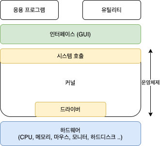</p>


## 부팅(Booting)

운영체제는 다음의 순서로 실행됩니다.

<p align="center">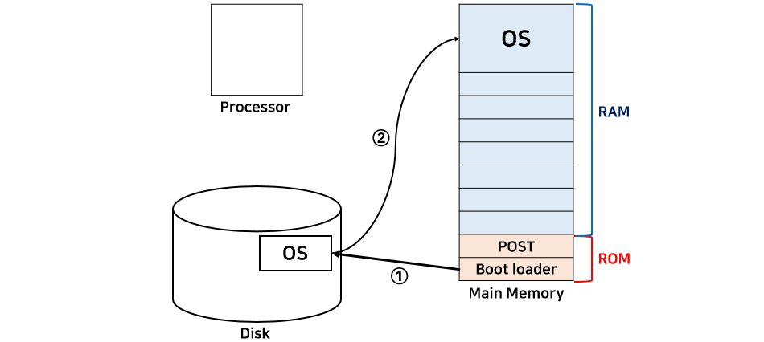</p>

1. 컴퓨터의 전원이 켜진다.
2. 프로세서(CPU)에서 ROM에 있는 내용을 읽는다.
   - ROM 안에는 POST(Power-On Self-Test), 부트 로더(boot loader)가 저장되어 있다.
3. POST는 현재 컴퓨터의 상태를 검사한다.
4. 부트 로더가 실행되어 하드디스크에 저장되어 있는 운영체제를 찾아서 RAM에 가지고 온다.


## Shell 과 Kernel

운영체제는 크게 셸과 커널로 나누어집니다.

<p align="center"></p>

셸(Shell)은 명령어 해석기입니다. 사용자의 지시를 해석하여 시스템에 전달하는 인터페이스 역할을 합니다. sh, bash 등이 있습니다.


커널(Kernel)은 운영체제의 핵심 기능을 하는 제어 프로그램입니다. 프로그램이 요청한 처리를 하드웨어에 나누어 처리를 요구합니다. 시스템 콜을 수행하며, 메모리 관리, 프로세스 관리, 파일 시스템 관리, 입출력 관리, 프로세스 간 통신 관리 등의 작업을 수행합니다.

- 프로세스 관리 : 프로세스에 CPU를 분배하고 작업에 필요한 제반 환경 제공
- 메모리 관리 : 프로세스에 작업 공간을 배치하고 실제 메모리보다 큰 가상공간 제공
- 파일 시스템 관리 : 데이터 저장하고 접근 할 수 있는 인터페이스 제공
- 입출력 관리 : 필요한 입출력 서비스 제공
- 프로세스 간 통신 관리 : 공동 작업을 위한 각 프로세스 간 통신 환경 제공

<br>

# 프로세스와 쓰레드 (Process and Thread)

## 프로세스

프로세스(Process)는 운영체제로부터 자원을 할당 받은 작업의 단위입니다. 

프로그램을 실행하면 운영체제는 프로그램 파일을 컴퓨터 메모리 공간에 할당합니다.

즉, 메모리 공간을 할당받아 실행되고 있는 프로그램을 프로세스라고 할 수 있습니다.  

운영체제는 프로세스마다 각각 독립된 메모리 영역을 Code/Data/Stack/Heap 형식으로 할당해줍니다.

Data에는 전역 변수들이 저장되고 Stack에는 함수의 매개변수, return 주소, 로컬 변수와 같은 임시 값들을 저장합니다. heap에는 프로세스 실행 중에 동적으로 할당되는 값들이 저장됩니다. 

<p align="center">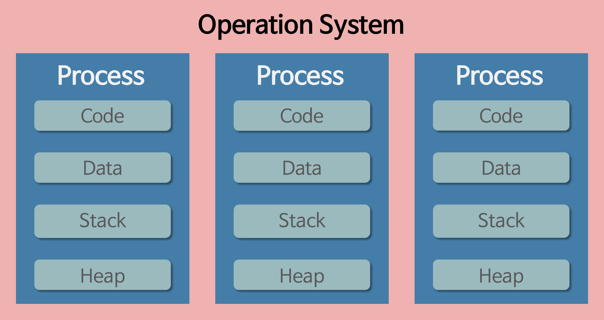</p>

각 프로세스는 별도의 메모리 공간에서 실행되기 때문에 다른 프로세스의 자원에 접근할 수 없으며,

접근하려면 IPC(Inter Process Communication)를 사용해야 합니다.


## 쓰레드

쓰레드(Thread)는 프로세스가 할당 받은 자원을 이용하는 실행 흐름의 단위입니다.

쓰레드는 프로세스의 작업들을 실행 흐름에 따라 분리한 것입니다. 

기본 적으로 프로세스는 최소 1개의 쓰레드를 가지고 있다. 이를 메인 쓰레드라고 합니다.

쓰레드는 프로세스 안에서 존재하는 것이다. 프로세스와 쓰레드를 코드에 비유하면 프로세스는 코드 전체이고 쓰레드는 그 중 main 함수와 같이 함수들이 될 수 있습니다. 

쓰레드는 프로세스 내에서 Stack만 따로 할당받고, Code, Data, Heap 영역은 공유합니다. 

<p align="center"></p>

그래서 프로세스와 다르게 쓰레드 간의 일부 공간이나 자원을 공유하여 작동합니다.

<p align="center">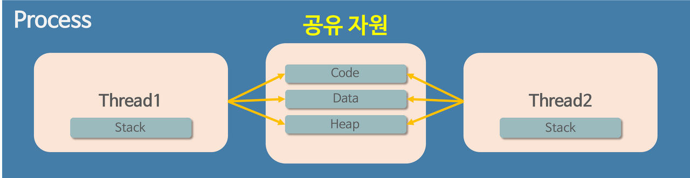</p>


## 멀티 쓰레드

 하나의 프로세스를 다수의 실행 단위로 구분하여 자원을 공유하고 자원의 생성과 관리의 중복성을 최소화하여 수행 능력을 향상시키는 것을 멀티스레딩이라고 합니다. 이 경우 각각의 스레드는 독립적인 작업을 수행해야 하기 때문에 각자의 스택과 PC 레지스터 값을 갖고 있습니다.


#### 스택을 쓰레드마다 독립적으로 할당하는 이유

스택은 함수 호출 시 전달되는 인자, 되돌아갈 주소값 및 함수 내에서 선언하는 변수 등을 저장하기 위해 사용되는 메모리 공간입니다. 

독립적인 실행 흐름을 추가하기 위해서는 독립적인 함수 호출이 가능해야 합니다. 그래서 스택 메모리 공간이 독립적으로 존재해야 합니다.

따라서 쓰레드의 정의에 따라 독립적인 실행 흐름을 추가하기 위한 최소 조건으로 독립된 스택을 할당합니다.


#### PC Register 를 쓰레드마다 독립적으로 할당하는 이유

쓰레드는 CPU 를 할당받았다가 스케줄러에 의해 다시 반환합니다.  그래서 PC Register에 쓰레드가 명령어의 어느 부분까지 수행했는지 PC 값을 저장해놓을 필요가 있습니다. 

따라서 PC 레지스터를 독립적으로 할당합니다.


## 멀티 프로세스 VS 멀티 쓰레드

멀티 프로세스는 하나의 응용 프로그램을 여러 개의 프로세스로 구성하여 각 프로세스가 하나의 작업을 수행하도록 하는 것입니다. 

- 장점
  - 멀티 프로세스는 프로세스 중 하나에 문제가 발생했을 때 그 프로세스 외의 프로세스에 영향이 생기지 않습니다. 
- 단점
  - Context Switching이 발생하면 CPU 레지스터와 캐쉬에 있는 데이터를 모두 리셋해야 하므로 오버헤드가 매우 큽니다.
  - 프로세스는 각각의 독립된 메모리 영역을 할당 받았기 때문에 프로세스 사이의 통신을 위해서는 IPC를 이용해야 합니다. 그리고 

멀티 쓰레드는 하나의 응용 프로그램을 여러 개의 쓰레드로 구성하여 각 쓰레가 하나의 작업을 수행하도록 하는 것입니다. 대표적으로 웹 서버가 멀티 쓰레드 응용 프로그램입니다. 많은 운영체제들이 멀티 프로세스를 지원하지만 멀티 쓰레드를 기본으로 합니다. 

- 장점
  - 쓰레드 간 데이터 공유가 가능하므로 데이터를 주고 받는 것이 비교적 수월합니다. 
  - Context Switching이 발생했을 때 stack 영역만 처리하므로 더 적은 오버헤드가 발생합니다. 
  - 더 적은 메모리 영역이 필요하므로 시스템의 자원 소모도 감소할 수 있습니다. 
- 단점
  - 쓰레드 중 하나에 문제가 발생했을 때 전체 프로세스에 영향을 끼치는 단점이 있습니다. 
  - 자원을 공유하기 때문에 **동기화 문제가 발생**할 수 있습니다.

정리하면 멀티 쓰레드는 멀티 프로세스에 비해 자원의 효율성 증대, 처리 비용 감소, 응답 시간 단축의 이점이 있지만 쓰레드에 문제가 생겼을 때 전체 프로세스에 영향이 생긴다는 것과 동기화 문제가 발생할 수 있으므로 이를 적절히 해결해 주어야 한다는 주의점이 있습니다.

<br>


# 인터럽트 (Interrupt)

인터럽트란 프로세서가 프로그램을 실행하고 있을 때, 입출력 장치나 예외상황의 핸들링이 필요할 경우 프로세서에서 실행 중인 프로그램을 멈추고 상황을 처리하도록 하는 명령입니다.

주요 인터럽트로는 CPU 선점형 스케쥴러의 타이머 인터럽트, 입출력 인터럽트, 1/0 연산 인터럽트(Divide-by-Zero Interrupt)과  등이 있습니다.


## 인터럽트 종류

- 하드웨어 인터럽트(=외부 인터럽트)

  - 입출력장치, 타이밍 장치, 전원 등 외부적인 요인에 의해 발생합니다. 
  - ISR 종료 후 대기합니다.

- 소프트웨어 인터럽트(=내부 인터럽트)

  - 소프트웨어가 OS 서비스를 요청하거나 에러를 일으켰을 때 발생합니다. 

  - 파일 읽기/쓰기, 0으로 나누기, Overflow 등이 있습니다.

  - ISR 종료 후 다시 프로그램으로 돌아거나 프로그램을 강제로 종료합니다.

  - **시스템 콜**도 의도적으로 일으킨 예외 인터럽트입니다.

    

## 인터럽트 처리 과정

프로그램 실행 중 인터럽트가 발생하였다면,

<p align="center">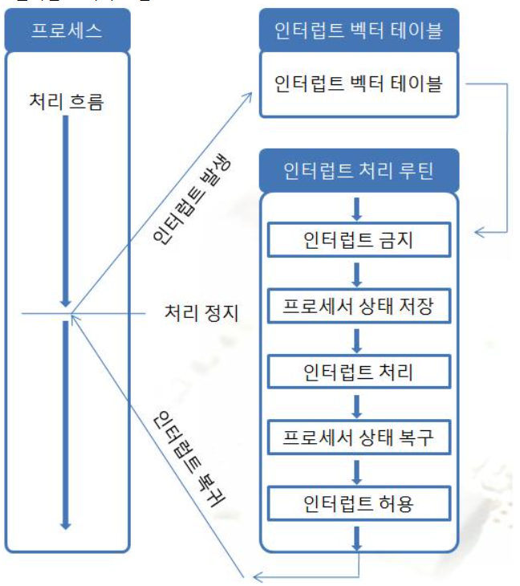</p>

- CPU는 실행 중이던 명령어를 마치고 인터럽트 라인을 통해 인터럽트가 걸렸음을 인지합니다.

- **인터럽트 벡터**를 읽고 ISR 주소값을 얻어 **ISR(Interrupt Service Routine)**로 점프하여 루틴을 실행합니다.

  - 인터럽트 벡터는 인터럽트 발생시 처리해야 할 ISR의 주소를 인터럽트 별로 보관하고 있는 테이블입니다.

  - ISR은 인터럽트 핸들러라고도 하며 인터럽트를 처리하는 프로그램이며 OS에서 지원합니다. 인터럽트별로 처리해야할 내용이 있습니다.

- ISR에서 동기화를 막기 위해 인터럽트를 금지합니다.

- 프로세서는 현재까지 수행중이었던 상태를 해당 process의 **PCB(Process Control Block)**에 저장합니다.

- PC(Program Counter, IP)에 다음에 실행할 명령의 주소를 저장합니다.

- 해당 인터럽트를 처리합니다.

- 다 처리하면, 대피시킨 프로세서의 상태를 복원합니다.

- ISR의 끝에 IRET 명령어에 의해 인터럽트가 해제됩니다.

- IRET 명령어가 실행되면, 대피시킨 PC 값을 복원하여 이전 실행 위치로 복원합니다.


## 인터럽트가 없다면?

입출력 연산은 프로세서의 명령 수행 연산보다 훨씬 느립니다. 

예를 들어 프로세서가 입력 장치를 주기적으로 검사하며 신호를 기다린다면(Polling 방식) 그 때 마다 프로세서는 다른 작업을 수행할 수 없기 때문에 프로세서의 오버헤드가 증가하여 시간이 낭비될 것입니다. 

하지만, 인터럽트가 입출력 장치의 처리 신호를 보내준다면 프로세서가 다른 작업을 하고 있다가 그 작업을 처리할 수 있게 됩니다.

<br>

<br>

# 시스템 콜

<br>

## 1. CPU 모드

CPU는 사용자 애플리케이션(User Application)이 시스템을 손상시키는 것을 방지하기 위해 2가지 모드를 제공한다. CPU에 있는 Mode bit로 모드를 구분하며 0은 커널 모드(운영체제 프로세스 실행) 1은 사용자 모드(사용자 프로세스 실행)를 나타낸다. 

- 사용자 모드(User Mode)

  사용자 모드에서 사용자 애플리케이션 코드가 실행된다. 사용자가 접근할 수 있는 영역에 제한이 있기 때문에 해당 모드에서는 하드웨어(디스크, I/O 등) 에 직접적으로 접근할 수 없다. 접근을 위해서는 시스템콜(System Call)을 사용해야한다. 사용자 애플리케이션의 각 스레드들은 고유의 사용자 모드 스택을 가진다. 


- 커널 모드(Kernel Mode)

  운영체제(OS)가 CPU를 사용하는 모드이다. 시스템콜을 통해 커널모드로 전환이 되면 운영체제는 하드웨어를 제어하는 명령어(Privileged Instructions)를 실행한다. Privileged Instructions은 사용자 모드에서 실행되면 exception이 발생한다.

<p align="center">
 </p>
<br>

<br>

## 2. 시스템콜(System Call)

운영체제에서 제공하는 서비스들을 사용하기 위한 프로그래밍 인터페이스이다. 보통 직접적으로 시스템 콜을 사용하기보다 API(라이브러리 함수)를 통해 사용하게 된다.


<p align="center">
 </p>

<br>


### 시스템  콜 종류

시스템 콜은 프로세스 제어, 파일 조작, 디바이스 조작, 정보 유지, 통신, 보호 크게 6가지로 분류할 수 있다. 

<br>

1. 프로세스 제어(Process Control)
   - 프로세스 생성/제거
   - 끝내기, 중지
   - 적재, 실행
   - 대기
   - 메모리 할당/해제
   
2. 파일 조작(File Manipulation)
   - 파일 생성/삭제
   - 열기/닫기/읽기/쓰기
   
3. 디바이스 조작(Device Manipulation)
   - 장치 요청/해제
   - 장치 읽기/쓰기/위치 변경
   - 속성 설정
   
4. 정보 유지(Information Maintenance)
   - 시간, 날짜 설정/요청
   
5. 통신(Communication)
   - 통신 연결 생성/제거
   - 송신/수신
   
6. 보호(Protection)
   - 권한 관리


<p align="center">
 </p>
<br>

### 시스템 콜 vs 라이브러리 함수

#### **시스템 콜**

커널 자원을 사용자가 사용할 수 있도록 만들어 놓은 함수들이며 호출 시 커널 모드로 전환이 되어 실행된다. 리턴 타입은 대부분 int이고 오류는 -1, 정상은 0 이상의 값을 반환한다.

<br>

#### **라이브러리 함수**

문자열/표준 입출력 등 사용자가 많이 사용하는 기능들을 미리 함수로 만들어 놓은 것이며 내부적으로 시스템 콜을 사용하지만 호출 시 사용자 모드에서 실행된다. 목적에 따라 다양한 타입의 리턴값을 갖으며 개발을 쉽게 만들거나 시스템 콜 호출을 최소화하기 위해 제공된다. 예를 들어, 파일 입/출력시 read(), write()와 같은 시스템 콜들을 호출할 때마다 커널 모드로 전환되어 바로 파일에 기록된다. 반면 라이브러리 함수인 fread(), fwrite()의 경우는 버퍼를 사용해 내부적으로 한번만 read(), write()를 실행하기 때문에 시스템 자원을 효율적으로 사용하게 된다. 내부적으로 시스템 콜을 호출하기 때문에 wrapper 함수라고도 부른다.

Windows API, POSIX API, Java API 등이 있다. 
<p align="center">
 </p>


<br>

### 시스템 콜 실행 과정(Linux)

<p align="center">
 </p>

```
1. 라이브러리 함수(printf)를 호출한다.
2. 라이브러리 함수 내부에서 시스템 콜(write)를 호출한다.
3. 해당 시스템 콜의 인덱스(4)를 CPU 레지스터에 저장한다.
4. 0x80 인터럽트를 발생시킨다.(커널 모드로 전환)
5. IDT(Interrupt Descriptor Table)를 참조하여 system_call()을 호출한다.
6. 이때 3에서 저장한 인덱스를 system_call() 함수 내에 전달한다. 
7. sys_call_table을 참조해 해당 인덱스에 맞는 기능(sys_write)을 호출한다. 
8. 수행이 모두 끝나면 사용자 모드로 전환된다.
```
<br>

<br>

# PCB와 Context Switching

## PCB(Process Controll Block)

PCB는 OS에서 **프로세스에 대한 중요 정보를 저장**하고 있는 자료구조입니다.  OS는 프로세스를 관리하기 위해 **프로세스의 생성과 동시에 고유한 PCB 를 생성**합니다.

<p align="center">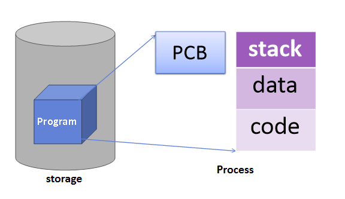</p>

> 프로그램 실행 -> 프로세스 생성 -> 프로세스 주소 공간에 (stack, data, stack) 생성 -> 이 프로세스의 메타데이터들이 PCB에 저장

CPU에서 프로세스 수행 중에 작업을 멈추고 다른 프로세스를 처리해야 하는 경우가 생깁니다. 그 때, 기존에 수행하고 있던 프로세스에 프로세스의 정보를 저장하는 곳이 PCB입니다.  

OS는 PCB에 현재까지 수행한 프로세스의 상태를 저장하고 CPU를 반납합니다. 그래서 PCB에는 이전까지 수행하고 있던 **프로세스가 다음에 수행해야 할 상태값**이 저장됩니다.  

**프로세스가 종료되면 OS는 해당 프로세스의 PCB를 제거**합니다.


## PCB에 저장되는 정보

<p align="center"></p>

- 프로세스 식별자(Process ID, PID) : 프로세스 식별번호
- 프로세스 상태 : new, ready, running, waiting, terminated 등의 상태를 저장
- 프로그램 카운터 : 프로세스가 다음에 실행할 명령어의 주소
- CPU Register 정보
- CPU 스케쥴링 정보 : 프로세스의 우선순위, 스케줄 큐에 대한 포인터 등
- 메모리 관리 정보 : 페이지 테이블 또는 세그먼트 테이블 등과 같은 정보를 포함
- Accounting 정보 : 사용된 CPU 시간, 시간제한, 계정번호 등
- 입출력 상태 정보 : 프로세스에 할당된 입출력 장치들과 열린 파일 목록


## Context Switching

Context Switching은 **CPU가 현재 수행하고 있는 작업(Process, Thread)의 상태를 저장하고 다음 진행할 작업의 상태 및 Register 값들에 대한 정보(Context)를 읽어 새로운 작업의 Context 정보로 교체하는 과정**을 말합니다.  여기서 Context란 CPU가 다루는 작업에 대한 정보를 말하고, 대부분의 정보는 Register에 저장되고 PCB로 관리됩니다. 그래서 이를 위의 **PCB의 역할에 맞추어 말하면 CPU가 이전의 프로세스 상태를 PCB에 보관하고, 또 다른 프로세스의 정보를 PCB에서 읽어서 레지스터에 적재하는 과정**을 말합니다.

Context Switching은 Interrupt가 발생하거나, 실행 중인 CPU 사용 시간을 모두 소모하거나, 입출력을 위해 대기해야 하는 경우 발생합니다.

즉, Context Switching은 **프로세스가** Ready -> Running , Running -> Ready , Running -> Block 처럼 **상태 변경 시에 발생**합니다. 그러므로 **Context Switching을 하는 주체는 CPU 스케쥴러**입니다.


## Context Switching 수행 과정

<p align="center">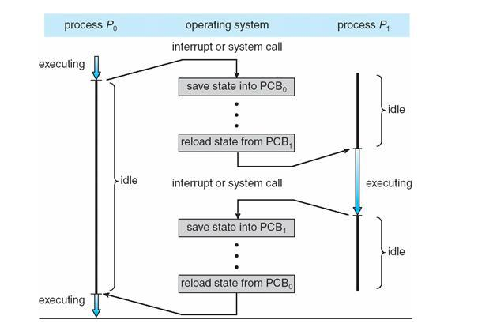</p>

> 프로세스 P0과 P1이 존재하고 P0이 CPU를 점유 중이고, P1이 대기 중일 때 Interrupt나 System Call이 발생하여 P1이 CPU를 점유하게 된다면 위와 같은 Context Switching 과정이 수행 됩니다.


## Context Switching Overhead

Context Switching이 발생하게 되면 다음과 같은 과정이 필요합니다.

- Cache 초기화

- Memory Mapping 초기화

- 메모리의 접근을 위해서 Kernel은 항상 실행되어야 합니다.

이 과정에서 소요되는 시간을 Cost라고 표현합니다. **Cost는 낭비되는 시간**이라고 생각할 수 있습니다. 이렇게 어떤 과정을 할 때 소모되는 Cost들을 Overhead라고 합니다.  그러므로 **어떤 작업을 할 때 Overhead가 높다는 것은 그 과정을 수행하기 위해 필요한 다른 작업들의 Cost가 높다**고 할 수 있습니다.

따라서 Context Switching은 Overhead가 높은 작업이고 잦은 Context Switching 는 성능 저하를 가져옵니다.

Context Switching이 높은 Overhead를 갖음에도 수행하는 이유는 그것을 감안해도 더 이득이기 때문입니다. 예를들어 **프로세스를 수행하다가 I/O event가 발생하여 BLOCK 상태로 전환시켰을 때, CPU가 그냥 놀게 놔두는 것보다 다른 프로세스를 수행시키는 것이 효율적**이므로, Context Switching을 수행하여  CPU로 다른 프로세스를 실행시킵니다.


> **Context Switching과 Interrupt**

CPU는 하나의 프로세스 정보만을 기억합니다. 여러 개의 프로세스가 실행되는 다중 프로그래밍 환경에서 CPU는 각각의 프로세스의 정보를 저장했다 복귀하고 다시 저장했다 복귀하는 일을 반복합니다. 프로세스의 저장과 복귀는 프로세스의 중단과 실행을 의미합니다. 프로세스의 중단과 실행 시 Interrupt가 발생하므로, Context Switching이 많이 일어난다는 것은 Interrupt가 많이 발생한다는 것을 의미합니다.


> **Context Switching과 시간 할당량**

프로세스들의 시간 할당량은 시스템 성능의 중요한 역할을 합니다. 시간 할당량이 적을수록 사용자 입장에서는 여러 개의 프로세스가 거의 동시에 수행되는 느낌을 갖지만 Interrupt의 수와 Context Switching의 수가 늘어납니다. 

------


<br>

# IPC(Inter-Process Communication)

IPC는 **프로세스들 간에 데이터를 주고 받는 통신 또는 그 방법**입니다.

프로세스는 각각 OS로부터 할당받은 독립된 메모리 공간에서 실행됩니다. 하지만 정보 공유, 분산 처리로 작업 속도 향상, 시스템 기능 모듈화 등을 위해서 데이터를 공유하거나 서로 통신이 필요할 때가 있습니다. 이때 사용할 수 있도록 커널에서 여러 방식의 IPC를 제공합니다.


<p align="center"></p>


IPC 는 크게  **Message Passing(메시지 전달) 방식**과 **Shared Memory(공유 메모리) 방식**이 있습니다.


## Message Passing(메시지 전달 방식)

Message Passing은 memory protection을 위해 OS가 커널 내부에 메시지를 기록할 수 있는 공간을 마련해 두어서 receive와 send 시스템 콜을 이용하여 메시지를 커널이 대리 전달합니다. 따라서 OS의 간섭이 지속적으로 필요합니다. 같은 곳을 읽고 쓰는 것이 아니므로 동기화 문제가 발생하지 않으나 커널을 거쳐야 하기 때문에 시간이 오래 걸려 성능이 좋지 않습니다. 또한 시스템 콜을 매번 사용하므로 오버헤드 발생할 수 있습니다.


### PIPE (익명 PIPE)

<p align="center">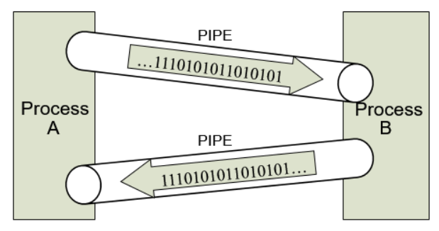</p>

파이프는 두 개의 프로세스를 연결하는 1:1 통신입니니다. 이때, 하나의 프로세스는 데이터를 쓰기만, 다른 하나는 데이터를 읽기만 하는 **단방향 통신**만 가능합니다. 한쪽 방향으로만 통신이 가능한 파이프의 특징 때문에 Half-Duplex(반이중) 통신이라고 부르기도 합니다.

PIPE와 같은 반이중 통신의 경우 하나의 통신선로는 읽기나 쓰기 중 하나만 가능하므로 만약 읽기와 쓰기, 즉 송/수신을 모두 하기 원한다면 두개의 파이프를 만들어야 합니다.

read()와 write()가 기본적으로  block mode로 작동되기에 프로세스가  read 대기 중이라면 read가 끝나기 전에 write를 할 수 없습니다.

- 장점
  - 매우 간단하게 사용할 수 있습니다. 
  - 한쪽 프로세스가 단지 읽기만 하고 다른 쪽 프로세스는 단지 쓰기만 하는, 단순한 데이터 흐름에 적합합니다.
- 단점
  - 반이중 통신이므로 프로세스가 읽기와 쓰기 통신 모두를 해야 한다면 PIPE를 두개 만들어야 합니다. 
  - **부모-자식 프로세스** 간에만 사용 가능합니다.

> 부모-자식 프로세스
>
> 프로세스는 실행되는 도중 시스템 콜을 통해 새로운 프로세스를 생성할 수 있습니다. 
>
> 다른 프로세스를 생성한 프로세스를 부모 프로세스, 생성 된 프로세스를 자식 프로세스라고 합니다.


### Named PIPE(FIFO)

익명 파이프(Pipe)는 부모-자식 프로세스와 같이 통신을 할 프로세스를 명확하게 알 수 있는 경우 사용합니다. 이에 반해,  Named PIPE는 프로세스 통신을 위해 **이름이 있는 파일을 사용**하기 때문에 전혀 모르는 상태의 프로세스들 사이의 통신에서도 사용합니다.  

Named PIPE의 생성은 mkfifo를 통해 이뤄지는데, mkfifo가 성공하면 명명된 파일이 생성됩니다.

PIPE 방식은 모두 먼저 입력된 데이터가 먼저 전달되는 흐름을 가진다는 측면에서 동일한 데이터 흐름 메커니즘을 가집니다.

- 장점
  - 익명 pipe와 비슷합니다.
  - 익명 pipe와 다르게 부모-자식간의 프로세스가 아니어도 통신이 가능합니다.

- 단점 

  - 익명 pipe와 비슷합니다.

    

### Message Queue

<p align="center">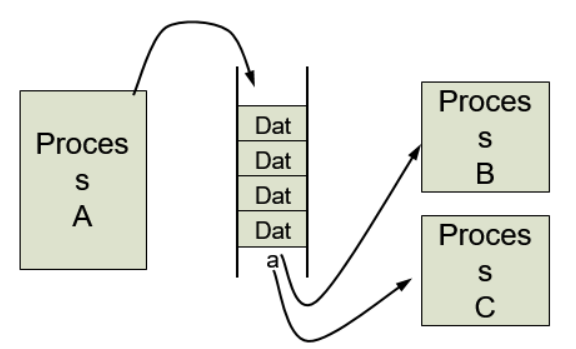</p>

Message Queue는 고정된 크기를 갖는 메시지의 연결 리스트를 이용한 메시지 단위의 통신입니다. 메세지의 형태는 사용자가 정의할 수 있으며, 통신하고자 하는 프로세스 간에 정의가 필요합니다. 입출력 방식으로 보자면 위의 Named PIPE와 동일하다고 볼 수 있지만, Name PIPE가 데이터의 흐름이라면 Message Queue는 **메모리 공간**이라는 차이가 있습니다. 

Message Queue 는 어디에서나 물건을 꺼낼 수 있는 컨테이너 벨트라고 볼 수 있습니다. Message Queue에 쓸 데이터에 번호를 붙임으로써 여러 개의 프로세스가 동시에 데이터를 쉽게 다룰 수 있습니다.

- 장점
  - 비동기 방식입니다. 큐에 넣은 데이터를 나중에 처리할 수 있습니다.
  - 분산 처리 및 경쟁 처리에 사용할 수 있습니다.
- 단점
  - 메시지가 잘 전달되었는지 알 수 없습니다.
  - 큐에 데이터를 넣고 빼는 과정에서 Overhead가 발생합니다.
  - 데이터가 많이 쌓이면 추가적인 메모리 자원이 필요합니다.


### Socket

<p align="center">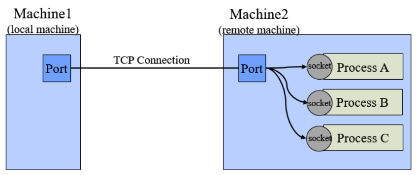</p>


Socket은 일반적으로 두 네트워크 프로그램 사이에서 데이터의 입출력의 관문, 또는 그를 위한 운영체제의 API로 많이 쓰입니다. 파이프 관점을 네트워크로 확장한 것으로 생각할 수 있습니다. 그래서 프로세스들 사이의 통신에서도 OS가 제공하는 Port를 통해 사용할 수 있습니다. 

- 장점
  - 양방향 통신이 가능합니다.
  - 패킷 단위로 주고 받습니다.
  - 서버/클라이언트 환경을 구축할 수 있습니다.


## Shared Memory(공유 메모리 방식)

다수의 프로세스가 동시에 작동하는 Linux 운영체제의 특성상 프로세스의 메모리 영역은 반드시 보호되어져야 합니다. 그렇지만 메모리 영역에 있는 데이터를 다른 프로세스도 사용할 수 있도록 해야하는 경우도 있습니다. Thread에서 처럼 메모리 영역을 공유한다면 더 편하게 데이터를 함께 사용할 수 있을 것입니다. 

Shared Memory(공유 메모리)는 **프로세스간 메모리 영역을 공유해서 사용할 수 있도록** **허용**합니다. 프로세스가 공유 메모리 할당을 커널에 요청하면 커널은 해당 프로세스에 메모리 공간을 할당해줍니다. 이후 접근할 프로세스들이 규약을 정해서 해당 메모리 영역에 접근할 수 있습니다.

공유메모리는 커널이 처음 생성하지만 이후에 커널의 도움 없이 곧바로 메모리에 접근할 수 있기 때문에 다른 모든 IPC들 중에서 가장 빠르게 작동할 수 있습니다. 하지만, Producer-Consumer Problem 같은 동기화 문제가 생길 수 있기 때문에 Semaphore 등으로 해결해야 합니다.

- 장점

  - 커널의 관여 없이 메모리를 직접 사용하여 IPC들 중에서 속도가 가장 빠릅니다.
  - Message Passing에 비해 한 번에 대량의 데이터 통신이 가능합니다.

- 단점

  - 커널의 관여가 없기 때문에 동기화 문제를 직접 처리해야 하므로 구현이 어렵습니다.

  - Producer-Consumer Problem

    

> ##### **Producer-Consumer Problem**
>
> 정보를 생산하는 Producer와 정보를 소비하는 Consumer 프로세스가 있다. 이 두 프로세스는 같은 공간을 공유한다. 두 프로세스가 생산과 소비를 반복하면서 문제가 발생할 수 있다.
>
> 1. 생산자가 생산하려고 할 때 더 이상 저장할 공간이 없는 문제가 발생할 수 있고,
> 2. 이 공간에 소비자가 더 이상 소비할 아이템이 없는 경우가 발생할 수 있다.


### Memory Map

Memory Map은 열린 파일을 메모리에 맵핑시켜서 공유합니다. 파일은 시스템의 전역적인(모두 공유할 수 있는) 자원이므로 서로 다른 프로세스들끼리 데이터를 공유할 수 있습니다.

- 장점
  - 데이터가 메모리에 올라와 있는 것처럼 간단하게 접근 할 수 있습니다.
- 단점
  - 많은 데이터를 얼마나 오랫동안 메모리에 둘 것인지 컨트롤 할 수 없습니다.

------

<br>

# CPU 스케줄링 (CPU Scheduling)

## CPU 스케줄링이란?

단일 처리기 시스템에서는 한 순간에 하나의 프로세스만 실행될 수 있습니다. 즉, 나머지 프로세스는 CPU가 자유상태가 될 때까지 무기한 대기해야 하는 것이죠.

다중 프로그래밍의 목적은 CPU 이용률을 최대화하기 위해 항상 실행중인 프로세스가 존재하도록 하는 데 있습니다. 따라서 운영체제는 CPU를 점유한 프로세스에 대기가 발생할 때마다 그 프로세스로부터 CPU를 회수하여 다른 프로세스에게 할당하는 스케줄링을 시도합니다.

<br>

## CPU 스케줄링과 관련된 사전 지식

### CPU-입/출력 버스트 사이클(CPU I/O Burst Cycle)

먼저 프로세스가 실행되는 도중 CPU를 사용하지 않아 CPU가 쉬게 되는 상황에 대해 알아봅시다.

프로세스 실행은 **CPU 실행과 입/출력 대기의 사이클**로 구성됩니다. CPU가 필요할 때는 CPU를 집중적으로 사용하다가 입/출력 요청이 발생할 때는 CPU는 잠시 쉬고 입/출력을 대기하고 있는 것이죠.

프로세스가 실행되면 최초에는 CPU 버스트(CPU burst)로 시작하여 CPU를 집중적으로 사용합니다. 그러다 입/출력 요청이 발생하면 입/출력 버스트(I/O burst)로 교체되고, 이후 입출력이 끝나면 다시 CPU 버스트가 실행되며 이후에는 이 두 버스트가 반복적으로 발생하는 패턴을 보입니다.

입/출력 중심의 프로그램은 전형적으로 긴 입/출력 버스트와 짧은 CPU 버스트를 가지는 편이고, CPU 지향 프로그램은 전형적으로 짧은 입/출력 버스트와 긴 CPU 버스트를 가지는 편입니다. 따라서 CPU-입/출력 버스트 분포를 파악하여 CPU 스케줄링 알고리즘을 선택해야 합니다.

### CPU 스케줄러 (CPU Scheduler)

CPU 할당을 기다리는 프로세스들이 모여있는 준비 완료 큐는 선입선출 큐, 우선순위 큐, 순서가 없는 연결 리스트 등으로 구현되어 있습니다.

입/출력 버스트 등에 의해 CPU가 유휴 상태가 될 때마다, 운영체제는 준비 완료 큐에 있는 프로세스 중 하나를 선택하여 실행해야 합니다. 이를 수행하는 것이 단기 스케줄러(Short term Scheduler 혹은, CPU 스케줄러)입니다.

준비 완료 큐에 있는 레코드들은 프로세스 제어 블록(PCB) 형태로 존재합니다.

- PCB : 해당 프로세스 상태, 다음에 실행할 명령어의 주소, 프로세스 우선순위, 프로세스와 연관된 입/출력 장치 등에 대한 다양한 프로세스 정보를 수록한 블록

### 선점 스케줄링 (Preemptive Scheduling)

특정 프로세스에 CPU가 할당되어 사용되는 도중 다음과 같은 고민되는 순간이 생깁니다. 

>- 현재 실행중인 프로세스보다 우선 순위가 높은 프로세스가 준비 완료 큐에 들어왔을 때 해당 프로세스에게 CPU를 넘겨줘야 할까?
>- 현재 프로세스가 아직 작업을 마치지 못했는데 자신에게 주어진 CPU 점유 시간을 다 채웠을 때는 어떻게 해야 할까?
>- 🤔

위와 같은 상황에서 CPU를 계속 현재 프로세스에게 할당할 것인지, 아니면 다음 프로세스에게 넘겨줄 것인지(선점)를 결정하는 것에 따라 **선점/비선점 스케줄링**을 구분합니다.

#### 선점 스케줄링 상황

CPU 선점이 발생할 수 있는 조금 더 구체적인 상황을 생각해봅시다.

1. 한 프로세스가 실행 상태에서 대기 상태로 전환될 때(입/출력 요청이 들어왔을 때, 혹은 자식 프로세스의 종료를 기다리기 위해 wait을 호출할 때 등)
2. 프로세스가 실행 상태에서 준비 완료 상태로 전환될 때(인터럽트가 발생했을 때 등)
3. 프로세스가 대기 상태에서 준비 완료 상태로 전환될 때(입/출력 요청이 들어와 입/출력을 완료하고 입/출력이 종료될 때 등)
4. 프로세스가 종료할 때

- 위의 상황 중 1, 4의 경우에는 무조건 다음 프로세스에게 CPU를 할당해야 겠죠. 하지만 2, 3의 경우에는 현재 실행중인 프로세스가 계속 CPU를 점유할지, 혹은 준비 완료 큐의 다른 프로세스에게 CPU를 넘겨줘야할 지 결정해야 합니다.
- 만약 1, 4의 상황에서만 스케줄링이 발생할 경우, 즉 일단 CPU가 한 프로세스에 할당되면 해당 프로세스가 종료되거나 혹은 대기상태로 전환되기 전까지는 해당 프로세스가 무조건 CPU를 점유하게 되는 경우를 **비선점(non-preemptive)** 혹은 **협조적(cooperative)**이라고 합니다.(Microsoft Windows 3.1, Mac OS X 이전 Macintosh 운영체제에서 사용하던 스케줄링 기법)
- 만약 1, 4뿐만 아니라 2, 3의 상황에서도 스케줄링이 발생할 경우, 즉 준비 완료 큐에 존재하는 다른 프로세스가 현재 프로세스를 제치고 CPU를 선점하는 경우를 **선점(preemptive)**이라고 합니다.(Windows 95 이후의 Windows 운영체제, Mac OS X 이후의 Macintosh 운영체제에서 사용하는 스케줄링 기법)

선점 스케줄링의 경우 공유 자료에 대한 접근에 주의를 기울여야 합니다. 또한 비선점 스케줄링보다 운영체제 커널 설계 등이 복잡할 수 있습니다.

### 디스패쳐 (Dispatcher)

디스패쳐는 CPU 스케줄러의 결정에 의해 선택된 프로세스에게 CPU를 넘겨주는 모듈입니다. 구체적인 디스패쳐의 역할은 다음과 같습니다.

- 문맥 교환(Context Switching)
- 사용자 모드로 전환
- 프로그램을 다시 시작하기 위해 사용자 프로그램의 적절한 위치로 이동

위와 같은 작업을 수행하면서 소모하는 시간을 디스패치 지연(dispatch latency)이라고 합니다.

<br>

## CPU 스케줄링 기준

CPU 스케줄링 알고리즘은 모두 서로 다른 특징을 갖고 있습니다. 특정 상황에서 더 나은 스케줄링 알고리즘을 선택하기 위해 다음과 같은 기준을 바탕으로 성능을 비교할 수 있습니다.

1. CPU 이용률 (CPU utilization)
    - CPU가 사용되는 정도

2. 처리량 (Throughput)
    - 단위 시간당 완료된 프로세스의 개수(작업량)

3. 총처리 시간 (Turnaround time)
    - 한 프로세스를 실행하는데 소요된 시간
    - 프로세스 완료 시간에서 프로세스 제출 시간을 마이너스
    - 준비 완료 큐에서 대기한 시간, CPU에서 실행하는 시간, 입/출력 시간 등을 포함

4. 대기 시간 (Waiting time)
    - 프로세스가 준비 완료 큐에서 대기하면서 보낸 시간의 합

5. 응답 시간 (Response time)
    - 대화식 시스템(interactive system)을 위한 기준
    - 응답이 시작되는 데까지 걸리는 시간

효율적인 스케줄링을 위해서는 CPU 이용률과 처리량는 최대화, 총처리 시간, 대기 시간, 응답 시간은 최소화하는 것이 바람직합니다.

<br>

## CPU 스케줄링 알고리즘

다양한 CPU 스케줄링 알고리즘을 소개합니다. 각 알고리즘의 특징과 장단점을 고려하여 프로그램에 맞는 알고리즘을 선택해야 합니다. 이 글에서 각 알고리즘의 성능은 평균 대기 시간으로 비교합니다.

### 선입 선처리 스케줄링 (First-Come, First-Served Scheduling)

- CPU를 먼저 요청한 프로세스가 CPU를 먼저 할당받습니다. 즉, 준비 완료 큐에 들어온 순서대로 프로세스를 할당받습니다.
- CPU가 자유상태가 되면 준비 완료 큐의 가장 앞에 있는 프로세스에게 CPU를 할당하고, 준비 완료 큐는 가장 앞에 위치한 프로세스를 제거합니다.
- 이 때, 준비 완료 큐는 선입선출(FIFO) 큐로 관리됩니다.
- 비선점형 스케줄링 기법입니다.
- 장점 : 구현이 쉽습니다.
- 단점
    - 최소 평균 대기 시간을 보장하지 않습니다.
    - 하나의 긴 프로세스가 CPU를 점유할 경우 모든 다른 프로세스들이 CPU 양도를 기다리는 호위효과(convoy effect)가 발생합니다. -> CPU와 장치 이용률 저하

#### 스케줄링 시뮬레이션

<p align="center"></p>
<p align="center">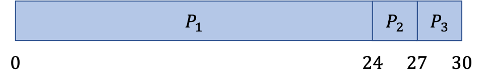</p>

> 평균대기시간 = (0+24+27)/3 = 17

<br>

### 최단 작업 우선 스케줄링 (Shortest-Job-First Scheduling)

- 가장 작은 CPU 버스트를 가진 프로세스가 CPU를 먼저 할당받습니다.
- 단, 두 프로세스가 동일한 길이의 다음 CPU 버스트를 가질경우 선입 선처리 스케줄링을 적용합니다.
- 선점형, 비선점형 스케줄링을 모두 적용할 수 있습니다.
- 장점 : 최소 평균 대기 시간을 보장하므로 **최적** 스케줄링 기법입니다.
- 단점 : 다음 CPU 버스트 길이를 미리 파악하기 어렵습니다.(다음 CPU 버스트 길이가 이전의 버스트 길이와 유사할 것이라고 기대한 뒤 근사 값을 계산하는 방법이 있습니다.)

#### 비선점형 스케줄링 시뮬레이션

<p align="center"></p>
<p align="center">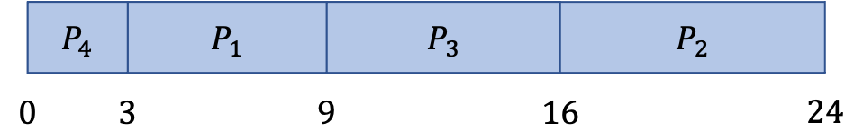</p>

> 평균대기시간 = (3+16+9+0)/4 = 7

#### 선점형 스케줄링(최소 잔여 시간 우선 스케줄링) 시뮬레이션

<p align="center"></p>
<p align="center">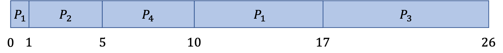</p>

> 평균대기시간 = ((10-1)+(1-1)+(17-2)+(5-3))/4 = 6.5

<br>

### 우선순위 스케줄링 (Priority Scheduling)

- 각 프로세스는 특정 기준에 의해 우선순위가 부여되어 있습니다. 이 기준에 의해 우선순위가 가장 높은 프로세스가 CPU를 먼저 할당받습니다.
- 단, 우선순위가 같은 프로세스들은 선입 선처리 스케줄링을 적용합니다.
- SJF 스케줄링 역시 우선순위 스케줄링의 한 종류라고 볼 수 있습니다.
- 우선순위의 기준으로는 시간 제한, 메모리 요구, 열린 파일의 수, 평균 입/출력 버스트의 평균 CPU 버스트의 비율, 프로세스의 중요도, 비용, 정치적인 요인 등이 있습니다.
- 선점형, 비선점형 스케줄링을 모두 적용할 수 있습니다.
    - 선점형 : 준비 완료 큐에 새로운 프로세스가 들어오면 현재 진행중인 프로세스와 우선순위를 비교하여 우선순위가 더 높은 프로세스가 CPU를 선점
    - 비선점형 : 현재 진행중인 프로세스를 계속 진행하되 새로 들어온 높은 우선순위의 프로세스는 준비 완료 큐의 머리 부분에 삽입
- 장점 : 우선순위를 고려할 수 있습니다.
- 단점 : 낮은 우선순위 프로세스들이 CPU를 무한히 대기하는 문제(**무한 봉쇄(indefinite blocking)** 혹은 **기아 상태(starvation)**)가 발생할 수 있습니다.
    - 위의 문제를 해결하는 방법으로 오랫동안 대기하는 프로세스들의 우선순위를 점진적으로(특정 시간마다) 증가시켜주는 기법(**노화(aging)**)을 적용할 수 있습니다.

#### 선점형 스케줄링 시뮬레이션

<p align="center"></p>
<p align="center">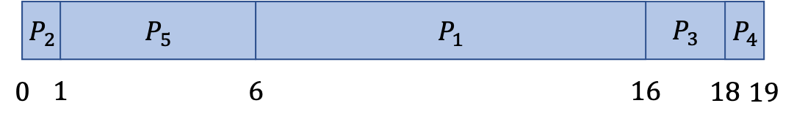</p>

> 평균대기시간 = (6+0+16+18+1)/5 = 8.2

<br>

### 라운드 로빈 스케줄링 (Round-Robin Scheduling)

- 사전에 CPU 시간 할당량(time quantum) 또는 시간 조각(time slice)를 설정하고, 한 프로세스에게 지정된 시간 할당량만큼의 CPU 점유 시간을 부여하는 스케줄링 방법입니다. 
- 시간 할당량만큼 CPU를 점유한 프로세스에게는 인터럽트가 발생하도록 타이머를 설정한 후, 프로세스를 디스패치합니다.
- 시분할 시스템을 위해 설계된 기법입니다.
- 이 때, 준비 완료 큐는 선입선출(FIFO) 큐로 관리됩니다.
- 프로세스는 주어진 시간 할당량 이내에 작업을 완료할 수도 있고 완료하지 못할 수도 있습니다. 이 때는 다음과 같이 처리합니다.
    - 프로세스의 CPU 버스트 < 시간 할당량 : 프로세스가 종료된 이후 자신이 자발적으로 CPU를 방출
    - 프로세스의 CPU 버스트 > 시간 할당량 : 타이머가 끝나고 인터럽트가 발생되면 문맥 교환이 일어나고 실행하던 프로세스는 준비 완료 큐의 꼬리에 위치
- 선점형 스케줄링 기법입니다.
- 장점 : 프로세스가 n개 존재하고 각 프로세스 당 시간 할당량이 q라고 가정한다면, 각 프로세스는 다음 시간 할당까지 최대 (n-1) * q 이상을 대기하지 않음을 보장할 수 있습니다.
- 단점 : 시간 할당량의 크기 설정에 따라 알고리즘의 성능이 크게 영향을 받습니다.
    - 시간 할당량이 지나치게 크면 선입 선처리 스케줄링 기법과 같아질 수 있습니다.
    - 시간 할당량이 지나치게 작으면 문맥 교환 오버헤드가 커져 총처리 시간이 증가합니다.

#### 스케줄링 시뮬레이션 (시간 할당량 : 4)

<p align="center"></p>
<p align="center">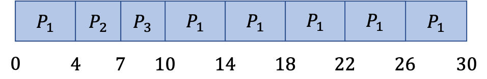</p>

> 평균대기시간 = (10+4+7)/3 = 7

<br>

### 다단계 큐 스케줄링 (Multilevel Queue Scheduling)

- 준비 완료 큐를 다수의 별도의 큐로 분류하여 각 큐마다 제각각의 스케쥴링 알고리즘을 적용하는 방법입니다.
- 프로세스는 포어그라운드(foreground, 대화형) 프로세스와 백그라운드(background, 일괄처리) 프로세스로 구분될 수 있습니다. 일반적으로 대화형 시스템을 위해 포어그라운드 프로세스가 우선순위를 갖는 경우가 많습니다.
- 따라서 프로세스의 메모리 크기, 프로세스의 우선순위, 프로세스 유형, 프로세스 특성에 따라 각각의 프로세스는 특정 큐에 할당될 수 있습니다. 단, 프로세스는 큐 간 이동할 수는 없습니다.
- 각 큐는 낮은 우선순위의 큐보다 절대적인 우선순위를 가집니다. 또한 큐들 사이에 시간을 나누어 CPU를 사용하기도 합니다.
- 선점형 스케줄링 기법입니다.

### 다단계 피드백 큐 스케줄링 (Multilevel Feedback Queue Scheduling)

- 다단계 큐 스케쥴링에서 프로세스가 큐들 사이를 이동하는 것을 허용한 방법입니다.
- 특정 프로세스가 CPU를 너무 많이 점유할 경우, 해당 프로세스를 낮은 우선순위 큐로 이동시킬 수 있습니다.
- 또한 큐에서 너무 오래 대기하는 프로세스는 높은 우선순위 큐로 이동(노화 기법)시킬 수 있습니다.
- 역시 각 큐는 낮은 우선순위의 큐보다 절대적인 우선순위를 가지고 큐들 사이에 시간을 나누어 CPU를 사용할 수도 있습니다.
- 선점형 스케줄링 기법입니다.

<br>

## 다중 처리기 스케줄링 (Multiple-Processor Scheduling)

위에서 정리한 CPU 스케줄링 기법은 단일 처리기 시스템 하에서 하나의 CPU를 어떻게 스케줄링할 것인지 결정했습니다. 하지만 CPU가 여러개라면 여러개의 CPU를 여러 프로세스에게 할당해야하는 더 복잡한 문제가 발생합니다. 다중 처리기 시스템에서는 CPU 스케줄링을 어떻게 결정할까요? 또한 무엇을 고려해야 할까요?

### 다중 처리기 시스템에서의 스케줄링 결정 대상

1. 비대칭 다중 처리(asymmetric multiprocessing)

    - 주 서버라는 하나의 처리기가 모든 스케줄링 결정을 내립니다.
    - 다른 서브 처리기들은 주 서버의 결정에 따라 사용자의 코드만을 수행합니다.
    - 주 서버 처리기만 시스템 자료 구조에 접근하므로 자료 공유로인한 문제가 발생하지 않습니다.

2. 대칭적 다중 처리(symmetric multiprocessing, SMP)

    - 각 처리기가 독자적으로 스케줄링을 합니다.
    - 각 처리기는 공통의 준비 완료 큐에서 프로세스를 선택할 수도 있고, 자신만의 독자적인 준비 완료 큐를 구성할 수도 있습니다.
    - 다중 처리기가 공동의 시스템 자료 구조에 접근하므로 자료 공유 문제를 고려해야 합니다.
    - 또한 공통의 준비 완료 큐를 사용할 경우 다중 처리기가 공통된 프로세스를 선택하지 않도록 조심해야 합니다.

### 다중 처리기 시스템에서의 스케줄링 쟁점

- 처리기 친화성 (Processor Affinity)

프로세스가 여러 처리기로 이동하게 될 경우 캐시 메모리를 채우고 비우는 오버헤드가 발생합니다.

따라서 한 처리기에서 다른 처리기로의 이주를 피하고, 대신 같은 처리기에서 프로세스를 실행시키려고 하는 현상을 보이는데 이 현상을 처리기 친화성이라고 합니다.

- 부하 균등화 (Load Balancing)

모든 처리기 사이의 부하가 고르게 배분되도록 하는 것을 말합니다. 대칭적 다중 처리 시스템에서 여러 처리기를 최적으로 활용하기 위해서는 부하 균등화가 잘 이루어져야 합니다.

부하 균등화는 대칭적 다중 처리 시스템의 각 처리기가 공통의 준비 완료 큐가 아닌 자기 자신만의 큐를 가지고 있을 때 적용 가능합니다. 한 처리기가 과부하 상태일 때 여유로운 처리기로 프로세스를 이동시키는 것을 push, 여유로운 처리기에서 과부하 처리기의 프로세스를 이주시키는 것을 pull 이라 합니다.

단, 부하 균등화는 위에서 소개한 처리기 친화성과 상충되므로 사전에 부하 불균형 상태에 대한 적절한 정의가 이루어져야 합니다.

- 대칭적 다중 쓰레딩 (Symmetric Multithreading)

대칭적 다중 처리 시스템은 다수의 물리적인 처리기를 제공하는 것을 말합니다. 이와 달리 동일한 물리 처리기 상에 다수의 논리적인 처리기를 제공하여 다수의 쓰레드가 동시에 실행되도록 하는 것을 **대칭적 다중 쓰레딩(SMT, 하이퍼쓰레딩 기술(hyperthreading technology))**라고 합니다.

논리적인 처리기는 하나의 물리적인 처리기 내부에 여러개 존재할 수 있습니다. 이 논리적인 처리기들은 캐시 메모리, 버스 등과 같은 자신이 속한 물리적인 처리기의 자원을 공유하며 사용합니다.

<br>


# Deadlock 교착상태

## 교착상태란?

한 프로세스 집합 내의 모든 프로세스가 그 집합 내의 다른 프로세스에 의해서만 발생될 수 있는 사건을 기다리는 상황이 발생하여, 프로세스들이 모두 무한정 대기에 빠지는 것을 말합니다.

> 예를 들어봅시다. 프로세스는 자원을 사용하기 위해 **요청**, **사용**, **방출** 순서를 지켜야합니다.  
> 3개의 CD RW 드라이브를 가진 시스템에서 3개의 프로세스가 각각의 CD RW 드라이브를 사용하고 있는 상태라고 가정합니다. 만약 이 상황에서 3개의 프로세스가 또 다른 드라이브를 요청할 경우, 세 프로세스는 교착상태에 빠지게 됩니다. 모든 프로세스는 다른 대기중인 프로세스에 의해 드라이브가 방출되어야지만 대기에서 빠져나올 수 있기때문입니다.

<br>

## 교착상태의 특징

### 교착상태 발생의 필요 조건

교착상태는 한 시스템에 다음 네 가지 조건이 동시에 성립될 때 발생할 수 있습니다.

1. 상호 배제(Mutual exclusion)
    - 최소한 하나의 자원이 비공유 모드(하나의 자원은 한 번에 한 프로세스만 사용할 수 있음)로 점유되어야 합니다.
    - 다른 프로세스가 그 자원을 요청할 경우, 요청 프로세스는 자원이 방출될 때까지 대기해야 합니다.
2. 점유하며 대기(Hold-and-wait)
    - 프로세스는 최소한 하나의 자원을 점유한 상태로, 현재 다른 프로세스에 의해 점유된 자원을 추가로 얻기 위해 대기해야 반드시 합니다.
3. 비선점(No preemption)
    - 자원이 강제적으로 방출될 수 없습니다.
    - 점유하고 있는 프로세스가 태스크를 종료한 후 그 프로세스에 의해 자발적으로만 방출될 수 있습니다.
4. 순환 대기(Circular wait)
    - 대기하고 있는 프로세스 집합 {p0, p1, ..., pn}에서 p0은 p1이 점유한 자원을 대기하고, p1은 p2가 점유한 자원을 대기하고, pn은 p0이 점유한 자원을 대기하는 것과 같은 상황입니다.
    - 즉, 대기하는 방향이 순환하는 형태입니다.

### 자원 할당 그래프(Resource-Allocation Graph)

교착상태는 정점(vertex, V)과 간선(edge, E) 집합으로 표현할 수 있습니다.

- 정점
    - 시스템 내의 모든 활성 프로세스(원으로 표현)
    - 시스템 내의 모든 자원 유형(사각형으로 표현)
- 간선
    - 프로세스의 자원 요청 관계(프로세스에서 자원으로의 화살표로 표현)
    - 자원의 프로세스 할당 관계(자원에서 프로세스로의 화살표로 표현)

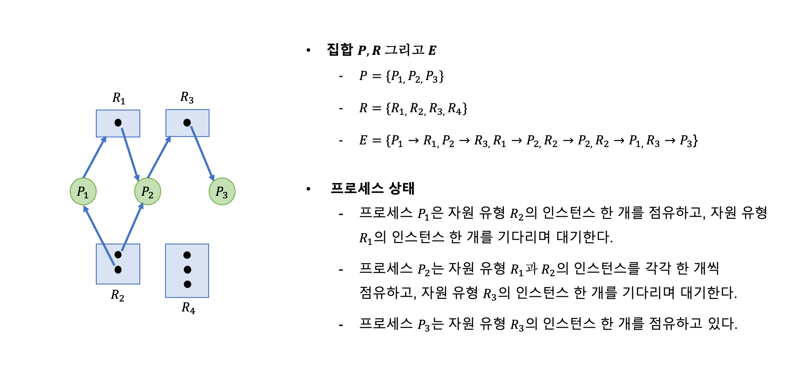

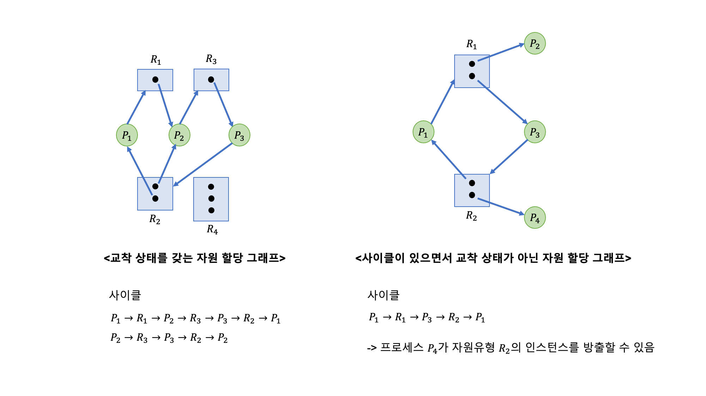

<br>

## 교착상태 처리 방법

원칙적으로 교착상태 문제를 처리하는 데에는 다음과 같은 세 가지 방법이 존재합니다.

- 시스템이 교착상태가 되지 않도록 보장하기 위해 교착 상태를 예방하거나 회피하는 프로토콜을 이용합니다.
- 시스템이 교착상태가 되도록 허용한 다음 회복시킵니다.
- 문제를 무시하고, 교착상태가 시스템에서 발생하지 않은 척 합니다.

놀랍게도 UNIX와 Windows를 비롯한 대부분의 운영체제는 세 번째 방법을 사용합니다. 이는 드물게 발생하는 교착상태에 대해 처리 비용과 오버헤드가 큰 교착상태 예방, 회피 및 탐지, 복구 알고리즘을 적용하는 것보다 수작업으로 시스템을 중지하고 재시작하는 것이 더 낫다고 판단하기 때문입니다.

<br>

### 교착상태 예방(Deadlock Prevention)

교착상태를 예방하기 위해서는 앞서 언급한 4가지의 교착 상태 발생 필요 조건 중 적어도 하나가 성립하지 않도록 보장해야 합니다.

#### 1. 상호 배제

상호 배제 조건은 공유가 불가능한 자원에 대해서는 반드시 성립해야 합니다. 따라서 근본적으로 동시 접근을 허용할 수 없는 자원이라면 상호배제 조건을 거부함으로써 교착 상태를 예방하는 것은 불가능합니다.

#### 2. 점유하며 대기

점유하며 대기 조건의 성립을 막기 위해, 프로세스가 자원을 요청할 때는 다른 자원들을 점유하지 않을 것을 보장해야 합니다. 이를 위한 방법으로는 2가지가 존재합니다.

- 프로세스가 실행되기 전 자신이 필요로하는 모든 자원을 최초에 한 번에 요청하고 할당받습니다.
- 프로세스가 자원을 전혀 갖고 있지 않을 때만 자원을 요청할 수 있도록 허용합니다.

> 예를 들어봅시다. DVD 드라이브로부터 자료를 받아 디스크 파일로 저장하고 이를 프린터로 출력하는 프로세스가 존재합니다. 전자의 방법을 적용할 경우 프로세스는 초기에 DVD 드라이브, 디스크 파일, 프린터를 요청해야 합니다. 후자의 방법을 적용할 경우 프로세스는 DVD 드라이브, 디스크 파일을 먼저 요청하여 사용한 뒤 이를 방출하고 나서 프린터를 요청하고 사용할 수 있습니다.

두 방법에는 모두 단점이 존재합니다. 전자의 경우 많은 자원들이 한꺼번에 할당된 후 오랜 기간 동안 사용되지 않고 점유될 수 있기때문에 **자원의 이용도가 낮을 수 있습니다**. 후자의 경우 자신이 필요한 자원 중 최소 하나 이상이 항상 다른 프로세스에게 할당되어 있기 때문에 **기아 상태**에 빠질 수 있습니다.

#### 3. 비선점

비선점 조건의 성립을 막기 위해서는, 어떤 자원을 점유하고 있는 프로세스가 다른 자원을 요청했지만 해당 자원을 당장 프로세스에게 할당할 수 없는 경우(즉, 대기가 발생할 경우) 프로세스가 원래 점유하고 있던 자원이 선점될 수 있도록 합니다.

#### 4. 순환 대기

순환 대기 조건의 성립을 막기 위해서는, 모든 자원 유형들에게 순서를 부여하여 프로세스가 열거된 순서대로 자원을 요청하도록 요구해야 합니다.

<br>

### 교착상태 회피(Deadlock Avoidance)

위의 방법들로 교착상태를 예방할 수 있지만, 장치 이용률이 저하되고 시스템 처리율이 감소된다는 한계가 존재합니다.

다른 접근으로는 **프로세스가 일생 동안 요청하고 사용할 자원에 대한 정보를 사전에 제공받아, 교착상태를 미리 예측**하는 방법이 있습니다. 이를 위해서는 현재 가용 자원, 현재 각 프로세스에게 할당된 자원, 각 프로세스가 앞으로 요청하거나 방출할 자원을 고려해야 합니다.

2가지의 교착상태 회피 알고리즘이 존재합니다. 이 알고리즘을 통해 시스템 **안전 상태**(프로세스들이 요청하는 모든 자원을 교착 상태를 발생시키지 않고 할당해줌)를 판단할 수 있습니다. 시스템이 불안전 상태라고 할지라도 교착상태에 빠지지 않을 수 있지만, 교착상태에 빠진다면 불안전 상태에 존재하게 됩니다. 따라서 시스템을 안전 상태로 유지한다면 교착상태를 예방할 수 있습니다.

#### 자원 할당 그래프 알고리즘

시스템의 각 자원 유형 별로 *단 하나의 인스턴스*만 존재하는 경우 자원 할당 그래프를 조금 변형시켜 교착 상태를 예견할 수 있습니다.

요청 간선과 할당 간선에 **예약 간선**이라는 새로운 유형을 도입합니다. 예약 간선은 프로세스가 미래에 해당 자원을 요청할 것이라는 의미를 내포합니다. 따라서 프로세스 실행 전 모든 예약 간선을 자원 할당 그래프에 명시해둔다면 교착 상태가 발생할 것을 사전에 예측할 수 있습니다.

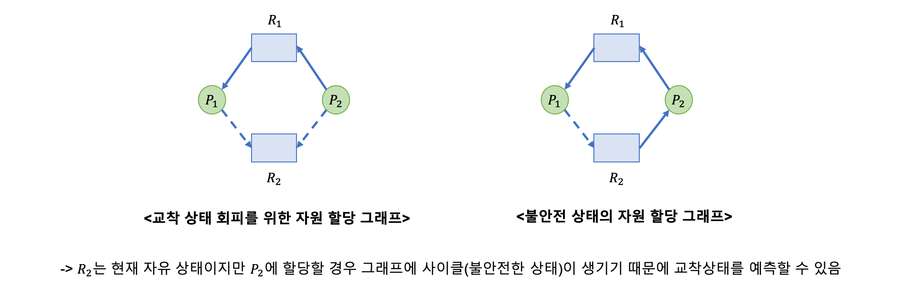

예약 간선을 할당 간선으로 변환시켜도 자원 할당 그래프에 사이클이 형성되지 않을 때에만 자원을 할당한다면 교착 상태가 발생하는 것을 피할 수 있습니다.

#### 은행원 알고리즘(Banker's Algorithm)

시스템의 각 자원 유형 별로 *여러개의 인스턴스*가 존재하는 경우 적용할 수 있는 알고리즘입니다.

이름에서 볼 수 있듯이 은행에서 돈을 빌리려는 다수의 고객이 존재할 때, 은행이 파산하지 않고 모든 고객에게 돈을 빌려주는 원리를 이용합니다.

> 예를 들어 봅시다. 100달러를 보유하고 있는 은행에 3명의 고객이 찾아와 각각 60달러, 40달러, 50달러씩 대출하기를 신청했습니다.
> 은행은 먼저 고객1에게는 20달러를, 고객2와 고객3에게는 30달러씩 빌려줍니다. 은행은 수중에 20달러가 남습니다.
> 이후 고객2에게 남은 10달러를 빌려주고 기다립니다. 고객2가 40달러를 상환하면 은행은 수중에 50달러가 남습니다.
> 이후 고객1에게 남은 40달러를 빌려주고 기다립니다. 고객1이 60달러를 상환하면 은행은 수중에 70달러가 남습니다.
> 이후 고객3에게 남은 20달러를 빌려주고 기다립니다. 고객3이 50달러를 상환하면 은행은 파산하지 않고 모든 고객게에 돈을 빌려줄 수 있습니다.
> 하지만 3번째 단계에서 은행이 고객1에게 남은 20달러를 모두 빌려줬다면 고객 중 상환할 수 있는 사람은 없고, 모두 대출을 받기 위해 기다려야 하는 상태에 빠지게 되어 파산하게 됩니다. -> 교착상태

이 방법과 같이 시스템은 **프로세스의 자원 요청을 허가**했을 때 시스템이 **안전 상태에 머무른다면 요청을 들어주고** 그렇지 않다면 프로세스를 대기시킵니다. 안전 상태에서 머무를 수 있도록 하는 안전 순서열이 존재한다면 시스템의 교착상태를 막을 수 있습니다.

이를 구현하기 위해 다음과 같은 자료구조가 필요합니다

- 가용(Available) : 각 종류의 자원이 현재 몇 개가 가용한지 나타내는 벡터
    - `Available[j] = k` : 현재 Rj를 k개 사용할 수 있음
- 최대(Max) : 각 프로세스가 최대로 필요로하는 자원의 개수를 나타내는 행렬
    - `Max[i, j] = k` : Pi가 Rj를 최대 k개 요청할 수 있음
- 할당(Allocation) : 각 프로세스에게 현재 할당되어 있는 자원의 개수를 나타내는 행렬
    - `Allocation[i,j] = k` : 현재 Pi가 Rj를 k개 사용하고 있음
- 요구(Need) : 각 프로세스가 향후 요구할 수 있는 자원의 개수를 나타내는 행렬
    - `Need[i,j] = k` : 향후 Pi가 Rj를 k개까지 요청할 수 있음
    - `Max[i, j] - Allocation[i,j] = Need[i,j]`

##### 안정성 알고리즘(Safty Algorithm)

시스템이 안전한지 판단하는 알고리즘 입니다. n은 프로세스 수를, m은 자원 종류의 수를 나타냅니다.

1. Work(향후 사용 가능한 자원 수)와 Finish(자원을 모두 사용하여 작업이 끝난 프로세스 수)는 각각 크기가 m과 n인 벡터이다. Work = Available로 초기화한다. 프로세스의 번호를 나타내는 i를 대상으로 Finish[i] = false로 초기화한다.
2. 두 조건을 만족시키는 i를 찾는다. 만약 그러한 i를 찾지 못하면 step 4로 간다.
    - Finish[i] == false
    - Needi <= Work
3. 아래 두 연산을 수행하고 step 2로 간다.
    - Work = Work + Allocationi
    - Finish[i] = true
4. 모든 i에 대해 Finish[i] == true이면 이 시스템은 안전 상태에 있다.

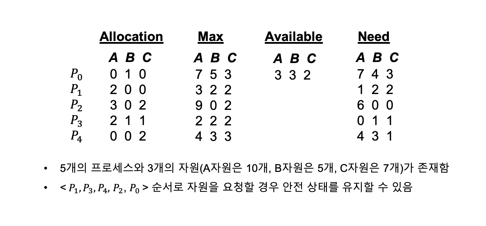

<br>

### 교착 상태 탐지(Deadlock Detection)

시스템이 교착상태 예방이나 교착상태 방지 알고리즘을 사용하지 않는다면 결국에는 교착상태가 발생하게 됩니다. 이러한 환경에서는 교착상태가 발생했는지 확인하기 위한 시스템 상태 검사 알고리즘과 교착 상태로부터 회복하는 알고리즘이 필요합니다.

교착상태 탐지는 자원 유형 별 개수에 따라 다른 방법을 적용합니다.

1. 자원 유형이 한 개씩 있는 경우

자원 할당 그래프를 변형시킨 대기 그래프를 활용하여 교착상태를 탐지할 수 있습니다. 대기 그래프가 사이클을 포함할 경우 시스템에 교착상태가 존재한다고 판단할 수 있습니다.

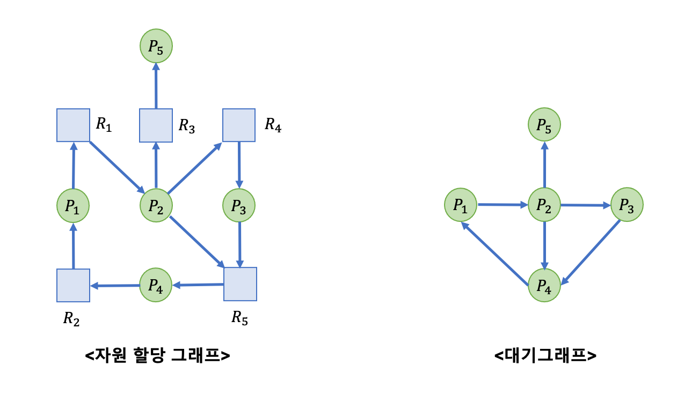

2. 자원 유형 별 자원이 여러개 있는 경우

교착상태 회피 알고리즘의 은행원 알고리즘과 유사합니다. 가용(Available), 할당(Allocation), 요청(Request) 자료구조를 이용하여 모든 프로세스가 요구하는 자원을 충족시켜줄 안전 순서열이 존재하는지 여부를 파악합니다.

**교착상태 발생 빈도**와 **교착상태 발생 시 몇 개의 프로세스가 연루되는지**에 따라 교착상태 탐지 알고리즘을 실행시킬 수 있습니다. 프로세스의 요청이 즉시 만족되지 않을 때마다 탐지 알고리즘을 실행시킨다면, 교착상태를 야기한 프로세스를 파악할 수 있지만 오버헤드가 크게 발생할 수 있다는 딜레마가 존재합니다.

<br>

### 교착 상태로부터 회복

교착상태에서 빠져나오기 위해 시스템은 두 가지 방법을 시도할 수 있습니다. 첫 번째 방법은 프로세스를 중지시킴으로써 순환 대기를 깨뜨리는 것이고, 두 번째 방법은 프로세스로부터 자원을 선점하는 것입니다.

한가지 중요한 것은 탐지와 회복 과정에서 이러한 알고리즘을 실행시키기 위한 비용 뿐만 아니라, 교착상태가 발생했을 때 부가적으로 나타나는 손실을 고려해야 한다는 것입니다.

#### 프로세스 종료(Process Termination)

- 교착상태의 프로세스들을 모두 중지
    - 프로세스가 그동안 연산한 내용이 모두 폐기되므로 비용이 큼
- 교착상태에서 빠져나올 때까지 한 프로세스씩 중지
    - 각 프로세스가 중지될 때마다 교착 상태 탐지 알고리즘을 호출해야 하므로 오버헤드가 유발됨

프로세스를 중간에 중지시키는 것은 결코 쉬운 방법은 아닙니다. 프로세스가 작업하던 파일을 손상시킬 수도 있고, 또 어떤 프로세스를 중지시킬 지 결정하는 데에도 비용이 들어갑니다.

#### 자원 선점(Resource Preemption)

교착상태를 해결하기 위해 선점을 할경우 **희생자를 선택**해야 하고, **롤백 상태를 선택**해야 하며, **기아 상태**가 발생하지 않도록 해야합니다.

<br>

## 결론

다양한 교착상태 방지 기법이 존재하지만 어떤 방법도 단독으로 사용하기에는 한계가 존재합니다. 따라서 최적의 해결책을 선택하기 위해서는 위의 기본 방법들을 적절하게 조합하여 사용해야 합니다.

---
<br>

# Race Condition
## Race Condition이란?

**여러 프로세스(혹은 쓰레드)가  동시에 공통 자원을 읽거나 쓰는 동작을 하고 그 실행 결과가 접근이 발생한 순서에 의존하는 상황**을 경쟁 상태(race condition)라고 합니다. 경쟁상태에서는 실행 결과가 개발자의 의도와 다르게 나올 수 있습니다. 다음 Producer-Consumer 예시를 살펴봅시다.<br><br>
쓰레드 A는 공유버퍼에 새항목을 추가하고 전역변수 counter의 값을 1 증가시키는 작동을 합니다. 쓰레드 B는 공유 버퍼에서 한 항목을 꺼내고 전역변수 counter의 값을 1 감소시키는 작동을 합니다.

```C
// Thread A(Producer)
while(true){
  /* Produce an item in next produced */
  while(count == BUFFER_SIZE)
  ; /* do nothing */

  buffer[in] = next_produced;
  in = (in + 1 ) % BUFFER_SIZE;
  count++;
}

// Thread B(Consumer)
while(true){
  while(count == 0)
  ; /* do nothing */

  next_consumed = buffer[out];
  out  = (out +1) % BUFFER_SIZE;
  count--;
  /* consume the item in next_consumed */
}
```

현재 카운터의 값이 5라면 두 쓰레드가 각각 한번 실행된 결과는 원래 값인 5가 나와야 합니다. 하지만, 아래와 같은 순서로 번갈아 실행되면 counter는 개발자의 의도와 달리 4 또는 6 이 될 수 있습니다.

<br>
<table>
  <tr>
    <th></th>
    <th>Thread A</th>
    <th>Thread B</th>
  </tr>
  <tr>
    <th>고급어</th>
    <td>counter = counter + 1;</td>
    <td>counter = counter - 1;</td>
  </tr>
  <tr>
    <th>기계어</th>
    <td>register1 = counter;<br>register1 = register1 + 1;<br>counter = register1;</td>
    <td>register2 = counter;<br>register2 = register2 - 1;<br>
counter = register2;</td>
  </tr>
  <tr>
    <td colspan=3>T0: Thread A가 register1 = counter 수행 {register1 = 5}<br>
T1: Thread A가 register1 = register1+1 수행 {register1 = 6}<br>
T2: Thread B가 register2 = counter 수행 {register2 = 5}<br>
T3: Thread B가 register2 = register2 1 수행 {register2 = 4}<br>
T4: Thread A가 counter = register1 수행 {counter = 6}<br>
T5: Thread B가 counter = register2 수행 {counter = 4}</td>
  </tr>
</table>
<br>

위와 같이 Race condition에서는 비정상적인 결과가 나올 수 있습니다. 이 문제는 항상 발생하는 게 아니라 기계어 레벨에서 특정한 순서로 수행되었을 때만 발생하게 되므로 디버깅 시에는 문제점이 전혀 보이지 않아 고치기가 매우 어렵습니다. 그래서 멀티프로세스 프로그래밍을 할 경우에 Race condition 방지를 위해 **프로세스 동기화(한번에 하나의 프로세스만 자원에 접근하도록 하는 것)** 를 해야합니다.

## 임계구역(Critical Section)

프로세스 동기화를 위해 우리는 임계구역에 대해 알 필요가 있습니다. 임계구역이란 **다른 프로세스와 공유하는 자원에 접근하는 코드 세그먼트**를 말합니다. 프로세스 동기화는 임계구역에 한번에 하나의 프로세스만 들어갈 수 있도록 함으로써 구현할 수 있습니다. 임계 구역 진입 통제를 위해 작성하는 코드는 다음과 같이 크게 네부분으로 나뉩니다.

```c
while(true){
  // entry section: 임계구역 진입 요청 코드

  // critical section:  임계 구역

  // exit section: 임계구역에서 빠져나오는 코드

  // remainder section: 나머지 코드 총칭
}
```

### 임계구역 문제에서 고려해야할 요구조건들

프로세스들이 데이터를 협력적으로 공유하기 위해서 자신들의 활동을 동기화 할 때 사용할 수 있는 프로토콜을 설계하는 것을 **임계구역 문제**라고 하고 이에 대한 해결안은 다음과 같은 세가지 요구조건을 충족해야 합니다.

1. **상호 배제(mutual exclusion)**: 프로세스 Pi가 자기의 임계구역에서 실행된다면 다른 프로세스 들은 그들 자신의 임계구역에서 실행될 수 없다.
2. **진행(progress)**: 임계구역에서 실행되는 프로세스가 없고 임계구역으로 진입하려고 하는 다른 프로세스들이 있다면, 기다리는 프로세스들만 다음에 누가 그 임계구역으로 진입할 수 있는지를 결정하는 데 참여가능하며 이 선택은 무한정 연기될 수 없다.
3. **한정된 대기(bounded waiting)***: 프로세스가 자기의 임계구역에 진입하려는 요청을 한 후부터 그 요청이 허용될 때까지 다른 프로세스들이 그들 자신의 임계구역에 진입하도록 허용되는 횟수에 한계가 있어야 한다.

이러한 요구조건들이 모두 충족되어야 프로세스 동기화가 정상작동할 수 있으며 앞으로 살펴볼 여러 동기화 기법들은 모두 이 요구조건을 충족합니다.

## 동기화 기법들

동기화를 구현하는 다양한 기법들이 존재합니다.

- 소프트웨어 기반 해결책: 알고리즘이 상호 배제를 보장하기 위해 운영체제나 특정 하드웨어 명령어의 특별한 지원을 포함하지 않는 방법)
  - Peterson's Solution: 임계 구역에 대한 고전적인 소프트웨어 기반 해결책, 현대 컴퓨터 구조에서 올바르게 실행됨을 보장하지 않음, 이론적으로 임계구역 문제의 세가지 요구조건을 충족하는 소프트웨어 설계시 필요한 복잡성을 잘 설명하는 기법 (https://dailyheumsi.tistory.com/132)
- 하드웨어 기반 해결책: 운영체제나 특정 하드웨어 명령어의 특별한 지원을 활용하는 방법
  - 메모리 장벽
  - 하드웨어 명령어(test_and_set(), compare_and_swap())
  - 원자적 변수
- Mutex Locks: 응용 프로그래머가 사용할 수 있도록 운영체제 설계자들이 제공하는 상위 수준 소프트웨어 도구 중 가장 간단한 형태.
- Semaphore: mutex와 유사하지만 프로세스들이 자신의 행동을 더 정교하게 동기화 할 수 있는 방법을 제공하는 도구
- Monitor
---
<br>

# 세마포어와 뮤텍스

## 📌 멀티스레드 프로그래밍에서의 동기화 문제


멀티스레드가 구현된 프로그램 안에서 두 개 이상의 스레드가 동시에 어떤 기능을 수행함에 있어 두개의 쓰레드가 만약 어떤 자원(변수) 같이 공유해서 사용하는 경우가 있다고 가정


각각의 쓰레드가 이 자원(변수) 특정한 값으로 수정하는 기능이 있다면 동시에 접근하는 이유로 인하여 이 자원의 값이 제대로 된 값을 유지하지 못하는 경우가 있을 수 있다.

이와 같이 멀티스레드 환경에서 발생하는 문제를 해결하기 위한 일련의 작업을 스레드 동기화(Thread Synchronization)라 부른다. 스레드 동기화 방법에 대해서는 세마포어(Semaphore), 뮤텍스(Mutex) 등이 있다.

###   Thread Synchronization in Java

자바에서는 이러한 임계영역의 처리를 위하여 synchronized, Semaphore 키워드를 제공하며 임계영역의 처리를 수행

synchronized는 Mutex와 동일한 기능을, Semaphore는 말 그대로 세마포어의 기능을 수행한다.

```Java

// synchronized 사용법
public synchronized void test
{ 
    // 임계구역 작업
}
public void test
{
        // 일반 작업 
	synchronized{
	      // 임계구역 작업
	}
}

// Semaphore 사용법
public void test{

      Semaphore semaphore = new Semaphore(maxThread); // 동시 접근 가능한 Thread 개수
      semaphore.acquire(); // Thread 가 semaphore에게 시작을 알림
      // 임계구역 작업
      semaphore.release(); // Thread 가 semaphore에게 종료를 알림
}
```


## 📌 임계 구역 (Critical Section)
 > 임계구역은 개념적 크리티컬 섹션과 기능적 크리티컬 섹션 두 가지 의미로 사용될 수 있지만, 자바에서는 개념적 크리티컬 섹션의 의미만을 사용

<h4> 개념적 크리티컬 섹션 </h4>

- 여러 프로세스(스레드)가 데이터를 공유하며 수행될 때, 각 **프로세스(스레드)에서 공유 데이터를 접근하는 프로그램 코드 부분**


<h4> 기능적 크리티컬 섹션 </h4>

- 동기화 목적을 위해 사용되는 배타적 제어를 하기 위한 구조(API)
- Windows 객체 중 하나이며, 프로그램에서 CRITICAL_SECTION 타입 변수를 통해 사용
- **자바에서는 사용하지 않음**


## 📌 세마포어(Semaphore)


- **Signaling 메커니즘** 을 통해 자원에 대한 접근을 동기화하는 기술
- 임계구역에 동시에 접근 가능한 스레드의 개수는 1개 이상이다.
- Signaling 메커니즘으로 락을 걸지 않은 스레드도 Signal을 통해 락을 해제할 수 있다. (wait 함수를 호출한 스레드만이 signal 함수를 호출할 수 있는 Mutex와의 차이점)
- Spin-Lock 방식과 Block & Wakeup의 2가지 방식의 사용법이 존재한다. (Spin-Up 방식은 CPU를 계속 점유하기 때문에 busy-wating이 발생한다는 단점이 있다.)

###  세마포어의 동작 원리
P (Wait) : 임계 구역에 들어가는 동작 (프로세스 진입 여부를 자원의 개수 S 를 통해 결정)

V (Signal) : 임계 구역에서 나오는 동작 (자원 반납 알림, 대기 중인 프로세스를 깨우는 신호)

<h4> 기본 동작 </h4>

```C++
wait(S);
// --- 임계 구역 ---
signal(S);
```

<h4> Spin-Lock(busy-waiting) </h4>

```C++
wait(S) {
  while (S <= 0);  // 자원이 없다면 while 루프를 돌며 대기를 함.

  S--;  // 자원을 획득함.
}

signal(S) {
  S++;  // 자원을 해제함.
}
```

<h4> Block & Wakeup </h4>

```C++
wait(semaphore *S) {
  S->value--;
  if (S->value < 0 ) {              // 자원이 없다면
    add this process to S->list;    // 프로세스를 큐에 넣고
    block();                        // block 시킴
  }
}

signal(semaphore *S) {
  S->value++;
  if (S->value <= 0) {               // 자원이 0이하라면 block중인 프로세스가 있다는 의미임.
    remove a process P from S->list; // 대기하고 있는 프로세스를 가져옴.
    wakeup(P);                       // 가져온 프로세스를 깨움.
  }
}
```


## 📌 뮤텍스(Mutex)


- **Locking 메커니즘** 을 통해 자원에 대한 접근을 동기화하는 **상호배제 기술**
-  Locking 메커니즘으로 오직 하나의 스레드만이 동일한 시점에 뮤텍스를 얻어 임계 영역에 들어갈 수 있다.
    - Lock : 임계 구역의 사용 권한을 얻음 (만약 다른 스레드가 임계 구역 수행중이면 종료시까지 대기)
    - unlock : 현재 임계 구역을 모두 사용했음을 알림 (대기중인 다른 스레드가 임계구역에 진입할수 있음)
- Lock을 건 스레드만이 임계 영역에서 나갈 때 뮤텍스를 해제할 수 있다.
- 뮤텍스는 상태가 1, 0 밖에 존재하지 않고, 바이너리 세마포어(Binary Semaphore)라고도 불림

###  뮤텍스 알고리즘

<h4> 1. 데커 알고리즘 (Dekker's Algorithm) </h4>

> 프로세스 두 개 일 때 상호 배제를 보장하는 알고리즘
> flag와 turn 변수를 통해 임계 구역에 들어갈 프로세스/스레드를 결정하는 방식
- flag : 프로세스 중 누가 임계영역에 진입할 것인지 나타내는 변수
- turn : 누가 임계구역에 들어갈 차례인지 나타내는 변수

```C++
while(true) {
    flag[i] = true;                 // 프로세스 i가 임계 구역 진입 시도

    while(flag[j]) {                // 프로세스 j가 현재 임계 구역에 있는지 확인
        if(turn == j) {             // j가 임계 구역 사용 중이면
            flag[i] = false;        // 프로세스 i 진입 취소

            while(turn == j);    // turn이 j에서 변경될 때까지 대기

            flag[i] = true;         // j turn이 끝나면 다시 진입 시도
        }
    }
}

// ------- 임계 구역 ---------

turn = j;               // 임계 구역 사용 끝나면 turn을 넘김
flag[i] = false;      // flag 값을 false로 바꿔 임계 구역 사용 완료를 알림

```

<h4> 2. 피터슨 알고리즘 (Peterson's Algorithm) </h4>

> 프로세스 두 개 일 때 상호 배제를 보장하는 알고리즘
> 데커와 유사하지만, 상대방 프로세스/스레드에게 진입 기회를 양보하는 것에 차이가 있음

```C++
while(true) {
    flag[i] = true; // 프로세스 i가 임계 구역 진입 시도
    turn = j; // 다른 프로세스에게 진입 기회 양보
    while(flag[j] && turn == j) { // 다른 프로세스가 진입 시도하면 대기
    }
}

// ------- 임계 구역 ---------

flag[i] = false; // flag 값을 false로 바꿔 임계 구역 사용 완료를 알림

```

<h4> 3. 램퍼드의 제과점 알고리즘 (Lamport's bakery algorithm) </h4>

> 여러 프로세스/스레드에 대한 처리가 가능한 알고리즘. 
>  프로세스에게 고유한 번호를 부여하고, 번호를 기준으로 우선순위를 정하여 우선순위가 높은 프로세스가 먼저 임계 구역에 진입하도록 구현 (번호가 낮을수록 우선순위가 높음)

```C++
while(true) {
    
    isReady[i] = true; // 번호표 받을 준비
    number[i] = max(number[0~n-1]) + 1; // 현재 실행 중인 프로세스 중에 가장 큰 번호 배정 
    isReady[i] = false; // 번호표 수령 완료
    
    for(j = 0; j < n; j++) { // 모든 프로세스 번호표 비교
        while(isReady[j]); // 비교 프로세스가 번호표 받을 때까지 대기
        while(number[j] && number[j] < number[i] && j < i);
        
        // 프로세스 j가 번호표 가지고 있어야 함
        // 프로세스 j의 번호표 < 프로세스 i의 번호표
    }
}

// ------- 임계 구역 ---------

number[i] = 0; // 임계 구역 사용 종료

```
<br>


# 주 메모리와 가상 메모리

## 주 메모리(Main Memory)

메모리는 주소가 할당된 일련의 워드 또는 바이트로 구성됩니다. CPU는 메모리로부터 다음 수행할 명령어를 가져오기때문에 메모리를 관리하는 것은 매우 중요한 일입니다.

## 주 메모리와 관련된 배경 지식

### 기본 하드웨어

- 주 메모리 및 레지스터 : CPU가 접근할 수 있는 유일한 저장장치입니다. 따라서 모든 명령어와 자료들은 CPU가 직접 접근할 수 있는 주 메모리와 레지스터에 존재해야 합니다.
- 베이스(base) 레지스터 : 각 프로세스는 독립된 메모리 공간을 갖습니다. 따라서 특정 메모리 공간에는 특정 프로세스만 접근할 수 있도록 합법적인 메모리 주소 영역을 설정해야 합니다. 가장 작은 합법적인 물리 메모리 주소 값을 저장하는 것이 베이스 레지스터입니다.
- 상한(limit) 레지스터 : 주어진 영역의 크기를 저장합니다

>- 만약 베이스 레지스터 값이 300040 이고 상한 레지스터 값이 120900이라면 프로그램은 300040에서 420940까지의 모든 주소에 접근할 수 있습니다.

<br>

### 주소의 할당(Address Binding)

이진 실행 파일 형태의 **프로그램**은 **디스크**에 존재하고 있다가 프로그램이 실행되면 **주 메모리**로 올라와 **프로세스**가 됩니다. 프로세스는 실행 동안 디스크와 주 메모리 사이를 이동할 수 있는데 이를 위해 프로세스가 사용했던 기억 공간(주소) 할당이 필요합니다.

메모리 주소 공간에서 명령어와 자료의 할당 시점은 다음과 같이 분류됩니다.

#### 컴파일 시간 할당(Compile Time Binding)

컴파일 시 프로세스가 물리 메모리 내 진입할 위치를 알 수 있습니다. 즉 컴파일 시 바인딩 된 주소는 절대적인 주소이며, 논리적인 주소와 물리적인 주소가 같습니다. 따라서 이후 물리 메모리 위치를 변경해야할 경우 컴파일을 다시 해야합니다.

#### 적재 시간 할당(Load Time Binding)

컴파일 시 물리 메모리 위치를 알 수 없다면 컴파일러는 일단 이진 코드를 재배치 가능 코드로 만들고, 심볼과 번지수 할당은 프로그램이 주 메모리에 적재되는 시간에 이루어집니다. 따라서 프로그램 내부에서 사용하는 논리적인 주소와 실제 주 메모리 상의 물리적인 주소는 다릅니다. 이후 물리 메모리 위치를 변경해야할 경우 재적재를 해야합니다.

#### 실행 시간 할당(Execution Time Binding/RunTime Binding)

프로세스가 실행하는 중간에도 메모리 내의 한 세그먼트에서 다른 세그먼트로 물리 메모리 주소가 이동할 수 있는 경우를 말합니다. 이를 위해서는 하드웨어적인 지원(MMU, Memory Management Unit)과 주소 매핑 테이블이 필요합니다.

<br>

### 논리 주소 공간과 물리 주소 공간

CPU가 생성하는 주소를 **논리 주소**(Logical Address), 메모리가 취급하는 주소(메모리 주소 레지스터에 주어지는 주소)를 **물리 주소**(Physical Address)라고 합니다.

컴파일 시간 바인딩은 논리 주소와 물리 주소가 같지만, 실행 시간 바인딩은 다릅니다. 흔히 정적 바인딩과 동적 바인딩이라고하는 개념도 이것을 말하는 것이죠. 따라서 프로그램 실행 중에는 가상 주소(논리 주소)를 물리 주소로 바꿔줘야 하고, 이 변환을 위한 기법에는 재배치(relocation) 레지스터가 있습니다.

사용자 프로그램의 경우 실제적인 물리 주소를 절대 알 수 없습니다. 사용자 프로그램은 오직 논리 주소를 사용한 것이고, 메모리 하드웨어 상 주소는 논리 주소를 물리 주소로 바꾼 것입니다.

<br>

### 동적 적재(Dynamic Loading)

프로세스는 실행되기 전 모든 자료가 미리 메모리에 올라가 있어야하는데, 만약 메모리 크기가 프로세스 크기보다 작다면 이는 불가능합니다. 이를 해결하기 위한 것이 동적 적재입니다.

동적 적재는 각 루틴을 재배치 가능 상태로 만들어 디스크에서 대기시킨 뒤, 메모리에 올라가 있는 주 프로그램이 해당 루틴을 필요로 해 호출한 시기에 재배치 가능 연결 적재기(relocatable linking loader)를 이용해 주 메모리로 올립니다.

따라서 사용되지 않는 루틴은 결코 미리 적재되지 않기때문에 메모리를 절약할 수 있습니다.

<br>

### 동적 연결과 공유 라이브러리(Dynamic Linking & Shared Library)

시스템 라이브러리를 실제 해당 라이브러리를 실행할 때에 동적으로 연결하는 것을 말합니다.

프로그램 실행 시 시스템 라이브러리를 부르면 스텁(stub)이라는 작은 코드 조각이 생깁니다. 이 스텁을 이용해 필요로 하는 라이브러리가 디스크와 메모리 중 어디에 존재하는지 번지수를 찾고, 다음번에는 기억했던 번지수를 이용해 쉽게 라이브러리 루틴을 수행할 수 있습니다.

<br>

## 주 메모리 할당 기법

### 스와핑(Swapping)

프로세스는 실행 시 주 메모리에 올라와 있어야 하지만 라운드 로빈과 같은 CPU 스케줄링 시 잠시 보조 메모리로 보내졌다가 돌아오게될 수도 있습니다. 이렇게 프로세스를 주 메모리와 예비 저장 장치 사이에서 이동시키는 것을 스와핑이라고 합니다. 보조 메모리는 주로 디스크를 사용합니다.

주 메모리에서 보조 메모리로 이동하는 것을 스왑 아웃(swap out), 보조 메모리에서 주 메모리로 이동하는 것을 스왑 인(swap in)이라고 합니다.

어셈블리 혹은 적재 시간 바인딩 프로세스의 경우 동일한 주소로 스왑되어야 하지만 실행 시간 바인딩 프로세스의 경우 빈 메모리의 어떤 공간으로도 스왑될 수 있습니다.

스와핑은 문맥 교환 시간(context-switch time) 상당히 걸리므로, 프로세스를 라운드 로빈 스케줄링 기법으로 관리한다면 시간 할당량은 문맥 교환 시간보다 커야겠죠.

스왑을 할 프로세스는 반드시 유휴 상태여야 합니다. 만약 입/출력 장치와 신호를 주고받던 프로세스를 스왑하게 된다면 잘못된 입/출력 내용이 저장되거나 다른 프로세스에게 저장될 수도 있습니다.

일반적으로 디스크 내의 스왑공간은 파일 시스템과 별도로 할당되도록 하여 스왑 시간을 단축할 수 있습니다.

<br>

### 연속 메모리 할당(Contiguous allocation)

초기 컴퓨터 시스템의 경우 한 컴퓨터는 한 사용자만이 사용했고, 또한 많은 프로그램을 동시에 실행시키지 않았습니다. 따라서 한 프로세스가 실행되기 위해 메모리 공간을 요구할 경우 메모리 상의 연속된 덩어리 공간을 할당해주는 연속 메모리 할당 방식을 이용했습니다. 프로세스는 메모리 덩어리의 시작 주소를 통해 할당받은 메모리에 접근할 수 있으며, 각종 변수와 함수들을 바인딩하여 사용하였습니다.

#### 단일 사용자 할당
메모리는 일반적으로 두 부분으로 나눌 수 있습니다. 하나는 메모리에 상주하는 운영체제를 위한 것이고, 나머지는 사용자 프로세스를 위한 것입니다. 

위에서 언급한 것과 같이 초기 컴퓨터 시스템은 단일 사용자에 의해서만 사용되었으므로 사용자 프로세스를 위한 공간을 나누어 사용할 필요가 없었습니다. 따라서 운영체제를 위한 메모리는 주로 인터럽트 벡터가 위치한 0번지 근처(하위 메모리)에 위치시키고, 사용자 프로세스를 위한 메모리는 나머지 공간을 연속적으로 사용했습니다.

#### 다중 분할 할당

점점 실행되는 사용자 프로세스가 많아지며 사용자 프로세스를 위한 메모리 영역은 다시 여러 프로세스를 위해 다중으로 분할되어 할당되어야 하는 문제가 떠올랐습니다. 이렇게 사용자 프로세스를 위한 메모리 공간을 다중으로 할당하는 것을 다중 분할 할당이라고 합니다. 이를 위한 기법으로는 **고정 분할 할당**(Multiple Contiguous Fixed Partition Aloocation, MFT)과 **가변 분할 할당**(Multiple Contiguous Variable Partition Aloocation, MVT) 기법이 있습니다.

1. 고정 분할 할당 기법(정적 분할(Static Allocation) 기법)
- 메모리를 똑같은 고정된 크기로 분할하여 각 분할을 하나의 프로세스에게만 할당하는 방법
- 각 분할 개수는 다중 프로그래밍 정도
- 한 분할이 비게 되면 입력 큐의 다른 프로세스가 해당 분할을 차지
- 주로 초기 운영체제에 사용됨

2. 가변 분할 할당 기법(동적 분할(Dynamic Allocation) 기법)
- 미리 주 메모리를 분할하는 것이 아니라, 적재 시 필요한 만큼 크기로 영역을 분할하는 방법
- 주 메모리의 어떤 부분이 얼마나 사용되고 있는지 파악하는 테이블을 관리
- 메모리 내에 여러 크기 공간이 산재되어 있으므로 이 공간을 쪼개어 사용하거나 인근 공간을 합쳐 큰 공간으로 만드는 등의 과정을 고려해야 함

#### 동적 공간 할당 문제

위의 가변 분할 할당 기법에서는 프로세스의 메모리 요구량에 따라 산재되어있는 주 메모리를 쪼개어 사용할 지, 아니면 합쳐 사용할 지 결정해야 합니다. 즉, 일련의 메모리 공간과 프로세스 리스트를 어떻게 할당할 지 결정하는 문제를 동적 공간 할당 문제라고 합니다.

동적 공간 할당 문제를 해결하는 방법에는 다음과 같은 세 가지 해결책이 존재합니다.

1. 최초 적합
- 첫번쨰 사용 가능한 공간을 할당
- 메모리 검색 시 할당이 가능한 충분히 큰 자유 공간을 찾으면 검색 종료
2. 최적 적합
- 사용 가능한 공간 중 *가장 작은 것* 선택
- 리스트가 오름차순으로 정렬되어 있어야 함
- 아주 작은 나머지 공간 발견
3. 최악 적합
- 사용 가능한 공간 중 *가장 큰 것* 선택
- 역시 리스트가 정렬되어 있어야 함

일반적으로는 최초 적합과 최적 적합이 최악 적합에 비해 시간, 메모리 효율이 뛰어나다고 알려져 있습니다.

#### 단편화(Fragmentation)

메모리 할당 시 메모리 공간 중 일부는 사용자에 의해 사용될 수 없는 빈 공간이 존재하는 문제가 발생할 수 있습니다. 이런 *빈 공간*을 단편화라고 합니다.

단편화는 전체 주 메모리 중 듬성 듬성 비어있는 공간인 **외부 단편화**와, 사용자에게 할당된 주 메모리 공간 중 넉넉하게 할당되어 사용되지 않는 공간인 **내부 단편화**로 나눌 수 있습니다.

1. 외부 단편화
- 주 메모리 중 프로세스에게 할당되지 않은 프로세스와 프로세스 사이 틈새의 작은 자유 공간
- 이 자유 공간을 합쳐 하나의 큰 자유 공간을 만든다면 더 많은 프로세스를 할당할 수 있음
- 단편화의 크기와 메모리의 빈 공간 위치에 따라 최초 적합과 최적 적합 기법을 적용할 수 있음
- 또한 **압축**을 통해 메모리의 모든 내용을 한 부분으로 몰고 나머지 자유 공간을 여유롭게 사용할 수도 있음
- 하지만 이를 위해서는 프로세스 내의 모든 주소들이 동적으로 재배치되어야 하고, 실행시간에 동적으로 바인딩 되는 경우에만 적용 가능함
2. 내부 단편화
- 프로세스가 요구하는 공간보다 할당된 공간이 약간 더 클 때 생기는 자유 공간
- 프로세스가 요구하는 공간을 정확히 할당해주는 것보다 약간 더 크게 할당해주고 공간을 낭비하는 것이 어떤 면에서는 비용적으로 더 효율적일 수 있음

<br>

### 불연속 메모리 할당(Contiguous allocation)

위의 연속 메모리 할당에서 발생하는 단편화 문제를 해결하기 위해 한 프로세스를 위한 메모리를 메모리 상 여러 영역으로 분산하여 할당해주는 기법이 등장합니다. 다음으로 불연속 메모리 할당을 가능하게하는 페이징과 세그멘테이션 기법에 대해 알아봅시다.

#### 페이징

주 메모리와 같이 디스크(보조 메모리) 역시 논리 주소의 할당 문제, 단편화 문제가 발생합니다. 하지만 디스크는 주 메모리보다 속도가 느리기때문에 압축과 같은 방법으로 주소 할당 문제를 해결하기 어렵습니다. 이를 해결하기 위한 방법이 바로 페이징입니다.

페이징은 논리 주소 공간이 한 연속적인 공간에 모여있어야 한다는 제약을 없앴습니다. 따라서 프로세스를 주 메모리에서 디스크로 넘길 때 프로세스의 크기에 맞는 연속된 공간을 찾지 않아도 됩니다.

##### 페이징 원리

물리 메모리는 프레임(frame), 논리 메모리는 페이지(page)라 불리는 동일한 크기의 여러 블록으로 나누어져 있습니다. 

CPU에서 나오는 모든 주소는 **페이지 번호**(p)와 **페이지 변위**(d: offset)로 나뉩니다. 페이지 테이블은 *주 메모리 내의 페이지 점유 주소*를 표현하고 있는데, 페이지 번호로 이 테이블에 엑세스하여 페이지 주소를 파악할 수 있습니다. 페이지 주소에 페이지 변위를 더한 것이 물리주소가 됩니다.

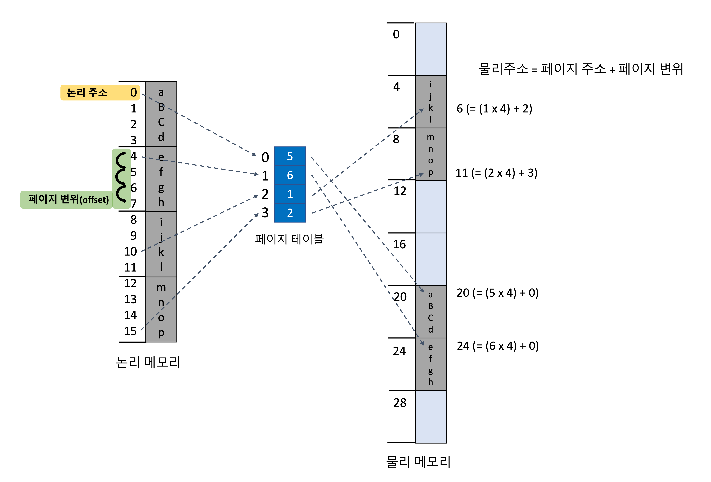

페이징 역시 동적 재배치의 한 형태입니다. 페이징을 사용할 경우 모든 유휴 상태 프레임이 프로세스에 할당될 수 있으므로 외부 단편화는 발생하지 않습니다. 하지만 내부 단편화를 피할 수는 없습니다. 공간 할당이 늘 프레임의 정수 배로 할당되기 때문입니다. 이를 고려했을 때는 작은 페이지 크기가 바람직하지만, 이에 반비례하여 페이지 테이블의 크기가 커지는 문제가 발생하므로 디스크 입장에서는 페이지 크기가 클 수록 효율적입니다.

프로세스가 실행을 위해 큐에 도착하면 몇 개의 페이지를 필요로 하는지 확인합니다. 한 페이지는 한 개의 프레임을 필요로 하므로, 프로세스가 n개의 페이지를 요구하면 메모리 내에 n개의 프레임이 존재해야 합니다. 프로세스는 페이지가 할당된 프레임 중 하나에 적재되고 이 프레임 번호는 페이지 테이블에 기록되는 방식으로 할당합니다.

페이징에서 중요한 것은 일반적인 사용자의 인식과 달리, 논리 주소와 실제 물리 주소에는 차이가 존재한다는 것입니다. 언뜻 보면 메모리는 하나의 연속적인 공간이고 하나의 프로그램이 메모리를 점유하는 것처럼 보이지만, 실제로는 다양한 프로그램들이 메모리의 여러 곳에 프레임 단위로 분산되어 있습니다. 따라서 운영체제는 논리 주소를 매핑하여 물리 주소로 스스로 연결하고, 각 프로세스는 페이지 테이블 내의 주소만 접근하므로 자신의 메모리가 아닌 다른 프로세스의 메모리에 접근할 수 없습니다. 페이지 테이블과 같이 운영체제가 물리 메모리 할당에 대한 파악을하기 위한 목적으로 프레임 테이블을 구성하고 있습니다.

<br>

##### 페이지 테이블 저장 방법

- 레지스터 집합 구현 : 효율적인 페이징 주소 변환. 단, 페이지 테이블이 작을 경우 적합.
- 페이지 테이블 기준 레지스터(PTBR) : 주 메모리에 저장한 페이지 테이블을 가리키도록 하는 레지스터. 페이지 테이블 교환 시 레지스터만 변경하면 되므로 문맥 교환 시간 단축 가능. 단, 메모리 접근 시간이 많이 걸림.

<br>

##### 페이지 테이블에 의한 메모리 보호

페이지 테이블에는 메모리를 보호하기 위한 보호 비트가 구현되어 있습니다. 보호 비트는 해당 페이지가 읽기 전용 페이지인지, 아니면 읽기 쓰기가 가능한 페이지인지를 정의하고 있습니다. 따라서 부적잘한 접근을 막을 수 있습니다. 

또한 프로세스의 합법적인 페이지인지 여부를 나타내는 유효/무효(valid/invalid) 비트가 존재하여 메모리를 보호합니다.

<br>

##### 공유 페이지

페이지의 큰 장점 중 하나는 코드를 쉽게 공유할 수 있다는 것입니다. 재진입 가능 코드로 구현한다면 여러 프로세스에 의해 접근될 수 있습니다.

공유 페이지는 쓰레드 주소 공간 공유와 유사하며, 프로세스 간 상호 통신의 방법으로 공유됩니다.

<br>

##### 페이지 테이블의 구조

1. 계층적 페이징

<p align="center"></p>

- 페이지 테이블 자체가 다시 페이지화되는 것(2단계 페이징 기법)
- 주소 변환이 바깥 페이지 테이블에서 시작하여 안쪽으로 들어오는 형식(포워드 매핑 페이지 테이블)
- 페이지 테이블을 나눔으로써 운영체제는 프로세스가 각 분할들을 실제로 필요로 할 때까지 사용하지 않은 채 남겨둘 수 있음
- 단, 논리 주소 사상 시 너무 많은 메모리를 접근하게 되므로 비현실적인 상황에 도달할 수 있음

2. 해시형 페이지 테이블

- 해시 값이 가상 페이지 번호가 됨
- 가상 주소 공간으로부터 페이지 번호를 받으면 해싱 시도
- 해시형 페이지 테이블에서 연결 리스트를 따라가며 첫번째 원소와 가상 페이지 번호를 비교. 일치할 경우 페이지 프레임 번호를 가져와 물리 주소를 얻고, 아닐 경우 연결리스트 다음 원소로 탐색
- 클러스터형 페이지 테이블은 해시형에서 조금 발전하여 각 항목이 여러개 페이지를 가리키도록 함
- 클러스터형은 메모리 접근이 불연속적이고 전 주소공간으로 넓게 퍼져 나오는 경우에 유리

3. 역 페이지 테이블

- 메모리 프레임마다 한 항목씩을 할당(페이지마다 하나의 항목을 가지는 것을 반대로 함)
- 각 항목 별로 해당 프레임에 올라와 있은 페이지 주소, 페이지를 소유하고 있는 프로세스의 ID가 표시되어 있음
- 따라서 시스템에는 단 하나의 페이지 테이블이 존재하고, 테이블 내 각 항목은 메모리 프레임을 하나씩 가리키게 됨
- 논리 페이지마다 항목을 가지는 대신 물리 프레임에 대응되는 항목만 테이블에 저장하므로 메모리 공간을 절약할 수 있음
- 단, 반대로 주소 변환 비용이 많이 듦. 테이블에서 가상 페이지 주소를 탐색하기 위해서는 테이블 전체를 탐색해야 함.
- 하나의 물리영역에 여러 개의 가상 주소를 매핑할 수 없으므로 메모리 공유가 어려움

<br>

#### 세그먼테이션(Segmentation)

앞서 언급했듯이 사용자의 메모리 관점과 실제 물리 메모리 관점은 다릅니다. 사용자(프로그래머)는 종종 프로그램을 작성하면서 함수나 모듈, 자료구조에 대해 메모리의 몇번째 주소로부터 몇 개의 바이트를 이용한다는 식으로 생각합니다. 이러한 사용자 관점에서의 메모리 관리를 가능하게 하는 메모리 관리 기법을 **세그먼테이션**이라고 합니다.

##### 구현

세그먼테이션에서는 논리 주소 공간을 세그먼트 집합으로 정의합니다. 각 세그먼트는 이름과 길이를 가집니다. 단, 세그먼트는 구현을 쉽게 하기 위해 내부에서 번호로 불립니다. 따라서 논리 주소는 (segment number, offset(변위))로 구성됩니다.

> 예를 들어 봅시다. 
> C언어 프로그램을 컴파일할 경우 컴파일러는 자동적으로 다음과 같은 세그먼트들을 만들어낼 것입니다.
>- 코드
>- 전역변수
>- 메모리 할당을 위한 힙(heap)
>- 각 쓰레드를 위한 스택(stack)
>- 표준 C 라이브러리
> 이때 적재기는 위의 세그먼트들을 받아 각각 번호를 매겨줍니다.

사용자가 정의한 각 세그먼트의 2차원 주소(ex. (3번째 세그먼트, 18번째 바이트))는 실제 메모리 상에서 바이트의 1차원 구조로 구성되어 있으므로 이 둘을 올바르게 매핑하기 위해 **세그먼트 테이블**이 존재합니다.

세그먼트는 세그먼트 이름에 해당하는 **세그먼트 번호**와 세그먼트 내에서 몇 번째 인지 위치에 해당하는 **세그먼트 변위**(offset)로 표현됩니다. 이를 물리 주소로 매핑하기 위해 세그먼트 테이블은 세그먼트의 시작 주소를 나타내는 **세그먼트의 기준**(base)과 세그먼트의 길이를 나타내는 **세그먼트 한계**(limit)을 가지고 있습니다.

세그먼트 번호를 통해 세그먼트 테이블에 색인을할 수 있는데, 이때 변위가 0과 세그먼트 크기 사이의 값이 아니라면 오류로 인식되어 트랩(trap)이 발생할 수 있습니다.

<br>

---

## 가상 메모리(Virtual Momory)

현재 실행중인 코드는 반드시 물리 메모리에 존재해야한다고 생각할 수 있습니다. 하지만 다음과 같은 상황을 생각해봅시다.

>- 프로그램에서 가끔 발생하는 예외를 처리하기 위한 코드
>- 크기가 제한된 형태인 배열(array)을 이용하기 위해 필요한 크기보다 훨씬 큰 크기로 선언한 경우
>- 정말 가끔 사용하는 옵션
>- 위와 같이 당장 필요하지 않은 코드들

위와 같은 경우를 고려했을 때 모든 코드를 늘 물리 메모리에 올려놓을 필요는 없으며, 그렇게 한다고 할지라도 물리 메모리 크기는 제한적이기 때문에 불가능할 수도 있습니다.

이를 해결하기 위해 가상 메모리를 사용합니다. **가상 메모리**는 실제의 물리 메모리 개념과 사용자의 논리 메모리 개념을 분리한 것입니다. 프로그램 중 당장 필요한 일부만을 물리 메모리에 올려놓고 실행하는 것이죠.

### 이점

- 프로그램은 물리 메모리 크기에 제약받지 않을 수 있습니다. 프로그래머들은 매우 큰 *가상 주소 공간*을 가정하고 프로그래밍을 할 수 있습니다.
- 각 프로그램의 코드 중 일부만이 메모리를 차지하므로 더 많은 프로그램이 동시에 수행될 수 있습니다. 이는 응답시간의 감소와 CPU 이용률 및 처리율을 향상시킵니다.
- 프로그램을 메모리에 올리고 스왑할 때 발생하는 입/출력 비용이 감소합니다
- 페이지 공유를 통해 파일이나 메모리가 둘 이상의 프로세스들에 의해 공유되는 것이 가능합니다.

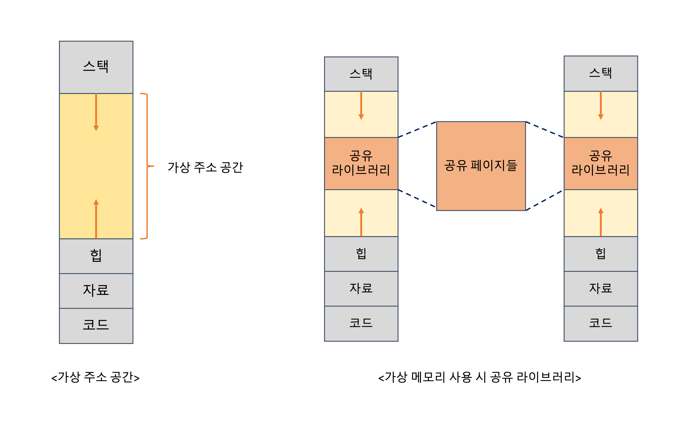

<br>

## 요구 페이징

일반적인 가상 메모리는 보통 요구 페이징으로 구현합니다. **요구 페이징**은 프로그램 실행 시 모든 부분을 메모리에 적재하는 것이 아니라, 실행 과정에서 페이지를 요구할 때마다, 즉 페이지들이 필요해질 때마다 적재하는 전략입니다.

요구 페이징은 스와핑과 개념이 유사합니다. 스와핑에서는 보조 메모리의 프로세스를 실행하고 싶을 때에 주 메모리로 읽어옵니다(swap in). 이와 같이 프로세스 내 페이지를 관리하는 페이저(pager)는 프로세스가 스왑 아웃(swap out)되기 전에 실제로 사용될 페이지가 어떤 것일지 추측하고, 이후에는 프로세스 전체를 스왑인 하는 대신 실제 필요한 페이지만 메모리로 읽어옵니다.

이를 위해서는 하드웨어 적인 기술이 필요한데, 유효/무효 비트를 사용하여 페이지가 메모리에 존재할 경우 유효(valid)하다고 표시하고, 페이지가 가상 주소 공간에 정의되지 않았거나 디스크에 존재할 경우 무효(invalid)하다고 표시하거나 페이지가 현재 저장된 디스크 주소를 기록합니다.

### 순수 요구 페이징

특정 페이지가 필요해 실제로 참조하기 전에는 절대 그 페이지를 메모리로 적재하지 않는 방법을 말합니다. 이를 통해 전체 프로세스가 주 메모리에 올라와있지 않아도 프로세스를 실행할 수 있습니다.

메커니즘은 다음과 같습니다.

1. 실제로 참조하지 않는 페이지는 초기에 메모리에 올리지 않으므로 어떤 페이지도 메모리에 올라가 있지 않음
2. 특정 페이지에 대한 참조가 발생
3. 페이지 부재(page fault) 발생
4. 운영체제는 내부 테이블을 통해 해당 페이지가 디스크 내부 어디에 위치했는지 파악
5. 자유 프레임을 탐색하여 디스크로부터 해당 페이지를 읽어옴
6. 페이지 테이블 내애 페이지에 변화가 생겼음을 표시
7. 3에서 페이지 부재로 중지되었던 명령이 다시 실행됨

위에서 볼 수 있듯이 요구 페이징의 성능은 페이지 부재에 의해 좌우됩니다. 따라서 **페이지 부재율을 낮게 유지**하는 것이 중요하겠죠.

<br>

## 페이지 교체

요구 페이징에서 주요 관건은 페이지 교체와 프레임 할당 문제를 해결하는 것입니다. 디스크 입/출력 비용은 결코 만만하게 볼 수 없기때문이죠.

먼저 페이지 교체부터 봅시다. 실제 시스템이 보유한 페이지보다 더 많은 프로세스가 더 많은 페이지를 요구할 경우, 페이지 간 교체를 해야하는 문제가 발생합니다. 이렇게 희생될 페이지를 골라야 하는 순간에서 고려할 수 있는 페이지 교체 알고리즘에 대해 알아봅시다.

<br>

### FIFO 페이지 교체(First-In-First-Out)

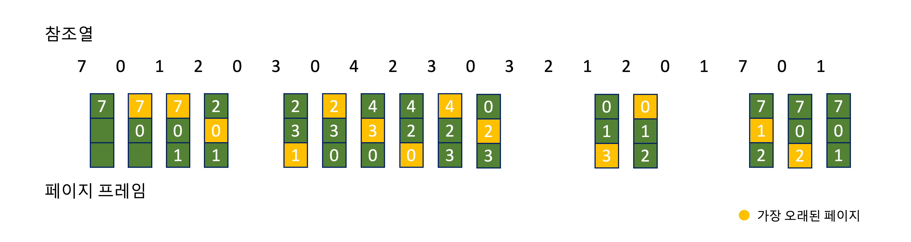

- 메모리에 올라온 페이지 중 **가장 오래된 페이지**를 교체하는 방법
- 페이지가 올라온 시간을 기록하거나, 페이지가 올라온 순서대로 큐(queue)를 생성하여 관리
- 장점 : 가장 직관적이고 단순한 알고리즘
- 단점 : 
    - 성능이 좋지 않음(페이지 교체 직후 바로 해당 페이지를 필요로 하는 경우 등)
    - 더 많은 프레임을 할당했음에도 불구하고 페이지 부재율이 높을 수 있는 Belady의 모순이 발생함

<br>

### 최적 페이지 교체(OPT, Optimal page replacement)

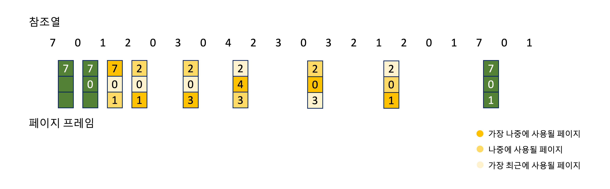

- 앞으로 가장 오랜 동안 **사용되지 않을** 페이지를 찾아 교체하는 방법
- 장점 : 가장 낮은 페이지 부재율을 보장하는 최적의 알고리즘
- 단점 : 실제 구현이 거의 불가능하므로(미래의 프로세스 참조를 예측하기란 쉽지 않음) 비교 연구 목적으로 사용됨

<br>

### LRU 페이지 교체(Least-Recently-Used)

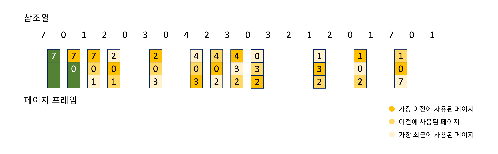

- 가장 오랜 기간 동안 **사용되지 않은** 페이지를 교체하는 방법
- 최적 알고리즘의 근사 알고리즘으로 최근의 과거를 가까운 미래의 근사치로 생각함
- 각 페이지마다 마지막 사용 시간을 기록하여 구현
    - 카운터(counter) : 각 페이지 별 사용 시간 필드와 카운터를 추가하여 메모리 접근 시마다 시간을 증가시킴. 페이지 테이블이 변경될 때마다 시간 값을 관리해야 함.
    - 스택(stack) : 페이지가 참조될 때마다 페이지 번호를 스택 중간에서 빼내어 스택 top에 삽입. 스택의 꼭대기에는 항상 가장 최근에 사용된 페이지가, 스택 밑바닥에는 항상 가장 이전에 사용된 페이지가 위치함. 스택의 중간에서 꺼내고 다시 top으로 삽입하는 과정에서 오버헤드가 발생하긴 하지만 페이지 교체 시 페이지를 탐색할 필요 없이 top만 보면 됨.
- 장점 : OPT와 근사하게 좋은 성능을 보장
- 단점 : 카운터나 스택과 같은 구현을 위해 하드웨어 지원이 필요함

<br>

### LRU 근사 페이지 교체(LRU Approximation)

하드웨어의 지원을 필요로하는 LRU 페이지 교체 알고리즘의 한계를 극복하기 위한 알고리즘입니다. 주로 페이지 별 참조 비트를 설정하여 사용합니다.

#### 부가적 참조 비트 알고리즘

- 일정한 간격마타 참조 비트를 기록함으로써 페이지 사용 선후 관계를 기록

#### 이차 기회 알고리즘(클럭 알고리즘)

- FIFO 교체 알고리즘을 기반으로 함.
- 페이지를 순환 큐에 저장하고, 페이지가 선택될 때마다 참조 비트를 확인하여 값이 `0`인 경우에는 페이지를 교체하고 `1`인 경우에는 한번 더 기회를 줌
- 자주 사용되는 페이지의 경우 교체될 가능성이 낮음

<br>

### 계수 기반 페이지 교체(Counting-Based)

#### LFU 알고리즘(Least-Frequently-Used)

- 참조 횟수가 가장 적은 페이지를 교체하는 방법
- 장점 : 자주 사용되는 페이지는 참조 횟수가 크므로 교체가 적을 수 있음
- 단점
    - 한 프로세스의 초기에만 자주 사용된 페이지의 경우 이후에 더 이상 자주 사용되지 않는다고 할지라도 페이지가 교체되지 않아 오히려 페이지 부재가 발생할 수 있음
    - 이를 극복하기 위해 참조 횟수 비트를 일정 시간마다 오른쪽으로 shift 연산하여 지수적으로 영향력을 감소시키는 방법이 있음

#### MFU 알고리즘(Most-Frequently-Used)

- 가장 적은 참조 횟수를 가진 페이지가 가장 최근에 사용된 페이지이며, 또 앞으로 사용될 것이라 판단하여 교체하지 않는 방법

<br>

## 프레임 할당

요구 페이징의 두번째 관건은 프레임 할당입니다. 여러 프로세스에게 각각 얼마나 많은 프레임을 할당해야할지 결정하는 문제이죠. 프레임 할당에 따라 페이지 부재율이 달라질 수 있기때문에 프레임 할당은 페이지 교체와 더불어 중요하게 작용합니다. 다양한 프레임 할당 알고리즘에 대해 소개합니다.

### 균등 할당

- 모든 프로세스에게 프레임을 똑같이 할당
- 가장 단순~무식~한 방법으로 작은 크기의 메모리를 요구하는 프로세스는 메모리를 낭비한다는 문제가 있음

### 비례 할당

- 각 프로세스의 크기에 맞춰 비율대로 할당
- 프로세스가 요구하는 크기를 고려할 수 있어 균등 할당에서 발생하는 문제를 어느정도 보완할 수 있음
- 프로세스 크기 대신 프로세스의 우선순위를 기준으로 삼아 비율을 나눠 할당한다면 우선순위가 높은 프로세스에게 더 많은 메모리를 할당하여 프로세스를 빠르게 수행할 수 있음

### 전역 대 지역 할당

이제서야 밝히지만 프레임 할당에는 또 다른 중요한 요인이 있습니다. 바로 페이지 교체를 고려하는 것인데, 구체적으로 **전역 교체**와 **지역 교체** 라는 두 가지 범주로 나눌 수 있다는 것입니다.

- 전역 교체 : 프로세스가 교체할 프레임을 다른 프로세스에 속한 프레임을 포함한 모든 프레임을 대상으로 찾음
    - 우선 순위가 높은 프로세스가 낮은 프로세스로부터 프레임을 빼앗아오는 경우
    - 다른 프로세스로부터 프레임을 할당받게 된다면 프로세스에게 할당된 페이지 수도 증가하게 됨
    - 일반적으로 지역 교체 알고리즘보다 우수한 성능을 자랑하여 보편적으로 사용됨
    - 하지만 프로세스의 페이지 부재율을 컨트롤하기 어렵다는 단점이 존재함(페이지 부재율은 다른 프로세스에게 영향을 받는데 전역 교체는 프로세스 간 프레임과 페이지가 교환되기 때문에)
- 지역 교체 : 각 프로세스가 자신에게 할당된 프레임 내부에서만 교체될 희생자를 찾음
    - 프로세스 개별에게 할당된 프레임에는 변화가 없음
    - 페이지 부재율이 다른 프로세스에 의해 변하거나 조절하기 어려운 문제가 발생하지 않음
    - 다만 전역 교체보다 성능이 좋지 않음

<br>

## 쓰레싱(Thrashing)

만약 한 프로세스가 프레임을 부족하게 할당받는다면 페이지 집합도 부족하게 할당받게 될 것이고, 이는 페이지 부재를 발생시킬 것입니다. 하지만 만약 다른 프로세스들도 모두 열심히 일하고 있는 상황이라 페이지를 내어줄 수 없다면 어떻게 될까요? 다른 프로세스로부터 억지로 페이지를 뺏어오더라도 바로 다시 해당 프로세스가 페이지 부재를 발생시켜 결국 페이지를 되돌려줘야하는 문제가 발생할 수 있습니다. 

이와 같은 치열한 눈치싸움, 과도한 페이징 작업을 **쓰레싱**이라 합니다. 쓰레싱은 어떤 프로세스가 실제 실행보다 더 많은 시간을 페이징에 사용하고 있는 것을 말합니다. 쓰레싱이 발생하면 성능은 심각하게 저하됩니다.

쓰레싱은 전역 페이지 교체 알고리즘을 이용하여 다중 프로그래밍 정도를 높일 때 발생할 수 있습니다. 운영체제는 다중 프로그래밍 정도를 높이기 위해 CPU 이용률이 낮아지면 새로운 프로세스를 추가합니다. 이때 다른 프로세스의 프레임을 할당받는 전역 페이지 교체 알고리즘을 적용한다면 다른 프로세스도 프레임이 부족한 상황에서는 서로의 프레임을 자꾸 할당받으려 할 것입니다. 이 과정에서 CPU는 다시 놀게되고, 운영체제는 더 많은 프로세스를 추가시켜버리는 것이죠. 이러한 악순환이 반복되어 쓰레싱이 발생합니다.

쓰레싱은 지역 교환 알고리즘 혹은 우선순위 교환 알고리즘을 적용하여 막을 수 있지만, 좀 더 근본적인 해결책은 각 프로세스가 필요로 하는 최소한의 프레임 수를 보장하는 것입니다. 이를 위해서는 **작업 집합 모델**에 대해 이해해야 합니다.

<br>

### 작업 집합 모델(Working-Set Model)

작업 집합 모델은 프로세스가 필요로 하는 최소한의 프레임 수를 알 수 있는 방법으로, 쓰레싱을 조절하는 방법 중 하나입니다. 작업 집합 모델은 **지역성** 개념을 기반으로 합니다. 

지역성 모델이란 프로세스가 실행될 때는 **항상 어떤 특정 지역에서만 메모리를 집중적으로 참조**한다는 개념입니다. 이에 따라 지역성은 집중적으로 함께 참조되는 페이지들의 집합을 의미합니다.

지역성을 고려하여 작업 집합을 구성하는 방법은 다음과 같습니다. 특정 프로세스가 최근 참조한 페이지들 중 Δ개의 페이지를 작업 집합으로 구성합니다. 이후 한 페이지가 더이상 사용되지 않는다면 해당 페이지의 마지막 참조로부터 Δ만큼의 새로운 페이지가 작업 집합으로 구성될 것이고, 사용되지 않는 페이지는 집합에서 제외됩니다.

작업 집합의 정확도에서 중요한 것은 Δ값, 즉 집합의 크기겠죠. Δ값이 너무 커지면 지역성을 과도하게 수용할 것이고, Δ값이 너무 작아지면 지역을 포함하지 못할 것입니다.

작업 집합을 설정하게 된다면 운영체제는 각 프로세스의 작업 집합을 통해 프로세스에게 맞는 크기의 프레임을 할당할 수 있습니다. 따라서 가능한 최대의 다중 프로그래밍 정도를 유지하면서도 쓰레싱을 방지할 수 있게됩니다.

하지만 작업 집합을 추적하는 것이 쉬운 일은 아닙니다. 여기서도 참조 비트를 활용하여 구현해야 합니다. 타이머 인터럽트를 발생시켜 현재 작업 집합의 참조 비트와 이전 단위의 작업 집합의 참조 비트를 비교하는 방식으로 구현할 수 있지만, 이런 방식은 정확도가 낮고 오버헤드가 크다는 문제가 있습니다.

<br>

### 페이지 부재 빈도(PFF, Page-Fault Frequency)

쓰레싱을 조절하는 또 다른 방법은 페이지 부재 빈도 모델입니다. 

쓰레싱의 개념에 대해 다시 생각해봅시다. 쓰레싱이 발생했다는 것은 페이지 부재율이 높다는 것을 의미합니다. 페이지 부재율이 높으면 **더 많은 프레임이 할당되어야**하고, 페이지 부재율이 낮으면 **너무 많은 프레임을 할당해 낭비**가 될 수 있습니다. 

따라서 페이지 부재율을 조절해야할텐데, 단순하게 페이지 부재율의 상한과 하한을 설정한다고 생각해봅시다. 페이지 부재율이 상한을 넘어가게 되면 해당 프로세스에게 더 많은 프레임을 할당해주면 됩니다. 또한 하한보다 낮아지게 된다면 해당 프로세스로부터 프레임을 빼앗아 다른 프로세스에게 할당해주면 됩니다.

페이지 부재 빈도 모델을 통해 직접적으로 페이지 부재율을 관리할 수 있고 쓰레싱도 막을 수 있습니다.

<br>

<br>

# 파일시스템(File System)


<br>


## 파일 시스템(File System)

파일 시스템은 시스템 상 파일들의 저장, 접근, 공유 등 모든 관리를 총괄하는 시스템이다. 사용자와 보조기억장치 간의 인터페이스를 제공하여 사용자가 직접적으로 파일에 접근하는 것을 막고 대신해서 파일 관련 작업들을 수행해준다. 

<br>

<br>


## 파일(Files)

연관된 정보들을 모아놓은 논리적 저장 단위. 운영체제(OS)는 저장 장치의 물리적 특징을 추상화하여 파일로 맵핑하여 관리한다. 일반적으로 비휘발적인 특성을 가져 전원이 끊어져도 영구적으로 보존할 수 있다. 

<br>

### 파일 속성

- 이름: 사용자가 읽고 식별할 수 있는 파일 이름

- 식별자: 파일 시스템에서 파일들을 식별하는 고유 번호

- 타입: 실행파일, 텍스트파일, 소스파일 등 여러 타입 존재

  		Windows는 이름에 확장자 제공, UNIX는 파일 내에 매직넘버(Magic number) 제공

- 위치

- 크기

<br>


### 파일 연산

시스템 콜을 통해 파일 관련 여러 연산을 수행할 수 있고 수행 단위에 따라 **파일 단위 작업**과 **레코드 단위 작업**으로 분류할 수 있다. 

- 파일 단위 작업

  open, close, copy, rename, destroy ...

- 레코드 단위 작업

  read, write, update, insert, delete ...

운영체제는 Open-file table을 사용해 열린 파일들을 관리한다. 파일을 연 횟수, 디스크에서 위치, 접근 관한 등이 기록된다. 각 프로세스들은 각자 file descriptor(fd) table을 가지고 연 파일들의 fd를 관리한다.


<br>


### 파일 접근 방법

1. 순차 접근

   기본적인 접근 방법으로 file pointer를 따라 파일 정보가 차례차례 처리된다. read(), write()는 자동으로 file pointer를 변경시키고 lseek()를 사용해 file pointer를 조정할 수 있다. 

<p align="center">
 </p>

2. 직접 접근

   file pointer를 직접적으로 조작하여 특별한 순서 없이 빠르게 레코드를 읽고 쓸 수 있다. 대규모 정보를 접근하는 데이터베이스 관리에서 주로 사용된다.


<p align="center">
 </p>

<br>

<br>


## 디렉터리(Directory)

관련된 파일이나 디렉터리들의 집합으로 사용자는 이를 통해 파일들을 구조화할 수 있다. 디렉터리 또한 파일이나 디렉터리 정보를 담은 하나의 **파일**이다. 

<br>


### 1단계 디렉터리

모든 파일이 동일한 디렉터리에서 관리되는 가장 기본적인 구조. 각 파일은 유일한 이름을 가져야 하므로 다수의 사용자가 사용할 경우 제약이 따른다.

<p align="center">
 </p>


<br>


### 2단계 디렉터리

사용자별로 디렉터리를 생성한 구조. MFD(Master File Directory)가 있고 그 아래에 사용자별로 할당되는 UFD(User File Directory)가 있다. 파일 참조 시 각 UFD만 탐색하므로 사용자별로 파일 이름이 중복될 수 있다. 


<p align="center">
 </p>

<br>


### 트리 구조 디렉터리

하나의 루트 디렉터리와 다수의 서브 디렉터리로 구성된 구조이며 Dos, Windows, Unix 운영체제에서 사용한다. 서로 다른 디렉터리 내에서는 파일이나 디렉터리의 이름이 중복될 수 있다. 파일 탐색시 절대 경로(루트 디렉터리를 기준) 또는 상대 경로(현재 디렉터리 기준)를 이용할 수 있다.


<p align="center">
 </p>

<br>


### 비순환 그래프 디렉터리

디렉터리들이 서로 파일을 공유할 수 있도록 허용하는 구조. 절대 경로/상대 경로를 사용해 **링크**라는 디렉터리 항목을 만들 수 있다. 공유된 파일을 삭제하는 경우 빈 곳을 가리키는 고아 포인터(dangling pointer)가 발생할 수 있다. 


<p align="center">
 </p>

<br>


### 일반 그래프 디렉터리


<p align="center">
 </p>

디렉터리 구조에서 순환(Cycle)을 허용하는 구조. 탐색 알고리즘이 간단해 파일 접근에 용이하나 무한 루프에 빠질 가능성도 있다. 

<br>

**하드링크(Hard link)**: 해당 파일을 직접적으로 가리키는 링크. 

**심볼릭링크(Symbolic link)**: 가리키는 파일의 경로를 담은 링크. 해당 파일이 삭제되면 고아 링크가 된다.


<br>

파일 할당 방식, 파일시스템 종류
